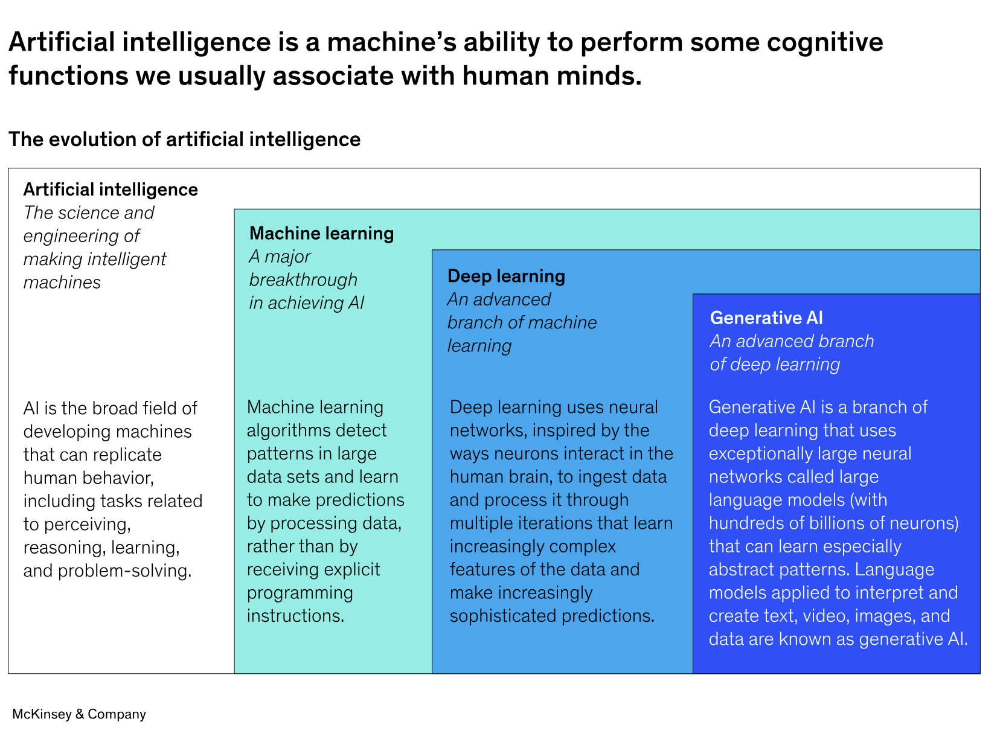
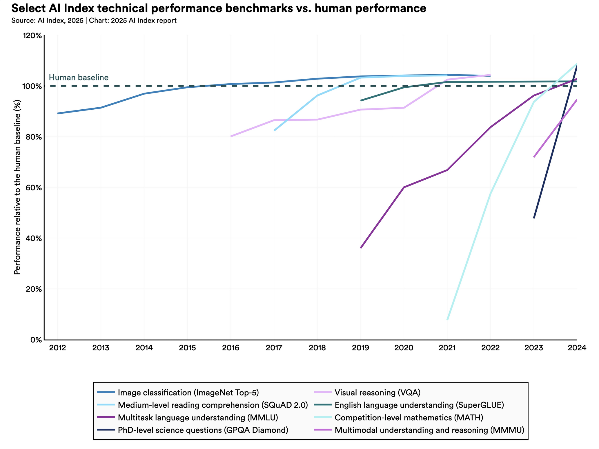
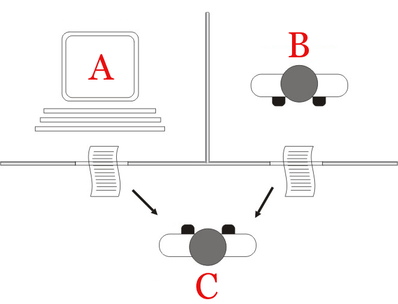
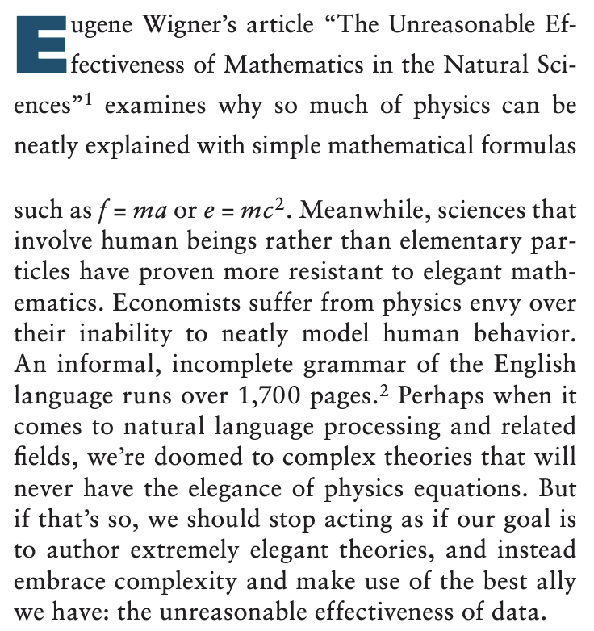
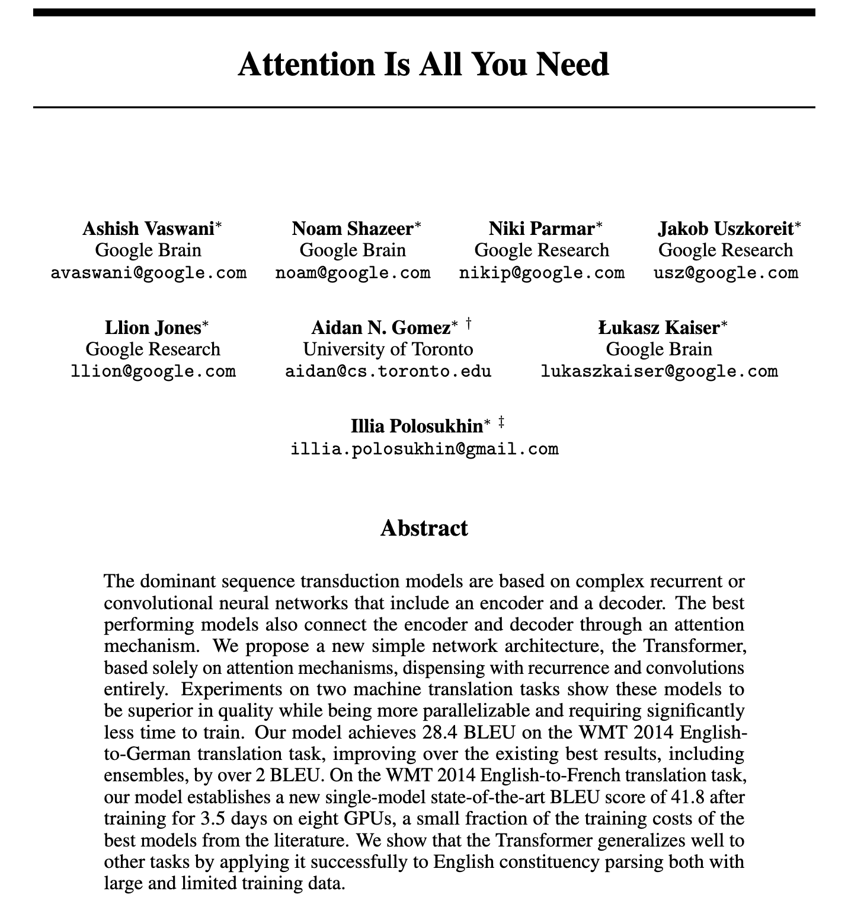
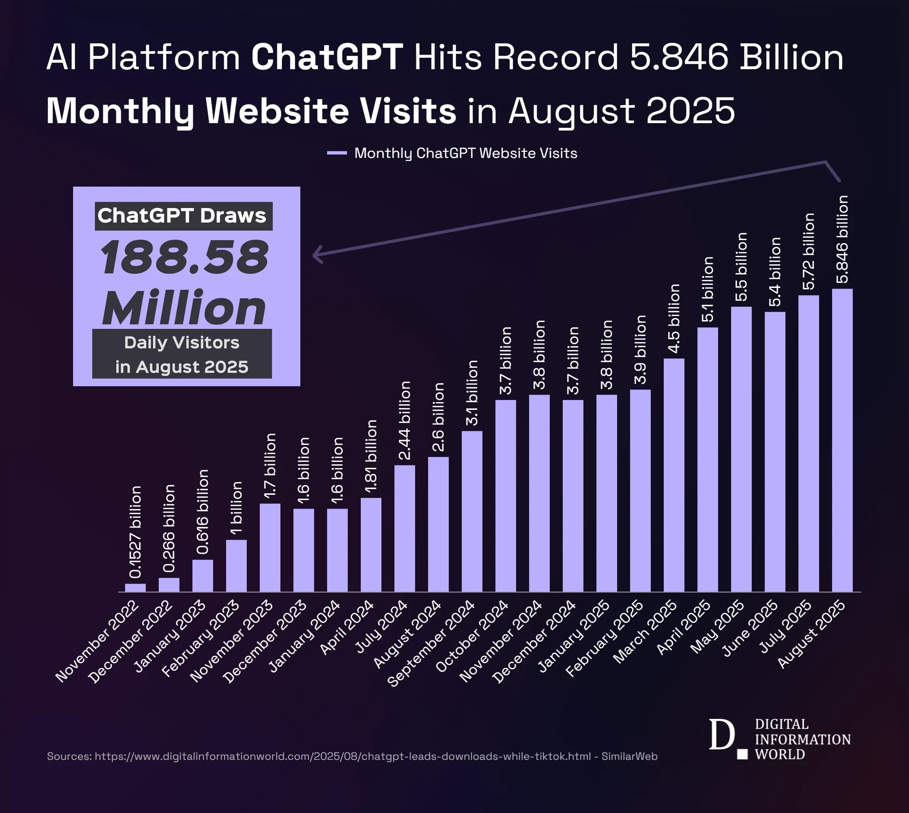
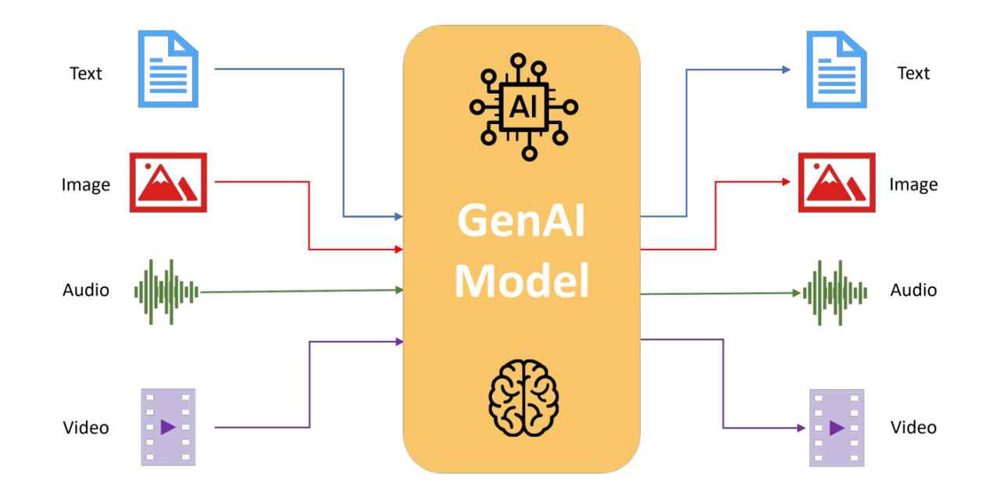
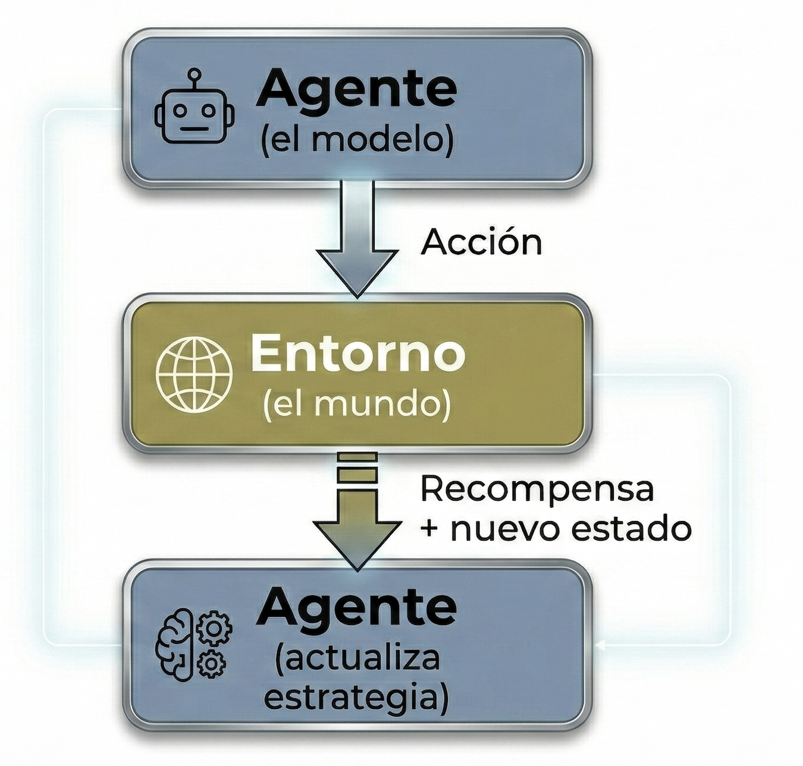
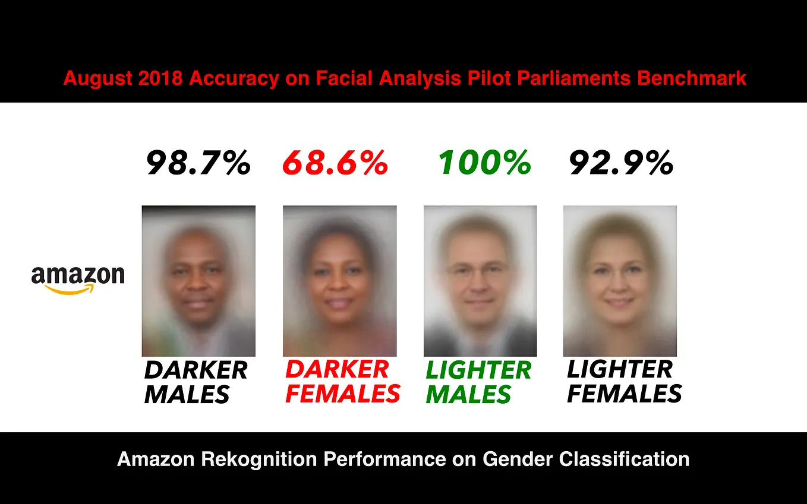
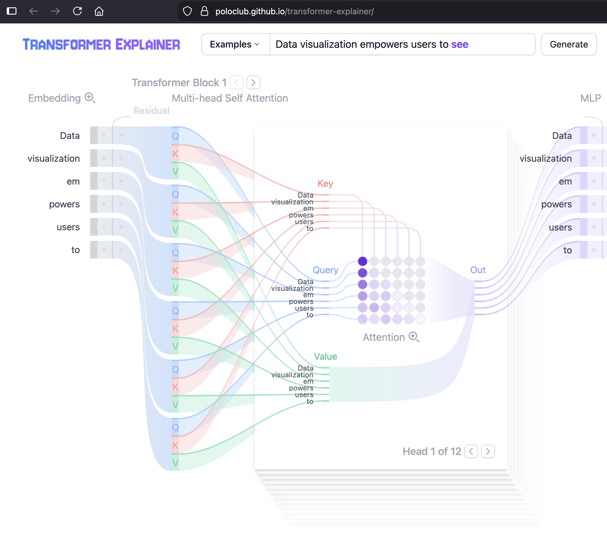

```{r setup, include=FALSE}
options(htmltools.dir.version = FALSE)
library(knitr)
opts_chunk$set(
  prompt = T,
  fig.align = "center",
  dpi = 300,
  cache = T,
  engine.opts = list(bash = "-l")
)

knit_hooks$set(
  prompt = function(before, options, envir) {
    options(
      prompt = if (options$engine %in% c("sh", "bash", "zsh")) "$ " else "R> ",
      continue = if (options$engine %in% c("sh", "bash", "zsh")) "$ " else "+ "
    )
  }
)

options(repos = c(CRAN = "https://cran.rstudio.com/"))

if (!require("fontawesome", character.only = TRUE)) {
  install.packages("fontawesome", dependencies = TRUE)
  library(fontawesome, character.only = TRUE)
}
```

# Bienvenidos! 🥳 {background-color="#2d4563"}

## Agenda de la sesión
### ¿Qué veremos hoy?

:::{style="margin-top: 20px; font-size: 23px;"}

:::{.columns}
:::{.column width=50%}
1. [Bienvenida y presentaciones]{.alert}
    - Quiénes somos, materiales del curso, filosofía de trabajo
2. [¿Qué es la IA?]{.alert}
    - Definición, tipos (estrecha, general, superinteligente), mitos comunes, taxonomía
3. [Historia de la IA]{.alert}
    - De Turing y Dartmouth a ChatGPT
4. [Tipos de aprendizaje automático]{.alert}
    - Supervisado, no supervisado, por refuerzo
5. [Ética y regulación]{.alert}
    - Sesgos, alucinaciones, legislación actual
:::

:::{.column width=50%}
:::{style="text-align: center; margin-top: -50px;"}
[{width="65%"}](#){data-modal-type="image" data-modal-url="figures/cute-robot.png"}
:::
:::
:::
:::

## Materiales del curso
### Enlaces importantes

::: {style="font-size: 30px;"}
`r fa('github')` Repositorio del curso: <https://github.com/danilofreire/introduccion-ia-ucu>

`r fa('globe')` Sitio web del curso: <https://danilofreire.github.io/introduccion-ia-ucu>

Todos los materiales del curso (diapositivas, código, laboratorios y lecturas) están disponibles en nuestro [repositorio de GitHub](https://github.com/danilofreire/introduccion-ia-ucu) y [sitio web](https://danilofreire.github.io/introduccion-ia-ucu)

Las diapositivas se publicarán antes de cada sesión y se actualizarán a lo largo de la semana si surgen nuevas ideas o preguntas 😉

::: {.callout-note}
Revisen el repositorio del curso con frecuencia para ver actualizaciones y nuevos materiales!
:::
:::

## Sobre el docente
### Un poco sobre mí

:::: {.columns}
::: {.column}


::: {style="font-size: 26px;"}
`r fa('envelope')` [danilofreire@gmail.com](mailto:danilofreire@gmail.com)

`r fa('globe')` <https://danilofreire.github.io/>

`r fa('github')` <https://github.com/danilofreire/>
:::
:::

:::{.column}
:::{style="font-size: 28px;"}
`r fa('chalkboard-user')` Professor Assistente en el [Department of Data and Decision Sciences](https://datascience.emory.edu/), [Emory University](https://www.emory.edu/)

`r fa('graduation-cap')` MA del Graduate Institute Geneva, PhD de King's College London, Postdoc en Brown University, Senior Lecturer en la University of Lincoln, UK

`r fa('book-open')` Investigación: ciencias sociales computacionales, métodos experimentales, evaluación de políticas públicas, violencia política
:::
:::
::::

## Sobre ustedes

:::{style="margin-top: 60px; font-size: 40px;"}

- Ahora les toca a ustedes! 😊

- Por favor, preséntense brevemente

- Cuéntennos su nombre, su área de trabajo y qué les gustaría aprender en este curso
:::

## Estructura del curso
### Cinco días, 20 horas

:::{style="margin-top: 50px; font-size: 26px; text-align: center;"}

| Día | Tema | Sesiones | Laboratorios |
|-----|------|----------|--------------|
| 1 | Fundamentos de IA y ML | ¿Qué es la IA? + Flujo de ML | tidymodels + comparación de modelos |
| 2 | Aprendizaje supervisado | Clasificación + Predicción | clasificación + regresión |
| 3 | Texto y no supervisado | Clustering/PCA + Texto | clustering + análisis de texto |
| 4 | LLMs y aplicaciones | Transformers + APIs | ellmer + aplicaciones avanzadas |
| 5 | Ética y cierre | Sesgo/regulación + Propuestas | auditoría de sesgo |

:::

## Objetivos de aprendizaje
### Al finalizar este curso, serán capaces de:

:::{style="margin-top: 40px; font-size: 30px;"}

- `r fa('comment-dots')` [Explicar]{.alert} cómo funcionan los sistemas de IA actuales
- `r fa('triangle-exclamation')` [Identificar]{.alert} fallos comunes y problemas de datos
- `r fa('newspaper')` [Evaluar]{.alert} afirmaciones sobre IA en noticias y políticas públicas
- `r fa('pencil-ruler')` [Diseñar]{.alert} un plan realista para una aplicación de IA
- `r fa('scale-balanced')` [Reflexionar]{.alert} sobre las cuestiones éticas y sociales de la IA
:::

# ¿Qué es la Inteligencia Artificial? {background-color="#2d4563"}

## Definición de IA

:::{style="margin-top: 40px; font-size: 25px;"}
:::{.incremental}
- Una definición sencilla: [la Inteligencia Artificial (IA) es una rama de la informática centrada en crear sistemas capaces de realizar tareas que normalmente requieren inteligencia humana]{.alert}
- Estas tareas incluyen aprender, razonar, resolver problemas, percibir, entender el lenguaje y muchas más
- La IA se puede clasificar en [tres categorías principales:]{.alert}
    - [IA estrecha (narrow):]{.alert} diseñada para tareas específicas (asistentes virtuales, sistemas de recomendación)
    - [IA general:]{.alert} sistemas hipotéticos con inteligencia similar a la humana en una amplia gama de tareas
    - [IA superinteligente:]{.alert} superaría la inteligencia humana en todos los aspectos (hipotética; no existe ni está claro que sea posible)
- Técnicas comunes de IA: [aprendizaje automático]{.alert} (ML), [aprendizaje profundo]{.alert} (un subconjunto de ML que usa redes neuronales) y [procesamiento del lenguaje natural]{.alert} (NLP, un área de aplicación)
:::
:::

## ¿Qué NO es la IA?
### Mitos y concepciones erróneas

:::{style="margin-top: 30px; font-size: 24px;"}
:::{.columns}
:::{.column width=50%}
**Mitos comunes:**

- [La IA "piensa" como los humanos]{.alert}
    - No. Procesa patrones estadísticos, no tiene conciencia ni comprensión real
- [La IA es objetiva e imparcial]{.alert}
    - No. Refleja los sesgos de los datos con los que fue entrenada
- [La IA va a reemplazar todos los trabajos]{.alert}
    - Parcialmente. Transforma trabajos más de lo que los elimina por completo
- [La IA es infalible]{.alert}
    - No. Comete errores, a veces con mucha confianza
:::

:::{.column width=50%}
**Lo que la IA realmente es:**

- Una [herramienta poderosa]{.alert} para tareas específicas
- Un sistema que [encuentra patrones]{.alert} en grandes cantidades de datos
- Una tecnología que [requiere supervisión humana]{.alert}
- Un campo en [rápida evolución]{.alert} con limitaciones reales

<br>

[Entender qué NO es la IA es tan importante como entender qué es.]{.alert}
:::
:::
:::

## Taxonomía de la IA

:::{style="margin-top: 40px; font-size: 26px; text-align: center;"}
[{width="80%"}](#){data-modal-type="image" data-modal-url="figures/ai-overview.png"}

Fuente: [McKinsey & Company (2024)](https://www.mckinsey.com/featured-insights/mckinsey-explainers/what-is-ai)
:::

## IA en América Latina

:::{style="margin-top: 30px; font-size: 22px;"}
:::{.columns}
:::{.column width=50%}
- La región [produce y adapta]{.alert} IA, no solo la consume
- [Agricultura:]{.alert} predicción de cosechas, monitoreo de deforestación
- [Fintech:]{.alert} detección de fraude (MercadoLibre, Nubank)
- [Salud:]{.alert} triaje automático en hospitales públicos
- [Justicia:]{.alert} clasificación de procesos (Uruguay, Brasil)
- [Logística:]{.alert} optimización de rutas (Rappi)
- [Desafíos:]{.alert}
    - Pocos datos en español/portugués
    - Brecha digital urbano-rural
    - Infraestructura desigual
    - Dependencia de cloud extranjero
- [¿Quién diseñará la IA para la región?]{.alert}
:::

:::{.column width=50%}
:::{style="text-align: center;"}
[{width="100%"}](#){data-modal-type="image" data-modal-url="figures/wave.jpg"}
:::
:::
:::
:::

## Benchmarks de IA y desempeño humano

:::{style="margin-top: 40px; font-size: 28px; text-align: center;"}
[{width="60%"}](#){data-modal-type="image" data-modal-url="figures/ai-benchmarks.png"}

Fuente: [Artificial Intelligence Index Report (2025)](https://hai.stanford.edu/ai-index/2025-ai-index-report)
:::

## El estado actual de la IA (2025)

:::{style="margin-top: 30px; font-size: 22px;"}
:::{.columns}
:::{.column width=55%}
**Lo que la IA ya hace bien:**

- [Generación de texto:]{.alert} redacción, resumen, traducción, código
- [Análisis de imágenes:]{.alert} diagnóstico médico, reconocimiento facial
- [Predicción:]{.alert} demanda, riesgo crediticio, mantenimiento preventivo
- [Automatización:]{.alert} atención al cliente, clasificación de documentos

**Lo que todavía le cuesta:**

- [Razonamiento causal:]{.alert} entender por qué, no solo correlaciones
- [Sentido común:]{.alert} cosas obvias para humanos pero difíciles para máquinas
- [Explicabilidad:]{.alert} justificar sus decisiones de forma comprensible
:::

:::{.column width=45%}
**Tendencias actuales:**

- Modelos cada vez [más grandes]{.alert} (pero con rendimientos decrecientes)
- Énfasis en [eficiencia]{.alert} (modelos más pequeños y rápidos)
- [Multimodalidad:]{.alert} texto + imagen + audio + video
- [Agentes:]{.alert} sistemas que pueden realizar tareas complejas de forma autónoma
- [IA abierta vs. cerrada:]{.alert} debate sobre transparencia y acceso

<br>

[Estamos en un momento de experimentación activa: nadie sabe exactamente a dónde va esto!]{.alert}
:::
:::
:::

# Breve historia de la IA {background-color="#2d4563"}

## Mitos antiguos y calculadoras mecánicas

:::{style="margin-top: 30px; font-size: 22px;"}
:::{.columns}
:::{.column width=55%}
- Los seres humanos [siempre han soñado con crear vida artificial]{.alert}
- Mitos antiguos con seres mecánicos:
    - [Talos](https://es.wikipedia.org/wiki/Talos) (griego): gigante de bronce que protegía Creta
    - [Golem](https://es.wikipedia.org/wiki/Golem) (folclore judío): figura de arcilla que cobra vida
    - [Frankenstein](https://es.wikipedia.org/wiki/Frankenstein) (1818): la novela de Mary Shelley
- Calculadoras mecánicas:
    - **1642**: [Blaise Pascal](https://es.wikipedia.org/wiki/Blaise_Pascal) construye la [Pascalina](https://es.wikipedia.org/wiki/Pascalina)
    - **1837**: [Charles Babbage](https://es.wikipedia.org/wiki/Charles_Babbage) diseña la [Máquina Analítica](https://es.wikipedia.org/wiki/M%C3%A1quina_anal%C3%ADtica); [Ada Lovelace](https://es.wikipedia.org/wiki/Ada_Lovelace) escribe lo que muchos consideran el primer programa informático
- [El cálculo podía separarse de la mente humana]{.alert}
:::

:::{.column width=45%}
:::{style="text-align: center;"}
[{width="80%"}](#){data-modal-type="image" data-modal-url="figures/talos.jpg"}

Fuente: [Wikipedia - Talos](https://es.wikipedia.org/wiki/Talos)
:::
:::
:::
:::

## Alan Turing y los fundamentos

:::{style="margin-top: 30px; font-size: 24px;"}
:::{.columns}
:::{.column width=55%}
- **1936**: [Alan Turing](https://es.wikipedia.org/wiki/Alan_Turing) publica ["On Computable Numbers"](https://doi.org/10.1112/plms/s2-42.1.230), donde introduce el concepto de [máquina universal]{.alert}
- **1950**: publica ["Computing Machinery and Intelligence"](https://doi.org/10.1093/mind/LIX.236.433) en la revista [Mind](https://es.wikipedia.org/wiki/Mind_(revista))
    - Propone el famoso [Test de Turing](https://es.wikipedia.org/wiki/Test_de_Turing): ¿puede una máquina engañar a un humano haciéndole creer que es humana?
    - Pregunta: ["¿Pueden pensar las máquinas?"]{.alert} y la reformula como una pregunta práctica
- Las ideas de Turing sentaron las [bases teóricas]{.alert} tanto de la computación como de la IA
- Sugirió que las máquinas podían [aprender]{.alert}, no solo seguir reglas fijas
:::

:::{.column width=45%}
:::{style="text-align: center;"}
[{width="90%"}](#){data-modal-type="image" data-modal-url="figures/turing-test.png"}

Fuente: [Wikipedia - Test de Turing](https://es.wikipedia.org/wiki/Test_de_Turing)
:::
:::
:::
:::

## La Conferencia de Dartmouth (1956)

:::{style="margin-top: 30px; font-size: 22px;"}
:::{.columns}
:::{.column width=55%}
- **Verano de 1956**: un [taller en Dartmouth College](https://es.wikipedia.org/wiki/Conferencia_de_Dartmouth) marca el nacimiento de la IA como campo de estudio
- Organizado por [John McCarthy](https://es.wikipedia.org/wiki/John_McCarthy), [Marvin Minsky](https://es.wikipedia.org/wiki/Marvin_Minsky), Nathaniel Rochester y [Claude Shannon](https://es.wikipedia.org/wiki/Claude_Shannon)
- Primera vez que se usa el término "[Inteligencia Artificial]{.alert}"
- La conjetura fundacional:

> "Todo aspecto del aprendizaje o cualquier otra característica de la inteligencia puede, en principio, describirse con tal precisión que [una máquina puede simularla]{.alert}."

- [El optimismo era alto]{.alert}: muchos creían que la IA a nivel humano estaba a pocas décadas
:::

:::{.column width=45%}
:::{style="text-align: center;"}
[{width="100%"}](#){data-modal-type="image" data-modal-url="figures/dartmouth.webp"}

Fuente: [IEEE Spectrum](https://spectrum.ieee.org/dartmouth-ai-workshop)
:::
:::
:::
:::

## IA simbólica y sistemas expertos

:::{style="margin-top: 30px; font-size: 26px;"}
:::{.columns}
:::{.column width=50%}

**IA simbólica, 1956-1980s**

- [Inteligencia = manipular símbolos según reglas]{.alert} (la "IA clásica")
- Programar las [reglas formales]{.alert} del comportamiento inteligente
- Primeros éxitos: [ELIZA](https://es.wikipedia.org/wiki/ELIZA) (terapeuta), [SHRDLU](https://es.wikipedia.org/wiki/SHRDLU) (mundo de bloques)
- Prueben ELIZA: <https://anthay.github.io/eliza.html>
- [Predicciones audaces pero excesivamente optimistas]{.alert}
:::

:::{.column width=50%}

**Sistemas expertos, 1970s-1980s**

- Cambio hacia [dominios especializados]{.alert} con conocimiento experto
- Codificar la experiencia humana como [reglas si-entonces]{.alert} (`if x then y else z`)
- Ejemplos: [MYCIN](https://es.wikipedia.org/wiki/Mycin) (infecciones), [DENDRAL](https://es.wikipedia.org/wiki/Dendral) (análisis químico)
- Ambos enfoques dependían del [conocimiento codificado a mano]{.alert}, no del aprendizaje a partir de datos
- Ninguno podía [aprender o mejorar automáticamente]{.alert}
:::
:::
:::

## Los inviernos de la IA

:::{style="margin-top: 30px; font-size: 23px;"}
:::{.columns}
:::{.column width=50%}

**Primer invierno (1974-1980)**

- [Explosión combinatoria]{.alert}, [poder computacional limitado]{.alert}, [fragilidad]{.alert}
- El financiamiento colapsó, los investigadores abandonaron el campo
- [Lección: la IA es más difícil de lo que los pioneros pensaban]{.alert}

**Segundo invierno (1987-1993)**

- Sistemas [costosos de mantener]{.alert}, [cuello de botella del conocimiento]{.alert}, [no podían aprender]{.alert}
- Las computadoras de escritorio hicieron obsoleto el hardware especializado
- El mercado colapsó en 1987 y "IA" se convirtió en una mala palabra
:::

:::{.column width=50%}

**El patrón**

1. Grandes promesas atraen financiamiento
2. Los éxitos iniciales generan entusiasmo
3. Las limitaciones se hacen evidentes a escala
4. El financiamiento se seca, los investigadores se van
5. La investigación silenciosa continúa, preparando el terreno...

<br>
¿Les resulta familiar este patrón?

¿Será que esta vez es diferente?
:::
:::
:::

## El renacer: datos + GPUs + algoritmos

:::{style="margin-top: 30px; font-size: 22px;"}
:::{.columns}
:::{.column width=55%}
- **2009**: Halevy, Norvig y Pereira publican "[The Unreasonable Effectiveness of Data](https://static.googleusercontent.com/media/research.google.com/en//pubs/archive/35179.pdf)"
- [Modelos simples con muchos datos superan a modelos complejos con pocos datos]{.alert}
- **2012**: [AlexNet](https://spectrum.ieee.org/alexnet-source-code) (Krizhevsky, Sutskever y Hinton) gana ImageNet por un margen enorme
    - Tasa de error top-5: 15,3% (el siguiente mejor: 26,2%)
    - Usó [redes neuronales profundas]{.alert} entrenadas en GPUs
- Datos, poder computacional y mejores algoritmos convergieron al mismo tiempo
- Ninguno de ellos solo era suficiente, pero los tres juntos cambiaron el campo
:::

:::{.column width=45%}
:::{style="text-align: center;"}
[{width="90%"}](#){data-modal-type="image" data-modal-url="figures/data-effectiveness.png"}

Fuente: [Google Research](https://static.googleusercontent.com/media/research.google.com/en//pubs/archive/35179.pdf)
:::
:::
:::
:::

## Transformers (vista de alto nivel)

:::{style="margin-top: 30px; font-size: 24px;"}
:::{.columns}
:::{.column width=55%}
- **2017**: investigadores de Google publican "[Attention Is All You Need](https://arxiv.org/abs/1706.03762)" (Vaswani et al.)
- Introducen el [mecanismo de autoatención]{.alert}
- En lugar de procesar secuencialmente:
    - Cada palabra puede "mirar" [todas las demás palabras]{.alert} directamente
    - Calcula puntuaciones de relevancia entre todos los pares
    - [Procesamiento en paralelo]{.alert}: mucho más rápido de entrenar
- Esta arquitectura alimenta [GPT, BERT y prácticamente toda la IA moderna]{.alert}
- Veremos los transformers en detalle en el [Día 4]{.alert}
:::

:::{.column width=45%}
:::{style="text-align: center;"}
[{width="100%"}](#){data-modal-type="image" data-modal-url="figures/transformer-paper.png"}

Fuente: [Vaswani et al. (2017)](https://arxiv.org/abs/1706.03762)
:::
:::
:::
:::

## De GPT a ChatGPT

:::{style="margin-top: 30px; font-size: 24px;"}
:::{.columns}
:::{.column width=55%}

:::{style="text-align: center; font-size: 26px;"}
| Modelo | Año | Parámetros | Referencia |
|--------|-----|------------|------------|
| GPT-1 | 2018 | 117M | [Radford et al. (2018)](https://cdn.openai.com/research-covers/language-unsupervised/language_understanding_paper.pdf) |
| BERT | 2018 | 340M | [Devlin et al. (2018)](https://arxiv.org/abs/1810.04805) |
| GPT-2 | 2019 | 1,5B | [Radford et al. (2019)](https://cdn.openai.com/better-language-models/language_models_are_unsupervised_multitask_learners.pdf) |
| GPT-3 | 2020 | 175B | [Brown et al. (2020)](https://arxiv.org/abs/2005.14165) |
| GPT-4 | 2023 | No divulgado | [OpenAI (2023)](https://arxiv.org/abs/2303.08774) |
:::

:::{style="margin-top: 30px;"}
:::

- ChatGPT (nov. 2022) no fue simplemente un modelo más grande
- Tres innovaciones: [[ajuste de instrucciones](https://en.wikipedia.org/wiki/Fine-tuning_(deep_learning))]{.alert}, [[RLHF](https://en.wikipedia.org/wiki/Reinforcement_learning_from_human_feedback)]{.alert} (aprendizaje por refuerzo con retroalimentación humana) y [[entrenamiento de seguridad](https://en.wikipedia.org/wiki/AI_safety)]{.alert}
- [100 millones de usuarios en 2 meses]{.alert} ([Reuters, 2023](https://www.reuters.com/technology/chatgpt-sets-record-fastest-growing-user-base-analyst-note-2023-02-01/))
:::

:::{.column width=45%}
:::{style="text-align: center;"}
[{width="80%"}](#){data-modal-type="image" data-modal-url="figures/chatgpt-growth.webp"}

Fuente: [Voronoi](https://www.voronoiapp.com/technology/OpenAIs-ChatGPT-Hits-Record-5846-Billion-Monthly-Website-Visits-in-August-2025-6532)
:::
:::
:::
:::

## IA multimodal

:::{style="margin-top: 30px; font-size: 26px;"}
:::{.columns}
:::{.column width=55%}
- La IA moderna no se limita solo al texto
- Los [modelos multimodales]{.alert} pueden procesar:
    - Texto e imágenes (DALL-E, Midjourney)
    - Texto y audio (Whisper, ElevenLabs)
    - Texto y video (Sora, Runway)
    - Texto y código (Codex, Copilot)
- [Misma arquitectura de transformers]{.alert}, diferentes entradas y salidas
- Las fronteras entre modalidades se están [difuminando]{.alert}
:::

:::{.column width=45%}
:::{style="text-align: center;"}
[{width="100%"}](#){data-modal-type="image" data-modal-url="figures/multimodal.png"}

Fuente: [Tarun Sharma](https://www.linkedin.com/pulse/multimodal-generative-ai-tarun-sharma-zzf9c)
:::
:::
:::
:::

## Capacidades emergentes

:::{style="margin-top: 30px; font-size: 22px;"}
:::{.columns}
:::{.column width=55%}
- A medida que los modelos crecen, aparecen [capacidades que no fueron entrenadas explícitamente]{.alert}
- Ejemplos de capacidades emergentes:
    - [Razonamiento matemático:]{.alert} resolver problemas paso a paso
    - [Traducción zero-shot:]{.alert} traducir entre idiomas que nunca vio juntos
    - [Programación:]{.alert} escribir código funcional en múltiples lenguajes
    - [Seguimiento de instrucciones:]{.alert} entender y ejecutar indicaciones complejas
- Nadie diseñó estas capacidades: [emergieron del entrenamiento a escala]{.alert}
- Esto genera tanto entusiasmo como preocupación: [no siempre sabemos qué puede hacer un modelo hasta que lo probamos]{.alert}
:::

:::{.column width=45%}
:::{style="text-align: center; font-size: 20px;"}
**¿Por qué ocurre esto?**

Los modelos grandes ven tantos ejemplos durante el entrenamiento que [internalizan patrones abstractos]{.alert} sin que nadie se los enseñe explícitamente.

<br>

**Implicancia para investigadores:**

- No podemos predecir exactamente qué hará un modelo nuevo
- La evaluación post-hoc es necesaria
- Nuevas capacidades pueden aparecer (o desaparecer) con cambios de escala

<br>

[Es un área de investigación activa: ¿cómo predecir y controlar capacidades emergentes?]{.alert}
:::
:::
:::
:::

# Tipos de aprendizaje automático {background-color="#2d4563"}

## Aprendizaje supervisado

:::{style="margin-top: 30px; font-size: 24px;"}
:::{.columns}
:::{.column width=55%}
- El modelo [aprende de ejemplos etiquetados]{.alert}
- Tenemos datos de entrada (features) y la respuesta correcta (label)
- Dos tipos principales:
- [Clasificación:]{.alert} predecir una categoría
    - ¿Este correo es spam o no?
    - ¿Este tumor es benigno o maligno?
- [Regresión:]{.alert} predecir un número continuo
    - ¿Cuál será el precio de esta vivienda?
    - ¿Cuántos productos venderemos el próximo mes?
- [Es el tipo de aprendizaje más usado en la práctica]{.alert}
- Lo veremos en detalle en el [Día 2]{.alert}
:::

:::{.column width=45%}
:::{style="text-align: center; font-size: 23px;"}
**Ejemplo: clasificación de spam**

```
Entrada: "¡Ganaste un premio! Haz clic aquí"
Etiqueta: SPAM ❌

Entrada: "Reunión de equipo mañana a las 10"
Etiqueta: NO SPAM ✅

El modelo aprende patrones:
  - palabras como "premio", "gratis" → spam
  - palabras como "reunión", "equipo" → no spam
```

<br>

**Ejemplo: regresión**

```
Entrada: casa con 3 habitaciones, 120 m²
Salida: USD 250.000

El modelo aprende la relación entre
características y precio.
```
:::
:::
:::
:::

## Aprendizaje no supervisado

:::{style="margin-top: 30px; font-size: 24px;"}
:::{.columns}
:::{.column width=55%}
- El modelo [busca patrones sin etiquetas]{.alert}
- No hay respuestas "correctas": el modelo descubre la estructura por sí mismo
- Técnicas principales:
- [Clustering:]{.alert} agrupar elementos similares
    - Segmentación de clientes
    - Agrupación de noticias por tema
- [Reducción de dimensionalidad (PCA):]{.alert} simplificar datos con muchas variables
    - Visualizar datos de alta dimensión en 2D/3D
    - Identificar las variables más informativas
- Útil cuando [no sabemos qué estamos buscando]{.alert}
- Lo veremos en el [Día 3]{.alert}
:::

:::{.column width=45%}
:::{style="text-align: center; font-size: 24px;"}
**Ejemplo: segmentación de clientes**

```
El modelo recibe datos de compras
de miles de clientes y descubre
grupos por sí mismo:

Grupo A: compras frecuentes, bajo valor
Grupo B: compras ocasionales, alto valor
Grupo C: nuevos clientes, sin patrón claro

Nadie le dijo que estos grupos existían;
el algoritmo los encontró solo.
```
:::
:::
:::
:::

## Aprendizaje por refuerzo

:::{style="margin-top: 30px; font-size: 24px;"}
:::{.columns}
:::{.column width=55%}
- El modelo [aprende por ensayo y error]{.alert}
- Un [agente]{.alert} interactúa con un [entorno]{.alert} y recibe [recompensas]{.alert} o [penalizaciones]{.alert}
- El objetivo: maximizar la recompensa acumulada a lo largo del tiempo
- Ejemplos:
    - [AlphaGo]{.alert} (DeepMind): venció al campeón mundial de Go en 2016
    - [Robots]{.alert} que aprenden a caminar cayéndose miles de veces
    - [RLHF]{.alert} en ChatGPT: humanos califican respuestas, el modelo aprende qué es "útil"
- [No necesita ejemplos etiquetados]{.alert}: aprende de la experiencia
- Seramos más específicos sobre RLHF en el [Día 4]{.alert}
:::

:::{.column width=45%}
:::{style="text-align: center; font-size: 20px;"}
**El ciclo del aprendizaje por refuerzo**

[{width="95%"}](#){data-modal-type="image" data-modal-url="figures/rl-cycle.png"}

El agente aprende qué acciones
llevan a mejores resultados.
:::
:::
:::
:::

# Ética básica de la IA {background-color="#2d4563"}

## Sesgo algorítmico

:::{style="margin-top: 30px; font-size: 23px;"}
:::{.columns}
:::{.column width=55%}
- Los modelos de IA pueden [amplificar los sesgos]{.alert} presentes en los datos de entrenamiento
- **Ejemplo real** [(Buolamwini y Gebru, 2018)](https://proceedings.mlr.press/v81/buolamwini18a/buolamwini18a.pdf):
    - Tasas de error en reconocimiento facial comercial:
    - Hombres de piel clara: [0,8% de error]{.alert}
    - Mujeres de piel oscura: [34,7% de error]{.alert}
    - Un rendimiento [43 veces peor]{.alert} para un grupo
- El modelo "funciona" en general, pero [falla para poblaciones específicas]{.alert}
- Incluso eliminando variables sensibles (raza, género), los sesgos persisten porque [se correlacionan con otras variables]{.alert}
- [Siempre evaluar los modelos por subgrupos, no solo en promedio]{.alert}
:::

:::{.column width=45%}
:::{style="text-align: center;"}
[{width="100%"}](#){data-modal-type="image" data-modal-url="figures/rekognition.webp"}

Fuente: [Joy Buolamwini / Medium](https://medium.com/@Joy.Buolamwini/ibm-leads-more-should-follow-racial-justice-requires-algorithmic-justice-and-funding-da47e07e5b58)
:::
:::
:::
:::

## Alucinaciones

:::{style="margin-top: 30px; font-size: 22px;"}
:::{.columns}
:::{.column width=55%}
- [Alucinación:]{.alert} la IA genera contenido fluido pero factualmente incorrecto o inventado
- Formas comunes:
    - **Citas fabricadas**: inventar papers que no existen
    - **Estadísticas falsas**: "el 73% de los científicos coinciden..."
    - **Datos biográficos incorrectos**: fechas, eventos, logros equivocados
- **Caso real (2023)**: [dos abogados presentaron un escrito legal citando seis casos judiciales inexistentes]{.alert} generados por ChatGPT. Fueron sancionados por el tribunal
- ¿Por qué ocurre? Porque los modelos están entrenados para predecir [texto probable]{.alert}, no [texto verdadero]{.alert}:

$$P(\text{siguiente palabra} | \text{contexto}) \neq P(\text{afirmación verdadera})$$
:::

:::{.column width=45%}
:::{style="text-align: center; font-size: 20px;"}
**Preguntas para la discusión:**

¿Cómo verificarían si la respuesta de una IA es correcta?

- ¿Consultar fuentes primarias?
- ¿Preguntarle a otra IA?
- ¿Confiar en la intuición?
- ¿Confiar en la reputación de la empresa?

<br>

[La IA es una herramienta, no un oráculo.]{.alert}

Siempre mantengan el pensamiento crítico.
:::
:::
:::
:::

# Actividad: verdadero o falso {background-color="#2d4563"}

## Verdadero o falso

:::{style="margin-top: 30px; font-size: 24px;"}
:::{.columns}
:::{.column width=50%}
:::{.incremental}
- [Un modelo con 95% de accuracy siempre es mejor que uno con 80%]{.alert}
    - [Falso.]{.alert} Con clases desbalanceadas, predecir siempre la clase mayoritaria da 95% sin aprender nada

- [Los LLMs "entienden" el significado de las palabras como los humanos]{.alert}
    - [Falso.]{.alert} Procesan patrones estadísticos de co-ocurrencia, sin comprensión real

- [Si un modelo funciona bien en el conjunto de entrenamiento, funcionará bien en datos nuevos]{.alert}
    - [Falso.]{.alert} Eso es sobreajuste: memoriza sin generalizar
:::
:::

:::{.column width=50%}
:::{.incremental}
- [El código postal puede ser una variable discriminatoria aunque no incluya raza]{.alert}
    - [Verdadero.]{.alert} El código postal es proxy de raza por la segregación residencial histórica

- [BERT y GPT usan la misma arquitectura transformer pero para tareas diferentes]{.alert}
    - [Verdadero.]{.alert} BERT es encoder (comprensión), GPT es decoder (generación)

- [La validación cruzada sirve para elegir hiperparámetros sin "contaminar" el test set]{.alert}
    - [Verdadero.]{.alert} Evalúa configuraciones solo con datos de entrenamiento, reservando el test set
:::
:::
:::
:::

## Recurso interactivo
### Exploren los transformers ustedes mismos

:::{style="margin-top: 30px; font-size: 26px;"}
:::{.columns}
:::{.column width=55%}
- [Transformer Explainer](https://poloclub.github.io/transformer-explainer/) de Georgia Tech
- Visualización interactiva de cómo funcionan los transformers
- Vean los patrones de atención en tiempo real
- Experimenten con la temperatura y el muestreo
- Ejecuta GPT-2 directamente en su navegador

[https://poloclub.github.io/transformer-explainer](https://poloclub.github.io/transformer-explainer/)
:::

:::{.column width=45%}
:::{style="text-align: center;"}
[{width="95%"}](#){data-modal-type="image" data-modal-url="figures/transformer-explainer.png"}
:::
:::
:::
:::

## Resumen de la sesión

:::{style="margin-top: 30px; font-size: 28px;"}

- [IA:]{.alert} sistemas que realizan tareas que requieren inteligencia humana
- [Historia:]{.alert} ciclos de entusiasmo y decepción, cada uno con avances reales
- [Tres tipos de ML:]{.alert} supervisado, no supervisado y por refuerzo
- [Problemas reales:]{.alert} sesgo, alucinaciones, regulación incompleta
- [América Latina:]{.alert} desafíos de datos e infraestructura, pero aplicaciones concretas en fintech, salud y agricultura
:::

## Próximo: Fundamentos de Machine Learning

:::{style="margin-top: 40px; font-size: 28px;"}

- En la [próxima sesión]{.alert}, vamos a profundizar en los fundamentos del aprendizaje automático
- Veremos:
    - El flujo de trabajo completo de ML
    - División train/test y validación cruzada
    - Sobreajuste y el compromiso sesgo-varianza
    - Métricas de evaluación (precisión, recall, matrices de confusión)
- Y cerraremos con un [laboratorio práctico]{.alert} en R con tidymodels
- Nos vemos después del descanso
:::

# Nos vemos en la próxima sesión! 🤓 {background-color="#2d4563"}
