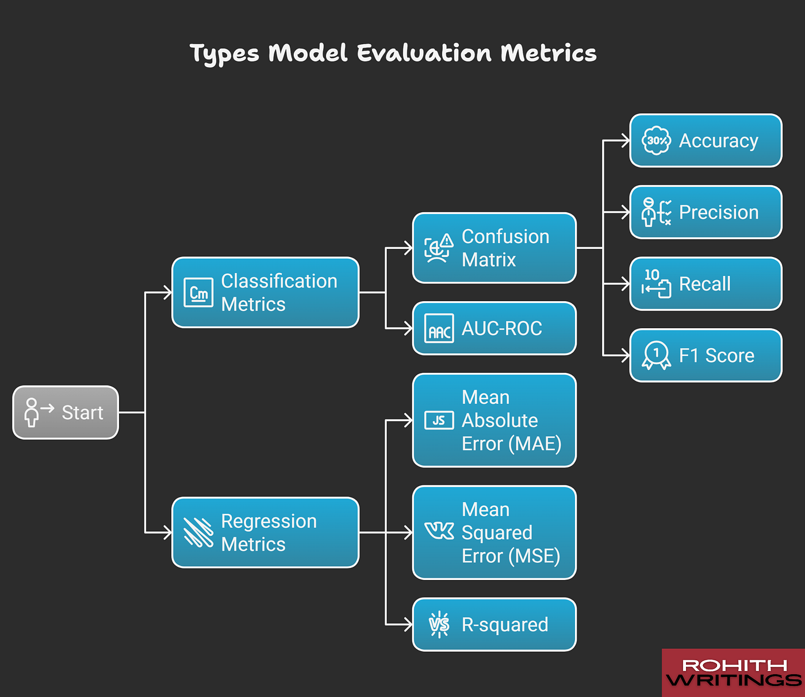
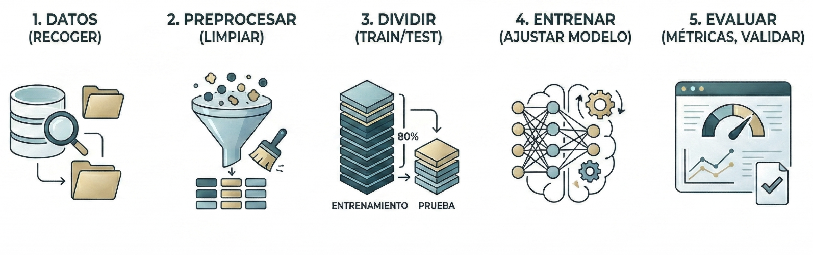
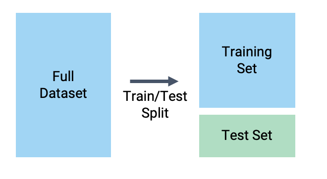
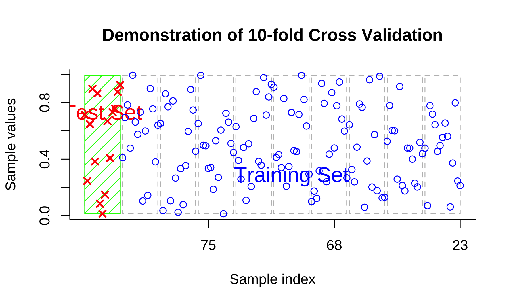
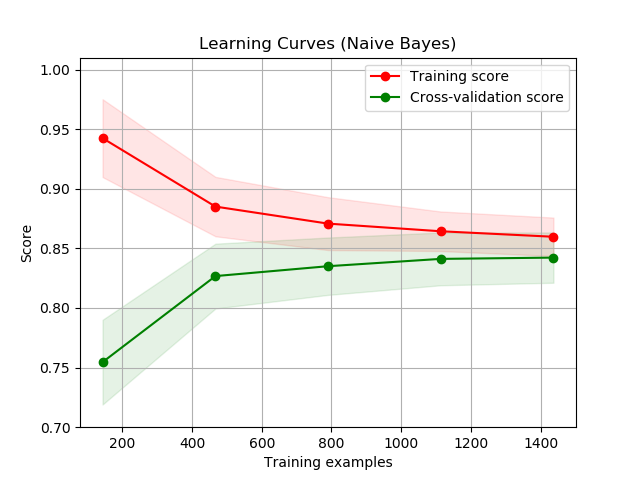
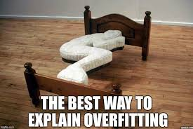
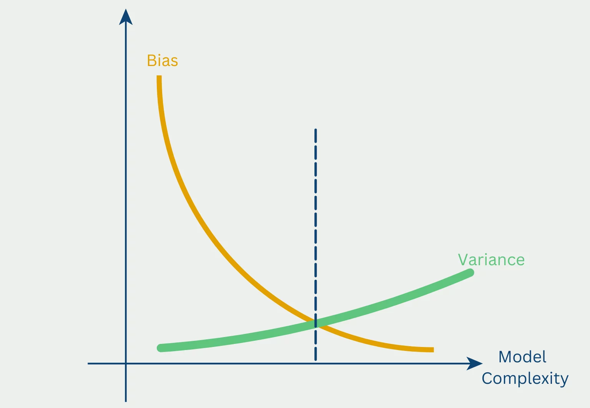
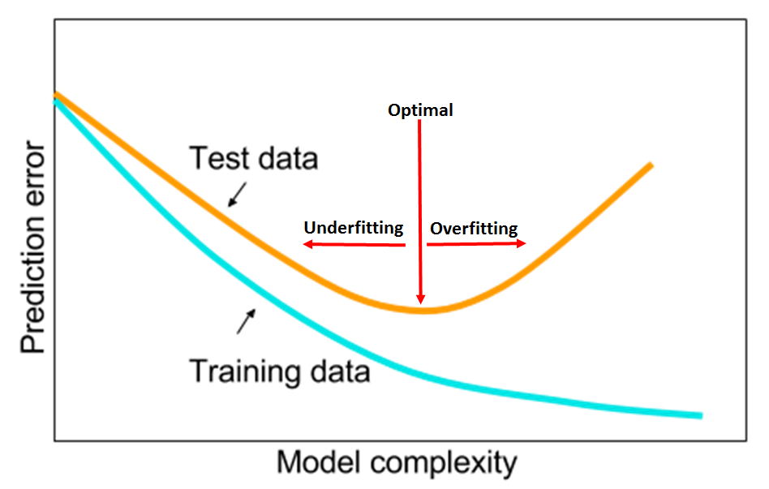
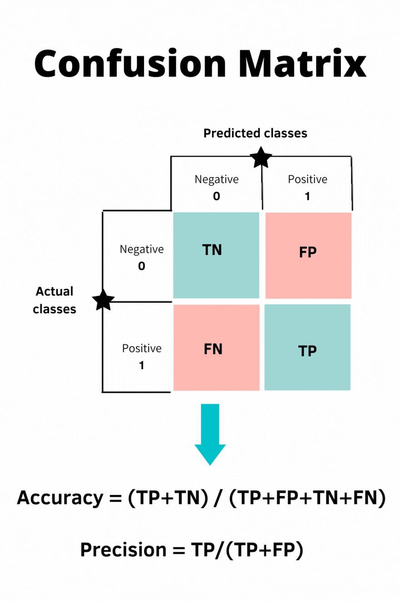
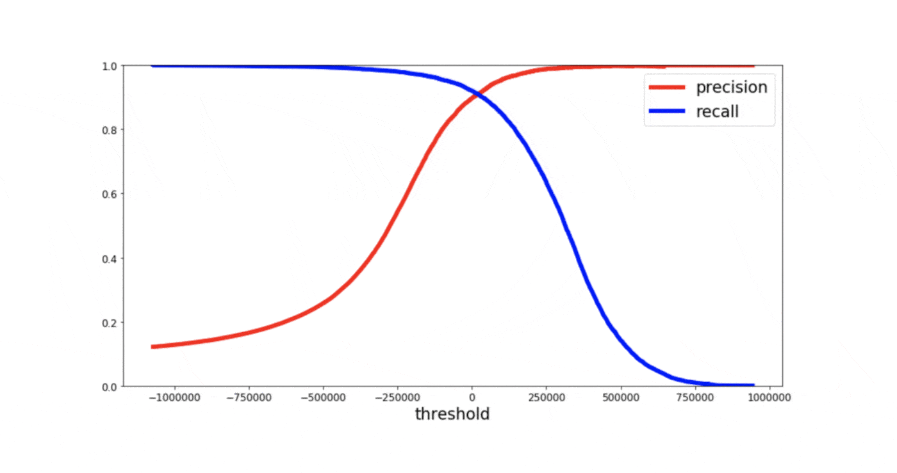

```{r setup, include=FALSE}
options(htmltools.dir.version = FALSE)
library(knitr)
opts_chunk$set(
  prompt = T,
  fig.align = "center",
  dpi = 300,
  cache = T,
  engine.opts = list(bash = "-l")
)

knit_hooks$set(
  prompt = function(before, options, envir) {
    options(
      prompt = if (options$engine %in% c("sh", "bash", "zsh")) "$ " else "R> ",
      continue = if (options$engine %in% c("sh", "bash", "zsh")) "$ " else "+ "
    )
  }
)

options(repos = c(CRAN = "https://cran.rstudio.com/"))

if (!require("fontawesome", character.only = TRUE)) {
  install.packages("fontawesome", dependencies = TRUE)
  library(fontawesome, character.only = TRUE)
}
```

# Fundamentos de Machine Learning {background-color="#2d4563"}

## Agenda de la sesión

:::{style="margin-top: 20px; font-size: 26px;"}

:::{.columns}
:::{.column width=50%}
**Primera parte**

- El flujo de trabajo de ML
- Calidad de datos y preprocesamiento
- Feature engineering
- División train/test y validación cruzada

**Segunda parte**

- Sobreajuste y sesgo-varianza
- Regularización
- Métricas de evaluación
- Selección de modelos
- Reproducibilidad en ML
:::

:::{.column width=50%}
:::{style="text-align: center; margin-top: 30px;"}
[{width="95%"}](#){data-modal-type="image" data-modal-url="figures/metrics-tradeoffs.png"}

Fuente: [Medium](https://aws.plainenglish.io/model-performance-optimization-understanding-machine-learning-evaluation-metrics-30f199ac6a23)
:::
:::
:::
:::

# El flujo de trabajo de ML {background-color="#2d4563"}

## El flujo de trabajo de ML
### Del problema a la solución

:::{style="margin-top: 30px; font-size: 23px;"}

:::{style="text-align: center; font-size: 20px;"}
[{width="60%"}](#){data-modal-type="image" data-modal-url="figures/ml-workflow.png"}
:::

<br>

:::{.columns}
:::{.column width=50%}
- [Paso 1: Recoger datos]{.alert}: obtener observaciones relevantes al problema
- [Paso 2: Preprocesar]{.alert}: limpiar valores faltantes, transformar variables, codificar categorías
- [Paso 3: Dividir]{.alert}: separar en entrenamiento y prueba
:::

:::{.column width=50%}
- [Paso 4: Entrenar]{.alert}: ajustar un modelo a los datos de entrenamiento
- [Paso 5: Evaluar]{.alert}: medir el rendimiento en datos que el modelo nunca vio
- En la práctica, [este proceso es iterativo]{.alert}: volvemos a pasos anteriores cuando algo falla
:::
:::
:::

## Pasos 1-2: recolección y preprocesamiento

:::{style="margin-top: 30px; font-size: 21px;"}
:::{.columns}
:::{.column width=55%}
**Recolección de datos**

- Encuestas, registros administrativos, sensores, APIs, [web scraping](https://es.wikipedia.org/wiki/Web_scraping)
- La [calidad]{.alert} de los datos determina la calidad del modelo
- "Basura entra, basura sale" (garbage in, garbage out)

**Preprocesamiento**

- [Valores faltantes:]{.alert} imputar, eliminar o marcar
- [Variables categóricas:]{.alert} convertir a numéricas ([one-hot encoding](https://en.wikipedia.org/wiki/One-hot), [label encoding](https://en.wikipedia.org/wiki/Feature_engineering#Categorical_data))
- [Escalado:]{.alert} [normalizar](https://es.wikipedia.org/wiki/Normalización_(estadística)) o [estandarizar](https://es.wikipedia.org/wiki/Puntuación_estándar) variables numéricas
- [Outliers:]{.alert} detectar y decidir qué hacer con ellos
- [[Feature engineering:](https://en.wikipedia.org/wiki/Feature_engineering)]{.alert} crear nuevas variables a partir de las existentes
:::

:::{.column width=45%}
:::{style="text-align: center; font-size: 23px;"}
**Ejemplo: datos de países**

```
Datos crudos:
  país     | pib    | edu  | internet
  Uruguay  | 17,020 | 4.9  | 87.7
  Bolivia  | NA     | 6.5  | 48.2
  Chile    | 15,346 | 5.4  | NA

Después de preprocesar:
  país     | pib    | edu  | internet
  Uruguay  | 17,020 | 4.9  | 87.7
  Bolivia  | 10,500 | 6.5  | 48.2   ← imputado
  Chile    | 15,346 | 5.4  | 72.3   ← imputado
```

El preprocesamiento es [la mayor parte del trabajo]{.alert} en un proyecto real de ML.
:::
:::
:::
:::

## Calidad de datos: el factor más ignorado

:::{style="margin-top: 30px; font-size: 22px;"}
:::{.columns}
:::{.column width=55%}
**Problemas comunes en datos reales:**

- [Valores faltantes:]{.alert} ¿aleatorios o sistemáticos?
    - [MCAR](https://en.wikipedia.org/wiki/Missing_data#Missing_completely_at_random): faltantes completamente al azar
    - [MAR](https://en.wikipedia.org/wiki/Missing_data#Missing_at_random): faltantes que dependen de otras variables observadas
    - [MNAR](https://en.wikipedia.org/wiki/Missing_data#Missing_not_at_random): faltantes que dependen de la variable misma (más difícil)
- [Errores de medición:]{.alert} datos mal cargados, unidades inconsistentes
- [Duplicados:]{.alert} registros repetidos que sesgan el modelo
- [Desbalance de clases:]{.alert} mucho más de una categoría que de otra
- [[Data leakage:](https://en.wikipedia.org/wiki/Leakage_(machine_learning))]{.alert} información del futuro que "se filtra" al entrenamiento
:::

:::{.column width=45%}
:::{style="text-align: center; font-size: 23px;"}
**Ejemplo de data leakage:**

Quieren predecir si un paciente será hospitalizado.

```
Variable: "días_en_hospital"

Si incluyen esta variable,
el modelo "aprende" que
días_en_hospital > 0 → hospitalizado

¡Pero esta información no existe
al momento de la predicción!
```

<br>

[El data leakage es uno de los errores más difíciles de detectar]{.alert} y puede inflar artificialmente las métricas.
:::
:::
:::
:::

## Feature engineering
### El arte de crear variables predictivas

:::{style="margin-top: 30px; font-size: 22px;"}
:::{.columns}
:::{.column width=55%}
- [[Feature engineering:](https://en.wikipedia.org/wiki/Feature_engineering)]{.alert} crear nuevas variables a partir de las existentes
- Puede mejorar mucho el rendimiento de un modelo simple
- Ejemplos comunes:
    - [Transformaciones:]{.alert} log(ingreso), raíz cuadrada, bins
    - [Interacciones:]{.alert} edad × educación
    - [Agregaciones:]{.alert} promedio de compras últimos 3 meses
    - [Variables temporales:]{.alert} día de la semana, mes, año
    - [Variables de texto:]{.alert} largo del texto, cantidad de palabras
- [El conocimiento del dominio es clave:]{.alert} ¿qué variables tienen sentido para el problema?
:::

:::{.column width=45%}
:::{style="text-align: center; font-size: 23px;"}
**Ejemplo: predicción de abandono**

Variables originales:
```
fecha_registro, ultima_compra,
monto_total, cantidad_compras
```

Variables derivadas:
```
dias_desde_registro
dias_sin_comprar         ← predictor fuerte
promedio_por_compra
frecuencia_compras
tendencia_reciente       ← ¿aumenta o baja?
```

<br>

[Un buen feature engineering puede valer más que un modelo complejo.]{.alert}
:::
:::
:::
:::

## Paso 3: ¿por qué dividir los datos?

:::{style="margin-top: 30px; font-size: 24px;"}
:::{.columns}
:::{.column width=55%}
- Queremos saber si el modelo [funciona con datos nuevos]{.alert}, no solo con los datos que ya vio
- Si evaluamos el modelo con los mismos datos que usamos para entrenarlo, [no sabemos si realmente aprendió]{.alert}
- Por eso dividimos:
    - [Entrenamiento (~70-80%):]{.alert} el modelo aprende de estos datos
    - [Prueba (~20-30%):]{.alert} evaluamos el rendimiento con datos que el modelo nunca vio
- [Regla de oro: nunca mirar los datos de prueba hasta el final]{.alert}
:::

:::{.column width=45%}
:::{style="text-align: center;"}
[{width="100%"}](#){data-modal-type="image" data-modal-url="figures/train-val-test.png"}
:::
:::
:::
:::

# División train/test y validación cruzada {background-color="#2d4563"}

## División train/test

:::{style="margin-top: 30px; font-size: 24px;"}
:::{.columns}
:::{.column width=55%}
- La forma más simple de evaluar un modelo
- Dividimos los datos [aleatoriamente]{.alert} en dos conjuntos
- El modelo [solo ve los datos de entrenamiento]{.alert} durante el ajuste
- Evaluamos con los datos de prueba al final
- Problemas potenciales:
    - Con pocos datos, una sola división puede [no ser representativa]{.alert}
    - El resultado depende de [qué observaciones cayeron en cada conjunto]{.alert}
- Para datasets pequeños, necesitamos algo más: [[validación cruzada](https://es.wikipedia.org/wiki/Validación_cruzada)]{.alert}
:::

:::{.column width=45%}
:::{style="text-align: center; font-size: 20px;"}
[{width="80%"}](#){data-modal-type="image" data-modal-url="figures/train-val-test.png"}
:::
:::
:::
:::

## Validación cruzada K-fold

:::{style="margin-top: 30px; font-size: 24px;"}
:::{.columns}
:::{.column width=55%}
- Dividimos los datos en [K partes]{.alert} (folds) de tamaño similar
- Entrenamos K veces, cada vez usando [K-1 folds para entrenamiento]{.alert} y [1 fold para validación]{.alert}
- Repetimos K veces, rotando el fold de validación
- [Promediamos]{.alert} los resultados de las K iteraciones
- Cada observación es usada para validación exactamente una vez
- Más [confiable]{.alert} que una sola división, especialmente con pocos datos
- K = 5 o K = 10 son los valores más comunes
:::

:::{.column width=45%}
:::{style="text-align: center;"}
[{width="100%"}](#){data-modal-type="image" data-modal-url="figures/cv.gif"}
:::
:::
:::
:::

## Estratificación y otras estrategias

:::{style="margin-top: 30px; font-size: 19px;"}
:::{.columns}
:::{.column width=55%}
**Estratificación**

- Asegura que cada fold tenga la [misma proporción de clases]{.alert} que el dataset completo
- Necesaria cuando las clases están [desbalanceadas]{.alert}
- En tidymodels: `initial_split(datos, strata = variable_respuesta)`

**Validación temporal (time series split)**

- Para datos con [estructura temporal]{.alert} ([series de tiempo](https://es.wikipedia.org/wiki/Serie_temporal))
- [Nunca entrenar con datos del futuro]{.alert} para predecir el pasado
- Se entrena con datos anteriores, se valida con datos posteriores

**[Leave-One-Out](https://en.wikipedia.org/wiki/Cross-validation_(statistics)#Leave-one-out_cross-validation) (LOO)**

- K = N (cada observación es un fold)
- Útil con [muy pocos datos]{.alert}, pero costoso computacionalmente
:::

:::{.column width=45%}
:::{style="text-align: center; font-size: 20px;"}
**Validación temporal**

```
Datos: ene feb mar abr may jun jul ago

Fold 1:
  Train: ene feb mar
  Test:  abr

Fold 2:
  Train: ene feb mar abr
  Test:  may

Fold 3:
  Train: ene feb mar abr may
  Test:  jun

... y así sucesivamente
```

<br>

[La validación temporal es necesaria para datos con dependencia temporal.]{.alert}
:::
:::
:::
:::

## ¿Cuántos datos necesito?

:::{style="margin-top: 30px; font-size: 22px;"}
:::{.columns}
:::{.column width=55%}
- Pregunta frecuente sin respuesta universal
- Depende de:
    - [Complejidad del problema:]{.alert} ¿cuántas variables? ¿relaciones lineales o no lineales?
    - [Ruido en los datos:]{.alert} datos limpios necesitan menos observaciones
    - [Complejidad del modelo:]{.alert} modelos complejos necesitan más datos
    - [Número de clases:]{.alert} más clases = más datos por clase
- Reglas prácticas (muy aproximadas):
    - [Clasificación:]{.alert} al menos 50-100 por clase minoritaria
    - [[Deep learning:](https://es.wikipedia.org/wiki/Aprendizaje_profundo)]{.alert} miles a millones de ejemplos
:::

:::{.column width=45%}
:::{style="text-align: center; font-size: 20px;"}
**[Curvas de aprendizaje](https://en.wikipedia.org/wiki/Learning_curve_(machine_learning))**

[{width="100%"}](#){data-modal-type="image" data-modal-url="figures/learning-curve.png"}

Con más datos, el rendimiento mejora, pero con [[rendimientos decrecientes](https://es.wikipedia.org/wiki/Rendimientos_decrecientes)]{.alert}.

A veces [más datos ayudan más]{.alert} que un modelo más complejo.
:::
:::
:::
:::

# Sobreajuste y sesgo-varianza {background-color="#2d4563"}

## ¿Qué es el sobreajuste?

:::{style="margin-top: 30px; font-size: 24px;"}
:::{.columns}
:::{.column width=55%}
- [[Sobreajuste (overfitting):](https://es.wikipedia.org/wiki/Sobreajuste)]{.alert} el modelo funciona muy bien con los datos de entrenamiento pero mal con datos nuevos
- El modelo ha [memorizado]{.alert} el conjunto de entrenamiento, incluyendo su ruido y particularidades
- No ha aprendido los [patrones subyacentes]{.alert}
- Señales de sobreajuste:
    - [Rendimiento excelente en entrenamiento]{.alert}
    - [Rendimiento pobre en test]{.alert}
    - La brecha crece con la complejidad del modelo
- Piénsenlo así: [memorizar las respuestas del examen vs. entender la materia]{.alert}
- El estudiante que memoriza fracasa cuando las preguntas se reformulan
:::

:::{.column width=45%}
:::{style="text-align: center;"}
[{width="100%"}](#){data-modal-type="image" data-modal-url="figures/overfitting-meme.jpg"}

Fuente: [X.com](https://x.com/MaartenvSmeden/status/1522230905468862464)
:::
:::
:::
:::

## Subajuste vs. sobreajuste

:::{style="margin-top: 30px; font-size: 22px;"}
:::{style="text-align: center;"}
[{width="65%"}](#){data-modal-type="image" data-modal-url="figures/overfit-underfit.png"}
:::

:::{.columns}
:::{.column width=33%}
**Subajuste**

- Modelo [demasiado simple]{.alert}
- Alto sesgo, baja varianza
- Malo en entrenamiento Y en test
- No captó el patrón
- Solución: modelo más complejo
:::

:::{.column width=33%}
**Buen ajuste**

- [Complejidad adecuada]{.alert}
- Sesgo y varianza equilibrados
- Bueno en ambos conjuntos
- Captura el patrón verdadero
- Esto es lo que buscamos
:::

:::{.column width=33%}
**Sobreajuste**

- Modelo [demasiado complejo]{.alert}
- Bajo sesgo, alta varianza
- Excelente en entrenamiento, malo en test
- Memorizó el ruido
- Solución: regularización
:::
:::
:::

## El compromiso sesgo-varianza

:::{style="margin-top: 30px; font-size: 22px;"}
:::{.columns}
:::{.column width=55%}
- [[Sesgo (bias):](https://en.wikipedia.org/wiki/Bias%E2%80%93variance_tradeoff)]{.alert} error por suposiciones simplificadoras del modelo. Un modelo con alto sesgo "no presta atención" a los datos
- [[Varianza:](https://es.wikipedia.org/wiki/Varianza)]{.alert} error por sensibilidad excesiva a los datos de entrenamiento. Un modelo con alta varianza cambia mucho con cada muestra
- [No se pueden minimizar ambos al mismo tiempo]{.alert}: al reducir uno, el otro tiende a aumentar
- El objetivo es encontrar el [punto medio]{.alert} donde el error total es mínimo
- En la práctica:
    - Modelos simples ([regresión lineal](https://es.wikipedia.org/wiki/Regresión_lineal)): alto sesgo, baja varianza
    - Modelos complejos ([redes neuronales profundas](https://es.wikipedia.org/wiki/Aprendizaje_profundo)): bajo sesgo, alta varianza
    - [Regularización]{.alert} ayuda a controlar la varianza sin aumentar demasiado el sesgo
:::

:::{.column width=45%}
:::{style="text-align: center; font-size: 20px;"}
[{width="100%"}](#){data-modal-type="image" data-modal-url="figures/bias-variance.webp"}

A medida que el modelo se vuelve
más complejo, el sesgo disminuye
(la curva baja) pero la varianza
aumenta (la curva sube).
:::
:::
:::
:::

## Regularización: controlando la complejidad

:::{style="margin-top: 30px; font-size: 22px;"}
:::{.columns}
:::{.column width=55%}
- [[Regularización:](https://en.wikipedia.org/wiki/Regularization_(mathematics))]{.alert} técnica para penalizar la complejidad del modelo
- Agrega un término de penalización a la [función de pérdida](https://en.wikipedia.org/wiki/Loss_function)
- Obliga al modelo a [mantener coeficientes pequeños]{.alert}
- Reduce la varianza a costa de un pequeño aumento en el sesgo

**Tipos principales:**

- [[L1 (LASSO):](https://en.wikipedia.org/wiki/Lasso_(statistics))]{.alert} puede llevar coeficientes a exactamente cero (selección de variables)
- [[L2 (Ridge):](https://en.wikipedia.org/wiki/Ridge_regression)]{.alert} reduce coeficientes pero no los elimina
- [[Elastic Net:](https://en.wikipedia.org/wiki/Elastic_net_regularization)]{.alert} combinación de L1 y L2

Lo veremos en detalle en el [Día 2]{.alert} cuando trabajemos con regresión.
:::

:::{.column width=45%}
:::{style="text-align: center; font-size: 20px;"}
**Intuición de la regularización**

Sin regularización:
```
Modelo: y = 15.3x₁ - 42.7x₂ + 89.1x₃

Coeficientes grandes = modelo sensible
a pequeños cambios en los datos
```

Con regularización:
```
Modelo: y = 2.1x₁ - 1.8x₂ + 0.5x₃

Coeficientes pequeños = modelo más
estable y generalizable
```

<br>

[La regularización es como pedirle al modelo que sea "parsimonioso".]{.alert}
:::
:::
:::
:::

## Cómo detectar sobreajuste en la práctica

:::{style="margin-top: 30px; font-size: 24px;"}
:::{.columns}
:::{.column width=55%}
**Señales de alarma:**

1. [Gran brecha]{.alert} entre rendimiento en train y test
2. El modelo mejora en train pero [empeora en validación]{.alert}
3. Coeficientes o pesos [muy grandes]{.alert}
4. El modelo es [muy sensible]{.alert} a pequeños cambios en los datos

**Estrategias para combatirlo:**

- [Más datos]{.alert} (si es posible)
- [Regularización]{.alert} (L1, L2, Elastic Net)
- [Reducir complejidad]{.alert} del modelo
- [Validación cruzada]{.alert} para evaluar de forma más robusta
:::

:::{.column width=45%}
:::{style="text-align: center; font-size: 20px;"}
**Curvas de entrenamiento**

[{width="100%"}](#){data-modal-type="image" data-modal-url="figures/learning-curve-overfit.png"}

Cuando las curvas se separan, [el modelo está sobreajustando]{.alert}.

El punto donde se cruzan es donde deberíamos detenernos.
:::
:::
:::
:::

# Métricas de evaluación {background-color="#2d4563"}

## La paradoja de la precisión

:::{style="margin-top: 40px; font-size: 26px;"}
**Escenario**: están construyendo un modelo para predecir si los pacientes tienen una enfermedad rara que afecta a [1 de cada 1.000 personas]{.alert}.

Un colega les muestra un modelo y les dice con orgullo: ["Logra un 99,9% de accuracy (exactitud)"]{.alert}

:::{.fragment}
**Pregunta**: ¿es bueno este modelo?

Piénsenlo 30 segundos...
:::

:::{.fragment}
**La verdad incómoda**: ese modelo "99,9% preciso" [no detecta ni un solo caso real]{.alert}. Simplemente predice "sano" para todos. Cada paciente enfermo es ignorado.

[La accuracy (exactitud) no basta]{.alert}, especialmente con clases desbalanceadas.
:::
:::

## La matriz de confusión

:::{style="margin-top: 30px; font-size: 23px;"}
:::{.columns}
:::{.column width=55%}
- Una tabla que muestra [todos los resultados posibles]{.alert} de las predicciones
- Cuatro cantidades clave:
    - **Verdaderos Positivos (VP)**: correctamente predicho como positivo
    - **Verdaderos Negativos (VN)**: correctamente predicho como negativo
    - **Falsos Positivos (FP)**: predicho como positivo, pero era negativo ([Error Tipo I](https://es.wikipedia.org/wiki/Error_de_tipo_I_y_de_tipo_II))
    - **Falsos Negativos (FN)**: predicho como negativo, pero era positivo ([Error Tipo II](https://es.wikipedia.org/wiki/Error_de_tipo_I_y_de_tipo_II))
- [Todas las métricas de clasificación se derivan de estos cuatro números]{.alert}
:::

:::{.column width=45%}
:::{style="text-align: center; margin-top: -30px;"}
[{width="70%"}](#){data-modal-type="image" data-modal-url="figures/confusion-matrix.gif"}
:::
:::
:::
:::

## Precisión y recall

:::{style="margin-top: 20px; font-size: 21px;"}
:::{.columns}
:::{.column width=50%}
**[Precision](https://es.wikipedia.org/wiki/Precisi%C3%B3n_y_exhaustividad)** = VP / (VP + FP)

- Cuando el modelo dice "sí", [¿con qué frecuencia acierta?]{.alert}
- Alta precisión = [pocas falsas alarmas]{.alert}
- Importante cuando **los falsos positivos son costosos** (spam, fraude)

**[Recall](https://es.wikipedia.org/wiki/Precisi%C3%B3n_y_exhaustividad)** = VP / (VP + FN)

- De todos los positivos reales, [¿cuántos encontramos?]{.alert}
- Alto recall = [no nos perdemos muchos positivos]{.alert}
- Importante cuando **los falsos negativos son costosos** (enfermedades, seguridad)

La mayoría de los clasificadores generan una [puntuación de probabilidad]{.alert}. Mover el umbral cambia el equilibrio entre precisión y recall. [No se pueden maximizar ambos]{.alert}
:::

:::{.column width=50%}
:::{style="text-align: center;"}
[{width="90%"}](#){data-modal-type="image" data-modal-url="figures/precision-recall-tradeoff.gif"}

Fuente: [Analytics Vidhya](https://www.analyticsvidhya.com/blog/2020/10/how-to-choose-evaluation-metrics-for-classification-model/)
:::
:::
:::
:::

## AUC-ROC

:::{style="margin-top: 30px; font-size: 22px;"}
:::{.columns}
:::{.column width=50%}
**[AUC-ROC](https://es.wikipedia.org/wiki/Curva_ROC)**

- [[Curva ROC:](https://es.wikipedia.org/wiki/Curva_ROC)]{.alert} grafica tasa de verdaderos positivos vs. falsos positivos
- [[AUC:](https://en.wikipedia.org/wiki/Receiver_operating_characteristic#AUC)]{.alert} área bajo la curva ROC (0.5 = azar, 1.0 = perfecto)
- Mide qué tan bien el modelo [separa las clases]{.alert} en general
- [Independiente del umbral:]{.alert} evalúa todas las probabilidades
- Muy usado para comparar clasificadores

:::{style="text-align: center;"}
| AUC | Interpretación |
|-----|----------------|
| 0.5 | No mejor que azar |
| 0.7-0.8 | Aceptable |
| 0.8-0.9 | Bueno |
| >0.9 | Excelente |
:::
:::

:::{.column width=50%}
:::{style="text-align: center; font-size: 30px;"}
[{width="100%"}](#){data-modal-type="image" data-modal-url="figures/auc.png"}
:::
:::
:::
:::

## Métricas de regresión

:::{style="margin-top: 30px; font-size: 24px;"}
- Para regresión (predecir números), necesitamos métricas diferentes:

| Métrica | Fórmula | Intuición |
|---------|---------|-----------|
| **[MAE](https://es.wikipedia.org/wiki/Error_absoluto_medio)** | Media de |real - predicho| | Error promedio (en unidades originales) |
| **[MSE](https://es.wikipedia.org/wiki/Error_cuadrático_medio)** | Media de (real - predicho)² | Error cuadrado promedio (penaliza errores grandes) |
| **[RMSE](https://en.wikipedia.org/wiki/Root_mean_square_deviation)** | $\sqrt{\text{MSE}}$ | Lo mismo que MSE, pero en unidades originales |
| **[R²](https://es.wikipedia.org/wiki/Coeficiente_de_determinación)** | 1 - (SS_res / SS_tot) | Proporción de varianza explicada |

:::{.fragment}
[Ejemplos sencillos:]{.alert}

- **MAE**: predigo 10 pizzas, llegan 12, error de 2. Predigo 10, llegan 8, error de 2. [MAE = 2 pizzas]{.alert}
- **RMSE**: un día me equivoco por 2, otro día por 10. RMSE [penaliza mucho más]{.alert} el error de 10 que el de 2
- **R²**: R² = 0,8 significa que el modelo [explica el 80%]{.alert} de la variación; [el 20% queda sin explicar]{.alert}
:::
:::

## ¿Qué métrica elegir?

:::{style="margin-top: 30px; font-size: 22px;"}
:::{.columns}
:::{.column width=55%}
- No existe una métrica "mejor" en general: [depende del contexto]{.alert}
- Preguntas para orientarse:
    - ¿Cuál es el costo de un [falso positivo]{.alert}? (decir "sí" cuando es "no")
    - ¿Cuál es el costo de un [falso negativo]{.alert}? (decir "no" cuando es "sí")
    - ¿Las clases están [balanceadas]{.alert} o desbalanceadas?
    - ¿Qué [acción]{.alert} se tomará con base en la predicción?

| Escenario | Métrica prioritaria |
|-----------|-------------------|
| Diagnóstico médico | [Recall]{.alert} (no perder enfermos) |
| Filtro de spam | [Precision]{.alert} (no perder correos legítimos) |
| Predicción de ventas | [MAE o RMSE]{.alert} |
| Comparar modelos | [R²]{.alert} (varianza explicada) |
:::

:::{.column width=45%}
:::{style="text-align: center;"}
[{width="100%"}](#){data-modal-type="image" data-modal-url="figures/metrics-tradeoffs.png"}

Fuente: [Medium](https://aws.plainenglish.io/model-performance-optimization-understanding-machine-learning-evaluation-metrics-30f199ac6a23)
:::
:::
:::
:::

## Selección de modelos

:::{style="margin-top: 30px; font-size: 22px;"}
:::{.columns}
:::{.column width=55%}
**¿Qué modelo usar?**

- No existe un modelo "mejor" para todos los problemas
- Depende de:
    - [Cantidad de datos]{.alert} disponibles
    - [Interpretabilidad]{.alert} requerida
    - [Tiempo de entrenamiento]{.alert} aceptable
    - [Tipo de relaciones]{.alert} en los datos

**Principio de parsimonia:**

- Empezar con [modelos simples]{.alert} (regresión, árboles)
- Aumentar complejidad solo si es necesario
- [Un modelo simple que funciona bien es mejor que uno complejo que funciona igual]{.alert}
:::

:::{.column width=45%}
:::{style="text-align: center; font-size: 20px;"}
**Guía práctica**

| Situación | Modelo sugerido |
|-----------|-----------------|
| Pocos datos, interpretabilidad alta | [Regresión logística](https://es.wikipedia.org/wiki/Regresión_logística)/[lineal](https://es.wikipedia.org/wiki/Regresión_lineal) |
| Datos moderados, interpretabilidad media | Árboles, [Random Forest](https://es.wikipedia.org/wiki/Random_forest) |
| Muchos datos, rendimiento máximo | [Gradient Boosting](https://es.wikipedia.org/wiki/Gradient_boosting), Redes |
| Relaciones muy no lineales | Random Forest, [XGBoost](https://en.wikipedia.org/wiki/XGBoost) |
| Texto | [Transformers](https://en.wikipedia.org/wiki/Transformer_(deep_learning_architecture)), [BERT](https://en.wikipedia.org/wiki/BERT_(language_model)) |

<br>

[En la práctica, probar varios modelos y comparar con validación cruzada.]{.alert}
:::
:::
:::
:::

# Reproducibilidad en ML {background-color="#2d4563"}

## ¿Por qué importa la reproducibilidad?

:::{style="margin-top: 30px; font-size: 24px;"}
:::{.columns}
:::{.column width=55%}
- [Reproducibilidad:]{.alert} poder obtener los mismos resultados con los mismos datos y código
- Necesaria para:
    - [Verificar resultados]{.alert} propios y ajenos
    - [Colaborar]{.alert} con otros investigadores
    - [Debugging]{.alert}: entender qué salió mal
    - [Producción]{.alert}: desplegar el mismo modelo que probamos

**Problemas comunes:**

- Diferentes versiones de paquetes
- Semillas aleatorias no fijadas
- Datos no versionados
- Código no documentado
- Hiperparámetros no registrados
:::

:::{.column width=45%}
:::{style="text-align: center; font-size: 20px;"}
**Buenas prácticas**

1. [Fijar semillas aleatorias]{.alert}
   ```r
   set.seed(2026)
   ```

2. [Documentar versiones]{.alert}
   ```r
   sessionInfo()
   ```

3. [Usar control de versiones]{.alert}
   - Git para código
   - DVC para datos (si son grandes)

4. [Registrar experimentos]{.alert}
   - Qué modelo, qué hiperparámetros
   - Qué datos, qué preprocesamiento
   - Qué métricas obtuvieron
:::
:::
:::
:::

## Herramientas para reproducibilidad

:::{style="margin-top: 30px; font-size: 24px;"}
:::{.columns}
:::{.column width=50%}
**En R:**

- [[renv:](https://rstudio.github.io/renv/)]{.alert} gestión de dependencias (versiones de paquetes)
- [[targets:](https://docs.ropensci.org/targets/)]{.alert} pipelines reproducibles
- [Quarto/RMarkdown:]{.alert} código + documentación juntos
- [Git:]{.alert} control de versiones

**En general:**

- [[Docker:](https://www.docker.com/)]{.alert} contenedores con ambiente completo
- [[MLflow:](https://mlflow.org/)]{.alert} tracking de experimentos
- [[DVC:](https://dvc.org/)]{.alert} versionado de datos
:::

:::{.column width=50%}
:::{style="text-align: center; font-size: 20px;"}
**Ejemplo: estructura de proyecto reproducible**

```
mi_proyecto/
├── README.md           ← descripción
├── renv.lock           ← versiones de paquetes
├── data/
│   ├── raw/            ← datos originales
│   └── processed/      ← datos procesados
├── scripts/
│   ├── 01-preprocess.R
│   ├── 02-train.R
│   └── 03-evaluate.R
├── models/             ← modelos guardados
└── reports/            ← resultados
```

<br>

[Invertir en reproducibilidad ahorra tiempo a futuro.]{.alert}
:::
:::
:::
:::

# Resumen y preparación para el laboratorio {background-color="#2d4563"}

## El ecosistema tidymodels

:::{style="margin-top: 30px; font-size: 24px;"}
:::{.columns}
:::{.column width=55%}
- [tidymodels](https://www.tidymodels.org/) es un conjunto de paquetes de R para modelado de datos
- Sigue la filosofía del [[tidyverse](https://www.tidyverse.org/)]{.alert}: código legible, consistente y modular
- Paquetes principales:
    - [[rsample:](https://rsample.tidymodels.org/)]{.alert} división de datos (train/test, validación cruzada)
    - [[parsnip:](https://parsnip.tidymodels.org/)]{.alert} especificación de modelos (interfaz unificada)
    - [[yardstick:](https://yardstick.tidymodels.org/)]{.alert} métricas de evaluación
    - [[workflows:](https://workflows.tidymodels.org/)]{.alert} combinar preprocesamiento + modelo
    - [[recipes:](https://recipes.tidymodels.org/)]{.alert} preprocesamiento de datos
- Ventaja: [misma sintaxis]{.alert} para todos los modelos, ya sea regresión logística, random forest o redes neuronales
:::

:::{.column width=45%}
:::{style="text-align: center; font-size: 20px;"}
```
tidymodels
├── rsample    → dividir datos
├── recipes    → preprocesar
├── parsnip    → especificar modelo
├── workflows  → combinar todo
├── tune       → ajustar hiperparámetros
└── yardstick  → evaluar
```

<br>

El flujo de trabajo en código:

```r
# 1. Dividir
datos_split <- initial_split(datos)

# 2. Especificar modelo
modelo <- logistic_reg() |>
  set_engine("glm")

# 3. Ajustar
ajuste <- fit(modelo, formula, training(datos_split))

# 4. Evaluar
predicciones <- predict(ajuste, testing(datos_split))
```
:::
:::
:::
:::

## Resumen de la sesión

:::{style="margin-top: 30px; font-size: 24px;"}
:::{.columns}
:::{.column width=50%}
**Conceptos fundamentales:**

- El flujo de trabajo de ML tiene 5 pasos: [recoger, preprocesar, dividir, entrenar, evaluar]{.alert}
- La [calidad de los datos]{.alert} determina la calidad del modelo
- El [feature engineering]{.alert} puede mejorar mucho un modelo simple
- Dividimos los datos en [entrenamiento y prueba]{.alert} para evaluar generalización
- La [validación cruzada]{.alert} es más confiable que una sola división
:::

:::{.column width=50%}
**Problemas y soluciones:**

- El [sobreajuste]{.alert} ocurre cuando el modelo memoriza en lugar de aprender
- La [regularización]{.alert} controla la complejidad del modelo
- La [accuracy no es suficiente]{.alert}: necesitamos precisión, recall, AUC-ROC
- Los [hiperparámetros]{.alert} se ajustan con validación, no con test
- La [reproducibilidad]{.alert} es necesaria para verificar y colaborar
:::
:::
:::

## Próximos pasos

:::{style="margin-top: 40px; font-size: 30px;"}
- [Ahora:]{.alert} Laboratorio práctico (Sesiones 1.3 y 1.4)
    - Primer flujo de trabajo con tidymodels
    - Clasificación con regresión logística
    - Evaluación y comparación de modelos

- [Mañana (Día 2):]{.alert} Aprendizaje supervisado
    - Sesión 2.1: Clasificación (regresión logística, árboles de decisión, random forest)
    - Sesión 2.2: Regresión y predicción (LASSO, Ridge, Elastic Net)

- Vamos a aplicar todo lo que vimos hoy con [modelos más sofisticados]{.alert}
:::

# Nos vemos en el laboratorio! 🤓 {background-color="#2d4563"}
