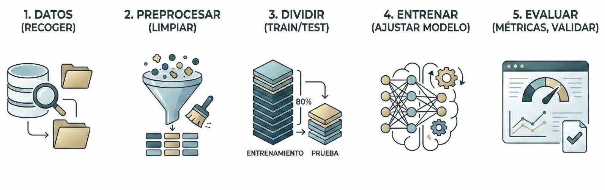
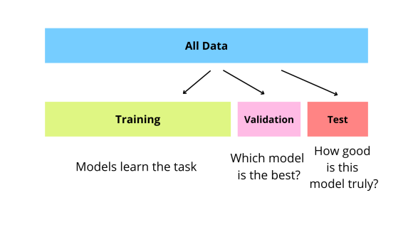
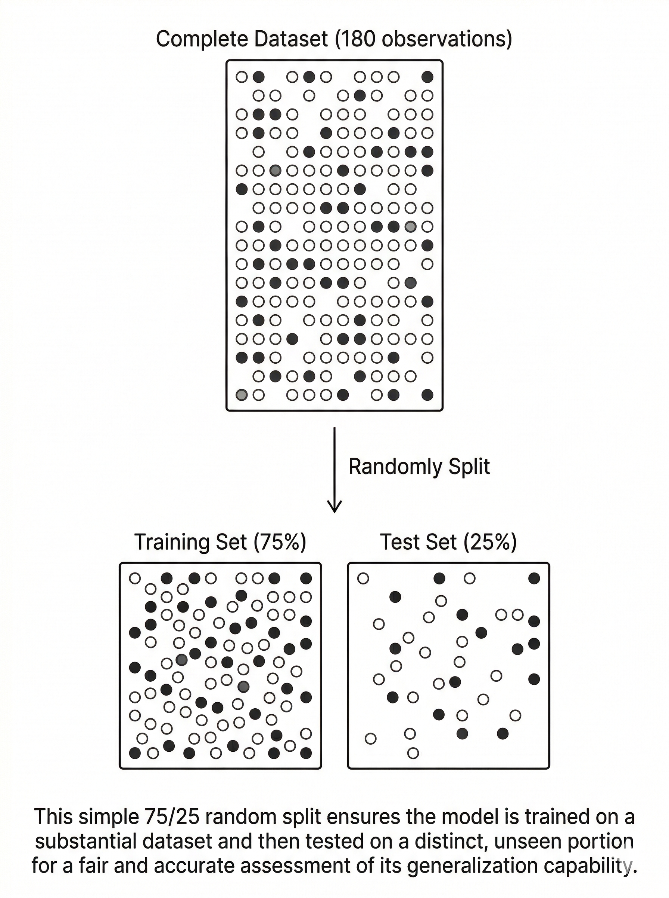
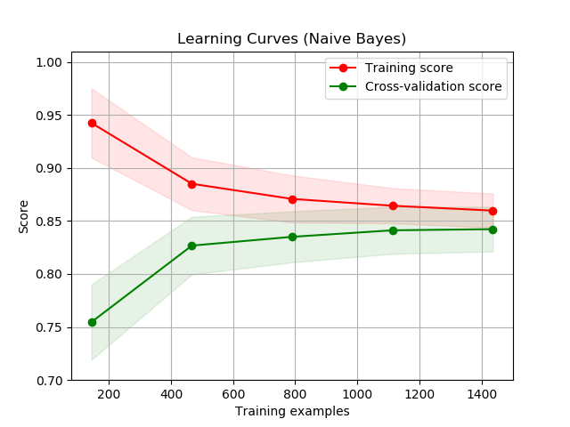
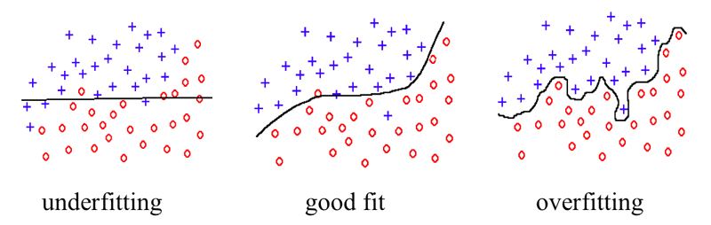
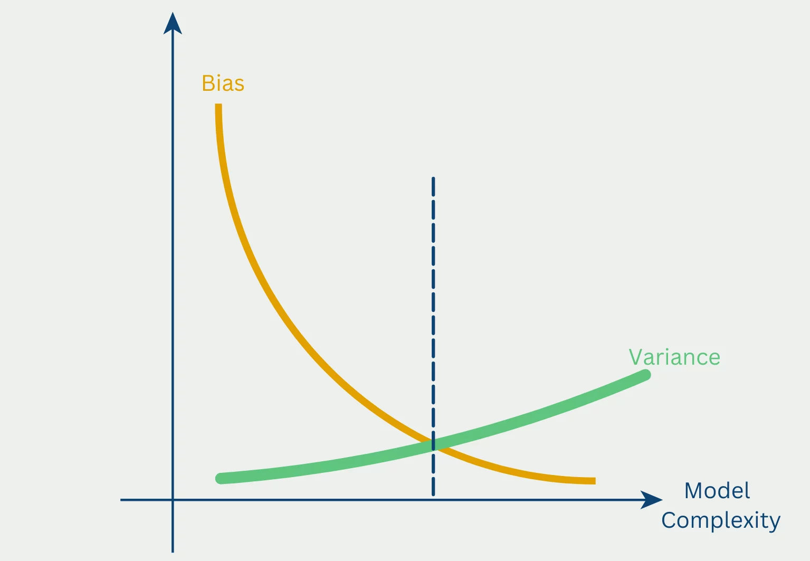
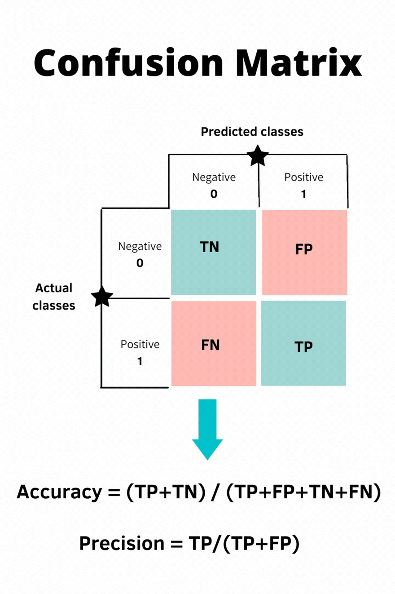

```{r setup, include=FALSE}
options(htmltools.dir.version = FALSE)
library(knitr)
opts_chunk$set(
  prompt = T,
  fig.align = "center",
  dpi = 300,
  cache = T,
  engine.opts = list(bash = "-l")
)

knit_hooks$set(
  prompt = function(before, options, envir) {
    options(
      prompt = if (options$engine %in% c("sh", "bash", "zsh")) "$ " else "R> ",
      continue = if (options$engine %in% c("sh", "bash", "zsh")) "$ " else "+ "
    )
  }
)

options(repos = c(CRAN = "https://cran.rstudio.com/"))

if (!require("fontawesome", character.only = TRUE)) {
  install.packages("fontawesome", dependencies = TRUE)
  library(fontawesome, character.only = TRUE)
}
```

# Fundamentos de Machine Learning {background-color="#2d4563"}

## Agenda de la sesión

:::{style="margin-top: 20px; font-size: 26px;"}

:::{.columns}
:::{.column width=50%}
**Primera parte**

- El flujo de trabajo de ML
- Calidad de datos y preprocesamiento
- Feature engineering
- División train/test y validación cruzada

**Segunda parte**

- Sobreajuste y sesgo-varianza
- Métricas de evaluación
- Selección de modelos
- Reproducibilidad en ML
:::

:::{.column width=50%}
:::{style="text-align: center; margin-top: 30px;"}
[{width="95%"}](#){data-modal-type="image" data-modal-url="figures/metrics-tradeoffs.png"}

Fuente: [AWS in Plain English](https://aws.plainenglish.io/model-performance-optimization-understanding-machine-learning-evaluation-metrics-30f199ac6a23)
:::
:::
:::
:::

# El flujo de trabajo de ML {background-color="#2d4563"}

## El flujo de trabajo de ML
### Del problema a la solución

:::{style="margin-top: 30px; font-size: 23px;"}

:::{style="text-align: center; font-size: 20px;"}
[{width="60%"}](#){data-modal-type="image" data-modal-url="figures/ml-workflow.png"}
:::

:::{style="margin-top: 30px;"}
:::

:::{.columns}
:::{.column width=50%}
1. [Recoger datos]{.alert}: obtener observaciones relevantes al problema
2. [Preprocesar]{.alert}: limpiar, transformar variables y codificar categorías
3. [Dividir]{.alert} en entrenamiento y prueba
:::

:::{.column width=50%}
4. [Entrenar]{.alert} un modelo con los datos de entrenamiento
5. [Evaluar]{.alert} el rendimiento con datos que el modelo nunca vio

En la práctica, [el proceso es iterativo]{.alert}: volvemos a pasos anteriores cuando algo falla
:::
:::
:::

## Pasos 1-2: recolección y preprocesamiento

:::{style="margin-top: 30px; font-size: 22px;"}
:::{.columns}
:::{.column width=55%}
**Recolección de datos**

- Encuestas, registros administrativos, sensores, APIs, web scraping, etc
- La [calidad]{.alert} de los datos determina la calidad del modelo
- "Basura entra, basura sale" (garbage in, garbage out)

**Preprocesamiento**

- [Valores faltantes]{.alert}: imputar, eliminar o marcar
- Convertir [variables categóricas]{.alert} a numéricas con [one-hot encoding](https://www.geeksforgeeks.org/r-language/encoding-categorical-data-in-r/) o [label encoding](https://www.geeksforgeeks.org/r-language/label-encoding-in-r-programming/)
- [Escalar]{.alert} variables numéricas ([normalizar](https://es.wikipedia.org/wiki/Normalización_(estadística)))
- Detectar [outliers]{.alert} y decidir qué hacer con ellos
- [[Feature engineering](https://en.wikipedia.org/wiki/Feature_engineering)]{.alert}, crear nuevas variables a partir de las existentes
:::

:::{.column width=45%}
:::{style="text-align: center; font-size: 23px;"}
**Ejemplo: datos de países**

```
Datos crudos:
  país     | pib   | edu  | internet
  Uruguay  | 17020 | 4.9  | 87.7
  Bolivia  | NA    | 6.5  | 48.2
  Chile    | 15346 | 5.4  | NA

Después de preprocesar:
  país     | pib   | edu  | internet
  Uruguay  | 17020 | 4.9  | 87.7
  Bolivia  | 10500 | 6.5  | 48.2   ← imputado
  Chile    | 15346 | 5.4  | 72.3   ← imputado
```

El preprocesamiento es [la mayor parte del trabajo]{.alert} en un proyecto real de ML
:::
:::
:::
:::

## Calidad de datos: el factor más ignorado

:::{style="margin-top: 30px; font-size: 22px;"}
:::{.columns}
:::{.column width=55%}
**Problemas comunes en datos reales:**

- [Valores faltantes]{.alert}, ¿aleatorios o sistemáticos?
    - [MCAR](https://en.wikipedia.org/wiki/Missing_data#Missing_completely_at_random): completamente al azar
    - [MAR](https://en.wikipedia.org/wiki/Missing_data#Missing_at_random): dependen de otras variables observadas
    - [MNAR](https://en.wikipedia.org/wiki/Missing_data#Missing_not_at_random): dependen de la variable misma (más difícil)
- Errores de [medición]{.alert}: datos mal cargados o unidades inconsistentes
- [Duplicados]{.alert} que sesgan el modelo
- [Desbalance de clases]{.alert} (mucho más de una categoría que de otra)
- [[Data leakage](https://en.wikipedia.org/wiki/Leakage_(machine_learning))]{.alert}: información del futuro que se filtra al entrenamiento
:::

:::{.column width=45%}
:::{style="text-align: center; font-size: 23px;"}
**Ejemplo de data leakage:**

Quieren predecir si un paciente será hospitalizado

```
Variable: "días_en_hospital"

Si incluyen esta variable,
el modelo "aprende" que
días_en_hospital > 0 → hospitalizado

¡Pero esta información no existe
al momento de la predicción!
```

<br>

[El data leakage es uno de los errores más difíciles de detectar]{.alert} y puede inflar artificialmente las métricas
:::
:::
:::
:::

## Feature engineering
### El arte de crear variables predictivas

:::{style="margin-top: 30px; font-size: 22px;"}
:::{.columns}
:::{.column width=55%}
- [[Feature engineering](https://en.wikipedia.org/wiki/Feature_engineering)]{.alert}, crear nuevas variables a partir de las existentes
- Puede mejorar mucho el rendimiento de un modelo simple
- Ejemplos comunes:
    - [Transformaciones]{.alert}: log(ingreso), raíz cuadrada, bins
    - [Interacciones]{.alert} entre variables (edad × educación)
    - [Agregaciones]{.alert}, como el promedio de compras de los últimos 3 meses
    - Variables [temporales]{.alert}: día de la semana, mes, año
    - Variables [de texto]{.alert} (largo, cantidad de palabras)
- El [conocimiento del dominio]{.alert} es clave: ¿qué variables tienen sentido para el problema?
:::

:::{.column width=45%}
:::{style="text-align: center; font-size: 23px;"}
**Ejemplo: predicción de abandono**

Variables originales:
```
fecha_registro, ultima_compra,
monto_total, cantidad_compras
```

Variables derivadas:
```
dias_desde_registro
dias_sin_comprar         ← predictor fuerte
promedio_por_compra
frecuencia_compras
tendencia_reciente       ← ¿aumenta o baja?
```

<br>

[Un buen feature engineering puede valer más que un modelo complejo]{.alert}
:::
:::
:::
:::

## Paso 3: ¿por qué dividir los datos?

:::{style="margin-top: 30px; font-size: 24px;"}
:::{.columns}
:::{.column width=55%}
- Queremos saber si el modelo [funciona con datos nuevos]{.alert}, no solo con los datos que ya vio
- Si evaluamos el modelo con los mismos datos que usamos para entrenarlo, [no sabemos si realmente aprendió]{.alert}
- Por eso dividimos:
    - [Entrenamiento (~70-80%):]{.alert} el modelo aprende de estos datos
    - [Prueba (~20-30%):]{.alert} evaluamos el rendimiento con datos que el modelo nunca vio
- [Regla de oro: nunca mirar los datos de prueba hasta el final]{.alert}
:::

:::{.column width=45%}
:::{style="text-align: center;"}
[{width="100%"}](#){data-modal-type="image" data-modal-url="figures/train-val-test.png"}
:::
:::
:::
:::

# División train/test y validación cruzada {background-color="#2d4563"}

## División train/test

:::{style="margin-top: 30px; font-size: 26px;"}
:::{.columns}
:::{.column width=55%}
- La forma más simple de evaluar un modelo
- Dividimos los datos [aleatoriamente]{.alert} en dos conjuntos
- El modelo [solo ve los datos de entrenamiento]{.alert} durante el ajuste
- Evaluamos con los datos de prueba al final
- Problemas potenciales:
    - Con pocos datos, una sola división puede [no ser representativa]{.alert}
    - El resultado depende de [qué observaciones cayeron en cada conjunto]{.alert}
- Para datasets pequeños, necesitamos algo más: [[validación cruzada](https://es.wikipedia.org/wiki/Validación_cruzada)]{.alert}
:::

:::{.column width=45%}
:::{style="text-align: center; font-size: 20px;"}
[{width="80%"}](#){data-modal-type="image" data-modal-url="figures/train-test.png"}
:::
:::
:::
:::

## Validación cruzada K-fold

:::{style="margin-top: 30px; font-size: 26px;"}
:::{.columns}
:::{.column width=55%}
- Dividimos los datos en [K partes (folds) de tamaño similar](https://es.wikipedia.org/wiki/Validaci%C3%B3n_cruzada)
- Entrenamos K veces, cada vez usando [K-1 folds para entrenamiento]{.alert} y [1 fold para validación]{.alert}
- Repetimos K veces, rotando el fold de validación
- [Promediamos]{.alert} los resultados de las K iteraciones
- Cada observación es usada para validación exactamente una vez
- Más [confiable]{.alert} que una sola división, especialmente con pocos datos
- [K = 5 o K = 10]{.alert} son los valores más comunes
:::

:::{.column width=45%}
:::{style="text-align: center;"}
[{width="100%"}](#){data-modal-type="image" data-modal-url="figures/cv.gif"}
:::
:::
:::
:::

## ¿Cuántos datos necesito?

:::{style="margin-top: 30px; font-size: 22px;"}
:::{.columns}
:::{.column width=55%}
- Pregunta frecuente sin respuesta universal
- Depende de varios factores:
    - [Complejidad del problema]{.alert}: número de variables y tipo de relaciones
    - Cantidad de [ruido]{.alert} en los datos (con datos limpios bastan menos)
    - [Complejidad del modelo]{.alert}, ya que los más complejos piden más datos
    - [Número de clases]{.alert}: más clases = más datos por clase
- Reglas prácticas (muy aproximadas):
    - Para [clasificación]{.alert}, al menos 50-100 por clase minoritaria
    - [[Deep learning](https://es.wikipedia.org/wiki/Aprendizaje_profundo)]{.alert}: miles o millones de ejemplos
:::

:::{.column width=45%}
:::{style="text-align: center; font-size: 20px;"}
**[Curvas de aprendizaje](https://en.wikipedia.org/wiki/Learning_curve_(machine_learning))**

[{width="100%"}](#){data-modal-type="image" data-modal-url="figures/learning-curve.png"}

Con más datos, el rendimiento mejora, pero con [[rendimientos decrecientes](https://es.wikipedia.org/wiki/Rendimientos_decrecientes)]{.alert}.

A veces [más datos ayudan más]{.alert} que un modelo más complejo
:::
:::
:::
:::

# Sobreajuste y sesgo-varianza {background-color="#2d4563"}

## ¿Qué es el sobreajuste?

:::{style="margin-top: 30px; font-size: 24px;"}
:::{.columns}
:::{.column width=55%}
- [[Sobreajuste (overfitting):](https://es.wikipedia.org/wiki/Sobreajuste)]{.alert} el modelo funciona muy bien con los datos de entrenamiento pero mal con datos nuevos
- El modelo ha [memorizado]{.alert} el conjunto de entrenamiento, incluyendo su ruido y particularidades
- No ha aprendido los [patrones subyacentes]{.alert}
- Señales de sobreajuste:
    - [Rendimiento excelente en entrenamiento]{.alert}
    - [Rendimiento pobre en test]{.alert}
    - La brecha crece con la complejidad del modelo
- Piénsenlo así: [memorizar las respuestas del examen vs. entender la materia]{.alert}
- El estudiante que memoriza fracasa cuando las preguntas se reformulan
:::

:::{.column width=45%}
:::{style="text-align: center;"}
[{width="100%"}](#){data-modal-type="image" data-modal-url="figures/overfitting-meme.jpg"}

Fuente: [X.com](https://x.com/MaartenvSmeden/status/1522230905468862464)
:::
:::
:::
:::

## Subajuste vs. sobreajuste

:::{style="margin-top: 30px; font-size: 22px;"}
:::{style="text-align: center;"}
[{width="65%"}](#){data-modal-type="image" data-modal-url="figures/overfit-underfit.png"}
:::

:::{.columns}
:::{.column width=33%}
**Subajuste**

- Modelo [demasiado simple]{.alert}
- Alto sesgo, baja varianza
- Malo en entrenamiento Y en test
- No captó el patrón
- Solución: modelo más complejo
:::

:::{.column width=33%}
**Buen ajuste**

- [Complejidad adecuada]{.alert}
- Sesgo y varianza equilibrados
- Bueno en ambos conjuntos
- Captura el patrón verdadero
- Esto es lo que buscamos
:::

:::{.column width=33%}
**Sobreajuste**

- Modelo [demasiado complejo]{.alert}
- Bajo sesgo, alta varianza
- Excelente en entrenamiento, malo en test
- Memorizó el ruido
- Solución: regularización
:::
:::
:::

## El compromiso sesgo-varianza

:::{style="margin-top: 30px; font-size: 21px;"}
:::{.columns}
:::{.column width=55%}
- El [sesgo (bias)](https://en.wikipedia.org/wiki/Bias%E2%80%93variance_tradeoff){.alert} es el error por suposiciones simplificadoras: un modelo con alto sesgo "no presta atención" a los datos
- La [varianza](https://es.wikipedia.org/wiki/Varianza){.alert}, en cambio, es el error por sensibilidad excesiva al entrenamiento: cambia mucho con cada muestra
- [No se pueden minimizar ambos al mismo tiempo]{.alert}, ya que al reducir uno el otro tiende a aumentar
- El objetivo es encontrar el [punto medio]{.alert} donde el error total es mínimo
- En la práctica:
    - Los modelos simples ([regresión lineal](https://es.wikipedia.org/wiki/Regresión_lineal)) tienden a alto sesgo y baja varianza
    - Los modelos complejos ([redes neuronales profundas](https://es.wikipedia.org/wiki/Aprendizaje_profundo)) muestran bajo sesgo y alta varianza
    - La [regularización]{.alert} controla la varianza sin aumentar mucho el sesgo (la veremos en detalle en el [Día 2]{.alert}, con regresión)
:::

:::{.column width=45%}
:::{style="text-align: center; font-size: 20px;"}
[{width="100%"}](#){data-modal-type="image" data-modal-url="figures/bias-variance.webp"}

A medida que el modelo se vuelve
más complejo, el sesgo disminuye
(la curva baja) pero la varianza
aumenta (la curva sube)
:::
:::
:::
:::

# Métricas de evaluación {background-color="#2d4563"}

## La paradoja de la precisión

:::{style="margin-top: 40px; font-size: 28px;"}
**Escenario**: están construyendo un modelo para predecir si los pacientes tienen una enfermedad rara que afecta a [1 de cada 1.000 personas]{.alert}

Un colega les muestra un modelo y les dice con orgullo: ["Logra un 99,9% de accuracy (exactitud)"]{.alert}

:::{.fragment}
**Pregunta**: ¿es bueno este modelo?

Piénsenlo 30 segundos...
:::

:::{.fragment}
**La verdad incómoda**: ese modelo "99,9% preciso" [no detecta ni un solo caso real]{.alert}. Simplemente predice "sano" para todos. Cada paciente enfermo es ignorado

[La accuracy (exactitud) no basta]{.alert}, especialmente con clases desbalanceadas
:::
:::

## La matriz de confusión

:::{style="margin-top: 30px; font-size: 26px;"}
:::{.columns}
:::{.column width=55%}
- Una tabla que muestra [todos los resultados posibles]{.alert} de las predicciones
- Cuatro cantidades clave:
    - **Verdaderos Positivos (VP)**: correctamente predicho como positivo
    - **Verdaderos Negativos (VN)**: correctamente predicho como negativo
    - **Falsos Positivos (FP)**: predicho como positivo, pero era negativo ([Error Tipo I](https://es.wikipedia.org/wiki/Error_de_tipo_I_y_de_tipo_II))
    - **Falsos Negativos (FN)**: predicho como negativo, pero era positivo ([Error Tipo II](https://es.wikipedia.org/wiki/Error_de_tipo_I_y_de_tipo_II))
- [Todas las métricas de clasificación se derivan de estos cuatro números]{.alert}
:::

:::{.column width=45%}
:::{style="text-align: center; margin-top: -30px; font-size: 25px;"}
[{width="70%"}](#){data-modal-type="image" data-modal-url="figures/confusion-matrix.gif"}
:::
:::
:::
:::

## Precisión y recall

:::{style="margin-top: 20px; font-size: 23px;"}
:::{.columns}
:::{.column width=50%}
**[Precisión](https://es.wikipedia.org/wiki/Precisi%C3%B3n_y_exhaustividad)** = VP / (VP + [FP]{.alert})

- De todo lo que el modelo marcó como "sí", ¿qué parte era "sí" de verdad?
- Mide la [confianza en la alarma]{.alert}: alta precisión, pocas falsas alarmas
- Importa cuando [un falso positivo cuesta caro]{.alert} (spam, moderación de contenido)

**[Recall](https://es.wikipedia.org/wiki/Precisi%C3%B3n_y_exhaustividad)** = VP / (VP + [FN]{.alert})

- De todo lo que era "sí" de verdad, ¿qué parte encontró el modelo?
- Mide la [cobertura]{.alert}: alto recall, no se nos escapa casi nada
- Importa cuando [un falso negativo cuesta caro]{.alert} (enfermedades, seguridad)
:::

:::{.column width=50%}
:::{style="text-align: center; font-size: 18px;"}
[{width="80%"}](#){data-modal-type="image" data-modal-url="figures/precision-recall-tradeoff.gif"}

Fuente: [Analytics Vidhya](https://www.analyticsvidhya.com/blog/2020/10/how-to-choose-evaluation-metrics-for-classification-model/)
:::

:::{style="margin-top: 10px; font-size: 19px;"}
**Un ejemplo**: de 1.000 pacientes, 10 están enfermos. El modelo marca a 8 personas y acierta en 6

- Precisión = 6/8 = [75%]{.alert}: de cada cuatro alarmas, tres son reales
- Recall = 6/10 = [60%]{.alert}: encontró 6 enfermos, y [se le escaparon 4]{.alert}

Si bajamos el [umbral]{.alert}, el modelo marca a más gente: sube el recall y baja la precisión. [No se pueden maximizar ambos]{.alert}
:::
:::
:::
:::

## Selección de modelos

:::{style="margin-top: 30px; font-size: 23px;"}
:::{.columns}
:::{.column width=55%}
**¿Qué modelo usar?**

- No existe un modelo "mejor" para todos los problemas
- Depende de:
    - [Cantidad de datos]{.alert} disponibles
    - [Interpretabilidad]{.alert} requerida
    - [Tiempo de entrenamiento]{.alert} aceptable
    - [Tipo de relaciones]{.alert} en los datos

**Principio de parsimonia:**

- Empezar con [modelos simples]{.alert} (regresión, árboles)
- Aumentar complejidad solo si es necesario
- [Un modelo simple que funciona bien es mejor que uno complejo que funciona igual]{.alert}
:::

:::{.column width=45%}
:::{style="text-align: center; font-size: 22px;"}
**Guía práctica**

| Situación | Modelo sugerido |
|-----------|-----------------|
| Pocos datos, interpretabilidad alta | [Regresión logística](https://es.wikipedia.org/wiki/Regresión_logística)/[lineal](https://es.wikipedia.org/wiki/Regresión_lineal) |
| Datos moderados, interpretabilidad media | Árboles, [Random Forest](https://es.wikipedia.org/wiki/Random_forest) |
| Muchos datos, rendimiento máximo | [Gradient Boosting](https://es.wikipedia.org/wiki/Gradient_boosting), Redes |
| Relaciones muy no lineales | Random Forest, [XGBoost](https://en.wikipedia.org/wiki/XGBoost) |
| Texto | [Transformers](https://en.wikipedia.org/wiki/Transformer_(deep_learning_architecture)), [BERT](https://en.wikipedia.org/wiki/BERT_(language_model)) |

<br>

[En la práctica, probar varios modelos y comparar con validación cruzada]{.alert}
:::
:::
:::
:::

# Reproducibilidad en ML {background-color="#2d4563"}

## ¿Por qué importa la reproducibilidad?

:::{style="margin-top: 30px; font-size: 23px;"}
:::{.columns}
:::{.column width=55%}
- [Reproducibilidad:]{.alert} poder obtener los mismos resultados con los mismos datos y código
- Necesaria para:
    - [Verificar resultados]{.alert} propios y ajenos
    - [Colaborar]{.alert} con otros investigadores
    - [Debugging]{.alert}: entender qué salió mal
    - [Producción]{.alert}: desplegar el mismo modelo que probamos

**Problemas comunes:**

- Diferentes versiones de paquetes
- Semillas aleatorias no fijadas
- Datos no versionados
- Código no documentado
- Hiperparámetros no registrados
:::

:::{.column width=45%}
:::{style="text-align: center; font-size: 20px;"}
**Buenas prácticas**

1. [Fijar semillas aleatorias]{.alert}
   ```r
   set.seed(2026)
   ```

2. [Documentar versiones]{.alert}
   ```r
   sessionInfo()
   ```

3. [Usar control de versiones]{.alert}
   - Git para código
   - DVC para datos (si son grandes)

4. [Registrar experimentos]{.alert}
   - Qué modelo, qué hiperparámetros
   - Qué datos, qué preprocesamiento
   - Qué métricas obtuvieron
:::
:::
:::
:::

## Herramientas para reproducibilidad

:::{style="margin-top: 30px; font-size: 24px;"}
:::{.columns}
:::{.column width=50%}
**En R:**

- [[renv](https://rstudio.github.io/renv/)]{.alert} para gestionar dependencias y versiones de paquetes
- [[targets](https://docs.ropensci.org/targets/)]{.alert}: pipelines reproducibles
- [Quarto](https://quarto.org/), código y documentación juntos
- [Git](https://git-scm.com/) para control de versiones

**En general:**

- [[Docker](https://www.docker.com/)]{.alert}: contenedores con ambiente completo
- [[MLflow](https://mlflow.org/)]{.alert} para tracking de experimentos
- [[DVC](https://dvc.org/)]{.alert}, versionado de datos
:::

:::{.column width=50%}
:::{style="text-align: center; font-size: 23px;"}
**Ejemplo: estructura de proyecto reproducible**

```
mi_proyecto/
├── README.md           ← descripción
├── renv.lock           ← versiones de paquetes
├── data/
│   ├── raw/            ← datos originales
│   └── processed/      ← datos procesados
├── scripts/
│   ├── 01-preprocess.R
│   ├── 02-train.R
│   └── 03-evaluate.R
├── models/             ← modelos guardados
└── reports/            ← resultados
```

<br>

[Invertir en reproducibilidad ahorra tiempo a futuro]{.alert}
:::
:::
:::
:::

# Resumen y preparación para el laboratorio {background-color="#2d4563"}

## El ecosistema tidymodels

:::{style="margin-top: 30px; font-size: 23px;"}
:::{.columns}
:::{.column width=55%}
- [tidymodels](https://www.tidymodels.org/) es un conjunto de paquetes de R para modelado de datos
- Sigue la filosofía del [[tidyverse](https://www.tidyverse.org/)]{.alert}: código legible, consistente y modular
- Paquetes principales:
    - [[rsample](https://rsample.tidymodels.org/)]{.alert} divide los datos (train/test, validación cruzada)
    - [[parsnip](https://parsnip.tidymodels.org/)]{.alert} para especificar modelos con una interfaz unificada
    - [[yardstick](https://yardstick.tidymodels.org/)]{.alert}: métricas de evaluación
    - [[workflows](https://workflows.tidymodels.org/)]{.alert} combina preprocesamiento y modelo
    - [[recipes](https://recipes.tidymodels.org/)]{.alert} para preprocesar los datos
- Ventaja: [misma sintaxis]{.alert} para todos los modelos, ya sea regresión logística, random forest o redes neuronales
:::

:::{.column width=45%}
:::{style="text-align: center; font-size: 24px;"}
```
tidymodels
├── rsample    → dividir datos
├── recipes    → preprocesar
├── parsnip    → especificar modelo
├── workflows  → combinar todo
├── tune       → ajustar hiperparámetros
└── yardstick  → evaluar
```

:::{style="margin-top: 30px; font-size: 21px;"}

El flujo de trabajo en código:

```r
# 1. Dividir
datos_split <- initial_split(datos)

# 2. Especificar modelo
modelo <- logistic_reg() |>
  set_engine("glm")

# 3. Ajustar
ajuste <- fit(modelo, formula,
              training(datos_split))

# 4. Evaluar
predicciones <- predict(ajuste,
                        testing(datos_split))
```
:::
:::
:::
:::
:::

## rsample: dividir los datos

:::{style="margin-top: 30px; font-size: 24px;"}
:::{.columns}
:::{.column width=48%}
- [`initial_split()`]{.alert} separa los datos en entrenamiento y prueba. Con `prop = 0.75` dejamos 75% para entrenar
- [`strata =`]{.alert} mantiene la misma proporción de clases en ambos conjuntos, algo importante cuando una categoría es poco frecuente
- [`training()`]{.alert} y [`testing()`]{.alert} extraen cada parte del objeto que devuelve `initial_split()`
- [`vfold_cv()`]{.alert} arma los K folds de validación cruzada, siempre a partir del conjunto de entrenamiento
- [`set.seed()`]{.alert} antes de dividir: sin eso, cada ejecución da una división distinta y los resultados no son reproducibles
:::

:::{.column width=52%}
:::{style="font-size: 24px; margin-top: 20px;"}
```r
library(tidymodels)
set.seed(2026)

# 75% entrenamiento, 25% prueba
datos_split <- initial_split(
  datos,
  prop   = 0.75,
  strata = crecimiento_alto
)

datos_train <- training(datos_split)
datos_test  <- testing(datos_split)

# 5 folds para validación cruzada
folds <- vfold_cv(
  datos_train,
  v      = 5,
  strata = crecimiento_alto
)
```
:::
:::
:::
:::

## parsnip: especificar y ajustar el modelo

:::{style="margin-top: 30px; font-size: 22px;"}
:::{.columns}
:::{.column width=48%}
Todo modelo se define con [tres verbos]{.alert}:

- El [tipo de modelo]{.alert}: `logistic_reg()`, `decision_tree()`, `rand_forest()`, `linear_reg()`, etc.
- [`set_engine()`]{.alert}: qué paquete de R hace el cálculo por detrás (`glm`, `rpart`, `ranger`)
- [`set_mode()`]{.alert}: `"classification"` o `"regression"`

Después:

- [`fit()`]{.alert} ajusta el modelo con los datos de entrenamiento
- La fórmula `y ~ .` significa "predecir `y` con todas las demás variables"
- La ventaja: cambiar de modelo es [cambiar dos líneas]{.alert}, no reescribir el análisis
:::

:::{.column width=52%}
:::{style="font-size: 23px; margin-top: 30px;"}
```r
# Regresión logística
modelo_log <- logistic_reg() |>
  set_engine("glm") |>
  set_mode("classification")

# Árbol de decisión: mismo patrón,
# solo cambian el tipo y el motor
modelo_arbol <- decision_tree() |>
  set_engine("rpart") |>
  set_mode("classification")

# Ajustar con los datos de entrenamiento
ajuste <- modelo_log |>
  fit(crecimiento_alto ~ .,
      data = datos_train)
```
:::

Especificar el modelo y ajustarlo son [pasos separados]{.alert}: podemos definir varios modelos y recién después decidir cuáles ajustar. La lista de modelos está en <https://www.tidymodels.org/find/parsnip/>
:::
:::
:::

## yardstick: evaluar el modelo

:::{style="margin-top: 30px; font-size: 22px;"}
:::{.columns}
:::{.column width=48%}
- [`augment()`]{.alert} agrega las predicciones (clase y probabilidades) al conjunto de prueba en una sola línea
- [`conf_mat()`]{.alert} arma la matriz de confusión que vimos antes
- [`metric_set()`]{.alert} junta varias métricas. En los labs usamos `precision`, `recall` y `roc_auc` en lugar de accuracy
- [`roc_auc`]{.alert} es el área bajo la curva ROC: mide qué tan bien separa el modelo las dos clases (0,5 = azar, 1 = perfecto)
- [`event_level = "second"`]{.alert} le indica cuál es la clase positiva, porque R ordena los niveles alfabéticamente y deja `"si"` en segundo lugar
- Para la versión con validación cruzada: [`fit_resamples()`]{.alert} entrena sobre los folds y [`collect_metrics()`]{.alert} promedia los resultados
:::

:::{.column width=52%}
:::{style="font-size: 22px; margin-top: 20px;"}
```r
# Predicciones sobre el test set
pred_test <- ajuste |> augment(datos_test)

conf_mat(pred_test,
         truth    = crecimiento_alto,
         estimate = .pred_class)

# La misma evaluación, pero con
# validación cruzada sobre los folds
fit_resamples(modelo_log,
  crecimiento_alto ~ .,
  resamples = folds,
  metrics = metric_set(precision, recall, roc_auc),
  control = control_resamples(
    event_level = "second")
) |>
  collect_metrics()
```
:::

Hoy pasamos la fórmula directamente a `fit()`. [Mañana]{.alert} la vamos a reemplazar por `recipe()` + `workflow()`, pero el esqueleto sigue siendo este
:::
:::
:::

## Resumen de la sesión

:::{style="margin-top: 30px; font-size: 27px;"}
:::{.columns}
:::{.column width=50%}
**Conceptos fundamentales:**

- El flujo de trabajo de ML tiene 5 pasos: [recoger, preprocesar, dividir, entrenar, evaluar]{.alert}
- La [calidad de los datos]{.alert} determina la calidad del modelo
- El [feature engineering]{.alert} puede mejorar mucho un modelo simple
- Dividimos los datos en [entrenamiento y prueba]{.alert} para evaluar generalización
- La [validación cruzada]{.alert} es más confiable que una sola división
:::

:::{.column width=50%}
**Problemas y soluciones:**

- El [sobreajuste]{.alert} ocurre cuando el modelo memoriza en lugar de aprender
- La [accuracy no es suficiente]{.alert}: necesitamos precisión y recall
- La [reproducibilidad]{.alert} es necesaria para verificar y colaborar
:::
:::
:::

## Próximos pasos

:::{style="margin-top: 40px; font-size: 32px;"}
- [Ahora:]{.alert} Laboratorio práctico (Sesiones 1.3 y 1.4)
    - Primer flujo de trabajo con tidymodels
    - Clasificación con regresión logística
    - Evaluación y comparación de modelos

- [Mañana (Día 2):]{.alert} Aprendizaje supervisado
    - Sesión 2.1: Clasificación (regresión logística, árboles de decisión, random forest)
    - Sesión 2.2: Regresión y predicción (LASSO, Ridge, Elastic Net)

- Vamos a aplicar todo lo que vimos hoy con [modelos más sofisticados]{.alert}
:::

# ¡Nos vemos en el laboratorio! 🤓 {background-color="#2d4563"}
