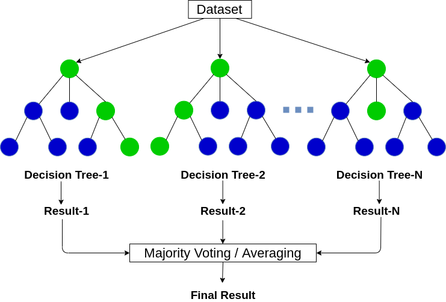

```{r setup, include=FALSE}
options(htmltools.dir.version = FALSE)
library(knitr)
opts_chunk$set(
  prompt = T,
  fig.align = "center",
  dpi = 300,
  cache = T,
  engine.opts = list(bash = "-l")
)

knit_hooks$set(
  prompt = function(before, options, envir) {
    options(
      prompt = if (options$engine %in% c("sh", "bash", "zsh")) "$ " else "R> ",
      continue = if (options$engine %in% c("sh", "bash", "zsh")) "$ " else "+ "
    )
  }
)

options(repos = c(CRAN = "https://cran.rstudio.com/"))

if (!require("fontawesome", character.only = TRUE)) {
  install.packages("fontawesome", dependencies = TRUE)
  library(fontawesome, character.only = TRUE)
}
```

# Día 2: Aprendizaje supervisado {background-color="#2d4563"}

## Repaso del Día 1

:::{style="margin-top: 20px; font-size: 26px;"}
:::{.columns}
:::{.column width=50%}
- La [IA]{.alert} busca crear sistemas capaces de realizar tareas que requieren inteligencia humana
- Tres tipos de aprendizaje: [supervisado]{.alert}, [no supervisado]{.alert} y [por refuerzo]{.alert}
- El flujo de trabajo de ML: recoger, preprocesar, dividir, entrenar, evaluar
- [Sobreajuste]{.alert} (_overfitting_): memorizar en lugar de aprender
- La [accuracy no es suficiente]{.alert}: necesitamos precisión, recall y otras métricas
- Ayer hicimos nuestros primeros modelos con [tidymodels](https://www.tidymodels.org/), una interfaz unificada para ML en R
:::

:::{.column width=50%}
:::{style="text-align: center;"}
[{width="100%"}](#){data-modal-type="image" data-modal-url="figures/supervised-learning.png"}
:::
:::
:::
:::

## Agenda de la sesión

:::{style="margin-top: 20px; font-size: 28px;"}

:::{.columns}
:::{.column width=50%}
**Primera parte**

- Regresión logística (profundización)
- Árboles de decisión
- Random Forests
- Interpretación de importancia de variables

**Segunda parte**

- Ajuste de hiperparámetros (tuning)
- Comparación sistemática de modelos
- Aplicaciones
:::

:::{.column width=50%}
:::{style="text-align: center;"}
[{width="90%"}](#){data-modal-type="image" data-modal-url="figures/rfc_vs_dt1.webp"}
:::
:::
:::
:::

# Regresión logística {background-color="#2d4563"}

## Regresión logística: profundización

:::{style="margin-top: 30px; font-size: 22px;"}
:::{.columns}
:::{.column width=55%}
- Ayer usamos `logistic_reg()` en nuestro primer modelo. Hoy vamos a entenderla mejor
- [Regresión logística]{.alert}: predice la probabilidad de pertenecer a una clase
- Usa la [función sigmoide]{.alert} para transformar una combinación lineal en una probabilidad entre 0 y 1:

$$P(y = 1 | x) = \frac{1}{1 + e^{-(w_0 + w_1 x_1 + \ldots + w_n x_n)}}$$

- Los [coeficientes]{.alert} ($w$) nos dicen la dirección y fuerza de la relación:
    - Positivo: aumenta la probabilidad
    - Negativo: disminuye la probabilidad
- [Interpretable]{.alert}: podemos decir "por cada año adicional de educación, la probabilidad de votar aumenta un X%"
:::

:::{.column width=45%}
:::{style="text-align: center;"}
[{width="80%"}](#){data-modal-type="image" data-modal-url="figures/logistic-function.png"}

Fuente: [Wikipedia](https://en.wikipedia.org/wiki/Logistic_function)
:::
:::
:::
:::

## ¿Cuándo usar regresión logística?

:::{style="margin-top: 30px; font-size: 22px;"}
:::{.columns}
:::{.column width=55%}
**Ventajas**

- [Simple e interpretable]{.alert}: los coeficientes tienen significado claro
- Rápida de entrenar, funciona bien con pocos datos
- Produce [probabilidades]{.alert}, no solo clases
- Buena [línea base]{.alert} (baseline) antes de probar modelos más complejos
- Familiar para investigadores de ciencias sociales

**Limitaciones**

- Asume [relaciones lineales]{.alert} entre predictores y log-odds
- No captura [interacciones complejas]{.alert} entre variables automáticamente
- Puede ser insuficiente cuando los datos tienen patrones no lineales
:::

:::{.column width=45%}
:::{style="text-align: center; font-size: 26px;"}
**Ejemplo en ciencias sociales**

```
¿Qué predice si una persona
vota en la última elección?

Predictores:
  - Edad
  - Años de educación
  - Ingreso del hogar
  - Confianza en el gobierno
  - Zona (urbana/rural)

Outcome: voto (sí/no)

El modelo nos dice qué factores
aumentan o disminuyen la probabilidad
de votar, y en qué magnitud.
```
:::
:::
:::
:::

## Regresión logística en la práctica

:::{style="margin-top: 30px; font-size: 23px;"}
:::{.columns}
:::{.column width=55%}
- En ciencias sociales, la regresión logística se usa mucho para:
    - [Comportamiento electoral]{.alert}: ¿qué predice si alguien vota por un candidato?
    - [Conflicto]{.alert}: ¿qué factores predicen la ocurrencia de un conflicto armado? (Muchlinski et al., 2016)
    - [Pobreza]{.alert}: ¿qué variables predicen si un hogar está por debajo de la línea de pobreza?
    - [Migración]{.alert}: ¿qué factores predicen la intención de emigrar?
- [La interpretabilidad es clave]{.alert} para informar políticas públicas
- Pero a veces sacrificamos [capacidad predictiva]{.alert} por interpretabilidad
- ¿Podemos hacer las dos cosas? Veamos los árboles de decisión
:::

:::{.column width=45%}
:::{style="text-align: center; font-size: 23px;"}
**Regresión logística en R (tidymodels)**

```r
# Ya lo vimos ayer:
modelo_log <- logistic_reg() |>
  set_engine("glm") |>
  set_mode("classification")

ajuste <- fit(modelo_log,
  voto ~ edad + educacion + ingreso,
  data = datos_train)

# Los coeficientes:
tidy(ajuste)

# Resultado:
# edad:       0.023 (más edad → más voto)
# educacion:  0.085 (más edu → más voto)
# ingreso:    0.041 (más ingreso → más voto)
```
:::
:::
:::
:::

## Ejemplo: Apoyo a la democracia en Uruguay

:::{style="margin-top: 30px; font-size: 22px;"}
:::{.columns}
:::{.column width=55%}
**Pregunta de investigación:**

¿Qué factores predicen si un uruguayo apoya la democracia como forma de gobierno?

**Datos:** Latinobarómetro Uruguay (simulados)

**Variables predictoras:**

- Edad, educación, ingreso
- Confianza en instituciones (gobierno, congreso, justicia)
- Percepción económica
- Zona (urbano/rural), género

**Variable objetivo:** `apoya_democracia` (sí/no)

[La regresión logística nos dice qué factores aumentan o disminuyen la probabilidad de apoyo.]{.alert}
:::

:::{.column width=45%}
:::{style="text-align: center; font-size: 25px;"}
**Resultados típicos:**

```
Variable              Coef    Odds Ratio
─────────────────────────────────────────
Intercept            -1.20    0.30
edad                  0.02    1.02
educacion_anos        0.08    1.08 ***
ingreso_log           0.15    1.16 *
confianza_gobierno    0.25    1.28 ***
percepcion_economia   0.18    1.20 **
zona_urbano           0.12    1.13

*** p < 0.001, ** p < 0.01, * p < 0.05
```

:::{style="font-size: 22px;"}
[Pregunta]{.alert}: ¿Qué significa un OR de 1.28 para confianza en el gobierno?
:::
:::
:::
:::
:::

## Odds ratios: interpretación práctica

:::{style="margin-top: 30px; font-size: 24px;"}
:::{.columns}
:::{.column width=55%}
- Los coeficientes de regresión logística están en escala [log-odds]{.alert}
- Para interpretarlos, usamos el [odds ratio]{.alert} = $e^{\beta}$

**Interpretación del odds ratio:**

- OR = 1: sin efecto
- OR > 1: aumenta la probabilidad
- OR < 1: disminuye la probabilidad

**Ejemplo:** OR = 1.28 para confianza en el gobierno

- Por cada punto adicional de confianza (escala 1-10), las chances de apoyar la democracia se multiplican por 1.28
- Es decir, [aumentan un 28%]{.alert}
:::

:::{.column width=45%}
:::{style="text-align: center; font-size: 22px;"}
**Cálculo en R:**

```r
# Obtener coeficientes
coefs <- tidy(ajuste)

# Calcular odds ratios
coefs |>
  mutate(
    odds_ratio = exp(estimate),
    # Intervalo de confianza
    or_lower = exp(estimate - 1.96*std.error),
    or_upper = exp(estimate + 1.96*std.error)
  )
```

<br>

[Siempre reportar intervalos de confianza para los odds ratios.]{.alert}
:::
:::
:::
:::

# Árboles de decisión {background-color="#2d4563"}

## ¿Qué es un árbol de decisión?

:::{style="margin-top: 30px; font-size: 26px;"}
:::{.columns}
:::{.column width=55%}
- Un [árbol de decisión]{.alert} aprende una jerarquía de preguntas de sí/no
- Cada [nodo]{.alert} divide los datos según una variable
- Cada [hoja]{.alert} contiene una predicción
- Ejemplo: "Si la educación > 12 años Y la edad > 30, entonces predecir: votó"
- Puede capturar [relaciones no lineales]{.alert}
- Muy [fácil de interpretar]{.alert}: se puede visualizar como un diagrama de flujo
- Cualquiera puede entender la lógica del modelo, incluyendo personas sin formación técnica
:::

:::{.column width=45%}
:::{style="text-align: center;"}
[{width="100%"}](#){data-modal-type="image" data-modal-url="figures/decision-tree.gif"}

Fuente: [Medium](https://medium.com/towards-data-engineering/100-days-of-machine-learning-on-databricks-day-63-decision-trees-5d4df25b194f)
:::
:::
:::
:::

## ¿Cómo se construye un árbol?

:::{style="margin-top: 30px; font-size: 24px;"}
:::{.columns}
:::{.column width=55%}
1. Empezar con [todos los datos]{.alert} en la raíz
2. Buscar la variable y el punto de corte que [mejor separen]{.alert} las clases
    - Se usa un criterio como [Gini]{.alert} o [entropía]{.alert} (miden la "impureza" del nodo)
3. Dividir los datos en dos grupos según esa regla
4. Repetir recursivamente para cada grupo
5. Parar cuando se cumple un criterio:
    - Profundidad máxima
    - Mínimo de observaciones en un nodo
    - Sin mejora significativa

- El algoritmo es [codicioso]{.alert} (greedy): en cada paso busca la mejor división local, sin mirar el panorama global
:::

:::{.column width=45%}
:::{style="text-align: center; font-size: 28px;"}
**Ejemplo paso a paso**

```
Datos: 500 personas, 265 votaron

Paso 1: ¿edad > 35?
  ├── Sí (300 personas, 200 votaron)
  │   Paso 2: ¿educación > 12?
  │   ├── Sí → Predecir: VOTÓ ✅
  │   └── No → Predecir: NO VOTÓ ❌
  └── No (200 personas, 65 votaron)
      Paso 2: ¿interés_política > 3?
      ├── Sí → Predecir: VOTÓ ✅
      └── No → Predecir: NO VOTÓ ❌

Cada pregunta busca la "mejor"
separación posible.
```
:::
:::
:::
:::

## La matemática detrás de los árboles

:::{style="margin-top: 20px; font-size: 22px;"}
:::{.columns}
:::{.column width=55%}
- El árbol busca la división que minimice la [impureza]{.alert} de los nodos resultantes
- La medida más común es el [índice de Gini]{.alert}:

$$\text{Gini}(t) = 1 - \sum_{k=1}^{K} p_k^2$$

donde $p_k$ es la proporción de la clase $k$ en el nodo $t$

- Nodo puro (una sola clase): $\text{Gini} = 0$
- Nodo 50/50 (máxima mezcla): $\text{Gini} = 0.5$
- El algoritmo evalúa cada variable y cada punto de corte posible, y elige la división con menor Gini ponderado:

$$\text{Gini}_{\text{split}} = \frac{n_L}{n} \text{Gini}(t_L) + \frac{n_R}{n} \text{Gini}(t_R)$$
:::

:::{.column width=45%}
:::{style="font-size: 22px;"}
**Ejemplo con datos de votación**

| Nodo | Votó | No votó | Gini |
|------|:----:|:-------:|:----:|
| Raíz | 265 | 235 | 0.497 |
| Edad > 35 | 200 | 100 | 0.444 |
| Edad ≤ 35 | 65 | 135 | 0.442 |

$\text{Gini}_{\text{split}} = \frac{300}{500}(0.444) + \frac{200}{500}(0.442)$

$= 0.267 + 0.177 = 0.443$

Como $0.443 < 0.497$, [esta división mejora la separación]{.alert} de las clases
:::
:::
:::
:::

## Ventajas y problemas de los árboles

:::{style="margin-top: 30px; font-size: 22px;"}
:::{.columns}
:::{.column width=50%}
**Ventajas**

- [Muy interpretables]{.alert}: se pueden visualizar y explicar
- Capturan [interacciones]{.alert} entre variables automáticamente
- No requieren [escalado]{.alert} de variables (funcionan con valores originales)
- Manejan variables [numéricas y categóricas]{.alert} sin transformación
- Pueden capturar [relaciones no lineales]{.alert}
:::

:::{.column width=50%}
**Problemas**

- [Sobreajuste severo]{.alert}: los árboles profundos memorizan los datos
- [Alta varianza]{.alert}: un pequeño cambio en los datos puede producir un árbol completamente diferente
- [Inestabilidad]{.alert}: muy sensibles a la muestra de entrenamiento
- Solución: en lugar de un solo árbol, usar [muchos árboles]{.alert}
- Eso nos lleva a los [Random Forests]{.alert}
:::
:::

:::{style="text-align: center; margin-top: 20px;"}
[{width="40%"}](#){data-modal-type="image" data-modal-url="figures/overfit-underfit.png"}
:::
:::

## Árboles de decisión en R

:::{style="margin-top: 30px; font-size: 24px;"}

Con tidymodels, solo necesitamos cambiar la especificación del modelo:

:::{style="font-size: 22px;"}
```r
# Especificar un árbol de decisión
modelo_arbol <- decision_tree(
  tree_depth = 5,       # profundidad máxima
  min_n = 10            # mínimo de observaciones por nodo
) |>
  set_engine("rpart") |>
  set_mode("classification")

# Ajustar (exactamente igual que antes)
ajuste_arbol <- fit(modelo_arbol, voto ~ ., data = datos_train)

# Predecir (exactamente igual que antes)
pred_arbol <- predict(ajuste_arbol, datos_test) |>
  bind_cols(datos_test)
```
:::

- Noten que la [interfaz es idéntica]{.alert}: solo cambiamos `logistic_reg()` por `decision_tree()`
- `tree_depth` y `min_n` son [hiperparámetros]{.alert}: controlan la complejidad del modelo
- Esta es la gran ventaja de tidymodels: [misma sintaxis para todos los modelos]{.alert}
:::

## Visualizar un árbol de decisión

:::{style="margin-top: 30px; font-size: 22px;"}
:::{.columns}
:::{.column width=55%}
- Una de las grandes ventajas de los árboles es que [se pueden visualizar]{.alert}
- Con el paquete `rpart.plot`:

```r
# install.packages("rpart.plot")
library(rpart.plot)

# Extraer el modelo rpart del ajuste
arbol_rpart <- extract_fit_engine(ajuste_arbol)

# Visualizar
# type=4: muestra reglas en todos los nodos
# extra=104: clase predicha + % de observaciones
# roundint=FALSE: evita warning con predictores 
# no enteros
rpart.plot(arbol_rpart,
           type = 4,
           extra = 104,
           roundint = FALSE)
```
:::

:::{.column width=45%}
:::{style="text-align: center; font-size: 26px;"}
**Ejemplo de visualización:**

```
                [voto]
               /      \
         edad < 35   edad >= 35
           /              \
      [no votó]      educacion < 12
       65%              /        \
                  [no votó]    [votó]
                    55%         78%
```

[Cualquier persona puede entender este modelo]{.alert}, incluso sin conocimientos técnicos.

Es ideal para [comunicar resultados]{.alert} a tomadores de decisiones.
:::
:::
:::
:::

## Poda (pruning): controlando la complejidad

:::{style="margin-top: 30px; font-size: 24px;"}
:::{.columns}
:::{.column width=55%}
- Un árbol sin restricciones crece hasta [memorizar]{.alert} los datos
- [Poda]{.alert} (pruning): técnica para reducir la complejidad del árbol
- Dos estrategias:
    - [Pre-poda:]{.alert} detener el crecimiento antes (limitar profundidad, mínimo de observaciones)
    - [Post-poda:]{.alert} dejar crecer el árbol completo y luego recortar ramas que no mejoran
- En tidymodels, usamos hiperparámetros para pre-poda:
    - `tree_depth`: profundidad máxima
    - `min_n`: mínimo de observaciones por nodo
    - `cost_complexity`: penalización por complejidad
:::

:::{.column width=45%}
:::{style="text-align: center; font-size: 25px;"}
**El trade-off:**

```
Profundidad     Error train    Error test
─────────────────────────────────────────
1               0.35           0.36
3               0.22           0.25
5               0.15           0.23
10              0.08           0.28  ←
15              0.03           0.35  ←
20              0.01           0.42  ←
```

A partir de cierta profundidad, el error en test [empeora]{.alert} mientras el error en train sigue bajando.

[La poda previene el sobreajuste.]{.alert}
:::
:::
:::
:::

# Random Forests {background-color="#2d4563"}

## La idea detrás de Random Forest

:::{style="margin-top: 30px; font-size: 24px;"}
:::{.columns}
:::{.column width=55%}
- Un solo árbol es [inestable]{.alert} y propenso al sobreajuste
- Solución: [combinar muchos árboles]{.alert} y promediar sus predicciones
- [Random Forest]{.alert} ([Breiman, 2001](https://doi.org/10.1023/A:1010933404324)) = un [ensemble]{.alert} (conjunto) de árboles de decisión
- Dos fuentes de aleatoriedad:
    1. [Bootstrap]{.alert}: cada árbol entrena con una muestra diferente de los datos (con reemplazo)
    2. [Subconjunto de variables]{.alert}: en cada división, cada árbol solo considera un subconjunto aleatorio de variables
- El resultado: árboles [diversos]{.alert} que cometen errores diferentes
- Al promediar, los errores se [cancelan]{.alert} y la predicción mejora
:::

:::{.column width=45%}
:::{style="text-align: center; font-size: 26px;"}
```
Random Forest con 500 árboles:

Árbol 1: muestra 1, variables {A,C,F}
  → Predicción: VOTÓ

Árbol 2: muestra 2, variables {B,D,E}
  → Predicción: NO VOTÓ

Árbol 3: muestra 3, variables {A,D,G}
  → Predicción: VOTÓ

...

Árbol 500: muestra 500, variables {C,E,F}
  → Predicción: VOTÓ

Predicción final: VOTÓ
(mayoría de votos entre los 500 árboles)
```

[La sabiduría de la multitud:]{.alert} muchos modelos "mediocres" juntos hacen un modelo excelente.
:::
:::
:::
:::

## ¿Por qué funciona Random Forest?

:::{style="margin-top: 30px; font-size: 24px;"}
:::{.columns}
:::{.column width=55%}
- [Reduce la varianza]{.alert} sin aumentar mucho el sesgo
- Cada árbol individual sobreajusta, pero al promediar, el sobreajuste se diluye
- Analogía: si les piden a 500 personas que estimen el peso de un buey, [el promedio será sorprendentemente cercano al valor real]{.alert}
- Funciona bien [sin mucha afinación]{.alert} de hiperparámetros
- Resistente frente a outliers y ruido
- Es uno de los [modelos más usados en la práctica]{.alert} por su combinación de rendimiento y simplicidad
:::

:::{.column width=45%}
**Hiperparámetros principales**

| Parámetro | Descripción |
|-----------|-------------|
| `trees` | Número de árboles (más = mejor, pero más lento) |
| `mtry` | Variables a considerar en cada división |
| `min_n` | Mínimo de observaciones por nodo |

:::{style="font-size: 18px;"}
- Más árboles casi siempre mejoran, pero con rendimientos decrecientes
- `mtry` = $\sqrt{p}$ para clasificación (donde $p$ = número de variables)
    - Restringir variables por split [fuerza a los árboles a ser diferentes]{.alert}. Si todos ven todas las variables, eligen las mismas divisiones
    - ¿Por qué $\sqrt{p}$? [Compromiso empírico]{.alert} (Breiman, 2001): pocas variables → árboles débiles; muchas → árboles demasiado similares. Para regresión se usa $p/3$
- En la práctica, [los valores por defecto suelen funcionar bien]{.alert}
:::
:::
:::
:::

## Random Forest en R

:::{style="margin-top: 30px; font-size: 24px;"}

De nuevo, con tidymodels solo cambiamos la especificación:

:::{style="font-size: 22px;"}
```r
# Especificar Random Forest
modelo_rf <- rand_forest(
  trees = 500,    # 500 árboles
  mtry = 3,       # 3 variables por división
  min_n = 5       # mínimo 5 observaciones por nodo
) |>
  set_engine("ranger") |>       # ranger es una implementación rápida
  set_mode("classification")

# Ajustar
ajuste_rf <- fit(modelo_rf, voto ~ ., data = datos_train)

# Predecir
pred_rf <- predict(ajuste_rf, datos_test) |>
  bind_cols(datos_test)

# Evaluar
metrics(pred_rf, truth = voto, estimate = .pred_class)
```
:::

- `ranger` es una implementación [rápida y eficiente]{.alert} de Random Forest en R
- La interfaz de tidymodels permite [comparar modelos fácilmente]{.alert}: misma estructura para logística, árbol y RF
:::

## Importancia de variables

:::{style="margin-top: 30px; font-size: 24px;"}
:::{.columns}
:::{.column width=55%}
- Los Random Forests no son tan interpretables como un solo árbol o una regresión logística
- Pero podemos medir la [importancia de cada variable]{.alert}
- ¿Cómo? Medir cuánto [empeora la predicción]{.alert} si permutamos (mezclamos) los valores de una variable
    - Si mezclar `edad` hace que el modelo sea mucho peor, entonces `edad` es importante
    - Si mezclar `zona` no cambia nada, entonces `zona` no aporta mucho
- Esto nos da un [ranking de variables]{.alert} por su contribución al modelo
- Útil para [entender qué factores importan]{.alert}, aunque no nos diga la dirección del efecto
:::

:::{.column width=45%}
:::{style="text-align: center; font-size: 20px;"}
```r
# Con tidymodels + vip
library(tidymodels)
library(vip) # Variable Importance Plots

rf_spec <- rand_forest(trees = 500) |>
  set_engine("ranger",
             importance = "permutation") |>
  set_mode("classification")

rf_fit <- rf_spec |>
  fit(voto ~ ., data = datos_train)

# Ver importancia
rf_fit |>
  vip(num_features = 10)

# edad                 ████████████ 0.042
# educacion_anios      ██████████   0.038
# interes_politica     ████████     0.031
# ingreso_hogar        ██████       0.025
# confianza_gobierno   █████        0.019
```
:::
:::
:::
:::

## Tipos de importancia de variables

:::{style="margin-top: 30px; font-size: 22px;"}
:::{.columns}
:::{.column width=50%}
**Importancia por permutación**

- Mezclar los valores de una variable y ver cuánto empeora el modelo
- [Independiente del modelo]{.alert}: se puede usar con cualquier algoritmo
- Más [confiable]{.alert} pero más lenta
- Es la que usamos con `importance = "permutation"`

**Importancia por impureza (Gini)**

- Suma de las reducciones de impureza en todos los nodos donde se usa la variable
- [Rápida]{.alert} pero puede ser [sesgada]{.alert} hacia variables con muchas categorías
- Es la opción por defecto en muchas implementaciones
:::

:::{.column width=50%}
**SHAP values (más avanzado)**

- [SHapley Additive exPlanations]{.alert}
- Basado en teoría de juegos cooperativos
- Mide la [contribución de cada variable para cada predicción individual]{.alert}
- Permite ver no solo qué variables importan, sino [cómo afectan cada caso]{.alert}
- Disponible en R con los paquetes `shapr` o `fastshap`

<br>

[Para este curso usaremos importancia por permutación, que es la más robusta.]{.alert}
:::
:::
:::
:::

## Gráficos de dependencia parcial (PDP)

:::{style="margin-top: 30px; font-size: 22px;"}
:::{.columns}
:::{.column width=55%}
- La importancia nos dice [qué]{.alert} variables importan
- Los [Partial Dependence Plots (PDP)]{.alert} nos dicen [cómo]{.alert} afectan
- Muestran el [efecto marginal]{.alert} de una variable sobre la predicción
- Útiles para entender relaciones no lineales

```r
library(pdp)

ajuste_rf |>
  partial(pred.var = "edad") |>
  autoplot()
```
:::

:::{.column width=45%}
:::{style="text-align: center; font-size: 26px;"}
**Ejemplo de PDP:**

```
Prob(voto)
    │
0.7 │           ┌────────────
    │          ╱
0.6 │        ╱
    │      ╱
0.5 │    ╱
    │  ╱
0.4 │╱
    └──────────────────────▶
     20  30  40  50  60  70  edad
```

[Interpretación:]{.alert} La probabilidad de votar aumenta con la edad, pero se estabiliza después de los 50 años.

Esto es algo que la regresión logística no captura automáticamente.
:::
:::
:::
:::

# Ajuste de hiperparámetros (tuning) {background-color="#2d4563"}

## ¿Por qué ajustar hiperparámetros?

:::{style="margin-top: 30px; font-size: 26px;"}
:::{.columns}
:::{.column width=55%}
- Los [hiperparámetros]{.alert} son decisiones que tomamos antes de entrenar
- Ejemplos:
    - Árbol: `tree_depth`, `min_n`
    - Random Forest: `trees`, `mtry`, `min_n`
- Los valores por defecto [suelen funcionar]{.alert}, pero no siempre son óptimos
- El [tuning]{.alert} busca la mejor combinación de hiperparámetros
- [Nunca usar datos de test para tuning]{.alert}: usamos validación cruzada
:::

:::{.column width=45%}
:::{style="text-align: center; font-size: 26px;"}
**El proceso:**

```
1. Definir grilla de valores a probar
   mtry: [2, 3, 4, 5]
   min_n: [5, 10, 20]

2. Para cada combinación:
   - Validación cruzada (5 folds)
   - Calcular métrica promedio

3. Elegir la mejor combinación

4. Entrenar modelo final con
   todos los datos de train
```

[Este proceso se llama "grid search".]{.alert}
:::
:::
:::
:::

## Tuning con tidymodels

:::{style="margin-top: 30px; font-size: 20px;"}

```r
# 1. Especificar modelo con parámetros a ajustar (tune())
modelo_rf_tune <- rand_forest(
  trees = 500,
  mtry = tune(),      # <- ajustar este

  min_n = tune()      # <- y este
) |>
  set_engine("ranger") |>
  set_mode("classification")

# 2. Crear grilla de valores
grilla <- grid_regular(
  mtry(range = c(2, 6)),
  min_n(range = c(5, 20)),
  levels = 4
)

# 3. Validación cruzada
folds <- vfold_cv(datos_train, v = 5, strata = voto)

# 4. Ajustar
resultados <- tune_grid(
  modelo_rf_tune,
  voto ~ .,
  resamples = folds,
  grid = grilla,
  metrics = metric_set(accuracy, roc_auc)
)

# 5. Ver mejores combinaciones
show_best(resultados, metric = "roc_auc")
```
:::

## Seleccionar y finalizar el modelo

:::{style="margin-top: 30px; font-size: 22px;"}

```r
# Seleccionar la mejor combinación
mejor <- select_best(resultados, metric = "roc_auc")
mejor

# Finalizar el modelo con los mejores hiperparámetros
modelo_final <- finalize_model(modelo_rf_tune, mejor)

# Entrenar con todos los datos de entrenamiento
ajuste_final <- fit(modelo_final, voto ~ ., data = datos_train)

# Evaluar en datos de test
pred_final <- predict(ajuste_final, datos_test) |>
  bind_cols(datos_test)

metrics(pred_final, truth = voto, estimate = .pred_class)
```

:::{style="margin-top: 20px;"}
- El [tuning puede mejorar significativamente]{.alert} el rendimiento
- Pero también [toma tiempo]{.alert}: con muchas combinaciones y folds, puede ser lento
- En la práctica, empezar con valores por defecto y hacer tuning si es necesario
:::
:::

# Comparación de modelos {background-color="#2d4563"}

## El poder de parsnip: misma interfaz, diferentes modelos

:::{style="margin-top: 30px; font-size: 22px;"}

La gran ventaja de tidymodels es que [cambiar de modelo es trivial]{.alert}:

:::{style="font-size: 20px;"}
```r
# Modelo 1: Regresión logística
modelo_1 <- logistic_reg() |> set_engine("glm") |> set_mode("classification")

# Modelo 2: Árbol de decisión
modelo_2 <- decision_tree(tree_depth = 5) |> set_engine("rpart") |> set_mode("classification")

# Modelo 3: Random Forest
modelo_3 <- rand_forest(trees = 500) |> set_engine("ranger") |> set_mode("classification")

# Todos se ajustan y evalúan con la misma sintaxis:
ajuste_1 <- fit(modelo_1, voto ~ ., data = datos_train)
ajuste_2 <- fit(modelo_2, voto ~ ., data = datos_train)
ajuste_3 <- fit(modelo_3, voto ~ ., data = datos_train)

# Y se comparan con las mismas métricas
```
:::

- [No hay que aprender una API diferente para cada modelo]{.alert}
- Esto facilita la experimentación y la comparación
- En la práctica, [siempre hay que comparar varios modelos]{.alert} antes de elegir uno
:::

## ¿Qué modelo elegir?

:::{style="margin-top: 30px; font-size: 26px;"}

:::{style="text-align: center;"}

| Criterio | Reg. logística | Árbol de decisión | Random Forest |
|----------|---------------|-------------------|---------------|
| [Interpretabilidad]{.alert} | Alta (coeficientes) | Alta (visual) | Baja (caja negra) |
| [Capacidad predictiva]{.alert} | Moderada | Moderada-baja | Alta |
| [Riesgo de sobreajuste]{.alert} | Bajo | Alto | Bajo |
| [Velocidad]{.alert} | Muy rápida | Rápida | Moderada |
| [Relaciones no lineales]{.alert} | No | Sí | Sí |
| [Datos necesarios]{.alert} | Pocos | Pocos | Moderados |

:::

:::{style="margin-top: 20px;"}
- Si necesitan [entender por qué]{.alert} el modelo predice algo: regresión logística
- Si necesitan [explicar la lógica]{.alert} a no técnicos: árbol de decisión
- Si necesitan la [mejor predicción posible]{.alert}: Random Forest (o modelos aún más complejos)
- En ciencias sociales, la elección depende de si el objetivo es [explicar o predecir]{.alert}
:::
:::

## Más allá de Random Forest: Gradient Boosting

:::{style="margin-top: 30px; font-size: 24px;"}
:::{.columns}
:::{.column width=55%}
- Random Forest es un [ensemble]{.alert} (muchos modelos juntos)
- Otra familia de ensembles: [Gradient Boosting]{.alert}
- En lugar de entrenar árboles en paralelo, los entrena [secuencialmente]{.alert}
- Cada árbol nuevo intenta corregir los errores del anterior
- Implementaciones populares:
    - [XGBoost]{.alert}: muy usado en competencias de Kaggle
    - [LightGBM]{.alert}: rápido para datasets grandes
    - [CatBoost]{.alert}: bueno con variables categóricas

[Suele tener mejor rendimiento que RF, pero es más difícil de ajustar.]{.alert}
:::

:::{.column width=45%}
:::{style="text-align: center; font-size: 23px;"}
**Random Forest vs. Gradient Boosting:**

| | RF | Boosting |
|---|---|---|
| Entrenamiento | Paralelo | Secuencial |
| Hiperparámetros | Pocos | Muchos |
| Riesgo de sobreajuste | Bajo | Más alto |
| Velocidad | Rápido | Variable |
| Rendimiento típico | Muy bueno | Excelente |

<br>

En tidymodels:
```r
modelo_xgb <- boost_tree() |>
  set_engine("xgboost") |>
  set_mode("classification")
```

[Lo veremos con más detalle en los laboratorios.]{.alert}
:::
:::
:::
:::

## Aplicaciones en ciencias sociales

:::{style="margin-top: 30px; font-size: 22px;"}
:::{.columns}
:::{.column width=50%}
**[Muchlinski et al. (2016)](https://doi.org/10.1093/pan/mpv024): Predicción de guerras civiles**

- Compararon regresión logística con Random Forest
- RF tuvo mejor rendimiento predictivo
- [Wang (2019)](https://doi.org/10.1093/pan/mpz004) replicó y encontró errores, pero la lección se mantiene
- RF captura interacciones complejas que la regresión no capta

**[Jean et al. (2016)](https://doi.org/10.1126/science.aaf7894): Pobreza desde el espacio**

- Predijeron pobreza en África usando imágenes satelitales
- Random Forest + redes neuronales
- Aplicable a contextos donde los censos son poco frecuentes o poco confiables
:::

:::{.column width=50%}
**Otros ejemplos en ciencias sociales:**

- [Predicción de deserción escolar]{.alert}: identificar estudiantes en riesgo antes de que abandonen
- [Scoring crediticio alternativo]{.alert}: fintech como Nubank usan ML para evaluar clientes sin historial bancario
- [Detección de fraude electoral]{.alert}: análisis de patrones anómalos en resultados
- [Predicción de violencia]{.alert}: modelos para anticipar zonas de riesgo
- [Análisis de opinión pública]{.alert}: clasificación de textos sobre políticas públicas

[En todos estos casos, RF es un punto de partida común.]{.alert}
:::
:::
:::

## Resumen de la sesión

:::{style="margin-top: 30px; font-size: 24px;"}
:::{.columns}
:::{.column width=50%}
**Modelos de clasificación:**

- [Regresión logística:]{.alert} interpretable, produce probabilidades, ideal para entender relaciones
- [Árboles de decisión:]{.alert} intuitivos, visualizables, pero sobreajustan
- [Random Forests:]{.alert} combinan muchos árboles, excelente rendimiento, menos interpretables
- [Gradient Boosting:]{.alert} aún mejor rendimiento, más difícil de ajustar
:::

:::{.column width=50%}
**Herramientas aprendidas:**

- [Importancia de variables:]{.alert} permutación, Gini, SHAP
- [Gráficos de dependencia parcial:]{.alert} entender el efecto de cada variable
- [Tuning de hiperparámetros:]{.alert} grid search con validación cruzada
- [Comparación de modelos:]{.alert} misma interfaz para todos en tidymodels
:::
:::

<br>

[La elección del modelo depende del objetivo: ¿explicar o predecir?]{.alert}
:::

## Próximos pasos

:::{style="margin-top: 40px; font-size: 26px;"}

- [Próxima sesión (2.2):]{.alert} Regresión y regularización
    - Predicción vs. explicación
    - LASSO, Ridge, Elastic Net
    - Selección automática de variables

- [Laboratorios (2.3 y 2.4):]{.alert}
    - Clasificación con datos de Latinobarómetro
    - Regresión con datos socioeconómicos
    - Tuning, comparación e interpretación

[Nos vemos después del descanso!]{.alert}
:::

# Nos vemos en la próxima sesión {background-color="#2d4563"}
