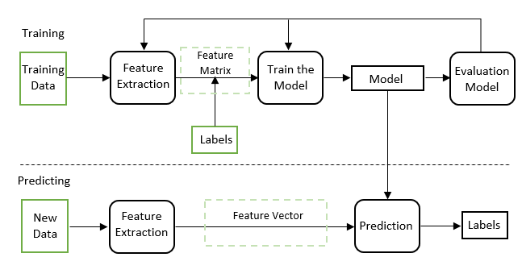
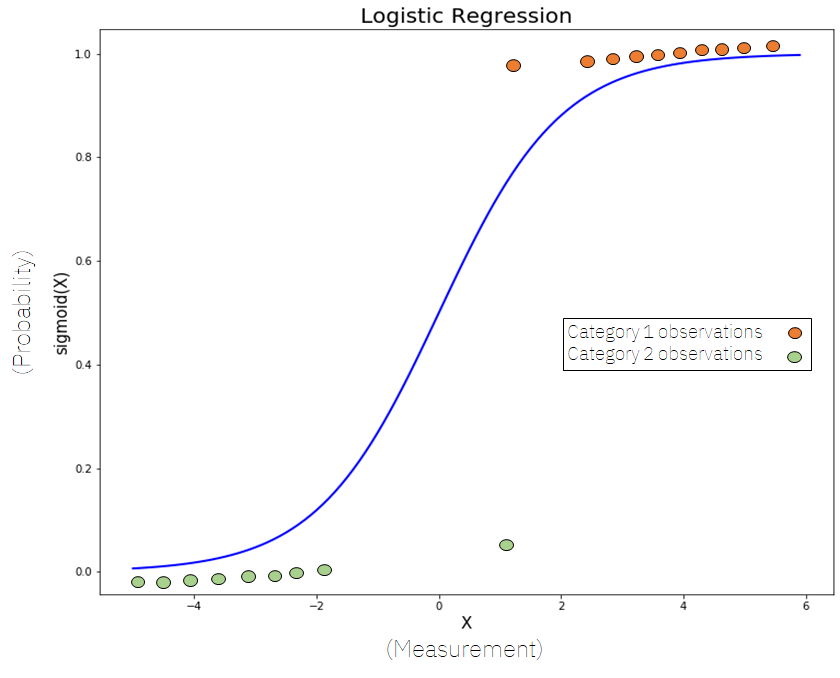
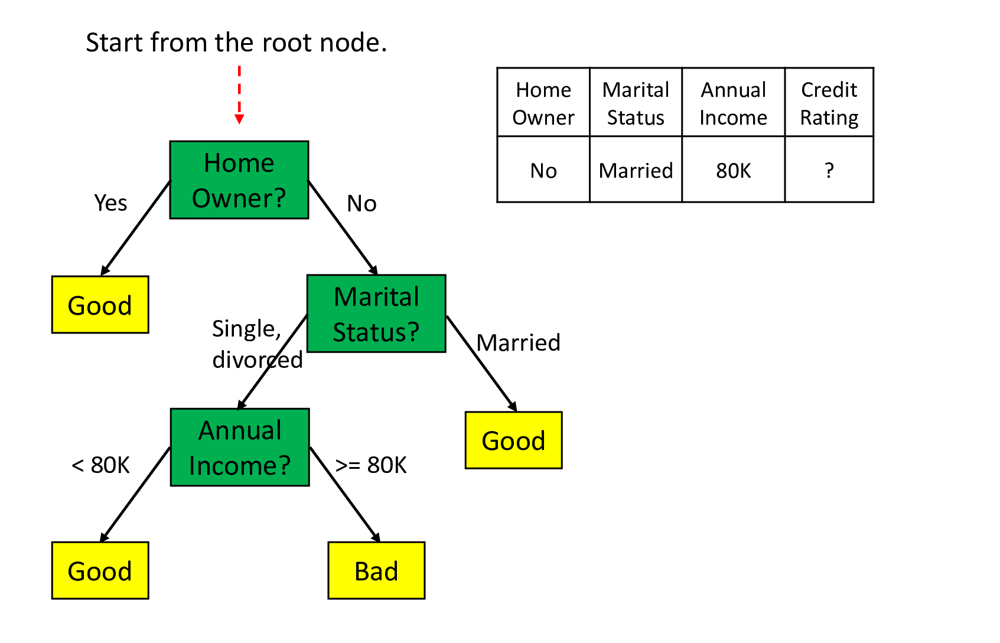

```{r setup, include=FALSE}
options(htmltools.dir.version = FALSE)
library(knitr)
opts_chunk$set(
  prompt = T,
  fig.align = "center",
  dpi = 300,
  cache = T,
  engine.opts = list(bash = "-l")
)

knit_hooks$set(
  prompt = function(before, options, envir) {
    options(
      prompt = if (options$engine %in% c("sh", "bash", "zsh")) "$ " else "R> ",
      continue = if (options$engine %in% c("sh", "bash", "zsh")) "$ " else "+ "
    )
  }
)

options(repos = c(CRAN = "https://cran.rstudio.com/"))

if (!require("fontawesome", character.only = TRUE)) {
  install.packages("fontawesome", dependencies = TRUE)
  library(fontawesome, character.only = TRUE)
}
```

# Día 2: Aprendizaje supervisado {background-color="#2d4563"}

## Repaso del Día 1

:::{style="margin-top: 20px; font-size: 28px;"}
:::{.columns}
:::{.column width=50%}
- La [IA]{.alert} busca crear sistemas capaces de realizar tareas que requieren inteligencia humana
- Tres tipos de aprendizaje: [supervisado]{.alert}, [no supervisado]{.alert} y [por refuerzo]{.alert}
- El flujo de trabajo de ML: recoger, preprocesar, dividir, entrenar, evaluar
- [Sobreajuste]{.alert}: memorizar en lugar de aprender
- La [accuracy no es suficiente]{.alert}: necesitamos precisión, recall y otras métricas
- Ayer hicimos nuestro primer modelo con [tidymodels]{.alert}
:::

:::{.column width=50%}
:::{style="text-align: center;"}
[{width="100%"}](#){data-modal-type="image" data-modal-url="figures/supervised-learning.png"}
:::
:::
:::
:::

## Agenda de la sesión

:::{style="margin-top: 20px; font-size: 32px;"}

:::{.columns}
:::{.column width=50%}
**Sesión 2.1: Clasificación (~2 h)**

- Regresión logística (repaso y profundización)
- Árboles de decisión
- Random Forests
- Comparación de modelos
- Aplicaciones en ciencias sociales
:::

:::{.column width=50%}
**Sesión 2.2: Regresión y predicción (~2 h)**

- Predicción vs. explicación
- Regularización: LASSO, Ridge, Elastic Net
- Laboratorio práctico con `ranger` y `glmnet`
:::
:::
:::

# Regresión logística {background-color="#2d4563"}

## Regresión logística: profundización

:::{style="margin-top: 30px; font-size: 22px;"}
:::{.columns}
:::{.column width=55%}
- Ayer usamos `logistic_reg()` en nuestro primer modelo. Hoy vamos a entenderla mejor
- [Regresión logística]{.alert}: predice la probabilidad de pertenecer a una clase
- Usa la [función sigmoide]{.alert} para transformar una combinación lineal en una probabilidad entre 0 y 1:

$$P(y = 1 | x) = \frac{1}{1 + e^{-(w_0 + w_1 x_1 + \ldots + w_n x_n)}}$$

- Los [coeficientes]{.alert} ($w$) nos dicen la dirección y fuerza de la relación:
    - Positivo: aumenta la probabilidad
    - Negativo: disminuye la probabilidad
- [Interpretable]{.alert}: podemos decir "por cada año adicional de educación, la probabilidad de votar aumenta un X%"
:::

:::{.column width=45%}
:::{style="text-align: center;"}
[{width="80%"}](#){data-modal-type="image" data-modal-url="figures/logistic-function.png"}

Fuente: [Wikipedia](https://en.wikipedia.org/wiki/Logistic_function)
:::
:::
:::
:::

## ¿Cuándo usar regresión logística?

:::{style="margin-top: 30px; font-size: 24px;"}
:::{.columns}
:::{.column width=55%}
**Ventajas**

- [Simple e interpretable]{.alert}: los coeficientes tienen significado claro
- Rápida de entrenar, funciona bien con pocos datos
- Produce [probabilidades]{.alert}, no solo clases
- Buena [línea base]{.alert} (baseline) antes de probar modelos más complejos
- Familiar para investigadores de ciencias sociales

**Limitaciones**

- Asume [relaciones lineales]{.alert} entre predictores y log-odds
- No captura [interacciones complejas]{.alert} entre variables automáticamente
- Puede ser insuficiente cuando los datos tienen patrones no lineales
:::

:::{.column width=45%}
:::{style="text-align: center; font-size: 20px;"}
**Ejemplo en ciencias sociales**

```
¿Qué predice si una persona
vota en la última elección?

Predictores:
  - Edad
  - Años de educación
  - Ingreso del hogar
  - Confianza en el gobierno
  - Zona (urbana/rural)

Outcome: voto (sí/no)

El modelo nos dice qué factores
aumentan o disminuyen la probabilidad
de votar, y en qué magnitud.
```
:::
:::
:::
:::

## Regresión logística en la práctica

:::{style="margin-top: 30px; font-size: 24px;"}
:::{.columns}
:::{.column width=55%}
- En ciencias sociales, la regresión logística se usa mucho para:
    - [Comportamiento electoral]{.alert}: ¿qué predice si alguien vota por un candidato?
    - [Conflicto]{.alert}: ¿qué factores predicen la ocurrencia de un conflicto armado? (Muchlinski et al., 2016)
    - [Pobreza]{.alert}: ¿qué variables predicen si un hogar está por debajo de la línea de pobreza?
    - [Migración]{.alert}: ¿qué factores predicen la intención de emigrar?
- [La interpretabilidad es clave]{.alert} para informar políticas públicas
- Pero a veces sacrificamos [capacidad predictiva]{.alert} por interpretabilidad
- ¿Podemos hacer las dos cosas? Veamos los árboles de decisión
:::

:::{.column width=45%}
:::{style="text-align: center; font-size: 20px;"}
**Regresión logística en R (tidymodels)**

```r
# Ya lo vimos ayer:
modelo_log <- logistic_reg() |>
  set_engine("glm") |>
  set_mode("classification")

ajuste <- fit(modelo_log,
  voto ~ edad + educacion + ingreso,
  data = datos_train)

# Los coeficientes:
tidy(ajuste)

# Resultado:
# edad:       0.023 (más edad → más voto)
# educacion:  0.085 (más edu → más voto)
# ingreso:    0.041 (más ingreso → más voto)
```
:::
:::
:::
:::

# Árboles de decisión {background-color="#2d4563"}

## ¿Qué es un árbol de decisión?

:::{style="margin-top: 30px; font-size: 24px;"}
:::{.columns}
:::{.column width=55%}
- Un [árbol de decisión]{.alert} aprende una jerarquía de preguntas de sí/no
- Cada [nodo]{.alert} divide los datos según una variable
- Cada [hoja]{.alert} contiene una predicción
- Ejemplo: "Si la educación > 12 años Y la edad > 30, entonces predecir: votó"
- Puede capturar [relaciones no lineales]{.alert}
- Muy [fácil de interpretar]{.alert}: se puede visualizar como un diagrama de flujo
- Cualquiera puede entender la lógica del modelo, incluyendo personas sin formación técnica
:::

:::{.column width=45%}
:::{style="text-align: center;"}
[{width="100%"}](#){data-modal-type="image" data-modal-url="figures/decision-tree.gif"}

Fuente: [Medium](https://medium.com/towards-data-engineering/100-days-of-machine-learning-on-databricks-day-63-decision-trees-5d4df25b194f)
:::
:::
:::
:::

## ¿Cómo se construye un árbol?

:::{style="margin-top: 30px; font-size: 24px;"}
:::{.columns}
:::{.column width=55%}
1. Empezar con [todos los datos]{.alert} en la raíz
2. Buscar la variable y el punto de corte que [mejor separen]{.alert} las clases
    - Se usa un criterio como [Gini]{.alert} o [entropía]{.alert} (miden la "impureza" del nodo)
3. Dividir los datos en dos grupos según esa regla
4. Repetir recursivamente para cada grupo
5. Parar cuando se cumple un criterio:
    - Profundidad máxima
    - Mínimo de observaciones en un nodo
    - Sin mejora significativa

- El algoritmo es [codicioso]{.alert} (greedy): en cada paso busca la mejor división local, sin mirar el panorama global
:::

:::{.column width=45%}
:::{style="text-align: center; font-size: 18px;"}
**Ejemplo paso a paso**

```
Datos: 500 personas, 265 votaron

Paso 1: ¿edad > 35?
  ├── Sí (300 personas, 200 votaron)
  │   Paso 2: ¿educación > 12?
  │   ├── Sí → Predecir: VOTÓ ✅
  │   └── No → Predecir: NO VOTÓ ❌
  └── No (200 personas, 65 votaron)
      Paso 2: ¿interés_política > 3?
      ├── Sí → Predecir: VOTÓ ✅
      └── No → Predecir: NO VOTÓ ❌

Cada pregunta busca la "mejor"
separación posible.
```
:::
:::
:::
:::

## Ventajas y problemas de los árboles

:::{style="margin-top: 30px; font-size: 24px;"}
:::{.columns}
:::{.column width=50%}
**Ventajas**

- [Muy interpretables]{.alert}: se pueden visualizar y explicar
- Capturan [interacciones]{.alert} entre variables automáticamente
- No requieren [escalado]{.alert} de variables (funcionan con valores originales)
- Manejan variables [numéricas y categóricas]{.alert} sin transformación
- Pueden capturar [relaciones no lineales]{.alert}
:::

:::{.column width=50%}
**Problemas**

- [Sobreajuste severo]{.alert}: los árboles profundos memorizan los datos
- [Alta varianza]{.alert}: un pequeño cambio en los datos puede producir un árbol completamente diferente
- [Inestabilidad]{.alert}: muy sensibles a la muestra de entrenamiento
- Solución: en lugar de un solo árbol, usar [muchos árboles]{.alert}
- Eso nos lleva a los [Random Forests]{.alert}
:::
:::

:::{style="text-align: center; margin-top: 20px;"}
[{width="50%"}](#){data-modal-type="image" data-modal-url="figures/overfit-underfit.png"}
:::
:::

## Árboles de decisión en R

:::{style="margin-top: 30px; font-size: 24px;"}

Con tidymodels, solo necesitamos cambiar la especificación del modelo:

:::{style="font-size: 22px;"}
```r
# Especificar un árbol de decisión
modelo_arbol <- decision_tree(
  tree_depth = 5,       # profundidad máxima
  min_n = 10            # mínimo de observaciones por nodo
) |>
  set_engine("rpart") |>
  set_mode("classification")

# Ajustar (exactamente igual que antes)
ajuste_arbol <- fit(modelo_arbol, voto ~ ., data = datos_train)

# Predecir (exactamente igual que antes)
pred_arbol <- predict(ajuste_arbol, datos_test) |>
  bind_cols(datos_test)
```
:::

- Noten que la [interfaz es idéntica]{.alert}: solo cambiamos `logistic_reg()` por `decision_tree()`
- `tree_depth` y `min_n` son [hiperparámetros]{.alert}: controlan la complejidad del modelo
- Esta es la gran ventaja de tidymodels: [misma sintaxis para todos los modelos]{.alert}
:::

# Random Forests {background-color="#2d4563"}

## La idea detrás de Random Forest

:::{style="margin-top: 30px; font-size: 24px;"}
:::{.columns}
:::{.column width=55%}
- Un solo árbol es [inestable]{.alert} y propenso al sobreajuste
- Solución: [combinar muchos árboles]{.alert} y promediar sus predicciones
- [Random Forest]{.alert} (bosque aleatorio) = un [ensemble]{.alert} (conjunto) de árboles de decisión
- Dos fuentes de aleatoriedad:
    1. [Bootstrap]{.alert}: cada árbol entrena con una muestra diferente de los datos (con reemplazo)
    2. [Subconjunto de variables]{.alert}: en cada división, cada árbol solo considera un subconjunto aleatorio de variables
- El resultado: árboles [diversos]{.alert} que cometen errores diferentes
- Al promediar, los errores se [cancelan]{.alert} y la predicción mejora
:::

:::{.column width=45%}
:::{style="text-align: center; font-size: 18px;"}
```
Random Forest con 500 árboles:

Árbol 1: muestra 1, variables {A,C,F}
  → Predicción: VOTÓ

Árbol 2: muestra 2, variables {B,D,E}
  → Predicción: NO VOTÓ

Árbol 3: muestra 3, variables {A,D,G}
  → Predicción: VOTÓ

...

Árbol 500: muestra 500, variables {C,E,F}
  → Predicción: VOTÓ

Predicción final: VOTÓ
(mayoría de votos entre los 500 árboles)
```

[La sabiduría de la multitud:]{.alert} muchos modelos "mediocres" juntos hacen un modelo excelente.
:::
:::
:::
:::

## ¿Por qué funciona Random Forest?

:::{style="margin-top: 30px; font-size: 24px;"}
:::{.columns}
:::{.column width=55%}
- [Reduce la varianza]{.alert} sin aumentar mucho el sesgo
- Cada árbol individual sobreajusta, pero al promediar, el sobreajuste se diluye
- Analogía: si les piden a 500 personas que estimen el peso de un buey, [el promedio será sorprendentemente cercano al valor real]{.alert} (el "efecto de la sabiduría de la multitud")
- Funciona bien [sin mucha afinación]{.alert} de hiperparámetros
- Robusto frente a outliers y ruido
- Es uno de los [modelos más usados en la práctica]{.alert} por su combinación de rendimiento y simplicidad
:::

:::{.column width=45%}
**Hiperparámetros principales**

| Parámetro | Descripción |
|-----------|-------------|
| `trees` | Número de árboles (más = mejor, pero más lento) |
| `mtry` | Variables a considerar en cada división |
| `min_n` | Mínimo de observaciones por nodo |

:::{style="font-size: 20px;"}
- Más árboles casi siempre mejoran, pero con rendimientos decrecientes
- `mtry` = $\sqrt{p}$ para clasificación (donde $p$ es el número de variables)
- En la práctica, [los valores por defecto suelen funcionar bien]{.alert}
:::
:::
:::
:::

## Random Forest en R

:::{style="margin-top: 30px; font-size: 24px;"}

De nuevo, con tidymodels solo cambiamos la especificación:

:::{style="font-size: 22px;"}
```r
# Especificar Random Forest
modelo_rf <- rand_forest(
  trees = 500,    # 500 árboles
  mtry = 3,       # 3 variables por división
  min_n = 5       # mínimo 5 observaciones por nodo
) |>
  set_engine("ranger") |>       # ranger es una implementación rápida
  set_mode("classification")

# Ajustar
ajuste_rf <- fit(modelo_rf, voto ~ ., data = datos_train)

# Predecir
pred_rf <- predict(ajuste_rf, datos_test) |>
  bind_cols(datos_test)

# Evaluar
metrics(pred_rf, truth = voto, estimate = .pred_class)
```
:::

- `ranger` es una implementación [rápida y eficiente]{.alert} de Random Forest en R
- La interfaz de tidymodels permite [comparar modelos fácilmente]{.alert}: misma estructura para logística, árbol y RF
:::

## Importancia de variables

:::{style="margin-top: 30px; font-size: 24px;"}
:::{.columns}
:::{.column width=55%}
- Los Random Forests no son tan interpretables como un solo árbol o una regresión logística
- Pero podemos medir la [importancia de cada variable]{.alert}
- ¿Cómo? Medir cuánto [empeora la predicción]{.alert} si permutamos (mezclamos) los valores de una variable
    - Si mezclar `edad` hace que el modelo sea mucho peor, entonces `edad` es importante
    - Si mezclar `zona` no cambia nada, entonces `zona` no aporta mucho
- Esto nos da un [ranking de variables]{.alert} por su contribución al modelo
- Útil para [entender qué factores importan]{.alert}, aunque no nos diga la dirección del efecto
:::

:::{.column width=45%}
:::{style="text-align: center; font-size: 20px;"}
```r
# Con ranger directamente
library(ranger)

rf_fit <- ranger(
  voto ~ .,
  data = datos_train,
  importance = "permutation"
)

# Ver importancia
importance(rf_fit) |>
  sort(decreasing = TRUE)

# Resultado típico:
# edad                 0.042
# educacion_anios      0.038
# interes_politica     0.031
# ingreso_hogar        0.025
# confianza_gobierno   0.019
# ...
```
:::
:::
:::
:::

# Comparación de modelos {background-color="#2d4563"}

## El poder de parsnip: misma interfaz, diferentes modelos

:::{style="margin-top: 30px; font-size: 22px;"}

La gran ventaja de tidymodels es que [cambiar de modelo es trivial]{.alert}:

:::{style="font-size: 20px;"}
```r
# Modelo 1: Regresión logística
modelo_1 <- logistic_reg() |> set_engine("glm") |> set_mode("classification")

# Modelo 2: Árbol de decisión
modelo_2 <- decision_tree(tree_depth = 5) |> set_engine("rpart") |> set_mode("classification")

# Modelo 3: Random Forest
modelo_3 <- rand_forest(trees = 500) |> set_engine("ranger") |> set_mode("classification")

# Todos se ajustan y evalúan con la misma sintaxis:
ajuste_1 <- fit(modelo_1, voto ~ ., data = datos_train)
ajuste_2 <- fit(modelo_2, voto ~ ., data = datos_train)
ajuste_3 <- fit(modelo_3, voto ~ ., data = datos_train)

# Y se comparan con las mismas métricas
```
:::

- [No hay que aprender una API diferente para cada modelo]{.alert}
- Esto facilita la experimentación y la comparación
- En la práctica, [siempre hay que comparar varios modelos]{.alert} antes de elegir uno
:::

## ¿Qué modelo elegir?

:::{style="margin-top: 30px; font-size: 22px;"}

:::{style="text-align: center;"}

| Criterio | Reg. logística | Árbol de decisión | Random Forest |
|----------|---------------|-------------------|---------------|
| [Interpretabilidad]{.alert} | Alta (coeficientes) | Alta (visual) | Baja (caja negra) |
| [Capacidad predictiva]{.alert} | Moderada | Moderada-baja | Alta |
| [Riesgo de sobreajuste]{.alert} | Bajo | Alto | Bajo |
| [Velocidad]{.alert} | Muy rápida | Rápida | Moderada |
| [Relaciones no lineales]{.alert} | No | Sí | Sí |
| [Datos necesarios]{.alert} | Pocos | Pocos | Moderados |

:::

:::{style="margin-top: 20px;"}
- Si necesitan [entender por qué]{.alert} el modelo predice algo: regresión logística
- Si necesitan [explicar la lógica]{.alert} a no técnicos: árbol de decisión
- Si necesitan la [mejor predicción posible]{.alert}: Random Forest (o modelos aún más complejos)
- En ciencias sociales, la elección depende de si el objetivo es [explicar o predecir]{.alert}
:::
:::

## Aplicaciones en ciencias sociales

:::{style="margin-top: 30px; font-size: 22px;"}
:::{.columns}
:::{.column width=50%}
**Muchlinski et al. (2016)**

- Pregunta: ¿podemos predecir guerras civiles?
- Compararon regresión logística con Random Forest
- RF tuvo mejor rendimiento predictivo
- Pero: Ward et al. (2010) mostraron que [los modelos estadísticos clásicos predicen mal las guerras civiles]{.alert}
- RF mejoró la predicción al capturar interacciones complejas entre factores como PIB, tipo de régimen y diversidad étnica
:::

:::{.column width=50%}
**Otras aplicaciones**

- [Ciencia política:]{.alert} predicción de resultados electorales, análisis de riesgo de conflicto, clasificación de textos legislativos
- [Sociología:]{.alert} predicción de movilidad social, detección de discursos de odio en redes sociales
- [Economía:]{.alert} scoring crediticio, predicción de pobreza a partir de datos satelitales (Jean et al., 2016)
- [Salud pública:]{.alert} predicción de brotes epidémicos, triaje automático
- [El ML complementa, no reemplaza, la teoría social]{.alert}
:::
:::
:::

## Resumen de la sesión

:::{style="margin-top: 30px; font-size: 26px;"}

- La [regresión logística]{.alert} es interpretable y produce probabilidades, ideal cuando queremos entender las relaciones causales
- Los [árboles de decisión]{.alert} son intuitivos y capturan no linealidades, pero sobreajustan con facilidad
- Los [Random Forests]{.alert} combinan muchos árboles para reducir la varianza y mejorar la predicción
- La elección del modelo depende del [objetivo]{.alert}: ¿explicar o predecir?
- tidymodels nos permite [comparar modelos fácilmente]{.alert} con la misma sintaxis
- En la próxima sesión: regresión, regularización y el laboratorio práctico
:::

## Próximo: Regresión y predicción

:::{style="margin-top: 40px; font-size: 28px;"}

- Predicción vs. explicación: el debate de Mullainathan y Spiess (2017)
- Regularización: LASSO, Ridge, Elastic Net
- ¿Cómo evitar el sobreajuste en modelos de regresión?
- Laboratorio práctico con datos de Latinobarómetro
- Nos vemos después del descanso
:::

# Nos vemos en la próxima sesión {background-color="#2d4563"}
