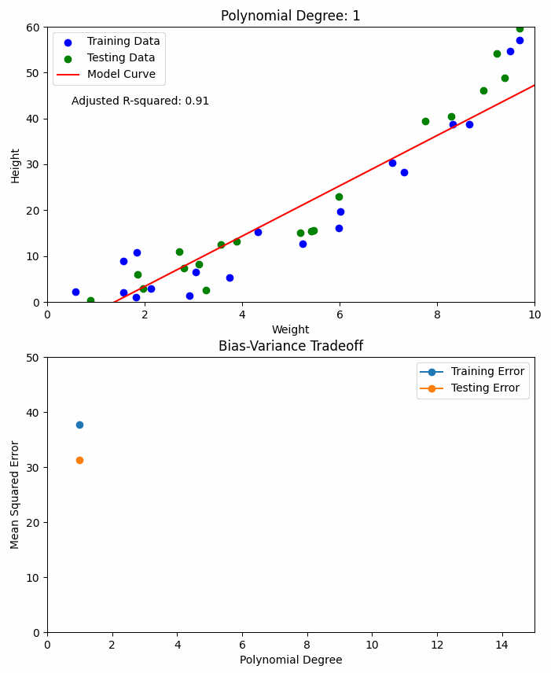
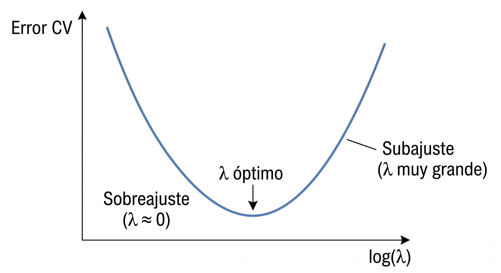
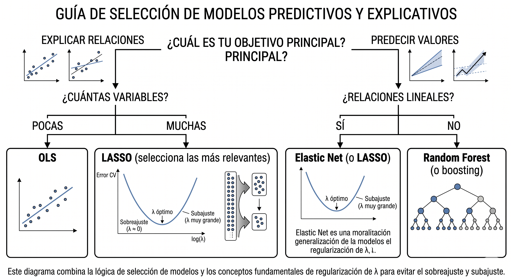

```{r setup, include=FALSE}
options(htmltools.dir.version = FALSE)
library(knitr)
opts_chunk$set(
  prompt = T,
  fig.align = "center",
  dpi = 300,
  cache = T,
  engine.opts = list(bash = "-l")
)

knit_hooks$set(
  prompt = function(before, options, envir) {
    options(
      prompt = if (options$engine %in% c("sh", "bash", "zsh")) "$ " else "R> ",
      continue = if (options$engine %in% c("sh", "bash", "zsh")) "$ " else "+ "
    )
  }
)

options(repos = c(CRAN = "https://cran.rstudio.com/"))

if (!require("fontawesome", character.only = TRUE)) {
  install.packages("fontawesome", dependencies = TRUE)
  library(fontawesome, character.only = TRUE)
}
```

# Regresión y predicción {background-color="#2d4563"}

## Agenda de la sesión

:::{style="margin-top: 20px; font-size: 26px;"}

:::{.columns}
:::{.column width=50%}
**Primera parte**

- Predicción vs. explicación: las "dos culturas"
- Regresión lineal y sus limitaciones
- El problema del sobreajuste
- Regularización: LASSO, Ridge, Elastic Net

**Segunda parte**

- Ajuste de hiperparámetros (tuning)
- Ingeniería de variables para datos sociales
- Aplicaciones en ciencias sociales
- Comparación con otros métodos
:::

:::{.column width=50%}
:::{style="text-align: center;"}
[{width="90%"}](#){data-modal-type="image" data-modal-url="figures/linear-regression.gif"}
:::
:::
:::
:::

# Predicción vs. explicación {background-color="#2d4563"}

## El debate central en ciencias sociales

:::{style="margin-top: 30px; font-size: 25px;"}
:::{.columns}
:::{.column width=55%}
- Breiman (2001), "[Statistical Modeling: The Two Cultures](https://doi.org/10.1214/ss/1009213726)":
    - [Modelo de datos]{.alert}: se asume un modelo generador, se estiman parámetros ($\hat{\beta}$). Foco en identificación causal
    - [Modelo algorítmico]{.alert}: caja negra, se optimiza la predicción ($\hat{y}$). Foco en generalización a datos nuevos
- En ciencias sociales solemos explicar, pero predecir deserción escolar o focalizar intervenciones también requiere buenos modelos
:::

:::{.column width=45%}
:::{style="text-align: center; font-size: 23px;"}
**Ejemplos**

| Pregunta | Tipo |
|----------|------|
| ¿Las becas aumentaron la asistencia escolar? | [Explicación]{.alert} |
| ¿Qué estudiantes van a desertar? | [Predicción]{.alert} |
| ¿La vacunación redujo la mortalidad? | [Explicación]{.alert} |
| ¿Qué pacientes necesitan cuidados intensivos? | [Predicción]{.alert} |

<br>

[Ambos son valiosos!]{.alert} El ML aporta herramientas de predicción que complementan los métodos causales.
:::
:::
:::
:::

## ¿Por qué la regresión lineal "clásica" no es suficiente para predecir?

:::{style="margin-top: 30px; font-size: 24px;"}
:::{.columns}
:::{.column width=55%}
- La regresión lineal (OLS) minimiza el error en los datos de entrenamiento
- Problema: si tenemos [muchas variables relativas al número de observaciones]{.alert}, OLS se ajusta demasiado al ruido
- Ejemplo: con 50 variables y 100 observaciones, OLS encuentra coeficientes que parecen funcionar pero no generalizan
- OLS no tiene un mecanismo para [descartar variables irrelevantes]{.alert} ni para reducir coeficientes inflados
- Solución: [regularización]{.alert}, que agrega una penalización por la magnitud de los coeficientes
:::

:::{.column width=45%}
:::{style="text-align: center; margin-top: -30px; font-size: 18px;"}
[{width="70%"}](#){data-modal-type="image" data-modal-url="figures/bias-variance.gif"}

A medida que agregamos variables, el error de entrenamiento baja pero el error de test sube: el modelo memoriza el ruido
:::
:::
:::
:::

# Regularización {background-color="#2d4563"}

## La idea de la regularización

:::{style="margin-top: 30px; font-size: 20px;"}
:::{.columns}
:::{.column width=55%}
- [Regularización]{.alert} = agregar una penalización por la complejidad del modelo
- En la regresión OLS, minimizamos el error:

$$\min \sum_{i=1}^{n} (y_i - \hat{y}_i)^2$$

- Con regularización, agregamos un término de [penalización]{.alert}:

$$\min \sum_{i=1}^{n} (y_i - \hat{y}_i)^2 + \lambda \cdot \text{penalización}(\beta)$$

- $\lambda$ controla la [fuerza]{.alert} de la penalización:
    - $\lambda = 0$: sin penalización (OLS clásico)
    - $\lambda$ grande: penalización fuerte (coeficientes se reducen hacia 0)
- El truco está en [elegir el $\lambda$ óptimo]{.alert} (por validación cruzada)
:::

:::{.column width=45%}
**La intuición: un presupuesto para coeficientes**

- OLS puede asignar coeficientes tan grandes como quiera. Con muchas variables, esto genera sobreajuste.

- Regularización impone un [presupuesto]{.alert}: la suma total de los coeficientes no puede ser ilimitada. El modelo debe [repartir un presupuesto finito]{.alert} entre todas las variables.

- Presupuesto generoso ($\lambda$ bajo): el modelo usa muchas variables, similar a OLS
- Presupuesto ajustado ($\lambda$ alto): el modelo solo gasta en las variables que más ayudan
:::
:::
:::

## LASSO (L1)

:::{style="margin-top: 30px; font-size: 22px;"}
:::{.columns}
:::{.column width=55%}
- [LASSO]{.alert} = Least Absolute Shrinkage and Selection Operator ([Tibshirani, 1996](https://doi.org/10.1111/j.2517-6161.1996.tb02080.x))
- Penalización L1: suma de los [valores absolutos]{.alert} de los coeficientes

$$\min \sum (y_i - \hat{y}_i)^2 + \lambda \sum |\beta_j|$$

- Propiedad clave: [reduce algunos coeficientes exactamente a cero]{.alert}
- Esto significa que LASSO [selecciona variables]{.alert} automáticamente
- Las variables irrelevantes son eliminadas del modelo
- Útil cuando sospechamos que [solo algunas variables]{.alert} son realmente importantes
- En ciencias sociales: ¿cuáles de 50 posibles predictores importan para predecir la satisfacción con la democracia?
:::

:::{.column width=45%}
:::{style="text-align: center; font-size: 24px;"}
**LASSO en acción**

```
Con 8 variables, λ = 0.1:

edad:                0.023
educacion_anios:     0.085
ingreso_hogar:       0.041
zona:                0.000  ← eliminada
genero:              0.000  ← eliminada
confianza_gobierno:  0.019
satisf_democracia:   0.052
percepcion_economia: 0.000  ← eliminada

LASSO seleccionó 5 de 8 variables.
Las demás fueron eliminadas
automáticamente.
```
:::
:::
:::
:::

## Ridge (L2)

:::{style="margin-top: 30px; font-size: 22px;"}
:::{.columns}
:::{.column width=55%}
- [Ridge]{.alert} = penalización L2: suma de los [cuadrados]{.alert} de los coeficientes

$$\min \sum (y_i - \hat{y}_i)^2 + \lambda \sum \beta_j^2$$

- A diferencia de LASSO, Ridge [no elimina variables]{.alert}: las reduce, pero nunca a cero exacto
- Todos los predictores permanecen en el modelo, pero con coeficientes más pequeños
- Útil cuando creemos que [muchas variables contribuyen un poco]{.alert}
- Funciona mejor que LASSO cuando hay [variables correlacionadas]{.alert} (multicolinealidad)
- En ciencias sociales: cuando tenemos indicadores muy correlacionados (confianza en distintas instituciones, por ejemplo)
:::

:::{.column width=45%}
:::{style="text-align: center; font-size: 20px;"}
**Ridge en acción**

```
Con 8 variables, λ = 0.1:

edad:                0.018
educacion_anios:     0.072
ingreso_hogar:       0.035
zona:                0.008  ← reducida, no eliminada
genero:              0.003  ← reducida, no eliminada
confianza_gobierno:  0.015
satisf_democracia:   0.044
percepcion_economia: 0.009  ← reducida, no eliminada

Ridge mantiene todas las variables
pero con coeficientes más pequeños.
```
:::
:::
:::
:::

## Elastic Net: lo mejor de ambos

:::{style="margin-top: 30px; font-size: 24px;"}
:::{.columns}
:::{.column width=55%}
- [Elastic Net]{.alert} ([Zou y Hastie, 2005](https://doi.org/10.1111/j.1467-9868.2005.00503.x)) combina LASSO (L1) y Ridge (L2):

$$\min \sum (y_i - \hat{y}_i)^2 + \lambda \left[ \alpha \sum |\beta_j| + (1-\alpha) \sum \beta_j^2 \right]$$

- Dos hiperparámetros:
    - $\lambda$: fuerza general de la penalización
    - $\alpha$: mezcla entre LASSO y Ridge
    - $\alpha = 1$: LASSO puro
    - $\alpha = 0$: Ridge puro
    - $0 < \alpha < 1$: Elastic Net
- [Selecciona variables]{.alert} (como LASSO) pero maneja mejor las [correlaciones]{.alert} (como Ridge)
- En la práctica, [Elastic Net suele funcionar mejor]{.alert} que LASSO o Ridge por separado
:::

:::{.column width=45%}
:::{style="text-align: center;"}

| | LASSO | Ridge | Elastic Net |
|---|---|---|---|
| [Penalización]{.alert} | L1 ($|\beta|$) | L2 ($\beta^2$) | L1 + L2 |
| [Selección]{.alert} | Sí | No | Sí |
| [Correlación]{.alert} | Problemas | Bien | Bien |
| [Hiperparámetros]{.alert} | $\lambda$ | $\lambda$ | $\lambda$, $\alpha$ |

<br>

:::{style="font-size: 20px;"}
**Regla general:**

- Pocas variables importantes → [LASSO]{.alert}
- Muchas variables correlacionadas → [Ridge]{.alert}
- No estoy seguro → [Elastic Net]{.alert}
:::
:::
:::
:::
:::

## Regularización en R

:::{style="margin-top: 30px; font-size: 22px;"}

Con tidymodels + glmnet:

```r
# LASSO (mixture = 1)
modelo_lasso <- linear_reg(penalty = 0.1, mixture = 1) |>
  set_engine("glmnet") |>
  set_mode("regression")

# Ridge (mixture = 0)
modelo_ridge <- linear_reg(penalty = 0.1, mixture = 0) |>
  set_engine("glmnet") |>
  set_mode("regression")

# Elastic Net (mixture entre 0 y 1)
modelo_enet <- linear_reg(penalty = 0.1, mixture = 0.5) |>
  set_engine("glmnet") |>
  set_mode("regression")

# Ajustar cualquiera de ellos (misma sintaxis)
ajuste <- fit(modelo_lasso, satisfaccion_vida ~ ., data = datos_train)
```

- `penalty` = $\lambda$ (fuerza de la penalización)
- `mixture` = $\alpha$ (1 = LASSO, 0 = Ridge, entre 0 y 1 = Elastic Net)
- En la práctica, [usamos validación cruzada]{.alert} para encontrar los mejores valores de `penalty` y `mixture`
:::

# Ingeniería de variables {background-color="#2d4563"}

## Ingeniería de variables para datos sociales

:::{style="margin-top: 30px; font-size: 22px;"}
- [Ingeniería de variables]{.alert} (feature engineering): crear, transformar o seleccionar variables para mejorar el modelo
- [Variables categóricas]{.alert}: convertir a dummies (one-hot encoding)
    - `zona = "urbana"` → `zona_urbana = 1`, `zona_rural = 0`
- [Variables ordinales]{.alert}: decidir si tratar como numéricas o categóricas
    - Nivel educativo (primaria, secundaria, universitaria): ¿ordinal o nominal?
- [Interacciones]{.alert}: crear productos entre variables
    - `edad * educacion`: el efecto de la educación cambia con la edad?
- [Transformaciones]{.alert}: logaritmos, polinomios
    - `log(ingreso)` para relaciones no lineales
    - `edad^2` para capturar efectos cuadráticos (ej: participación política en forma de U por edad)
- [Discretización]{.alert}: convertir variables continuas en categorías
    - Edad → grupos etarios (18-29, 30-44, 45-59, 60+)
- [Imputación]{.alert}: reemplazar valores faltantes con estimaciones
    - Encuestas siempre tienen datos faltantes; la mediana o KNN son opciones comunes
:::

## Ingeniería de variables para datos sociales

:::{style="margin-top: 30px; font-size: 25px;"}
**Con recipes de tidymodels:**

```r
receta <- recipe(voto ~ ., data = datos_train) |>
  # Convertir categóricas a dummies
  step_dummy(all_nominal_predictors()) |>
  # Normalizar numéricas (media = 0, sd = 1)
  step_normalize(all_numeric_predictors()) |>
  # Eliminar variables con varianza cero (constantes)
  step_zv(all_predictors()) |>
  # Crear interacciones
  step_interact(terms = ~ edad:educacion_anios) |>
  # Imputar valores faltantes con la mediana
  step_impute_median(all_numeric_predictors()) |>
  # Agrupar categorías poco frecuentes en "other"
  step_other(religion, threshold = 0.05) |>
  # Eliminar predictores altamente correlacionados (r > 0.9)
  step_corr(all_numeric_predictors(), threshold = 0.9) |>
  # Transformación logarítmica
  step_log(ingreso, offset = 1) |>
  # Términos polinómicos (ej: edad + edad²)
  step_poly(edad, degree = 2)
```
:::

## El flujo completo: `workflow()`

:::{style="margin-top: 30px; font-size: 21px;"}
:::{.columns}
:::{.column width=55%}
- En tidymodels, `recipe` y `model` se combinan en un [workflow()]{.alert}
- El workflow conecta el preprocesamiento con el modelo en un solo objeto
- Ventaja: se aplica automáticamente a datos nuevos, sin repetir pasos manualmente

```r
# Combinar receta + modelo
flujo <- workflow() |>
  add_recipe(receta) |>
  add_model(modelo_lasso)

# Ajustar todo junto
ajuste <- fit(flujo, data = datos_train)

# Predecir con datos nuevos
predicciones <- predict(ajuste,
                        new_data = datos_test)
```
:::

:::{.column width=45%}
:::{style="font-size: 20px;"}
**Evaluación final con `last_fit()`:**

```r
# Evaluar en el test set (una sola vez)
resultado <- last_fit(flujo,
                      split = datos_split)

# Métricas finales
collect_metrics(resultado)

# Ver predicciones
collect_predictions(resultado)
```

<br>

[`last_fit()` ajusta con todo el train set y evalúa con el test set en un solo paso.]{.alert} Es la forma recomendada de obtener las métricas finales del modelo.
:::
:::
:::
:::

# Ajuste de hiperparámetros para regularización {background-color="#2d4563"}

## ¿Cómo elegir λ (penalty)?

:::{style="margin-top: 30px; font-size: 22px;"}
:::{.columns}
:::{.column width=55%}
- $\lambda$ controla la [fuerza de la regularización]{.alert}
- $\lambda = 0$: sin penalización (equivale a OLS)
- $\lambda$ grande: coeficientes se encogen hacia cero
- El valor correcto [depende de los datos]{.alert}, así que lo buscamos empíricamente

**Estrategia práctica (3 pasos):**

1. Definir una [grilla]{.alert} de valores candidatos de $\lambda$ (en escala logarítmica, ej: $10^{-4}$ a $10^{0}$)
2. Evaluar cada $\lambda$ con [validación cruzada]{.alert} (5 o 10 folds)
3. Elegir el $\lambda$ que minimice el error de validación (RMSE, MAE, etc.)

**Consejo:** `tidymodels` genera la grilla automáticamente con `grid_regular(penalty(), levels = 30)`. No hace falta adivinar los valores 😉
:::

:::{.column width=45%}
:::{style="text-align: center; font-size: 18px;"}
**¿Qué pasa al variar λ?**

[{width="100%"}](#){data-modal-type="image" data-modal-url="figures/lambda-curve.png"}

- λ pequeño → muchas variables, riesgo de [sobreajuste]{.alert}
- λ grande → pocas variables, riesgo de [subajuste]{.alert}
- La curva en U nos muestra el [punto medio]{.alert} donde el modelo generaliza mejor
:::
:::
:::
:::

## Tuning de LASSO con tidymodels

:::{style="margin-top: 30px; font-size: 22px;"}

```r
# 1. Modelo con penalty a ajustar
# tune() = marcador: "no fijes este valor, búscalo con CV"
# mixture = 1 → LASSO puro (L1). Si fuera 0 → Ridge (L2)
modelo_lasso_tune <- linear_reg(penalty = tune(), mixture = 1) |>
  set_engine("glmnet") |>    # glmnet: paquete que implementa LASSO/Ridge

# 2. Grilla de valores candidatos de penalty (λ)
# range = c(-4, 0) → en escala log10: de 10^-4 = 0.0001 a 10^0 = 1
# levels = 30 → probar 30 valores espaciados uniformemente en ese rango
grilla_lambda <- grid_regular(penalty(range = c(-4, 0)), levels = 30)

# 3. Validación cruzada: dividir datos en 5 partes
folds <- vfold_cv(datos_train, v = 5)

# 4. Probar cada valor de λ con CV
resultados <- tune_grid(
  modelo_lasso_tune,               # modelo con tune()
  satisfaccion_vida ~ .,           # fórmula: predecir con todas las variables
  resamples = folds,               # usar los 5 folds
  grid = grilla_lambda,            # los 30 valores de λ a probar
  metrics = metric_set(rmse, rsq)  # métricas: error y R²
)

# 5. Visualizar: gráfico de RMSE vs. λ (curva en U)
autoplot(resultados)

# 6. Seleccionar el λ con menor RMSE promedio
mejor_lambda <- select_best(resultados, metric = "rmse")
modelo_final <- finalize_model(modelo_lasso_tune, mejor_lambda)
```
:::

## Dos criterios para elegir λ

:::{style="margin-top: 30px; font-size: 24px;"}
:::{.columns}
:::{.column width=50%}
**λ mínimo (lambda.min)**

- El valor que [minimiza el error de CV]{.alert}
- Mejor rendimiento predictivo
- Modelo más complejo (más variables)

```r
select_best(resultados, metric = "rmse")
```
:::

:::{.column width=50%}
**λ 1SE (lambda.1se)**

- El valor más grande dentro de [1 error estándar]{.alert} del mínimo
- Modelo más [parsimonioso]{.alert}
- Sacrifica un poco de rendimiento por simplicidad

```r
select_by_one_std_err(
  resultados,
  metric = "rmse",
  desc(penalty)  # preferir λ más grande
)
```
:::
:::

<br>

[En ciencias sociales, el λ 1SE suele preferirse por producir modelos más interpretables.]{.alert}
:::

## Tuning de Elastic Net (dos hiperparámetros)

:::{style="margin-top: 30px; font-size: 20px;"}

Elastic Net tiene dos hiperparámetros: `penalty` (λ) y `mixture` (α)

```r
# Modelo con ambos a ajustar
modelo_enet_tune <- linear_reg(penalty = tune(), mixture = tune()) |>
  set_engine("glmnet") |>
  set_mode("regression")

# Grilla de combinaciones
grilla_enet <- grid_regular(
  penalty(range = c(-4, 0)),
  mixture(range = c(0, 1)),    # 0 = Ridge, 1 = LASSO
  levels = c(20, 5)            # 20 valores de λ, 5 de α
)

# Ajustar (igual que antes)
resultados_enet <- tune_grid(
  modelo_enet_tune,
  satisfaccion_vida ~ .,
  resamples = folds,
  grid = grilla_enet,
  metrics = metric_set(rmse)
)

# Ver mejores combinaciones
show_best(resultados_enet, metric = "rmse", n = 5)
```
:::

# Aplicaciones en ciencias sociales {background-color="#2d4563"}

## Ejemplo: Predicción de pobreza con datos de encuestas

:::{style="margin-top: 30px; font-size: 21px;"}
:::{.columns}
:::{.column width=55%}
**El problema:**

- Los censos de pobreza son costosos y poco frecuentes
- Las encuestas de hogares tienen más detalle pero menos cobertura
- ¿Podemos [predecir]{.alert} la pobreza en áreas sin datos usando características observables?

**Enfoque con LASSO:**

- Variable objetivo: ingreso per cápita (o indicador de pobreza)
- Predictores: características del hogar, vivienda, acceso a servicios
- LASSO selecciona las variables más predictivas
- El modelo se aplica a censos o registros administrativos
:::

:::{.column width=45%}
:::{style="text-align: center; font-size: 25px;"}
**Variables típicas seleccionadas:**

```
Variable              Coef LASSO
─────────────────────────────────
años_educacion_jefe    0.42 ***
material_piso          0.28 ***
acceso_agua_potable    0.22 ***
num_habitaciones       0.18 **
tiene_refrigerador     0.15 **
material_techo         0.11 *
tiene_vehiculo         0.09
zona_urbana            0.00  ← eliminada
genero_jefe            0.00  ← eliminada
```
:::

:::{style="font-size: 21px;"}
LASSO identifica automáticamente qué variables [realmente predicen]{.alert} la pobreza.
:::
:::
:::
:::

## Ejemplo: Satisfacción con la democracia

:::{style="margin-top: 30px; font-size: 22px;"}
:::{.columns}
:::{.column width=55%}
**Pregunta de investigación:**

¿Qué factores predicen la satisfacción con la democracia en América Latina? (datos simulados)

**Enfoque:**

1. OLS como [baseline]{.alert}
2. LASSO para [selección de variables]{.alert}
3. Random Forest para [mejor predicción]{.alert}
4. Comparar resultados

**Hallazgos típicos:**

- Confianza en instituciones es el mejor predictor
- La percepción económica importa más que el ingreso real
- Hay interacciones que LASSO no captura pero RF sí
:::

:::{.column width=45%}
:::{style="text-align: center; font-size: 24px;"}
**Comparación de modelos:**

```
Modelo          RMSE    R²
──────────────────────────
OLS             1.82    0.31
LASSO           1.78    0.33
Ridge           1.80    0.32
Elastic Net     1.77    0.34
Random Forest   1.62    0.42

RF tiene mejor R², pero...
¿podemos interpretar el efecto
de cada variable?
```
:::

<br>

:::{style="font-size: 21px;"}
[El trade-off interpretabilidad-rendimiento es real. La elección depende del objetivo.]{.alert}
:::
:::
:::
:::

## Regularización para datos de alta dimensionalidad

:::{style="margin-top: 30px; font-size: 23px;"}
:::{.columns}
:::{.column width=55%}
**¿Cuándo es especialmente útil la regularización?**

- [Muchas variables, pocas observaciones]{.alert} (p >> n)
- Variables altamente [correlacionadas]{.alert}
- Sospecha de que [solo algunas variables importan]{.alert}
- Queremos [evitar sobreajuste]{.alert} sin hacer selección manual

**Ejemplos en ciencias sociales:**

- Análisis de texto (miles de palabras como variables)
- Datos genómicos (pocos individuos, muchos genes)
- Encuestas con muchas preguntas
- Datos administrativos con muchos campos
:::

:::{.column width=45%}
:::{style="text-align: center; font-size: 20px;"}
**La regla del pulgar:**

| Situación | Significado | Recomendación |
|-----------|-------------|---------------|
| $n \gg p$ | Muchos datos, pocas variables | OLS probablemente está bien |
| $n \approx p$ | Datos y variables similares | Regularización ayuda |
| $n \ll p$ | Pocas observaciones, muchas variables | Regularización es [necesaria]{.alert} (OLS no funciona) |
:::

<br>

:::{style="font-size: 23px;"}
[LASSO funciona incluso cuando $p > n$, lo cual es imposible con OLS clásico.]{.alert}
:::
:::
:::
:::

## Comparación: Regularización vs. Random Forest

:::{style="margin-top: 30px; font-size: 26px;"}

:::{style="text-align: center;"}

| Criterio | LASSO/Ridge | Random Forest |
|----------|-------------|---------------|
| [Interpretabilidad]{.alert} | Alta (coeficientes) | Baja (importancia) |
| [Relaciones no lineales]{.alert} | No | Sí |
| [Interacciones]{.alert} | Manual | Automáticas |
| [Selección de variables]{.alert} | Sí (LASSO) | No (pero da importancia) |
| [Velocidad]{.alert} | Muy rápido | Moderado |
| [Ajuste de hiperparámetros]{.alert} | 1-2 parámetros | Varios parámetros |
| [Extrapolación]{.alert} | Lineal | No extrapola bien |

:::

<br>

[En la práctica, es útil probar ambos enfoques y comparar.]{.alert} La regularización es mejor cuando las relaciones son aproximadamente lineales y queremos interpretabilidad. RF es mejor cuando hay no linealidades e interacciones complejas.
:::

## ¿Cómo interpretar los coeficientes de LASSO?

:::{style="margin-top: 30px; font-size: 21px;"}
:::{.columns}
:::{.column width=55%}
- Tras ajustar un modelo LASSO, obtenemos un conjunto de [coeficientes]{.alert}
- Algunos son exactamente cero: esas variables fueron [eliminadas]{.alert} por el modelo
- Los que sobreviven son los predictores que LASSO consideró más relevantes

**¿Cómo leerlos?**

- Un coeficiente [positivo]{.alert} indica que aumentar esa variable se asocia con un aumento en la respuesta
- Un coeficiente [negativo]{.alert} indica lo contrario
- La [magnitud]{.alert} depende de la escala de las variables. Si normalizamos antes (`step_normalize()`), los coeficientes son directamente comparables

**Atención:** LASSO elige [una]{.alert} variable entre un grupo correlacionado y descarta las demás. No significa que las eliminadas no importen, sino que son redundantes con la que quedó.
:::

:::{.column width=45%}
:::{style="font-size: 22px;"}
**Extraer coeficientes en tidymodels:**

```r
# Ajustar modelo final
ajuste_final <- fit(modelo_final,
                    satisfaccion ~ .,
                    data = datos_train)

# Ver coeficientes
tidy(ajuste_final) |>
  filter(estimate != 0) |>   # solo no-cero
  arrange(desc(abs(estimate)))
```

```
# Resultado (ejemplo):
term                  estimate
─────────────────────────────
confianza_gobierno     0.38
percepcion_economia    0.31
educacion_anios        0.22
edad                  -0.14
desempleo_regional    -0.09
```

Las variables con coeficiente = 0 (no mostradas) fueron [descartadas]{.alert} por LASSO.
:::
:::
:::
:::

## Regularización también para clasificación

:::{style="margin-top: 30px; font-size: 22px;"}
:::{.columns}
:::{.column width=55%}
- LASSO, Ridge y Elastic Net [no son solo para regresión]{.alert}
- Funcionan igual con regresión logística: se penalizan los coeficientes para evitar sobreajuste y seleccionar variables
- En tidymodels, basta con cambiar `linear_reg()` por `logistic_reg()`:

```r
# Regresión logística con LASSO
modelo_clasif <- logistic_reg(
  penalty = tune(),
  mixture = 1          # LASSO
) |>
  set_engine("glmnet") |>
  set_mode("classification")

# El resto del flujo es idéntico:
# workflow, recipe, tune_grid, etc.
```
:::

:::{.column width=45%}
:::{style="font-size: 20px;"}
**Ejemplo: predecir voto**

¿Qué variables predicen si alguien vota o no? Con 40 predictores de una encuesta, LASSO logístico selecciona los que realmente importan:

```
Variable              Coef
─────────────────────────────
edad                   0.52
educacion_anios        0.34
interes_politica       0.41
confianza_partidos     0.28
ingreso_hogar          0.00 ← eliminada
genero                 0.00 ← eliminada
satisf_servicios       0.00 ← eliminada
```

[Misma lógica que antes: LASSO descarta las variables redundantes.]{.alert}
:::
:::
:::
:::

## Guía práctica: ¿qué modelo uso?

:::{style="margin-top: 30px; font-size: 19px;"}

:::{style="text-align: center;"}
[{width="70%"}](#){data-modal-type="image" data-modal-url="figures/model-choice.png"}
:::

:::{.columns}
:::{.column width=50%}
**Si priorizas [interpretabilidad]{.alert}:**

- OLS para pocos predictores claros
- LASSO cuando quieres que el modelo elija
- Ridge si todos los predictores importan
:::

:::{.column width=50%}
**Si priorizas [rendimiento]{.alert}:**

- Random Forest para relaciones complejas
- Elastic Net como buen punto de partida
- Siempre compara varios modelos con CV
:::
:::
:::

## Validación cruzada: ¿por qué y cómo?

:::{style="margin-top: 30px; font-size: 19px;"}
:::{.columns}
:::{.column width=55%}
- Un solo split train/test puede dar resultados [inestables]{.alert} (depende de qué datos caen en cada grupo)
- [Validación cruzada (CV)]{.alert} resuelve esto: divide los datos en $k$ partes (folds) y entrena $k$ veces, dejando un fold diferente como validación cada vez
- `vfold_cv(datos, v = 5)` en tidymodels hace esto automáticamente

**Pasos de k-fold CV:**

1. Dividir los datos en $k$ partes iguales (típicamente $k$ = 5 o 10)
2. Para cada fold $i$: entrenar con los otros $k-1$ folds, evaluar con el fold $i$
3. Promediar las $k$ métricas de evaluación
4. Ese promedio es nuestra [estimación del error]{.alert} en datos nuevos

**¿Por qué $k$ = 5 o 10?** Es un compromiso práctico: suficientes folds para una buena estimación sin gastar demasiado tiempo de cómputo.
:::

:::{.column width=45%}
:::{style="text-align: center; font-size: 18px;"}
**5-fold CV ilustrado:**

```
Fold 1: [VAL] [Train] [Train] [Train] [Train]
Fold 2: [Train] [VAL] [Train] [Train] [Train]
Fold 3: [Train] [Train] [VAL] [Train] [Train]
Fold 4: [Train] [Train] [Train] [VAL] [Train]
Fold 5: [Train] [Train] [Train] [Train] [VAL]

→ 5 estimaciones de error → promedio
```

**En tidymodels:**

```r
# Crear folds
folds <- vfold_cv(datos_train, v = 5)

# Evaluar un modelo con CV
resultados <- fit_resamples(
  modelo,
  satisfaccion ~ .,
  resamples = folds,
  metrics = metric_set(rmse, rsq)
)

# Ver resultados promedio
collect_metrics(resultados)
```
:::
:::
:::
:::

## Resumen de la sesión

:::{style="margin-top: 30px; font-size: 25px;"}
:::{.columns}
:::{.column width=50%}
**Conceptos clave:**

- [Predicción vs. explicación]{.alert}: objetivos diferentes, herramientas complementarias
- [Regularización]{.alert}: LASSO selecciona, Ridge reduce, Elastic Net combina
- [Ajuste de λ]{.alert}: siempre con validación cruzada, nunca con datos de test
- [λ mínimo vs. λ 1SE]{.alert}: rendimiento vs. parsimonia
:::

:::{.column width=50%}
**Cuándo usar cada método:**

- [OLS:]{.alert} pocos predictores, relaciones lineales, foco en explicación
- [LASSO:]{.alert} muchos predictores, queremos selección automática
- [Ridge:]{.alert} predictores correlacionados, no queremos eliminar ninguno
- [Elastic Net:]{.alert} no estamos seguros, queremos lo mejor de ambos
- [Random Forest:]{.alert} mejor predicción posible, relaciones complejas
:::
:::
:::

## Próximos pasos

:::{style="margin-top: 40px; font-size: 26px;"}

- [Laboratorios (2.3 y 2.4):]{.alert}
    - Clasificación con datos de Latinobarómetro
    - Regresión con datos socioeconómicos
    - Tuning de hiperparámetros en la práctica
    - Comparación e interpretación de modelos

- [Mañana (Día 3):]{.alert} Aprendizaje no supervisado y análisis de texto
    - Clustering (K-means) y reducción de dimensionalidad (PCA)
    - Análisis computacional de texto
    - Topic modeling

[Nos vemos en el laboratorio!]{.alert} 🤓
:::

# Nos vemos en el laboratorio! 😊 {background-color="#2d4563"}
