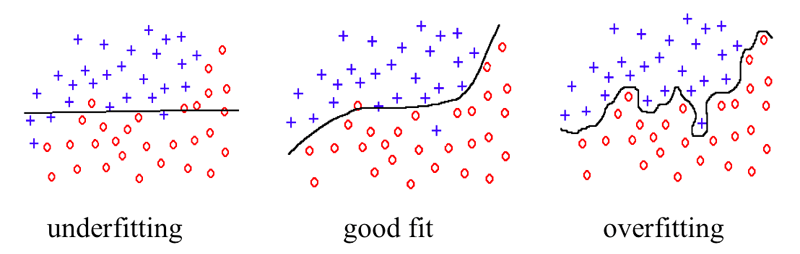

```{r setup, include=FALSE}
options(htmltools.dir.version = FALSE)
library(knitr)
opts_chunk$set(
  prompt = T,
  fig.align = "center",
  dpi = 300,
  cache = T,
  engine.opts = list(bash = "-l")
)

knit_hooks$set(
  prompt = function(before, options, envir) {
    options(
      prompt = if (options$engine %in% c("sh", "bash", "zsh")) "$ " else "R> ",
      continue = if (options$engine %in% c("sh", "bash", "zsh")) "$ " else "+ "
    )
  }
)

options(repos = c(CRAN = "https://cran.rstudio.com/"))

if (!require("fontawesome", character.only = TRUE)) {
  install.packages("fontawesome", dependencies = TRUE)
  library(fontawesome, character.only = TRUE)
}
```

# Regresión y predicción {background-color="#2d4563"}

## Agenda de la sesión

:::{style="margin-top: 20px; font-size: 32px;"}

:::{.columns}
:::{.column width=50%}
**Parte teórica (~50 min)**

- Predicción vs. explicación
- Regresión lineal (repaso)
- El problema del sobreajuste en regresión
- Regularización: LASSO, Ridge, Elastic Net
- Ingeniería de variables
:::

:::{.column width=50%}
**Laboratorio práctico (~60-70 min)**

- Datos de Latinobarómetro (simulados)
- Clasificación: logística vs. RF
- Regresión: lineal vs. regularizada
- Comparación de modelos
:::
:::
:::

# Predicción vs. explicación {background-color="#2d4563"}

## El debate central en ciencias sociales

:::{style="margin-top: 30px; font-size: 24px;"}
:::{.columns}
:::{.column width=55%}
- Mullainathan y Spiess (2017), "[Machine Learning: An Applied Econometric Approach](https://www.aeaweb.org/articles?id=10.1257/jep.31.2.87)":
    - En economía (y ciencias sociales en general), la tradición es la [explicación causal]{.alert}: $\hat{\beta}$
    - Pero muchos problemas de política pública son en realidad problemas de [predicción]{.alert}: $\hat{y}$
- [Explicación]{.alert}: ¿por qué ocurre algo? ¿cuál es el efecto causal de X sobre Y?
    - Necesitamos [identificación causal]{.alert} (experimentos, variables instrumentales, diff-in-diff)
    - El foco está en el [coeficiente]{.alert}
- [Predicción]{.alert}: ¿qué va a ocurrir? ¿quién está en riesgo?
    - Necesitamos [buena generalización]{.alert} a datos nuevos
    - El foco está en la [predicción]{.alert}
:::

:::{.column width=45%}
:::{style="text-align: center; font-size: 20px;"}
**Ejemplos**

| Pregunta | Tipo |
|----------|------|
| ¿El programa de becas aumentó la asistencia escolar? | [Explicación]{.alert} |
| ¿Qué estudiantes tienen mayor riesgo de desertar? | [Predicción]{.alert} |
| ¿La vacunación redujo la mortalidad infantil? | [Explicación]{.alert} |
| ¿Qué pacientes necesitan cuidados intensivos? | [Predicción]{.alert} |
| ¿El acuerdo de paz redujo la violencia? | [Explicación]{.alert} |
| ¿Dónde ocurrirán las protestas la próxima semana? | [Predicción]{.alert} |

<br>

[Ambos son valiosos.]{.alert} El ML aporta herramientas para predicción que complementan los métodos causales.
:::
:::
:::
:::

## ¿Por qué la regresión lineal "clásica" no es suficiente para predecir?

:::{style="margin-top: 30px; font-size: 24px;"}
:::{.columns}
:::{.column width=55%}
- La regresión lineal (OLS) busca el [mejor ajuste]{.alert} a los datos de entrenamiento
- Problema: si tenemos muchas variables, el modelo puede [sobreajustar]{.alert}
- Ejemplo: con 50 variables y 100 observaciones, el modelo puede encontrar un "ajuste perfecto" que no generaliza
- [Sobreajuste en regresión]{.alert}: el modelo "memoriza" los datos, incluyendo el ruido
- La regresión OLS [no tiene mecanismo de control]{.alert} contra el sobreajuste
- Solución: [regularización]{.alert}, un método para penalizar la complejidad del modelo
:::

:::{.column width=45%}
:::{style="text-align: center;"}
[{width="90%"}](#){data-modal-type="image" data-modal-url="figures/overfit-underfit.png"}

El mismo principio aplica a la regresión: un modelo demasiado complejo (muchas variables) memoriza el ruido.
:::
:::
:::
:::

# Regularización {background-color="#2d4563"}

## La idea de la regularización

:::{style="margin-top: 30px; font-size: 24px;"}
:::{.columns}
:::{.column width=55%}
- [Regularización]{.alert} = agregar una penalización por la complejidad del modelo
- En la regresión OLS, minimizamos el error:

$$\min \sum_{i=1}^{n} (y_i - \hat{y}_i)^2$$

- Con regularización, agregamos un término de [penalización]{.alert}:

$$\min \sum_{i=1}^{n} (y_i - \hat{y}_i)^2 + \lambda \cdot \text{penalización}(\beta)$$

- $\lambda$ controla la [fuerza]{.alert} de la penalización:
    - $\lambda = 0$: sin penalización (OLS clásico)
    - $\lambda$ grande: penalización fuerte (coeficientes se reducen hacia 0)
- El truco está en [elegir el $\lambda$ óptimo]{.alert} (por validación cruzada)
:::

:::{.column width=45%}
:::{style="text-align: center; font-size: 20px;"}
**La intuición**

Regularización le dice al modelo:

"Sí, quiero que ajustes los datos, pero [no te esfuerces demasiado]{.alert}. Si un coeficiente es muy grande, vas a pagar un precio."

Esto obliga al modelo a:

- Usar solo las variables que [realmente importan]{.alert}
- Mantener los coeficientes [pequeños]{.alert}
- [Generalizar mejor]{.alert} a datos nuevos

Es como un profesor que dice:
"Puedes usar notas en el examen, pero cada hoja que traigas te cuesta puntos."
:::
:::
:::
:::

## LASSO (L1)

:::{style="margin-top: 30px; font-size: 24px;"}
:::{.columns}
:::{.column width=55%}
- [LASSO]{.alert} = Least Absolute Shrinkage and Selection Operator
- Penalización L1: suma de los [valores absolutos]{.alert} de los coeficientes

$$\min \sum (y_i - \hat{y}_i)^2 + \lambda \sum |\beta_j|$$

- Propiedad clave: [reduce algunos coeficientes exactamente a cero]{.alert}
- Esto significa que LASSO [selecciona variables]{.alert} automáticamente
- Las variables irrelevantes son eliminadas del modelo
- Útil cuando sospechamos que [solo algunas variables]{.alert} son realmente importantes
- En ciencias sociales: ¿cuáles de 50 posibles predictores importan para predecir la satisfacción con la democracia?
:::

:::{.column width=45%}
:::{style="text-align: center; font-size: 20px;"}
**LASSO en acción**

```
Con 8 variables, λ = 0.1:

edad:                0.023
educacion_anios:     0.085
ingreso_hogar:       0.041
zona:                0.000  ← eliminada
genero:              0.000  ← eliminada
confianza_gobierno:  0.019
satisf_democracia:   0.052
percepcion_economia: 0.000  ← eliminada

LASSO seleccionó 5 de 8 variables.
Las demás fueron eliminadas
automáticamente.
```
:::
:::
:::
:::

## Ridge (L2)

:::{style="margin-top: 30px; font-size: 24px;"}
:::{.columns}
:::{.column width=55%}
- [Ridge]{.alert} = penalización L2: suma de los [cuadrados]{.alert} de los coeficientes

$$\min \sum (y_i - \hat{y}_i)^2 + \lambda \sum \beta_j^2$$

- A diferencia de LASSO, Ridge [no elimina variables]{.alert}: las reduce, pero nunca a cero exacto
- Todos los predictores permanecen en el modelo, pero con coeficientes más pequeños
- Útil cuando creemos que [muchas variables contribuyen un poco]{.alert}
- Funciona mejor que LASSO cuando hay [variables correlacionadas]{.alert} (multicolinealidad)
- En ciencias sociales: cuando tenemos indicadores muy correlacionados (confianza en distintas instituciones, por ejemplo)
:::

:::{.column width=45%}
:::{style="text-align: center; font-size: 20px;"}
**Ridge en acción**

```
Con 8 variables, λ = 0.1:

edad:                0.018
educacion_anios:     0.072
ingreso_hogar:       0.035
zona:                0.008  ← reducida, no eliminada
genero:              0.003  ← reducida, no eliminada
confianza_gobierno:  0.015
satisf_democracia:   0.044
percepcion_economia: 0.009  ← reducida, no eliminada

Ridge mantiene todas las variables
pero con coeficientes más pequeños.
```
:::
:::
:::
:::

## Elastic Net: lo mejor de ambos

:::{style="margin-top: 30px; font-size: 24px;"}
:::{.columns}
:::{.column width=55%}
- [Elastic Net]{.alert} combina LASSO (L1) y Ridge (L2):

$$\min \sum (y_i - \hat{y}_i)^2 + \lambda \left[ \alpha \sum |\beta_j| + (1-\alpha) \sum \beta_j^2 \right]$$

- Dos hiperparámetros:
    - $\lambda$: fuerza general de la penalización
    - $\alpha$: mezcla entre LASSO y Ridge
        - $\alpha = 1$: LASSO puro
        - $\alpha = 0$: Ridge puro
        - $0 < \alpha < 1$: Elastic Net
- [Selecciona variables]{.alert} (como LASSO) pero maneja mejor las [correlaciones]{.alert} (como Ridge)
- En la práctica, [Elastic Net suele funcionar mejor]{.alert} que LASSO o Ridge por separado
:::

:::{.column width=45%}
:::{style="text-align: center;"}

| | LASSO | Ridge | Elastic Net |
|---|---|---|---|
| [Penalización]{.alert} | L1 ($|\beta|$) | L2 ($\beta^2$) | L1 + L2 |
| [Selección]{.alert} | Sí | No | Sí |
| [Correlación]{.alert} | Problemas | Bien | Bien |
| [Hiperparámetros]{.alert} | $\lambda$ | $\lambda$ | $\lambda$, $\alpha$ |

<br>

:::{style="font-size: 20px;"}
**Regla general:**

- Pocas variables importantes → [LASSO]{.alert}
- Muchas variables correlacionadas → [Ridge]{.alert}
- No estoy seguro → [Elastic Net]{.alert}
:::
:::
:::
:::
:::

## Regularización en R

:::{style="margin-top: 30px; font-size: 22px;"}

Con tidymodels + glmnet:

```r
# LASSO (mixture = 1)
modelo_lasso <- linear_reg(penalty = 0.1, mixture = 1) |>
  set_engine("glmnet") |>
  set_mode("regression")

# Ridge (mixture = 0)
modelo_ridge <- linear_reg(penalty = 0.1, mixture = 0) |>
  set_engine("glmnet") |>
  set_mode("regression")

# Elastic Net (mixture entre 0 y 1)
modelo_enet <- linear_reg(penalty = 0.1, mixture = 0.5) |>
  set_engine("glmnet") |>
  set_mode("regression")

# Ajustar cualquiera de ellos (misma sintaxis)
ajuste <- fit(modelo_lasso, satisfaccion_vida ~ ., data = datos_train)
```

- `penalty` = $\lambda$ (fuerza de la penalización)
- `mixture` = $\alpha$ (1 = LASSO, 0 = Ridge, entre 0 y 1 = Elastic Net)
- En la práctica, [usamos validación cruzada]{.alert} para encontrar los mejores valores de `penalty` y `mixture`
:::

# Ingeniería de variables {background-color="#2d4563"}

## Ingeniería de variables para datos sociales

:::{style="margin-top: 30px; font-size: 22px;"}
:::{.columns}
:::{.column width=55%}
- [Ingeniería de variables]{.alert} (feature engineering): crear, transformar o seleccionar variables para mejorar el modelo
- En ciencias sociales, los datos encuestas suelen necesitar transformación:
    - [Variables categóricas]{.alert}: convertir a dummies (one-hot encoding)
        - `zona = "urbana"` → `zona_urbana = 1`, `zona_rural = 0`
    - [Variables ordinales]{.alert}: decidir si tratar como numéricas o categóricas
        - Confianza (1-4): ¿numérica o 4 dummies?
    - [Interacciones]{.alert}: crear productos entre variables
        - `edad * educacion`: el efecto de la educación cambia con la edad?
    - [Transformaciones]{.alert}: logaritmos, polinomios
        - `log(ingreso)` para relaciones no lineales
:::

:::{.column width=45%}
:::{style="font-size: 20px;"}
**Con recipes de tidymodels:**

```r
receta <- recipe(voto ~ ., data = datos_train) |>
  # Convertir categóricas a dummies
  step_dummy(all_nominal_predictors()) |>
  # Normalizar numéricas
  step_normalize(all_numeric_predictors()) |>
  # Eliminar variables con varianza cero
  step_zv(all_predictors()) |>
  # Crear interacciones
  step_interact(terms = ~ edad:educacion_anios)
```

- `recipes` nos permite definir el [preprocesamiento como parte del flujo]{.alert}
- Se aplica automáticamente a datos nuevos
- Evita [data leakage]{.alert}: el preprocesamiento se ajusta solo con datos de entrenamiento
:::
:::
:::
:::

## Resumen teórico

:::{style="margin-top: 30px; font-size: 26px;"}

- [Predicción y explicación]{.alert} son objetivos diferentes, y el ML aporta herramientas poderosas para la predicción
- La regresión OLS tiende a [sobreajustar]{.alert} con muchas variables
- La [regularización]{.alert} penaliza la complejidad: LASSO selecciona variables, Ridge reduce coeficientes, Elastic Net combina ambos
- La [ingeniería de variables]{.alert} es clave para que los modelos funcionen bien con datos de encuestas
- Ahora vamos a poner todo en práctica en el [laboratorio]{.alert}
:::

# Laboratorio 2: Clasificación y predicción con datos de Latinobarómetro {background-color="#2d4563"}

## Configuración del entorno

:::{style="margin-top: 30px; font-size: 24px;"}

```{r lab-setup, eval=FALSE, prompt=FALSE}
# Instalar paquetes (si no los tienen)
install.packages(c("tidymodels", "tidyverse", "ranger", "glmnet"))

# Cargar
library(tidymodels)
library(tidyverse)
```

```{r lab-load, echo=FALSE, message=FALSE, warning=FALSE}
library(tidymodels)
library(tidyverse)
```

- `ranger`: implementación rápida de Random Forest
- `glmnet`: implementación eficiente de LASSO, Ridge y Elastic Net
- tidymodels los usa como [motores]{.alert} (engines) de forma transparente
:::

## Cargar y explorar los datos

:::{style="margin-top: 30px; font-size: 22px;"}

```{r lab-cargar, message=FALSE, warning=FALSE, prompt=FALSE}
# Cargar datos simulados de Latinobarómetro
datos <- read_csv("datos/latinobarometro_sim.csv")

# Vista rápida
glimpse(datos)
```
:::

## Preparar los datos

:::{style="margin-top: 30px; font-size: 22px;"}

```{r lab-preparar, message=FALSE, warning=FALSE, prompt=FALSE}
# Convertir variables categóricas a factores
datos <- datos |>
  mutate(
    voto = factor(voto, levels = c("no", "si")),
    zona = factor(zona),
    genero = factor(genero),
    uso_internet = factor(uso_internet, levels = c("nunca", "semanal", "diario"))
  )

# Seleccionar variables para el modelo
datos_modelo <- datos |>
  select(-pais)  # Excluir país (demasiadas categorías)

# Dividir: 75% entrenamiento, 25% prueba
set.seed(2026)
datos_split <- initial_split(datos_modelo, prop = 0.75, strata = voto)
datos_train <- training(datos_split)
datos_test  <- testing(datos_split)

cat("Entrenamiento:", nrow(datos_train), "| Prueba:", nrow(datos_test), "\n")
```
:::

## Parte A: Clasificación (predecir voto)

:::{style="margin-top: 30px; font-size: 22px;"}

Vamos a comparar tres modelos para predecir si una persona votó:

```{r lab-clasif-modelos, message=FALSE, warning=FALSE, prompt=FALSE}
# Modelo 1: Regresión logística
mod_log <- logistic_reg() |>
  set_engine("glm") |>
  set_mode("classification")

# Modelo 2: Árbol de decisión
mod_arbol <- decision_tree(tree_depth = 5, min_n = 10) |>
  set_engine("rpart") |>
  set_mode("classification")

# Modelo 3: Random Forest
mod_rf <- rand_forest(trees = 500, min_n = 5) |>
  set_engine("ranger") |>
  set_mode("classification")
```

Noten lo fácil que es definir tres modelos distintos con [la misma interfaz]{.alert}.
:::

## Ajustar y comparar

:::{style="margin-top: 30px; font-size: 22px;"}

```{r lab-clasif-ajustar, message=FALSE, warning=FALSE, prompt=FALSE}
# Ajustar los tres modelos
fit_log   <- fit(mod_log,   voto ~ ., data = datos_train)
fit_arbol <- fit(mod_arbol, voto ~ ., data = datos_train)
fit_rf    <- fit(mod_rf,    voto ~ ., data = datos_train)

# Predecir en datos de prueba
pred_log   <- predict(fit_log,   datos_test) |> bind_cols(datos_test)
pred_arbol <- predict(fit_arbol, datos_test) |> bind_cols(datos_test)
pred_rf    <- predict(fit_rf,    datos_test) |> bind_cols(datos_test)

# Comparar accuracy
bind_rows(
  accuracy(pred_log,   truth = voto, estimate = .pred_class) |> mutate(modelo = "Logística"),
  accuracy(pred_arbol, truth = voto, estimate = .pred_class) |> mutate(modelo = "Árbol"),
  accuracy(pred_rf,    truth = voto, estimate = .pred_class) |> mutate(modelo = "Random Forest")
) |>
  select(modelo, .metric, .estimate)
```
:::

## Coeficientes de la regresión logística

:::{style="margin-top: 30px; font-size: 22px;"}

```{r lab-clasif-coefs, message=FALSE, warning=FALSE, prompt=FALSE}
# Ver los coeficientes (solo regresión logística tiene coeficientes interpretables)
tidy(fit_log) |>
  arrange(desc(abs(estimate)))
```

- ¿Qué variables son las más importantes?
- ¿Los signos tienen sentido?
:::

## Parte B: Regresión (predecir satisfacción con la vida)

:::{style="margin-top: 30px; font-size: 22px;"}

Ahora cambiamos a un problema de [regresión]{.alert}: predecir `satisfaccion_vida` (1-10).

```{r lab-reg-modelos, message=FALSE, warning=FALSE, prompt=FALSE}
# Preparar datos para regresión (excluir voto, que es una variable de respuesta)
datos_reg <- datos_modelo |> select(-voto)

set.seed(2026)
reg_split <- initial_split(datos_reg, prop = 0.75)
reg_train <- training(reg_split)
reg_test  <- testing(reg_split)

# Modelo 1: Regresión lineal (OLS)
mod_ols <- linear_reg() |>
  set_engine("lm") |>
  set_mode("regression")

# Modelo 2: LASSO
mod_lasso <- linear_reg(penalty = 0.1, mixture = 1) |>
  set_engine("glmnet") |>
  set_mode("regression")

# Modelo 3: Elastic Net
mod_enet <- linear_reg(penalty = 0.1, mixture = 0.5) |>
  set_engine("glmnet") |>
  set_mode("regression")
```
:::

## Ajustar y comparar modelos de regresión

:::{style="margin-top: 30px; font-size: 22px;"}

```{r lab-reg-ajustar, message=FALSE, warning=FALSE, prompt=FALSE}
# Ajustar
fit_ols   <- fit(mod_ols,   satisfaccion_vida ~ ., data = reg_train)
fit_lasso <- fit(mod_lasso, satisfaccion_vida ~ ., data = reg_train)
fit_enet  <- fit(mod_enet,  satisfaccion_vida ~ ., data = reg_train)

# Predecir
pred_ols   <- predict(fit_ols,   reg_test) |> bind_cols(reg_test)
pred_lasso <- predict(fit_lasso, reg_test) |> bind_cols(reg_test)
pred_enet  <- predict(fit_enet,  reg_test) |> bind_cols(reg_test)

# Comparar RMSE y R²
bind_rows(
  metrics(pred_ols,   truth = satisfaccion_vida, estimate = .pred) |> mutate(modelo = "OLS"),
  metrics(pred_lasso, truth = satisfaccion_vida, estimate = .pred) |> mutate(modelo = "LASSO"),
  metrics(pred_enet,  truth = satisfaccion_vida, estimate = .pred) |> mutate(modelo = "Elastic Net")
) |>
  filter(.metric %in% c("rmse", "rsq")) |>
  select(modelo, .metric, .estimate)
```
:::

## ¿Qué variables seleccionó LASSO?

:::{style="margin-top: 30px; font-size: 22px;"}

```{r lab-reg-lasso-coefs, message=FALSE, warning=FALSE, prompt=FALSE}
# Coeficientes del LASSO
tidy(fit_lasso) |>
  filter(estimate != 0) |>
  arrange(desc(abs(estimate)))
```

- LASSO eliminó automáticamente las variables menos importantes
- Comparen con los coeficientes de OLS: ¿cuáles fueron eliminadas?
- ¿Tiene sentido desde un punto de vista teórico?
:::

## Visualizar predicciones vs. valores reales

:::{style="margin-top: 30px; font-size: 22px;"}

```{r lab-reg-plot, message=FALSE, warning=FALSE, prompt=FALSE, fig.width=8, fig.height=4}
# Gráfico de predicciones vs. valores reales (OLS)
pred_ols |>
  ggplot(aes(x = satisfaccion_vida, y = .pred)) +
  geom_point(alpha = 0.5, colour = "#2d4563") +
  geom_abline(slope = 1, intercept = 0, linetype = "dashed", colour = "red") +
  labs(
    x = "Satisfacción real",
    y = "Satisfacción predicha",
    title = "Predicción vs. valor real (regresión lineal)"
  ) +
  theme_minimal()
```
:::

## Discusión

:::{style="margin-top: 30px; font-size: 26px;"}

Reflexionemos sobre los resultados:

- **Clasificación**: ¿qué modelo funcionó mejor para predecir el voto? ¿Random Forest mejoró mucho respecto a la regresión logística?

- **Regresión**: ¿la regularización (LASSO, Elastic Net) mejoró respecto a OLS? ¿Qué variables fueron eliminadas por LASSO?

- **Predicción vs. explicación**: si el objetivo fuera [explicar]{.alert} qué factores causan mayor participación electoral, ¿usaríamos Random Forest? ¿Por qué?

- **Limitaciones**: ¿qué le falta a este análisis para ser un estudio "real"?
    - Datos simulados vs. datos reales
    - Variables omitidas
    - Validación cruzada para elegir hiperparámetros
:::

## Resumen del Día 2

:::{style="margin-top: 30px; font-size: 26px;"}

- [Regresión logística]{.alert}: interpretable, buena para explicación, pero puede ser limitada para predicción
- [Árboles de decisión]{.alert}: intuitivos pero inestables
- [Random Forest]{.alert}: mejor predicción, pero más difícil de interpretar
- [Predicción vs. explicación]{.alert}: el ML complementa los métodos causales
- [Regularización]{.alert}: LASSO selecciona variables, Ridge reduce coeficientes, Elastic Net combina ambos
- tidymodels permite [comparar modelos con la misma sintaxis]{.alert}
- Mañana: [aprendizaje no supervisado y análisis de texto]{.alert}
:::

# Fin del Día 2 {background-color="#2d4563"}
