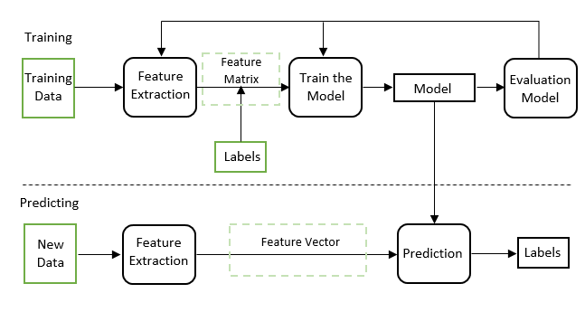
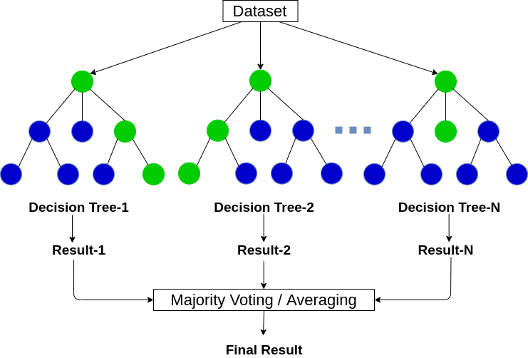
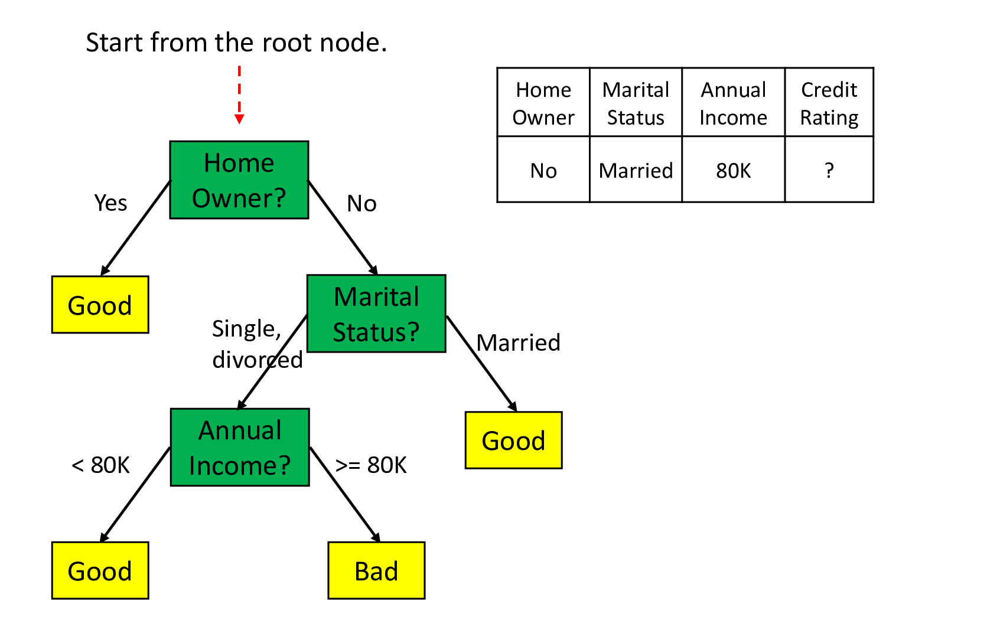

```{r setup, include=FALSE}
options(htmltools.dir.version = FALSE)
library(knitr)
opts_chunk$set(
  prompt = T,
  fig.align = "center",
  dpi = 300,
  cache = T,
  engine.opts = list(bash = "-l")
)

knit_hooks$set(
  prompt = function(before, options, envir) {
    options(
      prompt = if (options$engine %in% c("sh", "bash", "zsh")) "$ " else "R> ",
      continue = if (options$engine %in% c("sh", "bash", "zsh")) "$ " else "+ "
    )
  }
)

options(repos = c(CRAN = "https://cran.rstudio.com/"))

if (!require("fontawesome", character.only = TRUE)) {
  install.packages("fontawesome", dependencies = TRUE)
  library(fontawesome, character.only = TRUE)
}
```

```{r data-setup, include=FALSE}
suppressPackageStartupMessages({
  library(tidymodels)
  library(ranger)
  library(vip)
  library(broom)
  library(dplyr)
  library(rpart)
  library(rpart.plot)
  library(pdp)
  library(ggplot2)
})

set.seed(20260419)
n <- 1500

datos_uruguay <- tibble(
  edad                = round(runif(n, 18, 80)),
  educacion_anos      = pmin(20, pmax(0, round(rnorm(n, 11, 4)))),
  ingreso_log         = rnorm(n, 9, 1),
  confianza_gobierno  = sample(1:10, n, replace = TRUE),
  percepcion_economia = sample(1:5,  n, replace = TRUE),
  zona                = factor(sample(c("urbano", "rural"), n,
                                      replace = TRUE,
                                      prob = c(0.85, 0.15))),
  genero              = factor(sample(c("femenino", "masculino"), n,
                                      replace = TRUE))
)

# Proceso generador: efecto fuerte de confianza, percepción económica y
# educación; efecto modesto de edad e ingreso; zona casi nula
lp <- with(datos_uruguay,
  -4.5 +
    0.02 * edad +
    0.10 * educacion_anos +
    0.15 * ingreso_log +
    0.22 * confianza_gobierno +
    0.30 * percepcion_economia +
    0.15 * (zona == "urbano")
)
prob <- 1 / (1 + exp(-lp))
datos_uruguay$apoya_democracia <- factor(
  rbinom(n, 1, prob),
  levels = c(0, 1),
  labels = c("no", "si")
)

set.seed(20260419)
split_uy     <- initial_split(datos_uruguay, prop = 0.75,
                              strata = apoya_democracia)
datos_train  <- training(split_uy)
datos_test   <- testing(split_uy)

# Árbol de decisión que reusan varias slides (Gini, visualización, poda).
# Mismos hiperparámetros que el `decision_tree(tree_depth=5, min_n=10)` que
# se ajusta más adelante con tidymodels, para que todas las slides muestren
# exactamente el mismo árbol.
arbol_demo <- rpart(
  apoya_democracia ~ .,
  data    = datos_train,
  control = rpart.control(maxdepth = 5, minsplit = 10, cp = 0.01)
)
```

# Día 2: Aprendizaje supervisado {background-color="#2d4563"}

## Repaso del Día 1

:::{style="margin-top: 20px; font-size: 26px;"}
:::{.columns}
:::{.column width=50%}
- La [IA]{.alert} busca crear sistemas capaces de realizar tareas que requieren inteligencia humana
- Tres tipos de aprendizaje: [supervisado]{.alert}, [no supervisado]{.alert} y [por refuerzo]{.alert}
- El flujo de trabajo de ML: recoger, preprocesar, dividir, entrenar, evaluar
- [Sobreajuste]{.alert} (_overfitting_): memorizar en lugar de aprender
- La [exactitud]{.alert} (_accuracy_) no es suficiente: necesitamos precisión, recall y otras métricas
- Ayer hicimos nuestros primeros modelos con [tidymodels](https://www.tidymodels.org/), una interfaz unificada para ML en R
:::

:::{.column width=50%}
:::{style="text-align: center;"}
[{width="100%"}](#){data-modal-type="image" data-modal-url="figures/supervised-learning.png"}
:::
:::
:::
:::

## Agenda de la sesión

:::{style="margin-top: 20px; font-size: 28px;"}

:::{.columns}
:::{.column width=50%}
**Primera parte**

- Regresión logística (profundización)
- Árboles de decisión
- Random Forests
- Interpretación de importancia de variables

**Segunda parte**

- Ajuste de hiperparámetros (tuning)
- Comparación sistemática de modelos
- Aplicaciones
:::

:::{.column width=50%}
:::{style="text-align: center;"}
[{width="90%"}](#){data-modal-type="image" data-modal-url="figures/rfc_vs_dt1.webp"}
:::
:::
:::
:::

# Regresión logística {background-color="#2d4563"}

## Regresión logística: profundización

:::{style="margin-top: 30px; font-size: 26px;"}
:::{.columns}
:::{.column width=55%}
- [Regresión logística]{.alert}: predice la probabilidad de pertenecer a una clase
- Usa la [función sigmoide]{.alert} para transformar una combinación lineal en una probabilidad entre 0 y 1:

$$P(y = 1 | x) = \frac{1}{1 + e^{-(w_0 + w_1 x_1 + \ldots + w_n x_n)}}$$

- Los [coeficientes]{.alert} ($w$) indican la dirección (positivo o negativo) y la fuerza del efecto
- [Interpretable]{.alert}: "por cada año adicional de educación, la probabilidad de votar aumenta un X%"
:::

:::{.column width=45%}
:::{style="text-align: center;"}
[{width="80%"}](#){data-modal-type="image" data-modal-url="figures/logistic-function.png"}

Fuente: [Wikipedia](https://en.wikipedia.org/wiki/Logistic_function)
:::
:::
:::
:::

## ¿Cuándo usar regresión logística?

:::{style="margin-top: 30px; font-size: 23px;"}
:::{.columns}
:::{.column width=50%}
**Ventajas**

- [Simple e interpretable]{.alert}: los coeficientes tienen significado claro
- [Rápida]{.alert} de entrenar, funciona bien con pocos datos
- Produce [probabilidades]{.alert}, no solo clases
- Buena [línea base]{.alert} (baseline) antes de probar modelos más complejos

**Limitaciones**

- Asume [relaciones lineales]{.alert} entre predictores y log-odds
- No captura [interacciones complejas]{.alert} ni patrones no lineales automáticamente
:::

:::{.column width=50%}
**Usos comunes en ciencias sociales**

- [Comportamiento electoral]{.alert}: ¿qué predice si alguien vota por un candidato?
- [Conflicto]{.alert}: ¿qué factores predicen un conflicto armado?
- [Pobreza]{.alert}: ¿qué variables predicen si un hogar está por debajo de la línea de pobreza?
- [Migración]{.alert}: ¿qué factores predicen la intención de emigrar?

[La interpretabilidad es clave]{.alert} para informar políticas públicas, aunque a veces sacrifiquemos capacidad predictiva
:::
:::

```{r reg-log-fit, echo=FALSE, message=FALSE}
ajuste_log <- logistic_reg() |>
  set_engine("glm") |>
  set_mode("classification") |>
  fit(apoya_democracia ~ ., data = datos_train)
```
:::

## Ejemplo: Apoyo a la democracia en Uruguay

:::{style="margin-top: 30px; font-size: 24px;"}
:::{.columns}
:::{.column width=55%}
**Pregunta de investigación:** ¿qué factores predicen si un uruguayo apoya la democracia? Datos del Latinobarómetro para Uruguay (simulados)

**Variables:** edad, educación, ingreso, confianza en instituciones, percepción económica, zona, género

**Variable de respuesta:** `apoya_democracia` (sí/no)

[La regresión logística nos dice qué factores aumentan o disminuyen la probabilidad de apoyo, y en qué magnitud]{.alert}

```{r reg-log-fit-example, echo=TRUE, message=FALSE, eval=FALSE}
ajuste_log <- logistic_reg() |>
  set_engine("glm") |>
  set_mode("classification") |>
  fit(apoya_democracia ~ ., data = datos_train)
```
:::

:::{.column width=45%}
:::{style="text-align: center; font-size: 22px;"}
**Resultados (datos simulados, n = `r nrow(datos_train)`):**

```{r resultados-log, echo=TRUE, message=FALSE}
#| code-fold: true
broom::tidy(ajuste_log) |>
  dplyr::mutate(
    odds_ratio = exp(estimate),
    sig = dplyr::case_when(
      p.value < 0.001 ~ "***",
      p.value < 0.01  ~ "**",
      p.value < 0.05  ~ "*",
      TRUE            ~ ""
    ),
    term = dplyr::recode(term,
      `(Intercept)` = "Intercept",
      `zonaurbano`  = "zona_urbano"
    )
  ) |>
  dplyr::select(Variable = term,
                Coef = estimate,
                `Odds Ratio` = odds_ratio,
                ` ` = sig) |>
  knitr::kable(digits = 2, align = c("l", "r", "r", "l"))
```

[*** p < 0.001, ** p < 0.01, * p < 0.05]{style="font-size: 18px;"}

:::{style="font-size: 20px;"}
[Pregunta]{.alert}: ¿qué significa un OR de `r round(exp(broom::tidy(ajuste_log) |> dplyr::filter(term == "confianza_gobierno") |> dplyr::pull(estimate)), 2)` para confianza en el gobierno?
:::
:::
:::
:::
:::

## Odds ratios: interpretación práctica

:::{style="margin-top: 30px; font-size: 24px;"}
:::{.columns}
:::{.column width=55%}
- Los coeficientes de regresión logística están en escala [log-odds]{.alert}
- Para interpretarlos, usamos el [odds ratio]{.alert} = $e^{\beta}$

**Interpretación del odds ratio:**

- OR = 1: sin efecto
- OR > 1: aumenta la probabilidad
- OR < 1: disminuye la probabilidad

**Ejemplo:** OR = 1.25 para confianza en el gobierno

- Por cada punto adicional de confianza (escala 1-10), las chances de apoyar la democracia se multiplican por 1.25
- Es decir, [aumentan un 25%]{.alert}
:::

:::{.column width=45%}
:::{style="text-align: center; font-size: 19px;"}
**Cálculo en R:**

```{r or-ci, echo=TRUE, message=FALSE}
tidy(ajuste_log) |>
  mutate(
    OR     = exp(estimate),
    IC_inf = exp(estimate - 1.96 * std.error),
    IC_sup = exp(estimate + 1.96 * std.error)
  ) |>
  select(term, OR, IC_inf, IC_sup) |>
  knitr::kable(digits = 2)
```

<br>

[Siempre reportar intervalos de confianza para los odds ratios]{.alert}
:::
:::
:::
:::

# Árboles de decisión {background-color="#2d4563"}

## ¿Qué es un árbol de decisión?

:::{style="margin-top: 30px; font-size: 27px;"}
:::{.columns}
:::{.column width=55%}
- Un [árbol de decisión]{.alert} aprende una jerarquía de preguntas de sí/no
- Cada [nodo]{.alert} divide los datos según una variable
- Cada [hoja]{.alert} contiene una predicción
- Ejemplo: "Si la educación > 12 años Y la edad > 30, entonces predecir: votó"
- Puede capturar [relaciones no lineales]{.alert}
- Muy [fácil de interpretar]{.alert}: se visualiza como un diagrama de flujo que cualquiera entiende, incluso sin formación técnica
:::

:::{.column width=45%}
:::{style="text-align: center;"}
[{width="100%"}](#){data-modal-type="image" data-modal-url="figures/decision-tree.gif"}

Fuente: [Medium](https://medium.com/towards-data-engineering/100-days-of-machine-learning-on-databricks-day-63-decision-trees-5d4df25b194f)
:::
:::
:::
:::

## ¿Cómo se construye un árbol?

:::{style="margin-top: 30px; font-size: 24px;"}
:::{.columns}
:::{.column width=55%}
1. Empezar con [todos los datos]{.alert} en la raíz
2. Buscar la variable y el punto de corte que [mejor separen]{.alert} las clases
    - Se usa un criterio como [Gini]{.alert} o [entropía]{.alert} (miden la "impureza" del nodo)
3. Dividir los datos en dos grupos según esa regla
4. Repetir recursivamente para cada grupo
5. Parar cuando se cumple un criterio:
    - Profundidad máxima
    - Mínimo de observaciones en un nodo
    - Sin mejora significativa

- El algoritmo es [codicioso]{.alert} (greedy): en cada paso busca la mejor división local, sin mirar el panorama global
:::

:::{.column width=45%}
:::{style="text-align: center; font-size: 28px;"}
**Ejemplo paso a paso**

```
Datos: 500 personas, 265 votaron

Paso 1: ¿edad > 35?
  ├── Sí (300 personas, 200 votaron)
  │   Paso 2: ¿educación > 12?
  │   ├── Sí → Predecir: VOTÓ ✅
  │   └── No → Predecir: NO VOTÓ ❌
  └── No (200 personas, 65 votaron)
      Paso 2: ¿interés_política > 3?
      ├── Sí → Predecir: VOTÓ ✅
      └── No → Predecir: NO VOTÓ ❌

Cada pregunta busca la "mejor"
separación posible
```
:::
:::
:::
:::

## Ventajas y problemas de los árboles

:::{style="margin-top: 30px; font-size: 22px;"}
:::{.columns}
:::{.column width=50%}
**Ventajas**

- [Muy interpretables]{.alert}: se pueden visualizar y explicar
- Capturan [interacciones]{.alert} entre variables automáticamente
- No requieren [escalado]{.alert} de variables (funcionan con valores originales)
- Manejan variables [numéricas y categóricas]{.alert} sin transformación
- Pueden capturar [relaciones no lineales]{.alert}
:::

:::{.column width=50%}
**Problemas**

- [Sobreajuste severo]{.alert}: los árboles profundos memorizan los datos
- [Alta varianza]{.alert}: un pequeño cambio en los datos puede producir un árbol completamente diferente
- [Inestabilidad]{.alert}: muy sensibles a la muestra de entrenamiento
- Solución: en lugar de un solo árbol, usar [muchos árboles]{.alert}
- Eso nos lleva a los [Random Forests]{.alert}
:::
:::

:::{style="text-align: center; margin-top: 20px;"}
[{width="40%"}](#){data-modal-type="image" data-modal-url="figures/overfit-underfit.png"}
:::
:::

## Árboles de decisión en R

:::{style="margin-top: 30px; font-size: 20px;"}

Con tidymodels, solo necesitamos cambiar la especificación del modelo:

```{r arbol-fit, echo=TRUE, message=FALSE}
# Ajustar un árbol de decisión (spec + fit en una sola pipeline)
ajuste_arbol <- decision_tree(tree_depth = 5, min_n = 10) |>
  set_engine("rpart") |>
  set_mode("classification") |>
  fit(apoya_democracia ~ ., data = datos_train)

# Evaluar: accuracy y ROC-AUC en test
pred_arbol <- augment(ajuste_arbol, datos_test)
pred_arbol |> accuracy(truth = apoya_democracia, estimate = .pred_class)
pred_arbol |> roc_auc(truth = apoya_democracia, .pred_si, event_level = "second")
```

- Noten que la [interfaz es idéntica]{.alert}: solo cambiamos `logistic_reg()` por `decision_tree()`, ¡la misma sintaxis para todos los modelos!
- `tree_depth` y `min_n` son [hiperparámetros]{.alert}: controlan la complejidad del modelo
- [`augment()`]{.alert} agrega las predicciones al test set; una sola llamada da todo lo necesario para cualquier métrica de yardstick
:::

## Visualizar un árbol de decisión

:::{style="margin-top: 30px; font-size: 22px;"}
:::{.columns}
:::{.column width=55%}
- Una de las grandes ventajas de los árboles es que [se pueden visualizar]{.alert}
- Con el paquete `rpart.plot`:

```{r arbol-vis-code, echo=TRUE, eval=TRUE, fig.show='hide', message=FALSE}
library(rpart.plot)

# Extraer el modelo rpart del ajuste tidymodels
arbol_rpart <- extract_fit_engine(ajuste_arbol)

# type=4: muestra reglas en todos los nodos
# extra=104: clase predicha + % de observaciones
# roundint=FALSE: evita warning con predictores
# no enteros
rpart.plot(arbol_rpart,
           type     = 4,
           extra    = 104,
           roundint = FALSE)
```
:::

:::{.column width=45%}
:::{style="text-align: center; font-size: 20px;"}
**Árbol ajustado a nuestros datos:**

```{r arbol-vis, echo=FALSE, fig.height=4.2, fig.width=5.5, fig.align="center", out.width="100%"}
rpart.plot(arbol_demo,
           type     = 4,
           extra    = 104,
           roundint = FALSE,
           tweak    = 1.0,
           box.palette = "RdBu")
```

[¡Cualquier persona puede entender este modelo]{.alert}, incluso sin formación técnica!
:::
:::
:::
:::

## Poda (pruning): controlando la complejidad

:::{style="margin-top: 30px; font-size: 25px;"}
:::{.columns}
:::{.column width=55%}
- Un árbol sin restricciones crece hasta [memorizar]{.alert} los datos
- La [poda]{.alert} (pruning) reduce su complejidad: [pre-poda]{.alert} (frenar el crecimiento antes) o [post-poda]{.alert} (recortar ramas que no mejoran)
- En tidymodels se controla con hiperparámetros: `tree_depth` (profundidad máxima), `min_n` (mínimo por nodo) y `cost_complexity` (penalización por complejidad)
:::

:::{.column width=45%}
:::{style="text-align: center; font-size: 22px;"}
**El trade-off (con nuestros datos):**

```{r poda-tradeoff, echo=FALSE, message=FALSE, warning=FALSE, fig.height=3.5, fig.width=5, fig.align="center", out.width="100%"}
profs <- c(1, 2, 3, 5, 7, 10, 15, 20)
err <- purrr::map_dfr(profs, function(d) {
  fit <- rpart(apoya_democracia ~ .,
               data    = datos_train,
               control = rpart.control(maxdepth  = d,
                                       minsplit  = 2,
                                       minbucket = 1,
                                       cp        = 0))
  tibble::tibble(
    profundidad = d,
    train = mean(predict(fit, datos_train, type = "class") !=
                 datos_train$apoya_democracia),
    test  = mean(predict(fit, datos_test,  type = "class") !=
                 datos_test$apoya_democracia)
  )
})

err |>
  tidyr::pivot_longer(c(train, test),
                      names_to = "conjunto", values_to = "error") |>
  ggplot(aes(profundidad, error, colour = conjunto)) +
  geom_line(linewidth = 1) +
  geom_point(size = 2) +
  scale_colour_manual(values = c(train = "#1f77b4", test = "#d62728"),
                      labels = c(train = "Entrenamiento", test = "Test")) +
  labs(x = "Profundidad del árbol", y = "Error de clasificación",
       colour = NULL) +
  theme_minimal(base_size = 13) +
  theme(legend.position = "bottom")
```

A partir de cierta profundidad, el error en test [empeora]{.alert} mientras el error en train sigue bajando: [la poda previene el sobreajuste]{.alert}
:::
:::
:::
:::

# Random Forests {background-color="#2d4563"}

## La idea detrás de Random Forest

:::{style="margin-top: 30px; font-size: 22px;"}
:::{.columns}
:::{.column width=55%}
- Un solo árbol es [inestable]{.alert} y propenso al sobreajuste
- Solución: [combinar muchos árboles]{.alert} y promediar sus predicciones
- [Random Forest]{.alert} ([Breiman, 2001](https://doi.org/10.1023/A:1010933404324)) = un [conjunto]{.alert} de árboles de decisión
- Dos fuentes de aleatoriedad:
    1. [Bootstrap]{.alert}: cada árbol entrena con una muestra diferente de los datos (con reemplazo)
    2. [Subconjunto de variables]{.alert}: en cada división, cada árbol solo considera un subconjunto aleatorio de variables
- El resultado: árboles [diversos]{.alert} cuyos errores se [cancelan]{.alert} al promediar, y la predicción mejora
- Así, RF [reduce la varianza]{.alert} sin aumentar mucho el sesgo, y suele funcionar bien [sin mucha afinación]{.alert} de hiperparámetros
:::

:::{.column width=45%}
:::{style="text-align: center;"}
```
Random Forest con 500 árboles:

Árbol 1: muestra 1, variables {A,C,F}
  → Predicción: VOTÓ

Árbol 2: muestra 2, variables {B,D,E}
  → Predicción: NO VOTÓ

Árbol 3: muestra 3, variables {A,D,G}
  → Predicción: VOTÓ

...

Árbol 500: muestra 500, variables {C,E,F}
  → Predicción: VOTÓ

Predicción final: VOTÓ
(mayoría de votos entre los 500 árboles)
```

[La sabiduría de la multitud:]{.alert} ¡muchos modelos "mediocres" juntos hacen un modelo excelente!
:::
:::
:::
:::

## Random Forest en R

:::{style="margin-top: 30px; font-size: 21px;"}

De nuevo, con tidymodels solo cambiamos la especificación:

:::{style="font-size: 22px;"}
```{r rf-fit, echo=TRUE, message=FALSE}
# Ajustar Random Forest (importance = "permutation" lo usamos después en VIP)
ajuste_rf <- rand_forest(trees = 2000, mtry = 2, min_n = 5) |>
  set_engine("ranger", seed = 1, importance = "permutation") |>
  set_mode("classification") |>
  fit(apoya_democracia ~ ., data = datos_train)

# Evaluar: accuracy y ROC-AUC en test
pred_rf <- augment(ajuste_rf, datos_test)
pred_rf |> accuracy(truth = apoya_democracia, estimate = .pred_class)
pred_rf |> roc_auc(truth = apoya_democracia, .pred_si, event_level = "second")
```
:::

- `ranger` es una implementación [rápida y eficiente]{.alert} de Random Forest en R

**Hiperparámetros principales**

| Parámetro | Descripción |
|-----------|-------------|
| `trees` | Número de árboles (más = mejor, pero más lento) |
| `mtry` | Variables a considerar en cada división |
| `min_n` | Mínimo de observaciones por nodo |

- `mtry` $= \sqrt{p}$ (clasificación) o $p/3$ (regresión); restringir las variables por división [fuerza a los árboles a ser diferentes]{.alert}. En la práctica, [los valores por defecto funcionan bien]{.alert}
:::

## Importancia de variables

:::{style="margin-top: 30px; font-size: 23px;"}
:::{.columns}
:::{.column width=55%}
- Los Random Forests no son tan interpretables como un solo árbol o una regresión logística
- Pero podemos medir la [importancia de cada variable]{.alert}
- ¿Cómo? Medir cuánto [empeora la predicción]{.alert} si permutamos (mezclamos) los valores de una variable
    - Si mezclar `edad` hace que el modelo sea mucho peor, entonces `edad` es importante
    - Si mezclar `zona` no cambia nada, entonces `zona` no aporta mucho
- Esto nos da un [ranking de variables]{.alert} por su contribución al modelo
- Útil para [entender qué factores importan]{.alert}, aunque no nos diga la dirección del efecto
:::

:::{.column width=45%}
:::{style="font-size: 20px; margin-top: 20px;"}
```{r vip-rf, echo=TRUE, message=FALSE, warning=FALSE, fig.height=3.5, fig.width=5, fig.align="center", out.width="100%"}
vip(ajuste_rf, num_features = 7)
```
:::
- Usamos [importancia por permutación]{.alert} (robusta); existen otras como [Gini]{.alert} (rápida pero sesgada hacia variables con muchas categorías) y [SHAP]{.alert} (más detallada, más avanzada). Para profundizar: [Molnar, _Interpretable ML_](https://christophm.github.io/interpretable-ml-book/)
:::
:::
:::

## Gráficos de dependencia parcial (PDP)

:::{style="margin-top: 30px; font-size: 21px;"}
:::{.columns}
:::{.column width=45%}
- La importancia nos dice [qué]{.alert} variables importan
- Los [Partial Dependence Plots (PDP)]{.alert} nos dicen [cómo]{.alert} afectan
- Muestran el [efecto marginal]{.alert} de una variable sobre la predicción
- Útiles para entender relaciones no lineales

```{r pdp-code, echo=TRUE, eval=TRUE, fig.show='hide', message=FALSE, warning=FALSE}
library(pdp)

ajuste_rf |>
  partial(pred.var    = "confianza_gobierno",
          which.class = "si",
          prob        = TRUE,
          train       = datos_train) |>
  autoplot()
```
:::

:::{.column width=55%}
:::{style="text-align: center;"}
**PDP: confianza en el gobierno → P(apoya democracia)**

```{r pdp-confianza, echo=FALSE, message=FALSE, warning=FALSE, fig.height=3.5, fig.width=5, fig.align="center", out.width="90%"}
ajuste_rf |>
  pdp::partial(pred.var = "confianza_gobierno",
               which.class = "si",
               prob = TRUE,
               train = datos_train) |>
  autoplot() +
  labs(x = "Confianza en el gobierno (1–10)",
       y = "P(apoya democracia)") +
  theme_minimal(base_size = 13)
```
:::

:::{style="font-size: 20px;"}
- [Interpretación:]{.alert} la probabilidad de apoyar la democracia crece con la confianza en el gobierno, pero el efecto se acelera a partir de un valor moderado. Esto es algo que la regresión logística asume lineal por construcción
:::
:::
:::
:::

# Ajuste de hiperparámetros (tuning) {background-color="#2d4563"}

## Ajuste de hiperparámetros (tuning)

:::{style="margin-top: 30px; font-size: 22px;"}
:::{.columns}
:::{.column width=50%}
- Los [hiperparámetros]{.alert} (ej. `mtry`, `min_n`) se fijan antes de entrenar; los valores por defecto suelen servir, pero no siempre son óptimos
- El [tuning]{.alert} prueba muchas combinaciones y elige la mejor por [validación cruzada]{.alert} ([nunca con los datos de test]{.alert})
- El patrón en tidymodels:
    1. marcar parámetros con `tune()`
    2. definir una grilla de valores
    3. evaluar cada combinación con `tune_grid()` sobre los folds
    4. `select_best()` + `finalize_model()` para el ajuste final
:::

:::{.column width=50%}
:::{style="font-size: 16px; margin-top: 20px;"}
```{r tuning-overview, echo=TRUE, eval=FALSE}
# 1. Hiperparámetros a ajustar con tune()
modelo_rf_tune <- rand_forest(mtry = tune(), min_n = tune()) |>
  set_engine("ranger", seed = 1) |>
  set_mode("classification")

# 2. Grilla de valores + folds de validación cruzada
grilla <- grid_regular(mtry(range = c(2, 10)),
                       min_n(range = c(5, 20)), levels = 4)
folds  <- vfold_cv(datos_train, v = 5,
                   strata = apoya_democracia)

# 3. Probar cada combinación con CV
resultados <- tune_grid(modelo_rf_tune,
  apoya_democracia ~ ., resamples = folds,
  grid = grilla, metrics = metric_set(roc_auc))

# 4. Elegir la mejor y entrenar el modelo final
mejor <- select_best(resultados, metric = "roc_auc")
ajuste_final <- finalize_model(modelo_rf_tune, mejor) |>
  fit(apoya_democracia ~ ., data = datos_train)
```
:::
:::
:::

[El tuning mejora el rendimiento pero toma tiempo. Lo ejecutan paso a paso en el laboratorio]{.alert}
:::

# Comparación de modelos {background-color="#2d4563"}

## Comparando los tres modelos

:::{style="margin-top: 30px; font-size: 22px;"}

Como los tres ajustes comparten la misma estructura, podemos compararlos en una métrica común (ROC-AUC en test):

:::{style="font-size: 20px;"}
```{r comparacion-modelos, echo=TRUE, message=FALSE, warning=FALSE}
# Repaso: los tres ajustes que vimos en este capítulo (misma estructura, distinta spec)
ajuste_log <- logistic_reg() |> set_engine("glm") |> set_mode("classification") |>
  fit(apoya_democracia ~ ., data = datos_train)
ajuste_arbol <- decision_tree(tree_depth = 5, min_n = 10) |> set_engine("rpart") |> set_mode("classification") |>
  fit(apoya_democracia ~ ., data = datos_train)
ajuste_rf <- rand_forest(trees = 2000, mtry = 2, min_n = 5) |> set_engine("ranger", seed = 1, importance = "permutation") |> set_mode("classification") |>
  fit(apoya_democracia ~ ., data = datos_train)

# Métrica: ROC-AUC en test
tibble(
  Modelo = c("Logística", "Árbol", "Random Forest"),
  `ROC-AUC` = c(
    augment(ajuste_log,   datos_test) |> roc_auc(apoya_democracia, .pred_si, event_level = "second") |> pull(.estimate),
    augment(ajuste_arbol, datos_test) |> roc_auc(apoya_democracia, .pred_si, event_level = "second") |> pull(.estimate),
    augment(ajuste_rf,    datos_test) |> roc_auc(apoya_democracia, .pred_si, event_level = "second") |> pull(.estimate)
  )
) |> knitr::kable(digits = 3)
```
:::

- En la práctica, [siempre hay que comparar modelos]{.alert} antes de elegir uno
:::

## ¿Qué modelo elegir?

:::{style="margin-top: 30px; font-size: 26px;"}

:::{style="text-align: center;"}

| Criterio | Reg. logística | Árbol de decisión | Random Forest |
|----------|---------------|-------------------|---------------|
| [Interpretabilidad]{.alert} | Alta (coeficientes) | Alta (visual) | Baja (caja negra) |
| [Capacidad predictiva]{.alert} | Moderada | Moderada-baja | Alta |
| [Riesgo de sobreajuste]{.alert} | Bajo | Alto | Bajo |
| [Velocidad]{.alert} | Muy rápida | Rápida | Moderada |
| [Relaciones no lineales]{.alert} | No | Sí | Sí |
| [Datos necesarios]{.alert} | Pocos | Pocos | Moderados |

:::

:::{style="margin-top: 20px;"}
- Si necesitan [entender por qué]{.alert} el modelo predice algo: regresión logística
- Si necesitan [explicar la lógica]{.alert} a no técnicos: árbol de decisión
- Si necesitan la [mejor predicción posible]{.alert}: Random Forest (o modelos aún más complejos)
- En ciencias sociales, la elección depende de si el objetivo es [explicar o predecir]{.alert}
:::
:::

## Resumen de la sesión

:::{style="margin-top: 30px; font-size: 24px;"}

**Lo que vimos hoy:**

- Tres modelos, del más interpretable al más predictivo: [regresión logística]{.alert}, [árboles de decisión]{.alert} y [Random Forests]{.alert}
- [Importancia de variables]{.alert} y [dependencia parcial]{.alert} para interpretar modelos de caja negra
- [Tuning de hiperparámetros]{.alert} con validación cruzada y [comparación]{.alert} de modelos en tidymodels

**Para explorar:**

- [Gradient Boosting]{.alert} (XGBoost): suele predecir aún mejor, pero es más difícil de ajustar (apéndice 2)

<br>

[La elección del modelo depende del objetivo: ¿explicar o predecir?]{.alert}
:::

## Próximos pasos

:::{style="margin-top: 40px; font-size: 26px;"}

- [Próxima sesión (2.2):]{.alert} Regresión y regularización
    - Predicción vs. explicación
    - LASSO, Ridge, Elastic Net
    - Selección automática de variables

- [Laboratorios (2.3 y 2.4):]{.alert}
    - Clasificación con datos de Latinobarómetro
    - Regresión con datos socioeconómicos
    - Tuning, comparación e interpretación

[¡Nos vemos después del descanso!]{.alert}
:::

# Apéndices {background-color="#2d4563"}

## Apéndice 1: La matemática detrás de los árboles

:::{style="margin-top: 20px; font-size: 22px;"}
:::{.columns}
:::{.column width=55%}
- El árbol busca la división que minimice la [impureza]{.alert} de los nodos resultantes
- La medida más común es el [índice de Gini]{.alert}:

$$\text{Gini}(t) = 1 - \sum_{k=1}^{K} p_k^2$$

donde $p_k$ es la proporción de la clase $k$ en el nodo $t$

- Nodo puro (una sola clase): $\text{Gini} = 0$
- Nodo 50/50 (máxima mezcla): $\text{Gini} = 0.5$
- El algoritmo evalúa cada variable y cada punto de corte posible, y elige la división con menor Gini ponderado:

$$\text{Gini}_{\text{split}} = \frac{n_L}{n} \text{Gini}(t_L) + \frac{n_R}{n} \text{Gini}(t_R)$$
:::

:::{.column width=45%}
:::{style="font-size: 20px;"}
**Ejemplo con nuestros datos (apoyo a la democracia)**

```{r gini-tabla, echo=FALSE}
n_tot <- nrow(datos_train)
n_si  <- sum(datos_train$apoya_democracia == "si")
n_no  <- n_tot - n_si

cut1  <- arbol_demo$splits[1, "index"]
var1  <- rownames(arbol_demo$splits)[1]

izq <- datos_train[datos_train[[var1]] <  cut1, ]
der <- datos_train[datos_train[[var1]] >= cut1, ]

gini <- function(d) {
  p <- mean(d$apoya_democracia == "si")
  1 - p^2 - (1 - p)^2
}
g_root <- gini(datos_train)
g_izq  <- gini(izq)
g_der  <- gini(der)

tibble::tibble(
  Nodo  = c("Raíz",
            paste0(var1, " < ", cut1),
            paste0(var1, " ≥ ", cut1)),
  Sí    = c(n_si, sum(izq$apoya_democracia == "si"),
            sum(der$apoya_democracia == "si")),
  No    = c(n_no, sum(izq$apoya_democracia == "no"),
            sum(der$apoya_democracia == "no")),
  Gini  = round(c(g_root, g_izq, g_der), 3)
) |>
  knitr::kable(align = c("l", "r", "r", "r"))
```

```{r gini-split, echo=FALSE}
n_l <- nrow(izq); n_r <- nrow(der)
g_split <- (n_l/n_tot)*g_izq + (n_r/n_tot)*g_der
```

$\text{Gini}_{\text{split}} = \tfrac{`r n_l`}{`r n_tot`}(`r round(g_izq,3)`) + \tfrac{`r n_r`}{`r n_tot`}(`r round(g_der,3)`) = `r round(g_split,3)`$

Como $`r round(g_split,3)` < `r round(g_root,3)`$, [esta división mejora la separación]{.alert} de las clases.
:::
:::
:::
:::

## Apéndice 2: Más allá de Random Forest: Gradient Boosting

:::{style="margin-top: 30px; font-size: 23px;"}
:::{.columns}
:::{.column width=55%}
- Random Forest es un [ensemble]{.alert} (muchos modelos juntos)
- Otra familia de ensembles: [Gradient Boosting]{.alert}
- En lugar de entrenar árboles en paralelo, los entrena [secuencialmente]{.alert}
- Cada árbol nuevo intenta corregir los errores del anterior
- Implementaciones populares:
    - [XGBoost]{.alert}: muy usado en competencias de Kaggle
    - [LightGBM]{.alert}: rápido para datasets grandes
    - [CatBoost]{.alert}: bueno con variables categóricas

[Suele tener mejor rendimiento que RF, pero es más difícil de ajustar]{.alert}
:::

:::{.column width=45%}
:::{style="text-align: center; font-size: 22px;"}
**Random Forest vs. Gradient Boosting:**

| | RF | Boosting |
|---|---|---|
| Entrenamiento | Paralelo | Secuencial |
| Hiperparámetros | Pocos | Muchos |
| Riesgo de sobreajuste | Bajo | Más alto |
| Velocidad | Rápido | Variable |
| Rendimiento típico | Muy bueno | Excelente |

<br>

En tidymodels:
```{r boost-spec, echo=TRUE, message=FALSE, eval=FALSE}
modelo_xgb <- boost_tree() |>
  set_engine("xgboost") |>
  set_mode("classification")
```

[Lo veremos con más detalle en los laboratorios]{.alert}
:::
:::
:::
:::

## Apéndice 3: Aplicaciones en ciencias sociales

:::{style="margin-top: 30px; font-size: 22px;"}
:::{.columns}
:::{.column width=50%}
**[Muchlinski et al. (2016)](https://doi.org/10.1093/pan/mpv024): Predicción de guerras civiles**

- Compararon regresión logística con Random Forest
- RF tuvo mejor rendimiento predictivo
- [Wang (2019)](https://doi.org/10.1093/pan/mpz004) replicó y encontró errores, pero la lección se mantiene
- RF captura interacciones complejas que la regresión no capta

**[Jean et al. (2016)](https://doi.org/10.1126/science.aaf7894): Pobreza desde el espacio**

- Predijeron pobreza en África usando imágenes satelitales
- Random Forest + redes neuronales
- Aplicable a contextos donde los censos son poco frecuentes o poco confiables
:::

:::{.column width=50%}
**Otros ejemplos en ciencias sociales:**

- [Predicción de deserción escolar]{.alert}: identificar estudiantes en riesgo antes de que abandonen
- [Scoring crediticio alternativo]{.alert}: las fintech como Nubank usan ML para evaluar clientes sin historial bancario
- [Detección de fraude electoral]{.alert}: análisis de patrones anómalos en resultados
- [Predicción de violencia]{.alert}: modelos para anticipar zonas de riesgo
- [Análisis de opinión pública]{.alert}: clasificación de textos sobre políticas públicas

[En todos estos casos, RF es un punto de partida común]{.alert}
:::
:::
:::

# Nos vemos en la próxima sesión 🤓 {background-color="#2d4563"}
