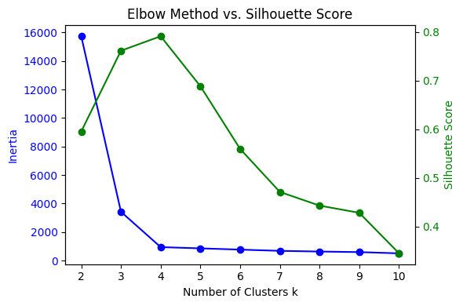

```{r setup, include=FALSE}
options(htmltools.dir.version = FALSE)
library(knitr)
opts_chunk$set(
  prompt = T,
  fig.align = "center",
  dpi = 300,
  cache = T,
  engine.opts = list(bash = "-l")
)

knit_hooks$set(
  prompt = function(before, options, envir) {
    options(
      prompt = if (options$engine %in% c("sh", "bash", "zsh")) "$ " else "R> ",
      continue = if (options$engine %in% c("sh", "bash", "zsh")) "$ " else "+ "
    )
  }
)

options(repos = c(CRAN = "https://cran.rstudio.com/"))

if (!require("fontawesome", character.only = TRUE)) {
  install.packages("fontawesome", dependencies = TRUE)
  library(fontawesome, character.only = TRUE)
}
```

# Día 3: Texto y aprendizaje no supervisado {background-color="#2d4563"}

## Repaso del Día 2

:::{style="margin-top: 20px; font-size: 28px;"}
:::{.columns}
:::{.column width=50%}
- [Regresión logística]{.alert}: interpretable, produce probabilidades
- [Árboles de decisión]{.alert}: intuitivos pero sobreajustan
- [Random Forest]{.alert}: combina muchos árboles para mejor predicción
- [Predicción vs. explicación]{.alert}: dos objetivos diferentes en ciencias sociales
- [Regularización]{.alert}: LASSO selecciona variables, Ridge reduce coeficientes
- `tidymodels` permite comparar modelos con [la misma sintaxis]{.alert}
:::

:::{.column width=50%}
:::{style="text-align: center;"}
[{width="100%"}](#){data-modal-type="image" data-modal-url="figures/learning-types.png"}
:::
:::
:::
:::

## Agenda de la sesión

:::{style="margin-top: 20px; font-size: 28px;"}

:::{.columns}
:::{.column width=50%}
**Primera parte: clustering**

- ¿Qué es el aprendizaje no supervisado?
- K-means: algoritmo y limitaciones
- Elegir K: método del codo y silueta
- Ejemplo práctico en R
- Clustering jerárquico y comparación
:::

:::{.column width=50%}
**Segunda parte: PCA**

- Reducción de dimensionalidad: PCA
- ¿Cuántos componentes conservar?
- Interpretación de loadings y biplot
- Aplicaciones en América Latina
:::
:::
:::

# ¿Qué es el aprendizaje no supervisado? {background-color="#2d4563"}

## Aprender sin etiquetas

:::{style="margin-top: 30px; font-size: 22px;"}
:::{.columns}
:::{.column width=55%}
- En aprendizaje supervisado, teníamos [respuestas correctas]{.alert} (etiquetas)
- En aprendizaje no supervisado, [no hay etiquetas]{.alert}
- El modelo debe descubrir [patrones ocultos]{.alert} en los datos por sí mismo
- ¿Por qué usarlo?
    - Las etiquetas son [costosas]{.alert} (requieren expertos)
    - A veces las etiquetas [no existen]{.alert} ("¿cuántos tipos de votantes hay?")
    - [Exploración]{.alert}: entender los datos antes de modelar
- Dos técnicas principales:
    - [Clustering]{.alert}: agrupar observaciones similares
    - [Reducción de dimensionalidad]{.alert}: simplificar datos con muchas variables
:::

:::{.column width=45%}
:::{style="text-align: center; margin-top: 30px;"}
[{width="100%"}](#){data-modal-type="image" data-modal-url="figures/K-means_convergence.gif"}

Fuente: [Wikipedia](https://commons.wikimedia.org/wiki/File:K-means_convergence.gif)
:::
:::
:::
:::

# K-means {background-color="#2d4563"}

## ¿Qué es K-means?

:::{style="margin-top: 30px; font-size: 24px;"}
:::{.columns}
:::{.column width=55%}
- [K-means]{.alert}: el algoritmo de clustering más popular
- Particiona los datos en [K grupos]{.alert} (clusters)
- Los puntos dentro del mismo cluster son [similares]{.alert} entre sí
- Los puntos en clusters diferentes son [disimilares]{.alert}
- ¿Cómo funciona?
    1. Elegir K centros [aleatoriamente]{.alert}
    2. [Asignar]{.alert} cada punto al centro más cercano
    3. [Mover]{.alert} cada centro al promedio de sus puntos asignados
    4. Repetir pasos 2-3 hasta que los centros [no se muevan]{.alert}
- Simple, rápido y funciona bien en muchos casos
:::

:::{.column width=45%}
:::{style="text-align: center;"}
[{width="90%"}](#){data-modal-type="image" data-modal-url="figures/kmeans2.gif"}

Fuente: [Machine Learning CoBan](https://machinelearningcoban.com/2017/01/01/kmeans/)
:::
:::
:::
:::

## ¿Cómo elegir K?

:::{style="margin-top: 30px; font-size: 24px;"}
:::{.columns}
:::{.column width=55%}
- El usuario debe [elegir el número de clusters]{.alert} (K) de antemano
- No existe un K "correcto" en general
- Métodos para orientarse:
    - [Método del codo]{.alert}: graficar la suma de distancias internas para diferentes K, buscar el "codo" donde la mejora se estabiliza
    - [Silueta]{.alert}: mide qué tan bien cada punto encaja en su cluster. Valores altos (cercanos a 1) son buenos
    - [Conocimiento del dominio]{.alert}: ¿cuántos grupos tienen sentido teóricamente?
- En ciencias sociales, [el contexto teórico]{.alert} suele ser más importante que las métricas estadísticas
- Ejemplo: ¿cuántos "tipos" de regímenes políticos hay? ¿3? ¿5? ¿7? Depende de la teoría
:::

:::{.column width=45%}
:::{style="text-align: center; font-size: 20px;"}
[{width="90%"}](#){data-modal-type="image" data-modal-url="figures/elbow_sil.png"}

[Codo]{.alert}: Se elige el K donde la curva "se aplana": agregar más clusters ya no mejora mucho

[Silueta]{.alert}: Valores altos (cercanos a 1) indican mejor ajuste
:::
:::
:::
:::

## Limitaciones de K-means

:::{style="margin-top: 30px; font-size: 24px;"}
:::{.columns}
:::{.column width=50%}
**Supuestos que hace**

- Los clusters son [esféricos]{.alert} (todos del mismo tamaño)
- Cada punto pertenece a [un solo cluster]{.alert}
- Sensible a la [escala]{.alert} de las variables (siempre normalizar antes)
- Sensible a los [valores iniciales]{.alert} (ejecutar varias veces)
:::

:::{.column width=50%}
**Aplicaciones en ciencias sociales**

- [Segmentación de países]{.alert}: agrupar países por indicadores de desarrollo
- [Tipología de votantes]{.alert}: identificar perfiles electorales
- [Clasificación de municipios]{.alert}: agrupar por características socioeconómicas
- [Análisis de encuestas]{.alert}: encontrar grupos de respuesta similares
:::
:::

:::{style="margin-top: 20px; text-align: center; font-size: 22px;"}
[K-means es un punto de partida, no el final.]{.alert} Sirve para explorar los datos y generar hipótesis, no para confirmar teorías causales.
:::
:::

# Evaluación de clusters {background-color="#2d4563"}

## Coeficiente de silueta

:::{style="margin-top: 30px; font-size: 22px;"}
:::{.columns}
:::{.column width=55%}
- El [coeficiente de silueta]{.alert} mide qué tan bien cada observación encaja en su cluster
- Para cada punto $i$:
    - $a(i)$ = distancia promedio a otros puntos [del mismo cluster]{.alert}
    - $b(i)$ = distancia promedio al cluster [más cercano diferente]{.alert}

$$s(i) = \frac{b(i) - a(i)}{\max(a(i), b(i))}$$

- Valores de $s(i)$:
    - Cerca de [+1]{.alert}: el punto está bien clasificado
    - Cerca de [0]{.alert}: el punto está en el borde entre clusters
    - Cerca de [-1]{.alert}: el punto probablemente está en el cluster equivocado
:::

:::{.column width=45%}
:::{style="text-align: center; font-size: 24px;"}
**Interpretación del promedio de silueta:**

| Valor | Interpretación |
|-------|----------------|
| 0.71 - 1.00 | Estructura fuerte |
| 0.51 - 0.70 | Estructura razonable |
| 0.26 - 0.50 | Estructura débil |
| < 0.25 | Sin estructura clara |

<br>

Podemos usar la silueta promedio para [elegir K]{.alert}: el K con mayor silueta indica clusters mejor definidos.
:::
:::
:::
:::

## Método de la silueta para elegir K

:::{style="margin-top: 20px; font-size: 21px;"}
:::{.columns}
:::{.column width=55%}
**Ventajas sobre el método del codo**

- Mide [calidad]{.alert} (qué tan separados están los clusters), no solo compacidad interna
- Escala interpretable: cerca de 1 indica clusters bien definidos, cerca de 0 clusters solapados
- El máximo suele ser más fácil de identificar que un "codo" ambiguo

**Advertencias**

- Tiende a [favorecer valores pequeños de K]{.alert}: a veces elige K=2 aunque existan 4 grupos reales, si esos 4 son menos "limpios"
- Si dos K dan siluetas similares, preferir el menor (parsimonia) o el que tenga más sentido teórico
- Combinar siempre con [conocimiento del dominio]{.alert} y con el método del codo
:::

:::{.column width=45%}
:::{style="text-align: center; font-size: 26px;"}
**Ejemplo**

```
Silueta promedio por K:

K=2:  0.52
K=3:  0.58  ← máximo
K=4:  0.51
K=5:  0.44
K=6:  0.38

La silueta sugiere K=3.
El método del codo podría
sugerir otro valor.

Usar ambos + teoría para decidir.
```
:::
:::
:::
:::

## K-means en R: simulando datos

:::{style="margin-top: 20px; font-size: 20px;"}

Simulamos [90 "países"]{.alert} organizados en 3 tipos de desarrollo (alto, medio, bajo), con 4 indicadores estandarizados y correlacionados entre sí.

```{r kmeans-sim, echo=FALSE, eval=TRUE}
#| message: false
library(tidyverse)
Sigma <- matrix(0.3, 4, 4); diag(Sigma) <- 1
sim_grupo <- function(n, mu, g) {
  MASS::mvrnorm(n, mu, Sigma) |>
    as_tibble(.name_repair = ~ c("pib", "educ", "internet", "desigualdad")) |>
    mutate(grupo_real = g)
}
set.seed(2026)
datos <- bind_rows(
  sim_grupo(30, c( 2.5,  2.5,  2.5, -1.0), "alto"),
  sim_grupo(30, c( 0.0,  0.0,  0.0,  2.5), "medio"),
  sim_grupo(30, c(-2.5, -2.5, -2.5, -1.0), "bajo")
)
```

:::{.columns}
:::{.column width=45%}
**Variables** (todas en z-score):

- `pib`: producto interno bruto per cápita
- `educ`: años promedio de escolaridad
- `internet`: acceso a internet
- `desigualdad`: índice tipo Gini
- `grupo_real`: grupo verdadero, para verificar si K-means lo recupera

[Desigualdad]{.alert} no es monótona: alta en países de ingreso medio, baja en los extremos. Refleja patrones reales en América Latina
:::

:::{.column width=55%}
```{r kmeans-glimpse, echo=TRUE, eval=TRUE}
glimpse(datos)
```
:::
:::
:::

## K-means en R: ajuste y evaluación

:::{style="margin-top: 20px; font-size: 20px;"}

```{r kmeans-fit, echo=TRUE, eval=TRUE}
#| message: false
#| fig-width: 7
#| fig-height: 3.2
#| fig-align: center
library(cluster)
library(factoextra)

# Escalar (siempre antes de K-means)
datos_scaled <- datos |>
  dplyr::select(where(is.numeric)) |>
  scale()

# Ajustar K-means con K=3 y 25 inicializaciones aleatorias
km <- kmeans(datos_scaled, centers = 3, nstart = 25)

# Silueta promedio
sil <- silhouette(km$cluster, dist(datos_scaled))
round(mean(sil[, 3]), 3)

# ¿Recuperó los grupos reales?
table(real = datos$grupo_real, cluster = km$cluster)

fviz_cluster(km, data = datos_scaled, geom = "point",
             ellipse.type = "convex") +
  theme_minimal(base_size = 11)
```

- `nstart = 25` protege contra mínimos locales por una mala inicialización aleatoria
:::

## K-means en R: eligiendo K

:::{style="margin-top: 20px; font-size: 20px;"}

¿Cómo supimos que [K=3]{.alert} era la mejor opción? Aplicando los dos métodos a los datos simulados:

```{r kmeans-nbclust, echo=TRUE, eval=TRUE}
#| layout-ncol: 2
#| fig-width: 5
#| fig-height: 3.8
fviz_nbclust(datos_scaled, kmeans, method = "wss", nstart = 25) +
  labs(title = "Método del codo", subtitle = NULL)

fviz_nbclust(datos_scaled, kmeans, method = "silhouette", nstart = 25) +
  labs(title = "Método de la silueta", subtitle = NULL)
```

- **Izquierda**: la [suma de distancias internas]{.alert} (within sum of squares) cae bruscamente hasta K=3 y se aplana después. El codo está en K=3.
- **Derecha**: la silueta promedio [se maximiza en K=3]{.alert}, confirmando el diagnóstico.
- Ambos métodos coinciden porque los datos tienen estructura clara. En aplicaciones reales suelen [discrepar]{.alert}, y ahí pesa la teoría.

:::

# Clustering jerárquico {background-color="#2d4563"}

## ¿Qué es el clustering jerárquico?

:::{style="margin-top: 20px; font-size: 22px;"}
:::{.columns}
:::{.column width=50%}
- [Clustering jerárquico]{.alert}: crea una jerarquía de clusters anidados
- No requiere [especificar K de antemano]{.alert}
- Dos enfoques:
    - [Aglomerativo]{.alert} (bottom-up): empieza con cada punto como cluster y fusiona los más cercanos
    - [Divisivo]{.alert} (top-down): empieza con todos los puntos juntos y los va dividiendo
- El resultado se visualiza como un [dendrograma]{.alert}
- El usuario "corta" el dendrograma al nivel deseado para obtener K clusters
- Tomamos [3 países de cada grupo]{.alert} de los datos simulados para ilustrar:
:::

:::{.column width=50%}

:::{style="margin-top: 20px; font-size: 19px;"}
```{r hclust-demo, echo=TRUE, eval=TRUE}
#| message: false
#| fig-width: 7.5
#| fig-height: 4
set.seed(2026)
muestra <- datos |>
  group_by(grupo_real) |>
  slice_sample(n = 3) |>
  ungroup()

m_scaled <- scale(muestra[, 1:4])
rownames(m_scaled) <- muestra$grupo_real

hc_demo <- hclust(dist(m_scaled), method = "ward.D2")
plot(hc_demo, hang = -1, main = "", xlab = "",
              sub = "", ylab = "Altura")
rect.hclust(hc_demo, k = 3, 
            border = c("#2d4563", "#b85450", "#6b8e23"))
```
:::
:::
:::
:::

## Métodos de enlace (linkage)

:::{style="margin-top: 30px; font-size: 24px;"}

:::{style="text-align: center;"}

| Método | Distancia entre clusters | Características |
|--------|--------------------------|-----------------|
| [Single]{.alert} (mínimo) | Puntos más cercanos | Puede crear cadenas largas |
| [Complete]{.alert} (máximo) | Puntos más lejanos | Clusters compactos |
| [Average]{.alert} (promedio) | Promedio de todas las distancias | Balance entre ambos |
| [Ward]{.alert} | Minimiza varianza interna | Similar a K-means, muy usado |

:::

<br>

:::{style="font-size: 22px;"}
- [Ward]{.alert} es el más usado en ciencias sociales porque tiende a crear clusters de tamaño similar
- En R: `hclust(dist(datos), method = "ward.D2")`
:::
:::

## Clustering jerárquico en R

:::{style="margin-top: 20px; font-size: 20px;"}

Reutilizamos los [mismos datos simulados]{.alert} (`datos_scaled`) para comparar con K-means:

```{r hclust-fit, echo=TRUE, eval=TRUE}
#| message: false
#| fig-width: 7
#| fig-height: 3
# Matriz de distancias y clustering jerárquico con método Ward
d <- dist(datos_scaled, method = "euclidean")
hc <- hclust(d, method = "ward.D2")

# Cortar para obtener 3 clusters
grupos_hc <- cutree(hc, k = 3)

# ¿Recuperó los grupos reales?
table(real = datos$grupo_real, cluster = grupos_hc)

# Dendrograma con los 3 cortes resaltados
plot(hc, hang = -1, labels = FALSE, main = "", xlab = "", sub = "")
rect.hclust(hc, k = 3, border = c("#2d4563", "#b85450", "#6b8e23"))
```

- La tabla confirma que [Ward recupera los 3 grupos]{.alert} casi perfectamente. El dendrograma permite explorar otros cortes (2, 4, 5, ...) sin reajustar el modelo
:::

## K-means vs. Jerárquico

:::{style="margin-top: 30px; font-size: 24px;"}

:::{style="text-align: center;"}

| Criterio | K-means | Jerárquico |
|----------|---------|------------|
| [Elegir K]{.alert} | Antes de ejecutar | Después (cortando) |
| [Forma de clusters]{.alert} | Esféricos | Cualquier forma |
| [Escalabilidad]{.alert} | Muy rápido | Lento para n grande |
| [Reproducibilidad]{.alert} | Depende de inicialización | Determinístico |
| [Visualización]{.alert} | Scatter plot | Dendrograma |
| [Jerarquía]{.alert} | No | Sí (anidamiento) |

:::

<br>

:::{style="font-size: 22px;"}
- Use [K-means]{.alert} para datasets grandes cuando tiene una idea del número de grupos
- Use [jerárquico]{.alert} para explorar la estructura de los datos y visualizar relaciones entre observaciones
:::
:::

# PCA: Reducción de dimensionalidad {background-color="#2d4563"}

## ¿Qué es PCA?

:::{style="margin-top: 30px; font-size: 24px;"}
:::{.columns}
:::{.column width=55%}
- [PCA]{.alert} (Principal Component Analysis / Análisis de Componentes Principales)
- Problema: tenemos [muchas variables]{.alert} y queremos simplificar
- PCA busca las [direcciones de máxima variación]{.alert} en los datos
- Crea nuevas variables ([componentes principales]{.alert}) que son combinaciones lineales de las originales
- Primer componente: la dirección con [más varianza]{.alert}
- Segundo componente: la siguiente dirección con más varianza, [perpendicular]{.alert} al primero
- Y así sucesivamente
- Permite [visualizar datos de alta dimensión]{.alert} en 2D o 3D
:::

:::{.column width=45%}
:::{style="text-align: center;"}
[{width="100%"}](#){data-modal-type="image" data-modal-url="figures/pca.gif"}

Fuente: [Vizuara](https://www.vizuaranewsletter.com/p/understanding-principal-component)
:::
:::
:::
:::

## ¿Para qué sirve PCA en ciencias sociales?

:::{style="margin-top: 30px; font-size: 23px;"}
:::{.columns}
:::{.column width=55%}
- [Visualización]{.alert}: reducir 8 variables a 2 dimensiones para graficar
- [Construcción de índices]{.alert}: combinar muchos indicadores en uno solo
    - Ejemplo: el Índice de Desarrollo Humano (IDH) combina esperanza de vida, educación e ingreso en un solo número, que es la misma idea de PCA (aunque el IDH usa una media geométrica, no componentes principales)
- [Preprocesamiento]{.alert}: reducir la dimensionalidad antes de aplicar otro modelo (como K-means o regresión)
- [Detección de patrones]{.alert}: ver qué variables "van juntas"
    - Si el primer componente carga fuertemente en PIB, educación e internet, lo podemos interpretar como un "eje de desarrollo"
:::

:::{.column width=45%}
:::{style="text-align: center;"}
[{width="100%"}](#){data-modal-type="image" data-modal-url="figures/dimensionality-reduction.png"}

Fuente: [Medium](https://muhammadtaha01.medium.com/dimensionality-reduction-in-machine-learning-46d45747eaee)
:::
:::
:::
:::

## ¿Cuántos componentes conservar?

:::{style="margin-top: 15px; font-size: 22px;"}

- PCA produce [tantos componentes como variables originales]{.alert}. Criterios para conservar los primeros: [varianza acumulada ~80%]{.alert}, [método del codo]{.alert}, [regla de Kaiser]{.alert} (eigenvalue > 1)

:::{.columns}
:::{.column width=50%}
:::{style="margin-top: 20px;"}
```{r pca-scree-code, echo=TRUE, eval=FALSE}
library(factoextra)
pca <- prcomp(datos_scaled)

fviz_eig(pca, addlabels = TRUE,
         barfill = "steelblue",
         barcolor = "steelblue") +
  labs(title = NULL,
       y = "Varianza (%)") +
  theme_minimal(base_size = 10) +
  coord_cartesian(ylim = c(0, 100))
```
:::
:::

:::{.column width=50%}
```{r pca-scree, echo=FALSE, eval=TRUE}
#| message: false
#| fig-width: 4
#| fig-height: 3.2
library(factoextra)
pca <- prcomp(datos_scaled)

fviz_eig(pca, addlabels = TRUE,
         barfill = "steelblue",
         barcolor = "steelblue") +
  labs(title = NULL, y = "Varianza (%)") +
  theme_minimal(base_size = 10) +
  coord_cartesian(ylim = c(0, 100))
```
:::
:::

- [PC1 captura la mayor parte de la varianza]{.alert} (eje de desarrollo: PIB, educación e internet covarían). Con 2 componentes ya explicamos más del 80% del total

:::

## Interpretación de los loadings

:::{style="margin-top: 20px; font-size: 22px;"}
:::{.columns}
:::{.column width=45%}
**Idea intuitiva:** cada componente es una [receta]{.alert} que combina las variables originales. Los [loadings]{.alert} son la cantidad de cada ingrediente.

- [Grande]{.alert} (cerca de ±1): la variable pesa mucho
- [Cerca de cero]{.alert}: la variable casi no aparece
- [Mismo signo]{.alert} dentro de un PC: las variables suben y bajan juntas
- [Signos opuestos]{.alert}: van en direcciones contrarias
- El signo global del PC es arbitrario: si lo invertimos, el resultado es equivalente
:::

:::{.column width=55%}
```{r pca-loadings, echo=TRUE, eval=TRUE}
# Loadings (matriz de rotación)
round(pca$rotation, 2)

# Varianza explicada
summary(pca)$importance |> round(2)
```

**Leyendo nuestros resultados:**

- [PC1]{.alert}: PIB, educación e internet pesan casi igual ([~-0.57]{.alert} cada uno); desigualdad casi no pesa. PC1 resume el [desarrollo general]{.alert} del país
- [PC2]{.alert}: desigualdad pesa casi todo ([-0.99]{.alert}) y las demás casi nada. PC2 captura solo la [desigualdad]{.alert}
- Entre PC1 y PC2 explican el [95%]{.alert} de la varianza
:::
:::
:::

## Biplot: visualización combinada

:::{style="margin-top: 20px; font-size: 20px;"}

Un [biplot]{.alert} muestra simultáneamente las [observaciones]{.alert} (puntos) y las [variables]{.alert} (flechas). Flechas cercanas indican variables correlacionadas; las observaciones en la dirección de una flecha tienen valores altos en esa variable.

```{r pca-biplot, echo=TRUE, eval=TRUE}
#| fig-width: 7
#| fig-height: 3.2
fviz_pca_biplot(pca,
                geom.ind = "point",
                habillage = datos$grupo_real,
                addEllipses = TRUE,
                palette = c("#2d4563", "#b85450", "#6b8e23"),
                col.var = "black",
                repel = TRUE,
                legend.title = "Grupo real") +
  labs(title = NULL) +
  theme_minimal(base_size = 11)
```

- Los tres grupos simulados se [separan con claridad]{.alert} en el plano PC1-PC2. Las flechas confirman que PIB, educación e internet apuntan juntas, y desigualdad va en dirección distinta
:::

## PCA: lo que hay que recordar

:::{style="margin-top: 30px; font-size: 24px;"}

:::{.columns}
:::{.column width=50%}
**Ventajas**

- [Reduce la dimensionalidad]{.alert} preservando la mayor varianza posible
- Ayuda a [visualizar]{.alert} datos complejos
- Puede revelar [estructura latente]{.alert}
- Los componentes son [no correlacionados]{.alert} entre sí (ortogonales, es decir, su correlación es cero)
- No necesita etiquetas
:::

:::{.column width=50%}
**Limitaciones**

- Sólo captura relaciones [lineales]{.alert}
- Los componentes son [difíciles de interpretar]{.alert} (son combinaciones de muchas variables)
- Sensible a la [escala]{.alert}: siempre normalizar antes
- No es un modelo causal: no dice [por qué]{.alert} las variables están correlacionadas
- ¿Cuántos componentes conservar? Regla general: los que explican [~80% de la varianza]{.alert}
:::
:::
:::

# Aplicaciones en ciencias sociales {background-color="#2d4563"}

## Aplicaciones y lecturas clave

:::{style="margin-top: 25px; font-size: 22px;"}
:::{.columns}
:::{.column width=50%}
**Dónde se usan estas técnicas:**

- [Tipologías de países]{.alert} por indicadores de desarrollo, gobernanza e institucionalidad
- [Mapas ideológicos]{.alert} de partidos y legisladores
- [Segmentación de votantes]{.alert} a partir de encuestas (Latinobarómetro, LAPOP)
- [Índices compuestos]{.alert} (desarrollo humano, capital social, calidad institucional)
- [Preprocesamiento]{.alert} antes de una regresión con variables correlacionadas
- [Agrupación de respuestas abiertas]{.alert} en encuestas grandes
:::

:::{.column width=50%}
**Lecturas recomendadas:**

- Hotelling, H. (1933). ["Analysis of a complex of statistical variables into principal components."](https://doi.org/10.1037/h0071325) *Journal of Educational Psychology*, 24(6)
- Ahlquist, J. S. & Breunig, C. (2012). ["Model-based clustering and typologies in the social sciences."](https://doi.org/10.1093/pan/mpr039) *Political Analysis*, 20(1)
- Jolliffe, I. T. & Cadima, J. (2016). ["Principal component analysis: a review and recent developments."](https://doi.org/10.1098/rsta.2015.0202) *Phil. Trans. R. Soc. A*, 374
- Grimmer, J., Roberts, M. E. & Stewart, B. M. (2022). [*Text as Data*.](https://press.princeton.edu/books/hardcover/9780691207544/text-as-data) Princeton University Press
:::
:::

<br>

[En el laboratorio (Sesión 3.3) aplicaremos estas técnicas a datos reales de países latinoamericanos.]{.alert}
:::

## PCA vs. análisis factorial

:::{style="margin-top: 20px; font-size: 22px;"}

Muchos índices que usamos en ciencias sociales (bienestar, confianza institucional, autoritarismo) parecen PCA pero son [análisis factorial]{.alert}. Son parientes cercanos que responden a preguntas distintas.

:::{.columns}
:::{.column width=50%}
**PCA**

- No asume un modelo: busca [ejes que explican varianza]{.alert}
- Los componentes son sumas ponderadas de las variables observadas
- Cada PC intenta captar la máxima varianza posible, sin separar "error"
- Pregunta: [¿cómo resumo estos datos?]{.alert}
:::

:::{.column width=50%}
**Análisis factorial**

- Asume un [modelo]{.alert}: variables observadas = factores latentes + error
- Los factores son causas hipotéticas que generan las correlaciones
- Estima por separado la varianza común y la específica de cada variable
- Pregunta: [¿qué constructos latentes explican estas variables?]{.alert}
:::
:::

<br>

[Regla práctica:]{.alert} si vas a reportar un índice como "medida de X" (una actitud, un constructo), probablemente querés análisis factorial. Si solo querés reducir dimensiones para visualizar o graficar, PCA alcanza.
:::

## Cómo caracterizar un cluster en la práctica

:::{style="margin-top: 20px; font-size: 22px;"}

Después de correr `kmeans()`, la etiqueta `1/2/3` no significa nada por sí misma. Hay que [darle contenido sustantivo]{.alert}:

:::{.columns}
:::{.column width=55%}
**1. Perfiles por cluster:** calcular la media de cada variable dentro de cada grupo

```{r cluster-medias, echo=TRUE, eval=TRUE}
datos |>
  mutate(cluster = km$cluster) |>
  group_by(cluster) |>
  summarise(across(where(is.numeric),
                   \(x) round(mean(x), 2)))
```
:::

:::{.column width=45%}
**2. Validación externa:** cruzar con variables [no usadas]{.alert} en el clustering (región, partido, encuesta, año). Si los grupos separan esas variables, tenés evidencia de estructura real

**3. Nombrar los clusters:** asignar etiquetas sustantivas ("alto desarrollo", "ingreso medio", "bajo desarrollo") en lugar de dejar "1, 2, 3"

**4. Cuidado con la reificación:** los clusters [no son categorías naturales]{.alert}. Son un resumen útil que depende de K y de las variables elegidas
:::
:::
:::

## Resumen de la sesión

:::{style="margin-top: 30px; font-size: 24px;"}
:::{.columns}
:::{.column width=50%}
**Clustering:**

- [K-means]{.alert}: rápido, asume clusters esféricos, requiere elegir K
- [Jerárquico]{.alert}: produce dendrograma, no requiere K de antemano
- [Silueta]{.alert}: mide calidad de los clusters
- [Escalar siempre]{.alert} antes de aplicar
:::

:::{.column width=50%}
**PCA:**

- Reduce [dimensionalidad]{.alert} preservando varianza
- Los [loadings]{.alert} indican qué variables contribuyen a cada componente
- [Scree plot]{.alert} ayuda a elegir cuántos componentes conservar
- [Biplot]{.alert} visualiza observaciones y variables juntas
:::
:::

<br>

[Son herramientas de exploración: generan hipótesis, no las confirman.]{.alert}
:::

## Próximos pasos

:::{style="margin-top: 40px; font-size: 26px;"}

- [Sesión 3.2:]{.alert} Análisis computacional de texto
    - Tokenización y preprocesamiento
    - TF-IDF y bag-of-words
    - Topic Modeling (LDA)
    - Introducción a embeddings

- [Laboratorios (3.3 y 3.4):]{.alert}
    - Clustering y PCA con datos de países
    - Análisis de textos políticos latinoamericanos

[Nos vemos en la próxima sesión.]{.alert}
:::

# Nos vemos en la sesión de análisis de texto! {background-color="#2d4563"}
