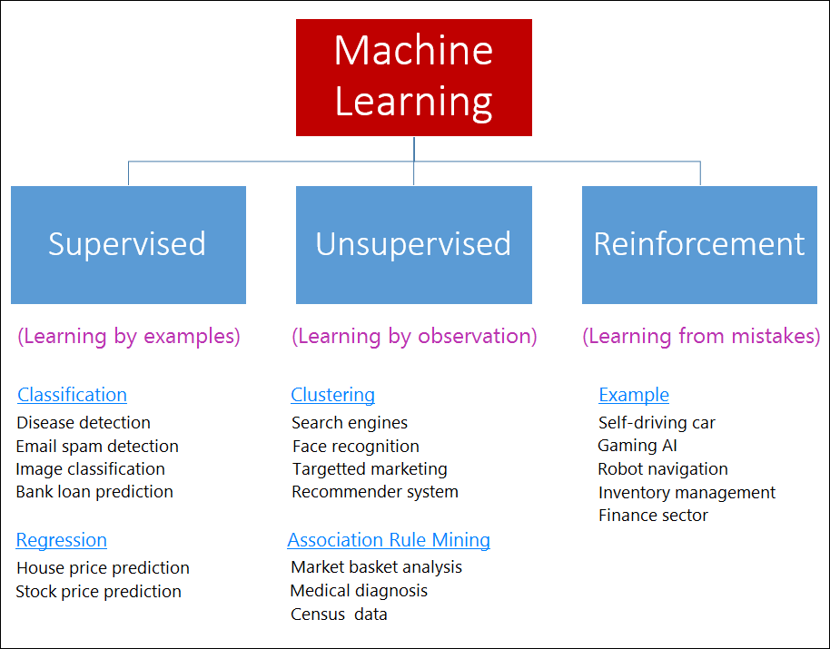
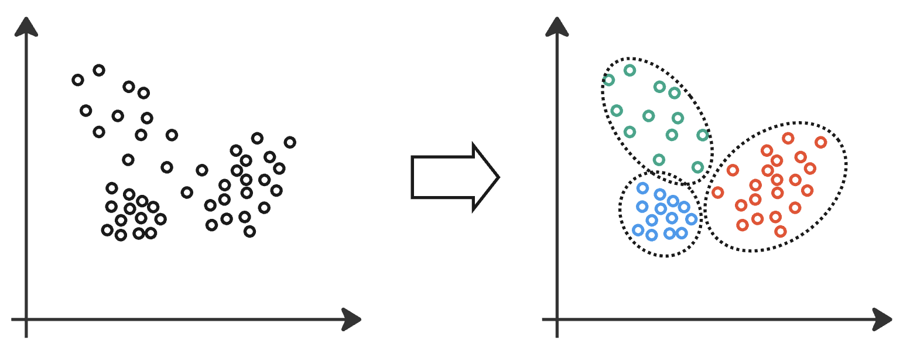
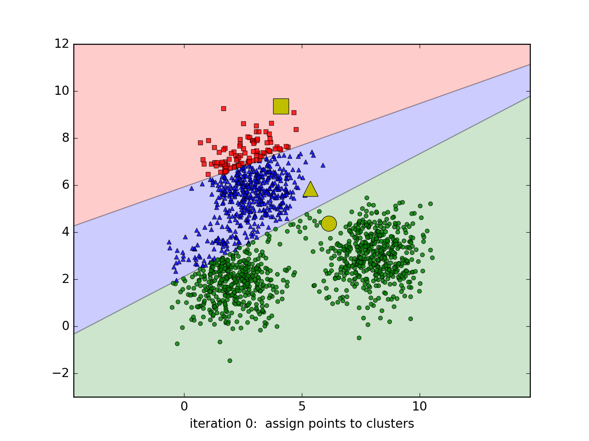
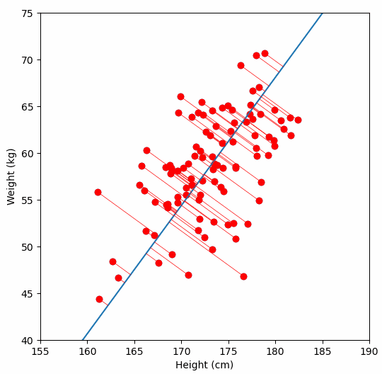
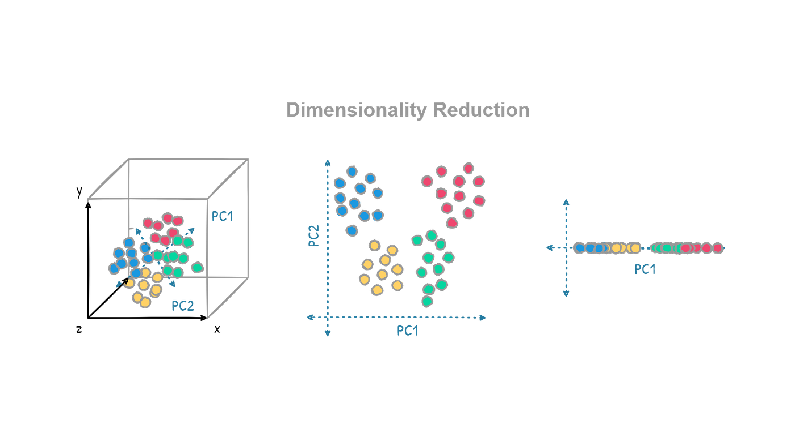

```{r setup, include=FALSE}
options(htmltools.dir.version = FALSE)
library(knitr)
opts_chunk$set(
  prompt = T,
  fig.align = "center",
  dpi = 300,
  cache = T,
  engine.opts = list(bash = "-l")
)

knit_hooks$set(
  prompt = function(before, options, envir) {
    options(
      prompt = if (options$engine %in% c("sh", "bash", "zsh")) "$ " else "R> ",
      continue = if (options$engine %in% c("sh", "bash", "zsh")) "$ " else "+ "
    )
  }
)

options(repos = c(CRAN = "https://cran.rstudio.com/"))

if (!require("fontawesome", character.only = TRUE)) {
  install.packages("fontawesome", dependencies = TRUE)
  library(fontawesome, character.only = TRUE)
}
```

# Día 3: Texto y aprendizaje no supervisado {background-color="#2d4563"}

## Repaso del Día 2

:::{style="margin-top: 20px; font-size: 28px;"}
:::{.columns}
:::{.column width=50%}
- [Regresión logística]{.alert}: interpretable, produce probabilidades
- [Árboles de decisión]{.alert}: intuitivos pero sobreajustan
- [Random Forest]{.alert}: combina muchos árboles para mejor predicción
- [Predicción vs. explicación]{.alert}: dos objetivos diferentes en ciencias sociales
- [Regularización]{.alert}: LASSO selecciona variables, Ridge reduce coeficientes
- tidymodels permite comparar modelos con [la misma sintaxis]{.alert}
:::

:::{.column width=50%}
:::{style="text-align: center;"}
[{width="100%"}](#){data-modal-type="image" data-modal-url="figures/learning-types.png"}
:::
:::
:::
:::

## Agenda de la sesión

:::{style="margin-top: 20px; font-size: 28px;"}

:::{.columns}
:::{.column width=50%}
**Primera parte**

- ¿Qué es el aprendizaje no supervisado?
- Clustering: K-means
- Elegir el número de clusters
- Evaluación con silueta
- Clustering jerárquico (intro)
:::

:::{.column width=50%}
**Segunda parte**

- Reducción de dimensionalidad: PCA
- Interpretación de componentes
- ¿Cuántos componentes conservar?
- Aplicaciones en América Latina
- Comparación con otros métodos
:::
:::
:::

# ¿Qué es el aprendizaje no supervisado? {background-color="#2d4563"}

## Aprender sin etiquetas

:::{style="margin-top: 30px; font-size: 24px;"}
:::{.columns}
:::{.column width=55%}
- En aprendizaje supervisado, teníamos [respuestas correctas]{.alert} (etiquetas)
- En aprendizaje no supervisado, [no hay etiquetas]{.alert}
- El modelo debe descubrir [patrones ocultos]{.alert} en los datos por sí mismo
- ¿Por qué usarlo?
    - Las etiquetas son [costosas]{.alert} (requieren expertos)
    - A veces las etiquetas [no existen]{.alert} ("¿cuántos tipos de votantes hay?")
    - [Exploración]{.alert}: entender los datos antes de modelar
- Dos técnicas principales:
    - [Clustering]{.alert}: agrupar observaciones similares
    - [Reducción de dimensionalidad]{.alert}: simplificar datos con muchas variables
:::

:::{.column width=45%}
:::{style="text-align: center;"}
[{width="100%"}](#){data-modal-type="image" data-modal-url="figures/unsupervised-learning.png"}
:::
:::
:::
:::

# K-means {background-color="#2d4563"}

## ¿Qué es K-means?

:::{style="margin-top: 30px; font-size: 24px;"}
:::{.columns}
:::{.column width=55%}
- [K-means]{.alert}: el algoritmo de clustering más popular
- Particiona los datos en [K grupos]{.alert} (clusters)
- Los puntos dentro del mismo cluster son [similares]{.alert} entre sí
- Los puntos en clusters diferentes son [disimilares]{.alert}
- ¿Cómo funciona?
    1. Elegir K centros [aleatoriamente]{.alert}
    2. [Asignar]{.alert} cada punto al centro más cercano
    3. [Mover]{.alert} cada centro al promedio de sus puntos asignados
    4. Repetir pasos 2-3 hasta que los centros [no se muevan]{.alert}
- Simple, rápido y funciona bien en muchos casos
:::

:::{.column width=45%}
:::{style="text-align: center;"}
[{width="90%"}](#){data-modal-type="image" data-modal-url="figures/kmeans2.gif"}

Fuente: [Machine Learning CoBan](https://machinelearningcoban.com/2017/01/01/kmeans/)
:::
:::
:::
:::

## ¿Cómo elegir K?

:::{style="margin-top: 30px; font-size: 24px;"}
:::{.columns}
:::{.column width=55%}
- El usuario debe [elegir el número de clusters]{.alert} (K) de antemano
- No existe un K "correcto" en general
- Métodos para orientarse:
    - [Método del codo]{.alert}: graficar la suma de distancias internas para diferentes K, buscar el "codo" donde la mejora se estabiliza
    - [Silueta]{.alert}: mide qué tan bien cada punto encaja en su cluster. Valores altos (cercanos a 1) son buenos
    - [Conocimiento del dominio]{.alert}: ¿cuántos grupos tienen sentido teóricamente?
- En ciencias sociales, [el contexto teórico]{.alert} suele ser más importante que las métricas estadísticas
- Ejemplo: ¿cuántos "tipos" de regímenes políticos hay? ¿3? ¿5? ¿7? Depende de la teoría
:::

:::{.column width=45%}
:::{style="text-align: center; font-size: 20px;"}
**Método del codo**

```
Suma de distancias internas
  │
  │\
  │ \
  │  \
  │   \
  │    \.___.___.___  ← "codo" en K=3
  │
  └──────────────────▶
    K=1  2  3  4  5  6
```

Se elige el K donde la curva
"se aplana": agregar más clusters
ya no mejora mucho.
:::
:::
:::
:::

## Limitaciones de K-means

:::{style="margin-top: 30px; font-size: 24px;"}
:::{.columns}
:::{.column width=50%}
**Supuestos que hace**

- Los clusters son [esféricos]{.alert} (todos del mismo tamaño)
- Cada punto pertenece a [un solo cluster]{.alert}
- Sensible a la [escala]{.alert} de las variables (siempre normalizar antes)
- Sensible a los [valores iniciales]{.alert} (ejecutar varias veces)
:::

:::{.column width=50%}
**Aplicaciones en ciencias sociales**

- [Segmentación de países]{.alert}: agrupar países por indicadores de desarrollo
- [Tipología de votantes]{.alert}: identificar perfiles electorales
- [Clasificación de municipios]{.alert}: agrupar por características socioeconómicas
- [Análisis de encuestas]{.alert}: encontrar grupos de respuesta similares
:::
:::

:::{style="margin-top: 20px; text-align: center; font-size: 22px;"}
[K-means es un punto de partida, no el final.]{.alert} Sirve para explorar los datos y generar hipótesis, no para confirmar teorías causales.
:::
:::

# PCA: Reducción de dimensionalidad {background-color="#2d4563"}

## ¿Qué es PCA?

:::{style="margin-top: 30px; font-size: 24px;"}
:::{.columns}
:::{.column width=55%}
- [PCA]{.alert} (Principal Component Analysis / Análisis de Componentes Principales)
- Problema: tenemos [muchas variables]{.alert} y queremos simplificar
- PCA busca las [direcciones de máxima variación]{.alert} en los datos
- Crea nuevas variables ([componentes principales]{.alert}) que son combinaciones lineales de las originales
- Primer componente: la dirección con [más varianza]{.alert}
- Segundo componente: la siguiente dirección con más varianza, [perpendicular]{.alert} al primero
- Y así sucesivamente
- Permite [visualizar datos de alta dimensión]{.alert} en 2D o 3D
:::

:::{.column width=45%}
:::{style="text-align: center;"}
[{width="100%"}](#){data-modal-type="image" data-modal-url="figures/pca.gif"}

Fuente: [Vizuara](https://www.vizuaranewsletter.com/p/understanding-principal-component)
:::
:::
:::
:::

## ¿Para qué sirve PCA en ciencias sociales?

:::{style="margin-top: 30px; font-size: 24px;"}
:::{.columns}
:::{.column width=55%}
- [Visualización]{.alert}: reducir 8 variables a 2 dimensiones para graficar
- [Construcción de índices]{.alert}: combinar muchos indicadores en uno solo
    - Ejemplo: el Índice de Desarrollo Humano (IDH) combina esperanza de vida, educación e ingreso en un solo número, que es la misma idea de PCA (aunque el IDH usa una media geométrica, no componentes principales)
- [Preprocesamiento]{.alert}: reducir la dimensionalidad antes de aplicar otro modelo (como K-means o regresión)
- [Detección de patrones]{.alert}: ver qué variables "van juntas"
    - Si el primer componente carga fuertemente en PIB, educación e internet, lo podemos interpretar como un "eje de desarrollo"
:::

:::{.column width=45%}
:::{style="text-align: center;"}
[{width="100%"}](#){data-modal-type="image" data-modal-url="figures/dimensionality-reduction.png"}

Fuente: [Medium](https://muhammadtaha01.medium.com/dimensionality-reduction-in-machine-learning-46d45747eaee)
:::
:::
:::
:::

## PCA: lo que hay que recordar

:::{style="margin-top: 30px; font-size: 24px;"}

:::{.columns}
:::{.column width=50%}
**Ventajas**

- [Reduce la dimensionalidad]{.alert} preservando la mayor varianza posible
- Ayuda a [visualizar]{.alert} datos complejos
- Puede revelar [estructura latente]{.alert}
- Los componentes son [no correlacionados]{.alert} entre sí (ortogonales, es decir, su correlación es cero)
- No necesita etiquetas
:::

:::{.column width=50%}
**Limitaciones**

- Solo captura relaciones [lineales]{.alert}
- Los componentes son [difíciles de interpretar]{.alert} (son combinaciones de muchas variables)
- Sensible a la [escala]{.alert}: siempre normalizar antes
- No es un modelo causal: no dice [por qué]{.alert} las variables están correlacionadas
- ¿Cuántos componentes conservar? Regla general: los que explican [~80% de la varianza]{.alert}
:::
:::
:::

# Evaluación de clusters {background-color="#2d4563"}

## Coeficiente de silueta

:::{style="margin-top: 30px; font-size: 24px;"}
:::{.columns}
:::{.column width=55%}
- El [coeficiente de silueta]{.alert} mide qué tan bien cada observación encaja en su cluster
- Para cada punto $i$:
    - $a(i)$ = distancia promedio a otros puntos [del mismo cluster]{.alert}
    - $b(i)$ = distancia promedio al cluster [más cercano diferente]{.alert}

$$s(i) = \frac{b(i) - a(i)}{\max(a(i), b(i))}$$

- Valores de $s(i)$:
    - Cerca de [+1]{.alert}: el punto está bien clasificado
    - Cerca de [0]{.alert}: el punto está en el borde entre clusters
    - Cerca de [-1]{.alert}: el punto probablemente está en el cluster equivocado
:::

:::{.column width=45%}
:::{style="text-align: center; font-size: 20px;"}
**Interpretación del promedio de silueta:**

| Valor | Interpretación |
|-------|----------------|
| 0.71 - 1.00 | Estructura fuerte |
| 0.51 - 0.70 | Estructura razonable |
| 0.26 - 0.50 | Estructura débil |
| < 0.25 | Sin estructura clara |

<br>

Podemos usar la silueta promedio para [elegir K]{.alert}: el K con mayor silueta indica clusters mejor definidos.
:::
:::
:::
:::

## Método de la silueta para elegir K

:::{style="margin-top: 30px; font-size: 24px;"}
:::{.columns}
:::{.column width=55%}
- Calcular la [silueta promedio]{.alert} para cada valor de K
- Elegir el K que [maximice la silueta]{.alert}
- Más informativo que el método del codo porque mide [calidad]{.alert} de los clusters, no solo compacidad
- Combinar con:
    - [Conocimiento del dominio]{.alert}: ¿tiene sentido este número de grupos?
    - [Interpretabilidad]{.alert}: ¿podemos explicar qué distingue cada cluster?
:::

:::{.column width=45%}
:::{style="text-align: center; font-size: 18px;"}
**Ejemplo**

```
Silueta promedio por K:

K=2:  0.52
K=3:  0.58  ← máximo
K=4:  0.51
K=5:  0.44
K=6:  0.38

La silueta sugiere K=3.
El método del codo podría
sugerir otro valor.

Usar ambos + teoría para decidir.
```
:::
:::
:::
:::

## K-means en R: ejemplo básico

:::{style="margin-top: 30px; font-size: 22px;"}

```r
library(tidyverse)
library(cluster)  # Para silhouette()

# Escalar los datos (siempre antes de K-means)
datos_scaled <- datos |>
  select(where(is.numeric)) |>
  scale()

# Ejecutar K-means
set.seed(2026)
km <- kmeans(datos_scaled, centers = 3, nstart = 25)

# Ver asignaciones
km$cluster

# Calcular silueta
sil <- silhouette(km$cluster, dist(datos_scaled))
mean(sil[, 3])  # Silueta promedio

# Visualizar
fviz_cluster(km, data = datos_scaled)  # Con factoextra
```

- `nstart = 25` ejecuta el algoritmo 25 veces con diferentes inicializaciones
:::

# Clustering jerárquico {background-color="#2d4563"}

## ¿Qué es el clustering jerárquico?

:::{style="margin-top: 30px; font-size: 24px;"}
:::{.columns}
:::{.column width=55%}
- [Clustering jerárquico]{.alert}: crea una jerarquía de clusters anidados
- No requiere [especificar K de antemano]{.alert}
- Dos enfoques:
    - [Aglomerativo]{.alert} (bottom-up): empieza con cada punto como cluster, va fusionando los más cercanos
    - [Divisivo]{.alert} (top-down): empieza con todos los puntos en un cluster, va dividiendo
- El resultado se visualiza como un [dendrograma]{.alert}
- El usuario "corta" el dendrograma al nivel deseado para obtener K clusters
:::

:::{.column width=45%}
:::{style="text-align: center; font-size: 18px;"}
**Dendrograma**

```
        ┌────────────────┐
        │    Todos       │ Altura
        ├───────┬────────┤ alta
        │       │        │
    ┌───┤   ┌───┴───┐    │
    │   │   │       │    │
  ┌─┴─┐ │ ┌─┴─┐   ┌─┴─┐  │
  A   B C D   E   F   G  │ Altura
                         │ baja

Si cortamos a altura media:
Cluster 1: {A, B}
Cluster 2: {C}
Cluster 3: {D, E}
Cluster 4: {F, G}
```
:::
:::
:::
:::

## Métodos de enlace (linkage)

:::{style="margin-top: 30px; font-size: 24px;"}

:::{style="text-align: center;"}

| Método | Distancia entre clusters | Características |
|--------|--------------------------|-----------------|
| [Single]{.alert} (mínimo) | Puntos más cercanos | Puede crear cadenas largas |
| [Complete]{.alert} (máximo) | Puntos más lejanos | Clusters compactos |
| [Average]{.alert} (promedio) | Promedio de todas las distancias | Balance entre ambos |
| [Ward]{.alert} | Minimiza varianza interna | Similar a K-means, muy usado |

:::

<br>

:::{style="font-size: 22px;"}
- [Ward]{.alert} es el más usado en ciencias sociales porque tiende a crear clusters de tamaño similar
- En R: `hclust(dist(datos), method = "ward.D2")`
:::
:::

## Clustering jerárquico en R

:::{style="margin-top: 30px; font-size: 22px;"}

```r
# Calcular matriz de distancias
d <- dist(datos_scaled, method = "euclidean")

# Clustering jerárquico con método Ward
hc <- hclust(d, method = "ward.D2")

# Visualizar dendrograma
plot(hc, hang = -1, cex = 0.8)

# Cortar para obtener K clusters
grupos <- cutree(hc, k = 3)

# O cortar a cierta altura
grupos <- cutree(hc, h = 5)

# Agregar al dataframe
datos$cluster <- factor(grupos)
```
:::

## K-means vs. Jerárquico

:::{style="margin-top: 30px; font-size: 24px;"}

:::{style="text-align: center;"}

| Criterio | K-means | Jerárquico |
|----------|---------|------------|
| [Elegir K]{.alert} | Antes de ejecutar | Después (cortando) |
| [Forma de clusters]{.alert} | Esféricos | Cualquier forma |
| [Escalabilidad]{.alert} | Muy rápido | Lento para n grande |
| [Reproducibilidad]{.alert} | Depende de inicialización | Determinístico |
| [Visualización]{.alert} | Scatter plot | Dendrograma |
| [Jerarquía]{.alert} | No | Sí (anidamiento) |

:::

<br>

:::{style="font-size: 22px;"}
- Use [K-means]{.alert} para datasets grandes cuando tiene una idea del número de grupos
- Use [jerárquico]{.alert} para explorar la estructura de los datos y visualizar relaciones entre observaciones
:::
:::

# Más sobre PCA {background-color="#2d4563"}

## ¿Cuántos componentes conservar?

:::{style="margin-top: 30px; font-size: 24px;"}
:::{.columns}
:::{.column width=55%}
- PCA produce tantos componentes como variables originales
- Pero queremos [conservar solo los primeros]{.alert} (los más informativos)
- Criterios para elegir:
    - [Varianza explicada acumulada]{.alert}: conservar los que expliquen ~80%
    - [Método del codo]{.alert} (scree plot): buscar el "codo" donde la varianza adicional es pequeña
    - [Regla de Kaiser]{.alert}: conservar componentes con eigenvalue > 1
- En la práctica, si el objetivo es [visualización]{.alert}, usamos 2-3 componentes
:::

:::{.column width=45%}
:::{style="text-align: center; font-size: 18px;"}
**Scree plot**

```
Varianza explicada (%)
  50│ ■
    │
  30│   ■
    │
  15│     ■
    │       ■
   5│         ■  ■  ■  ■
    └─────────────────────
       PC1 PC2 PC3 PC4 ...

El "codo" está en PC3:
conservamos PC1-PC3 (~95% varianza).
PC4 en adelante agregan poco.
```
:::
:::
:::
:::

## Interpretación de los loadings

:::{style="margin-top: 30px; font-size: 24px;"}
:::{.columns}
:::{.column width=55%}
- Los [loadings]{.alert} (cargas) indican cuánto contribuye cada variable a cada componente
- Valores absolutos altos = variable importante para ese componente
- El signo indica la dirección:
    - Si PIB y educación tienen loadings positivos altos en PC1 → PC1 mide "desarrollo"
    - Un país con PC1 alto tiene alto PIB Y alta educación
- Loadings cercanos a cero = variable no relevante para ese componente
:::

:::{.column width=45%}
:::{style="text-align: center; font-size: 18px;"}
**Ejemplo de loadings**

```
           PC1     PC2
PIB       0.45   -0.12
educación 0.42    0.08
salud     0.38    0.15
internet  0.40   -0.05
desigualdad -0.35  0.62
rural    -0.28    0.55

PC1 = "desarrollo general"
(PIB, educación, salud, internet
 cargan positivo)

PC2 = "ruralidad/desigualdad"
(desigualdad y rural cargan positivo)
```
:::
:::
:::
:::

## Biplot: visualización combinada

:::{style="margin-top: 30px; font-size: 24px;"}
:::{.columns}
:::{.column width=55%}
- Un [biplot]{.alert} muestra simultáneamente:
    - Las [observaciones]{.alert} (como puntos)
    - Las [variables]{.alert} (como flechas/vectores)
- La dirección de las flechas indica cómo las variables contribuyen a cada componente
- Flechas largas = variables con alta varianza
- Flechas cercanas = variables correlacionadas
- Observaciones en la dirección de una flecha tienen valores altos en esa variable
:::

:::{.column width=45%}
:::{style="text-align: center; font-size: 20px;"}
**En R:**

```r
# Ejecutar PCA
pca <- prcomp(datos_scaled)

# Biplot básico
biplot(pca)

# Con factoextra (más bonito)
library(factoextra)
fviz_pca_biplot(pca,
  repel = TRUE,
  col.var = "contrib",
  col.ind = "cos2"
)
```
:::
:::
:::
:::

# Aplicaciones en ciencias sociales {background-color="#2d4563"}

## Ejemplo: Tipología de países latinoamericanos

:::{style="margin-top: 30px; font-size: 22px;"}
:::{.columns}
:::{.column width=55%}
**El problema:**

- Tenemos 18 países con 8 indicadores cada uno
- ¿Existen "tipos" de países según su perfil de desarrollo?
- ¿Qué dimensiones latentes resumen mejor la variación?

**Enfoque:**

1. [Escalar]{.alert} todas las variables
2. [K-means]{.alert} para encontrar grupos
3. [PCA]{.alert} para visualizar en 2D
4. Interpretar los [clusters y componentes]{.alert}
:::

:::{.column width=45%}
:::{style="text-align: center; font-size: 18px;"}
**Posibles hallazgos:**

```
Cluster 1: "Alto desarrollo"
- Uruguay, Chile, Costa Rica
- Alto PIB, educación, internet

Cluster 2: "Desarrollo medio"
- México, Brasil, Colombia
- Industrializados pero desiguales

Cluster 3: "En desarrollo"
- Honduras, Nicaragua, Bolivia
- Más rurales, menor PIB

PC1 captura "desarrollo general"
PC2 captura "desigualdad/ruralidad"
```
:::
:::
:::
:::

## Ejemplo: Segmentación de votantes

:::{style="margin-top: 30px; font-size: 22px;"}
:::{.columns}
:::{.column width=55%}
**El problema:**

- Encuesta con 1000 respondentes y 20 preguntas de opinión
- ¿Existen "tipos" de votantes con perfiles similares?
- ¿Qué dimensiones ideológicas estructuran las opiniones?

**Enfoque:**

1. [PCA]{.alert} para reducir las 20 preguntas a 2-3 dimensiones
2. Interpretar: ¿PC1 es izquierda-derecha? ¿PC2 es autoritarismo-libertad?
3. [K-means]{.alert} en el espacio reducido para encontrar grupos
4. Caracterizar cada grupo por sus respuestas típicas
:::

:::{.column width=45%}
:::{style="text-align: center; font-size: 18px;"}
**Aplicaciones reales:**

- [Latinobarómetro]{.alert}: tipologías de opinión pública
- [LAPOP]{.alert}: perfiles de apoyo democrático
- [Encuestas electorales]{.alert}: segmentos de votantes
- [Análisis de partidos]{.alert}: posiciones ideológicas

<br>

[Estas técnicas son exploratorias.]{.alert} Generan hipótesis sobre cómo se estructuran las opiniones, no confirman teorías causales.
:::
:::
:::
:::

## Otras aplicaciones en América Latina

:::{style="margin-top: 30px; font-size: 24px;"}

:::{.columns}
:::{.column width=50%}
**Clustering:**

- [Segmentación de municipios]{.alert} por indicadores socioeconómicos
- [Clasificación de conflictos]{.alert} por características
- [Tipología de movimientos sociales]{.alert}
- [Agrupación de respuestas abiertas]{.alert} en encuestas
:::

:::{.column width=50%}
**PCA:**

- [Índices compuestos]{.alert} de desarrollo, gobernanza, calidad institucional
- [Mapas ideológicos]{.alert} de partidos políticos
- [Análisis de encuestas]{.alert} con muchas preguntas
- [Preprocesamiento]{.alert} antes de regresión cuando hay multicolinealidad
:::
:::

<br>

[En el laboratorio (Sesión 3.3) aplicaremos estas técnicas a datos reales de países latinoamericanos.]{.alert}
:::

## Resumen de la sesión

:::{style="margin-top: 30px; font-size: 24px;"}
:::{.columns}
:::{.column width=50%}
**Clustering:**

- [K-means]{.alert}: rápido, asume clusters esféricos, requiere elegir K
- [Jerárquico]{.alert}: produce dendrograma, no requiere K de antemano
- [Silueta]{.alert}: mide calidad de los clusters
- [Escalar siempre]{.alert} antes de aplicar
:::

:::{.column width=50%}
**PCA:**

- Reduce [dimensionalidad]{.alert} preservando varianza
- Los [loadings]{.alert} indican qué variables contribuyen a cada componente
- [Scree plot]{.alert} ayuda a elegir cuántos componentes conservar
- [Biplot]{.alert} visualiza observaciones y variables juntas
:::
:::

<br>

[Son herramientas de exploración: generan hipótesis, no las confirman.]{.alert}
:::

## Próximos pasos

:::{style="margin-top: 40px; font-size: 26px;"}

- [Sesión 3.2:]{.alert} Análisis computacional de texto
    - Tokenización y preprocesamiento
    - TF-IDF y bag-of-words
    - Topic Modeling (LDA)
    - Introducción a embeddings

- [Laboratorios (3.3 y 3.4):]{.alert}
    - Clustering y PCA con datos de países
    - Análisis de textos políticos latinoamericanos

[Nos vemos en la próxima sesión.]{.alert}
:::

# Nos vemos en la sesión de análisis de texto {background-color="#2d4563"}
