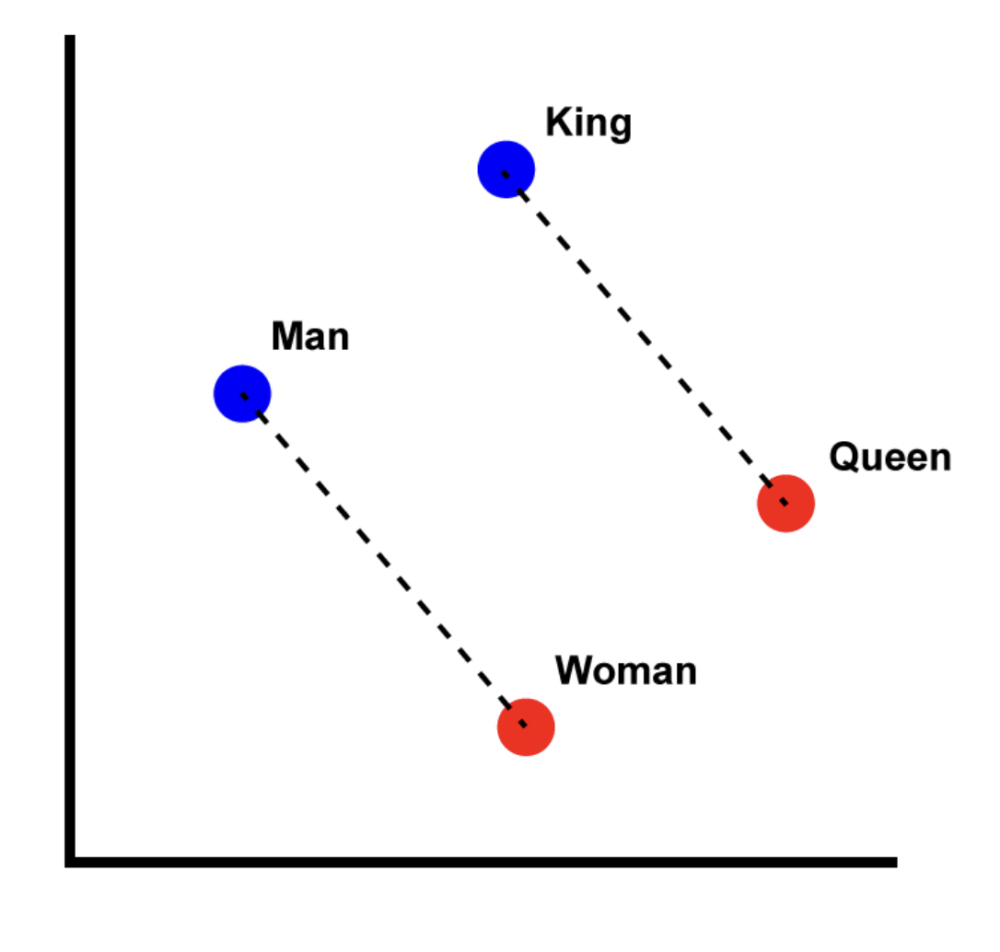
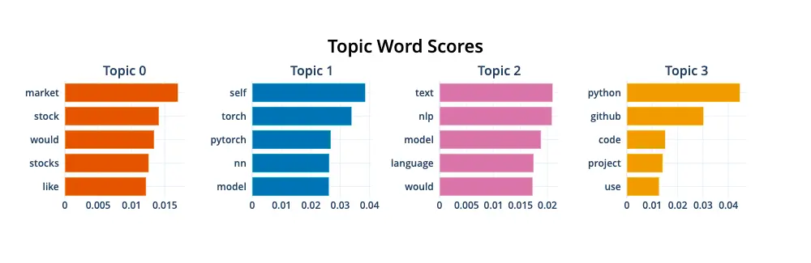

```{r setup, include=FALSE}
options(htmltools.dir.version = FALSE)
library(knitr)
opts_chunk$set(
  prompt = T,
  fig.align = "center",
  dpi = 300,
  cache = T,
  engine.opts = list(bash = "-l")
)

knit_hooks$set(
  prompt = function(before, options, envir) {
    options(
      prompt = if (options$engine %in% c("sh", "bash", "zsh")) "$ " else "R> ",
      continue = if (options$engine %in% c("sh", "bash", "zsh")) "$ " else "+ "
    )
  }
)

options(repos = c(CRAN = "https://cran.rstudio.com/"))

if (!require("fontawesome", character.only = TRUE)) {
  install.packages("fontawesome", dependencies = TRUE)
  library(fontawesome, character.only = TRUE)
}
```

# Análisis computacional de texto {background-color="#2d4563"}

## Agenda de la sesión

:::{style="margin-top: 20px; font-size: 28px;"}

:::{.columns}
:::{.column width=50%}
**Primera parte**

- El texto como datos
- Tokenización y preprocesamiento
- Bag-of-words
- TF-IDF
- Análisis de sentimiento
:::

:::{.column width=50%}
**Segunda parte**

- Topic Modeling (LDA)
- Introducción a embeddings
- Word2Vec y representaciones densas
- Aplicaciones en América Latina
- Limitaciones y próximos pasos
:::
:::
:::

# El texto como datos {background-color="#2d4563"}

## ¿Por qué analizar texto con computadoras?

:::{style="margin-top: 30px; font-size: 24px;"}
:::{.columns}
:::{.column width=55%}
- Las ciencias sociales producen y estudian [enormes cantidades de texto]{.alert}:
    - Discursos parlamentarios
    - Artículos periodísticos
    - Respuestas a encuestas abiertas
    - Publicaciones en redes sociales
    - Documentos legales y de política pública
- Un investigador puede leer cientos de textos. Una computadora puede analizar [millones]{.alert}
- El análisis computacional de texto permite:
    - [Medir]{.alert} temas y opiniones a gran escala
    - [Descubrir]{.alert} patrones invisibles a la lectura manual
    - [Comparar]{.alert} textos entre países, períodos o actores
:::

:::{.column width=45%}
:::{style="text-align: center; font-size: 20px;"}
**El desafío central**

Las computadoras trabajan con [números]{.alert}.

El texto son [palabras]{.alert}.

¿Cómo convertir palabras en números
de forma que preserve el significado?

```
"La democracia es
 importante para el
 desarrollo"

        ↓ ???

[0.23, 0.87, 0.12,
 0.45, 0.91, 0.33]
```

[Esta es la pregunta central]{.alert}
del análisis de texto.
:::
:::
:::
:::

## El pipeline de análisis de texto

:::{style="margin-top: 30px; font-size: 24px;"}

:::{style="text-align: center; font-size: 20px;"}
```
┌─────────┐   ┌──────────────┐   ┌────────────┐   ┌───────────┐   ┌──────────┐
│ 1. Texto │──▶│ 2. Preprocesar│──▶│ 3. Represen-│──▶│ 4. Analizar│──▶│ 5. Inter- │
│ crudo    │   │ (limpiar)    │   │ tar (números)│   │ (modelo)  │   │ pretar   │
└─────────┘   └──────────────┘   └────────────┘   └───────────┘   └──────────┘
```
:::

<br>

:::{.columns}
:::{.column width=50%}
- [Paso 1:]{.alert} Recoger el corpus (conjunto de textos)
- [Paso 2:]{.alert} Limpiar: quitar puntuación, convertir a minúsculas, eliminar palabras vacías (stopwords)
- [Paso 3:]{.alert} Representar el texto como números (bag-of-words, TF-IDF, embeddings)
:::

:::{.column width=50%}
- [Paso 4:]{.alert} Aplicar un modelo (sentimiento, tópicos, clasificación)
- [Paso 5:]{.alert} Interpretar los resultados en contexto
- Hoy nos enfocaremos en los pasos 2 a 4 con métodos [clásicos]{.alert} (no deep learning)
- Mañana veremos cómo los [LLMs]{.alert} cambian este panorama
:::
:::
:::

# Preprocesamiento {background-color="#2d4563"}

## Tokenización

:::{style="margin-top: 30px; font-size: 24px;"}
:::{.columns}
:::{.column width=55%}
- [Tokenización]{.alert}: dividir el texto en unidades más pequeñas (tokens)
- Los tokens pueden ser:
    - [Palabras]{.alert}: "la democracia es importante" → ["la", "democracia", "es", "importante"]
    - [N-gramas]{.alert}: secuencias de N palabras
        - Bigramas: ["la democracia", "democracia es", "es importante"]
    - [Subpalabras]{.alert}: para modelos de lenguaje (lo veremos mañana)
- La tokenización es el [primer paso]{.alert} de casi todo análisis de texto
- En R, usamos el paquete [tidytext]{.alert} con la función `unnest_tokens()`
- tidytext sigue la filosofía de tidyverse: [una fila por token]{.alert}
:::

:::{.column width=45%}
:::{style="text-align: center; font-size: 20px;"}
**Ejemplo con tidytext**

```r
library(tidytext)

tibble(texto = "La democracia es
  importante para el desarrollo") |>
  unnest_tokens(palabra, texto)

# Resultado:
#   palabra
#   <chr>
# 1 la
# 2 democracia
# 3 es
# 4 importante
# 5 para
# 6 el
# 7 desarrollo
```

Noten que tidytext automáticamente
convierte a [minúsculas]{.alert}.
:::
:::
:::
:::

## Stopwords y limpieza

:::{style="margin-top: 30px; font-size: 24px;"}
:::{.columns}
:::{.column width=55%}
- [Stopwords]{.alert} (palabras vacías): palabras muy frecuentes que aportan poco significado
    - En español: "el", "la", "de", "en", "que", "y", "a", "los"...
- Las eliminamos para centrarnos en las [palabras con contenido]{.alert}
- Otros pasos de limpieza:
    - Quitar [números]{.alert} y [puntuación]{.alert}
    - Convertir a [minúsculas]{.alert}
    - Opcionalmente, [stemming]{.alert}: reducir palabras a su raíz
        - "democracia", "democrático", "democracias" → "democra-"
    - O [lematización]{.alert}: reducir al lema (forma base)
        - "gobierna", "gobernó", "gobernar" → "gobernar"
:::

:::{.column width=45%}
:::{style="text-align: center; font-size: 20px;"}
**Antes y después**

```
Texto original:
"El gobierno anunció un nuevo
plan de estímulo fiscal para
reactivar la economía."

Después de limpiar:
["gobierno", "anunció", "nuevo",
 "plan", "estímulo", "fiscal",
 "reactivar", "economía"]

Palabras eliminadas:
"el", "un", "de", "para", "la"

Estas palabras son muy frecuentes
en todos los textos; no distinguen
un texto de otro.
```
:::
:::
:::
:::

# Representaciones numéricas del texto {background-color="#2d4563"}

## Bag-of-words

:::{style="margin-top: 30px; font-size: 24px;"}
:::{.columns}
:::{.column width=55%}
- [Bag-of-words]{.alert} (bolsa de palabras): representar un texto como un [vector de frecuencias]{.alert}
- Contar cuántas veces aparece cada palabra
- Ignora el [orden]{.alert} de las palabras (por eso se llama "bolsa")
- "El gato come pescado" y "El pescado come gato" tienen la misma representación
- Simple pero sorprendentemente [efectivo]{.alert} para muchos problemas
- Limitaciones:
    - No captura el [orden]{.alert}
    - No captura el [significado]{.alert}
    - Las palabras muy frecuentes dominan
:::

:::{.column width=45%}
:::{style="text-align: center; font-size: 18px;"}
**Ejemplo**

```
Doc 1: "la economía crece"
Doc 2: "la economía no crece"
Doc 3: "la salud mejora"

Matriz término-documento:

          crece  economía  la  mejora  no  salud
Doc 1:      1      1       1    0      0    0
Doc 2:      1      1       1    0      1    0
Doc 3:      0      0       1    1      0    1

Cada fila es un "vector" que
representa el documento.
Los documentos se comparan
por la similitud de sus vectores.
```
:::
:::
:::
:::

## TF-IDF

:::{style="margin-top: 30px; font-size: 22px;"}
:::{.columns}
:::{.column width=55%}
- [TF-IDF]{.alert}: Term Frequency - Inverse Document Frequency (el concepto de IDF viene de [Sparck Jones, 1972](https://doi.org/10.1108/eb026526))
- Problema con bag-of-words: las palabras [más frecuentes]{.alert} no siempre son las más [informativas]{.alert}
- TF-IDF pondera la frecuencia de una palabra por su [rareza en el corpus]{.alert}:

$$\text{TF-IDF}(t, d) = \text{TF}(t, d) \times \log\left(\frac{N}{\text{DF}(t)}\right)$$

- [TF]{.alert} (Term Frequency): frecuencia del término en el documento
- [IDF]{.alert} (Inverse Document Frequency): $\log(N / \text{documentos que contienen el término})$
- Una palabra que aparece mucho en [un documento]{.alert} pero poco en el [corpus]{.alert} tiene TF-IDF alto
- Resultado: identifica las [palabras distintivas]{.alert} de cada documento
:::

:::{.column width=45%}
:::{style="text-align: center; font-size: 20px;"}
**Intuición**

"gobierno" aparece en muchos textos
→ IDF bajo → poco distintiva

"deforestación" aparece solo en
textos de medio ambiente
→ IDF alto → muy distintiva

TF-IDF responde: [¿qué palabras
caracterizan ESTE documento
en particular?]{.alert}

<br>

En tidytext:
```r
datos_tfidf <- datos_tokens |>
  count(documento, palabra) |>
  bind_tf_idf(palabra, documento, n)
```
:::
:::
:::
:::

# Análisis de sentimiento {background-color="#2d4563"}

## ¿Qué es el análisis de sentimiento?

:::{style="margin-top: 30px; font-size: 24px;"}
:::{.columns}
:::{.column width=55%}
- [Análisis de sentimiento]{.alert}: determinar si un texto expresa una opinión positiva, negativa o neutra
- Método más simple: [diccionarios de sentimiento]{.alert}
    - Listas de palabras clasificadas como positivas o negativas
    - "crecimiento", "mejora", "éxito" → positivo
    - "crisis", "pobreza", "fracaso" → negativo
- Contar palabras positivas y negativas; comparar
- [Limitaciones importantes]{.alert}:
    - No captura negaciones: "no es bueno" → cuenta "bueno" como positivo
    - No captura ironía ni sarcasmo
    - Los diccionarios son [dependientes del dominio]{.alert}
- Aún así, [funciona razonablemente bien]{.alert} a gran escala
:::

:::{.column width=45%}
:::{style="text-align: center; font-size: 20px;"}
**Diccionarios disponibles en español**

- [NRC]{.alert}: 8 emociones + positivo/negativo (multilingüe)
- [AFINN]{.alert}: puntuación -5 a +5 (necesita traducción)
- Diccionarios académicos específicos para español

**Ejemplo**

```
"El crecimiento económico ha sido
 sólido gracias a las exportaciones"

Palabras positivas: crecimiento, sólido
Palabras negativas: (ninguna)

Sentimiento: POSITIVO (+2)
```

Para mayor precisión,
los [LLMs]{.alert} (Día 4) superan
ampliamente a los diccionarios.
:::
:::
:::
:::

# Topic Modeling {background-color="#2d4563"}

## LDA: Latent Dirichlet Allocation

:::{style="margin-top: 30px; font-size: 22px;"}
:::{.columns}
:::{.column width=55%}
- [LDA]{.alert} (Latent Dirichlet Allocation, [Blei, Ng y Jordan, 2003](https://www.jmlr.org/papers/v3/blei03a.html)): el método más usado para descubrir temas en un corpus
- Idea: cada documento es una [mezcla de temas]{.alert}, y cada tema es una [mezcla de palabras]{.alert}
- LDA descubre ambas mezclas simultáneamente
- Ejemplo:
    - Tema 1 (economía): "crecimiento", "inflación", "PIB", "empleo"
    - Tema 2 (salud): "hospital", "vacunación", "pandemia", "médicos"
    - Documento X: 70% tema 1 + 30% tema 2
- El usuario elige el [número de temas (K)]{.alert}
- LDA es un modelo [generativo]{.alert}: asume que los documentos fueron "generados" por este proceso de mezcla
:::

:::{.column width=45%}
:::{style="text-align: center; font-size: 18px;"}
**El proceso generativo de LDA**

```
Para cada documento:
  1. Elegir una mezcla de temas
     (ej: 70% economía, 30% salud)

  2. Para cada palabra:
     a. Elegir un tema según la mezcla
     b. Elegir una palabra del tema

Resultado:
  "El crecimiento [economía]
   del sector [economía]
   salud [salud]
   ha mejorado [economía]
   los hospitales [salud]
   públicos" [salud]

LDA hace el proceso INVERSO:
dado el texto, recupera los temas.
```
:::
:::
:::
:::

## Interpretar temas de LDA

:::{style="margin-top: 30px; font-size: 24px;"}
:::{.columns}
:::{.column width=50%}
**Lo que LDA nos da**

- Las [K palabras más probables]{.alert} de cada tema
- La [proporción de cada tema]{.alert} en cada documento
- Podemos [etiquetar]{.alert} los temas según las palabras más frecuentes

**Ejemplo de resultado**

| Tema | Palabras principales |
|------|---------------------|
| 1 | economía, crecimiento, empleo, inversión |
| 2 | educación, escuelas, docentes, estudiantes |
| 3 | violencia, seguridad, crimen, policía |

→ Etiquetamos: tema 1 = "economía", tema 2 = "educación", tema 3 = "seguridad"
:::

:::{.column width=50%}
**Limitaciones de LDA**

- Elegir K es [difícil]{.alert}: no hay un método definitivo
- Los temas pueden ser [incoherentes]{.alert} (mezclar conceptos)
- No captura [relaciones entre palabras]{.alert} (como lo hacen los embeddings)
- Los temas no tienen [nombre]{.alert}: los nombres los pone el investigador
- Es un [modelo probabilístico]{.alert}: resultados pueden variar entre ejecuciones
- Para textos cortos (tweets, respuestas breves), LDA funciona mal porque cada documento tiene muy pocas palabras para estimar distribuciones de tópicos
- Los [LLMs modernos]{.alert} pueden hacer este trabajo mucho mejor (Día 4)
:::
:::
:::

# Introducción a embeddings {background-color="#2d4563"}

## Limitaciones de bag-of-words y TF-IDF

:::{style="margin-top: 30px; font-size: 24px;"}
:::{.columns}
:::{.column width=55%}
- Bag-of-words y TF-IDF son [representaciones dispersas]{.alert} (sparse)
    - Cada palabra es una dimensión independiente
    - No capturan [significado]{.alert} ni [relaciones semánticas]{.alert}
    - "perro" y "can" son tan diferentes como "perro" y "democracia"
- Problemas:
    - [Sinónimos]{.alert}: palabras diferentes, significado igual
    - [Polisemia]{.alert}: misma palabra, significados diferentes
    - [Orden]{.alert}: "el gato come pescado" = "el pescado come gato"
- Solución: [representaciones densas]{.alert} que capturan significado
:::

:::{.column width=45%}
:::{style="text-align: center; font-size: 18px;"}
**Disperso vs. Denso**

```
Bag-of-words (disperso):
"perro" = [0,0,0,1,0,0,0,0,0,0...]
           (10,000 dimensiones,
            casi todas cero)

Embedding (denso):
"perro" = [0.23, -0.45, 0.12, ...]
           (300 dimensiones,
            todas con valores)

Los embeddings codifican
SIGNIFICADO en cada dimensión.
```
:::
:::
:::
:::

## ¿Qué son los embeddings?

:::{style="margin-top: 30px; font-size: 24px;"}
:::{.columns}
:::{.column width=55%}
- Un [embedding]{.alert} es un vector denso que representa una palabra (o texto)
- Las palabras con [significados similares]{.alert} tienen vectores [cercanos]{.alert}
- La idea central: "una palabra se conoce por la compañía que frecuenta" (Firth, 1957)
- Si dos palabras aparecen en [contextos similares]{.alert}, tienen significados similares
    - "El ___ ladra fuerte" → perro, can, cachorro
    - Estos deberían tener embeddings cercanos
- Métodos clásicos: [Word2Vec]{.alert} (Google, 2013), GloVe (Stanford, 2014)
- Métodos modernos: [BERT]{.alert}, GPT (veremos mañana)
:::

:::{.column width=45%}
:::{style="text-align: center;"}
[{width="100%"}](#){data-modal-type="image" data-modal-url="figures/embeddings-3d.png"}

Las palabras similares se agrupan en el espacio de embeddings.
:::
:::
:::
:::

## Word2Vec: la idea

:::{style="margin-top: 30px; font-size: 22px;"}
:::{.columns}
:::{.column width=55%}
- [Word2Vec]{.alert} ([Mikolov et al., 2013](https://arxiv.org/abs/1301.3781)): entrenar una red neuronal para predecir palabras a partir de su contexto
- Dos arquitecturas:
    - [CBOW]{.alert} (Continuous Bag of Words): predecir la palabra central dado el contexto
    - [Skip-gram]{.alert}: predecir el contexto dada la palabra central
- El "subproducto" del entrenamiento son los [embeddings]{.alert}
- Propiedades emergentes:
    - Aritmética de vectores: [rey - hombre + mujer ≈ reina]{.alert}
    - Analogías: París:Francia :: Madrid:España
:::

:::{.column width=45%}
:::{style="text-align: center;"}
[{width="100%"}](#){data-modal-type="image" data-modal-url="figures/king-queen-vectors.png"}

Los embeddings capturan relaciones semánticas como operaciones vectoriales.
:::
:::
:::
:::

## Embeddings preentrenados

:::{style="margin-top: 30px; font-size: 24px;"}
:::{.columns}
:::{.column width=55%}
- Entrenar embeddings requiere [muchísimos datos]{.alert} (miles de millones de palabras)
- En la práctica, usamos [embeddings preentrenados]{.alert}:
    - Word2Vec en Google News (inglés)
    - [fastText]{.alert} (Facebook): disponible para español
    - GloVe (Stanford)
- Para español:
    - [Spanish Billion Words Corpus]{.alert}
    - [fastText embeddings para español]{.alert}
- Cómo usarlos: cargar los embeddings y buscar el vector de cada palabra
:::

:::{.column width=45%}
:::{style="text-align: center; font-size: 18px;"}
**Usando embeddings en R:**

```r
# Con text2vec
library(text2vec)

# Cargar embeddings preentrenados
embeddings <- readRDS("embeddings_es.rds")

# Obtener vector de una palabra
vec_democracia <- embeddings["democracia", ]

# Encontrar palabras similares
sim <- sim2(
  embeddings,
  matrix(vec_democracia, nrow = 1)
)
head(sort(sim[,1], decreasing = TRUE))
```
:::
:::
:::
:::

## Embeddings de documentos

:::{style="margin-top: 30px; font-size: 24px;"}
:::{.columns}
:::{.column width=55%}
- Los embeddings de palabras representan [palabras individuales]{.alert}
- Pero muchas veces queremos representar [documentos completos]{.alert}
- Enfoques simples:
    - [Promedio]{.alert} de los embeddings de las palabras del documento
    - [Promedio ponderado por TF-IDF]{.alert}
- Enfoques más sofisticados:
    - [Doc2Vec]{.alert}: extensión de Word2Vec para documentos
    - [Sentence-BERT]{.alert}: embeddings de oraciones con transformers
- Los embeddings de documentos permiten [medir similaridad]{.alert} entre textos
:::

:::{.column width=45%}
:::{style="text-align: center;"}
[{width="100%"}](#){data-modal-type="image" data-modal-url="figures/semantic-search.webp"}

Con embeddings, podemos buscar textos por [significado]{.alert}, no solo por palabras exactas.
:::
:::
:::
:::

# Aplicaciones en América Latina {background-color="#2d4563"}

## Análisis de discursos políticos

:::{style="margin-top: 30px; font-size: 22px;"}
:::{.columns}
:::{.column width=55%}
**Ejemplos de investigación:**

- [Análisis de discursos presidenciales]{.alert}
    - ¿Cómo cambia el tono según el contexto económico?
    - ¿Qué temas dominan en cada país?
- [Comparación de programas partidarios]{.alert}
    - Posicionamiento ideológico automático
    - Evolución de agendas a lo largo del tiempo
- [Debates parlamentarios]{.alert}
    - Polarización del lenguaje
    - Redes de co-aparición de temas
:::

:::{.column width=45%}
:::{style="text-align: center; font-size: 18px;"}
**Datos disponibles:**

- [ParlSpeech]{.alert}: discursos parlamentarios de varios países
- [Manifesto Project]{.alert}: programas de partidos codificados
- [Latin American Presidential Speeches]{.alert}: colecciones académicas
- [Repositorios gubernamentales]{.alert}: actas, leyes, decretos

<br>

[El desafío principal es el acceso a datos estructurados y digitalizados.]{.alert}
:::
:::
:::
:::

## Análisis de redes sociales

:::{style="margin-top: 30px; font-size: 22px;"}
:::{.columns}
:::{.column width=55%}
**Aplicaciones:**

- [Detección de desinformación]{.alert}
    - Identificar narrativas falsas
    - Mapear redes de difusión
- [Sentimiento hacia políticas públicas]{.alert}
    - Reacciones a anuncios gubernamentales
    - Evolución de la opinión pública
- [Movilización social]{.alert}
    - Identificar hashtags emergentes
    - Predecir protestas
:::

:::{.column width=45%}
:::{style="text-align: center; font-size: 18px;"}
**Consideraciones:**

- [Sesgos de representatividad]{.alert}: los usuarios de redes no son la población general
- [Bots y cuentas falsas]{.alert}: distorsionan el análisis
- [Cambios en APIs]{.alert}: X (Twitter) restringió acceso
- [Ética]{.alert}: privacidad, consentimiento

<br>

[Los LLMs (Día 4) están transformando este campo: pueden clasificar, resumir y extraer información mucho mejor que los métodos clásicos.]{.alert}
:::
:::
:::
:::

## Análisis de medios de comunicación

:::{style="margin-top: 30px; font-size: 22px;"}
:::{.columns}
:::{.column width=55%}
**Aplicaciones:**

- [Agenda setting]{.alert}: ¿qué temas cubren los medios?
- [Framing]{.alert}: ¿cómo se presenta cada tema?
- [Sesgo mediático]{.alert}: diferencias entre medios
- [Cobertura electoral]{.alert}: equidad y tono

**Métodos:**

- [TF-IDF]{.alert} para identificar temas distintivos
- [LDA]{.alert} para descubrir frames
- [Sentimiento]{.alert} para medir tono
- [Embeddings]{.alert} para similaridad temática
:::

:::{.column width=45%}
:::{style="text-align: center; font-size: 18px;"}
**Proyectos relevantes:**

- [GDELT Project]{.alert}: noticias globales en tiempo real
- [Media Cloud]{.alert}: análisis de ecosistemas mediáticos
- [Observatorios de medios]{.alert}: en varios países latinoamericanos

<br>

**Ejemplo de pregunta:**

¿La cobertura de la economía
en medios argentinos es más
negativa que en medios uruguayos?

→ TF-IDF + sentimiento + comparación
:::
:::
:::
:::

## Análisis de respuestas abiertas

:::{style="margin-top: 30px; font-size: 22px;"}
:::{.columns}
:::{.column width=55%}
**El problema:**

- Las encuestas incluyen preguntas abiertas
- "¿Cuál es el principal problema del país?"
- Codificar manualmente miles de respuestas es [costoso]{.alert}

**Solución con NLP:**

1. [Tokenizar y limpiar]{.alert} las respuestas
2. [TF-IDF]{.alert} para identificar categorías
3. [Clustering]{.alert} para agrupar respuestas similares
4. [LDA]{.alert} para descubrir temas
5. O mejor: [usar un LLM]{.alert} para clasificar automáticamente
:::

:::{.column width=45%}
:::{style="text-align: center; font-size: 18px;"}
**Ejemplo:**

```
Respuestas abiertas:
"La economía está muy mal"
"No hay trabajo"
"La inflación nos mata"
"Mucha inseguridad"
"Los políticos son corruptos"

Clustering identifica:
- Cluster 1: Economía (3)
- Cluster 2: Seguridad (1)
- Cluster 3: Política (1)

Mucho más rápido que
codificación manual.
```
:::
:::
:::
:::

## Limitaciones de los métodos clásicos

:::{style="margin-top: 30px; font-size: 24px;"}
:::{.columns}
:::{.column width=50%}
**Bag-of-words / TF-IDF:**

- No capturan [orden]{.alert} de palabras
- No capturan [significado]{.alert}
- Dependen de [stopwords]{.alert} predefinidas
- Sensibles a [errores ortográficos]{.alert}
:::

:::{.column width=50%}
**LDA:**

- Elegir K es [arbitrario]{.alert}
- Temas pueden ser [incoherentes]{.alert}
- Malo para [textos cortos]{.alert}
- No captura [relaciones]{.alert} entre temas
:::
:::

<br>

:::{style="text-align: center; font-size: 22px;"}
[Los LLMs (transformers) superan estas limitaciones.]{.alert}

Mañana veremos cómo BERT, GPT y otros modelos revolucionan el análisis de texto.
:::
:::

## Resumen de la sesión

:::{style="margin-top: 30px; font-size: 22px;"}
:::{.columns}
:::{.column width=50%}
**Métodos clásicos:**

- [Tokenización]{.alert}: dividir texto en palabras
- [Stopwords]{.alert}: eliminar palabras vacías
- [Bag-of-words]{.alert}: contar frecuencias
- [TF-IDF]{.alert}: ponderar por rareza
- [LDA]{.alert}: descubrir temas latentes
:::

:::{.column width=50%}
**Representaciones:**

- [Dispersas]{.alert}: un vector enorme con casi todos ceros
- [Densas (embeddings)]{.alert}: vectores compactos que capturan significado
- [Word2Vec]{.alert}: embeddings de palabras
- [Doc2Vec]{.alert}: embeddings de documentos
:::
:::

<br>

[Estos métodos son el fundamento. Los LLMs los mejoran en casi todo, pero entender los conceptos básicos es clave.]{.alert}
:::

## Próximos pasos

:::{style="margin-top: 40px; font-size: 26px;"}

- [Laboratorios (3.3 y 3.4):]{.alert}
    - Clustering y PCA con datos de países latinoamericanos
    - Análisis de textos políticos con TF-IDF y LDA

- [Mañana (Día 4):]{.alert} LLMs y aplicaciones avanzadas
    - ¿Qué son los transformers?
    - BERT, GPT y modelos de lenguaje
    - Cómo usar LLMs para investigación
    - APIs y aplicaciones prácticas

[Nos vemos en el laboratorio.]{.alert}
:::

# Nos vemos en el laboratorio {background-color="#2d4563"}
