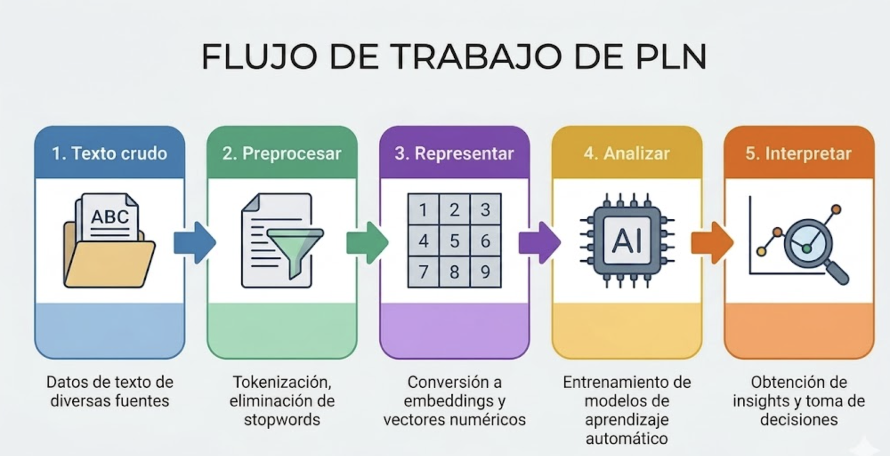

```{r setup, include=FALSE}
options(htmltools.dir.version = FALSE)
library(knitr)
opts_chunk$set(
  prompt = T,
  fig.align = "center",
  dpi = 300,
  cache = T,
  engine.opts = list(bash = "-l")
)

knit_hooks$set(
  prompt = function(before, options, envir) {
    options(
      prompt = if (options$engine %in% c("sh", "bash", "zsh")) "$ " else "R> ",
      continue = if (options$engine %in% c("sh", "bash", "zsh")) "$ " else "+ "
    )
  }
)

options(repos = c(CRAN = "https://cran.rstudio.com/"))

if (!require("fontawesome", character.only = TRUE)) {
  install.packages("fontawesome", dependencies = TRUE)
  library(fontawesome, character.only = TRUE)
}

suppressPackageStartupMessages({
  library(tidytext)
  library(dplyr)
  library(tidyr)
  library(stringr)
  library(tibble)
  library(tm)
  library(topicmodels)
  library(ggplot2)
  library(readr)
})
```

# Texto como datos {background-color="#2d4563"}

## Agenda de la sesión

:::{style="margin-top: 20px; font-size: 28px;"}

:::{.columns}
:::{.column width=50%}
**Primera parte**

- El texto como datos
- Tokenización y preprocesamiento
- Bag-of-words
- TF-IDF
- Análisis de sentimiento
:::

:::{.column width=50%}
**Segunda parte**

- Topic Modeling (LDA)
- Introducción a embeddings
- Word2Vec y representaciones densas
- Aplicaciones en América Latina
- Limitaciones y próximos pasos
:::
:::
:::

# El texto como datos {background-color="#2d4563"}

## ¿Por qué analizar texto con computadoras?

:::{style="margin-top: 30px; font-size: 24px;"}
:::{.columns}
:::{.column width=55%}
- Las ciencias sociales producen y estudian [enormes cantidades de texto]{.alert}:
    - Discursos parlamentarios
    - Artículos periodísticos
    - Respuestas a encuestas abiertas
    - Publicaciones en redes sociales
    - Documentos legales y de política pública
- Un investigador puede leer cientos de textos. Una computadora puede analizar [millones]{.alert}
- El análisis computacional de texto permite:
    - [Medir]{.alert} temas y opiniones a gran escala
    - [Descubrir]{.alert} patrones invisibles a la lectura manual
    - [Comparar]{.alert} textos entre países, períodos o actores
:::

:::{.column width=45%}
**El desafío central**

Las computadoras trabajan con [números]{.alert}, pero el texto son [palabras]{.alert}

¿Cómo convertirlas en números preservando el significado?

:::{style="text-align: center; font-size: 24px;"}
```
"La democracia es
 importante para el
 desarrollo"

        ↓ ???

[0.23, 0.87, 0.12,
 0.45, 0.91, 0.33]
```
:::

[Esta es la pregunta central del análisis de texto]{.alert}
:::
:::
:::

## El pipeline de análisis de texto

:::{style="margin-top: 30px; font-size: 21px;"}

:::{style="text-align: center; font-size: 20px;"}
[{width="50%"}](#){data-modal-type="image" data-modal-url="figures/pipeline-texto.png"}
:::

:::{.columns}
:::{.column width=50%}
- [Paso 1:]{.alert} Recoger el corpus (conjunto de textos)
- [Paso 2:]{.alert} Limpiar: quitar puntuación, convertir a minúsculas, eliminar palabras vacías (stopwords)
- [Paso 3:]{.alert} Representar el texto como números (bag-of-words, TF-IDF, embeddings)
:::

:::{.column width=50%}
- [Paso 4:]{.alert} Aplicar un modelo (sentimiento, tópicos, clasificación)
- [Paso 5:]{.alert} Interpretar los resultados en contexto
- Hoy nos enfocaremos en los pasos 2 a 4 con métodos [clásicos]{.alert} (no deep learning)
- Mañana veremos cómo los [LLMs]{.alert} cambian este panorama
:::
:::
:::

# Preprocesamiento {background-color="#2d4563"}

## Cargar paquetes

:::{style="margin-top: 30px; font-size: 24px;"}

- Para análisis de texto en R, hay varios paquetes útiles. Aquí usaremos principalmente:

```r
library(tidytext)       # tokenización y TF-IDF
library(dplyr)          # manipulación de datos
library(tidyr)          # pivotar datos
library(stringr)        # manejo de texto
library(tibble)         # data frames modernos
library(tm)             # stopwords y preprocesamiento básico
library(topicmodels)    # LDA para topic modeling
library(ggplot2)        # visualización
library(readr)          # lectura de datos
```
:::

## Nuestro corpus de trabajo

:::{style="margin-top: 30px; font-size: 22px;"}
:::{.columns}
:::{.column width=50%}
**Un corpus simulado de textos políticos**

- [60 textos cortos]{.alert} en español sobre política pública
- [5 temas]{.alert} (12 textos cada uno):
    - economía, educación, medio ambiente, salud, seguridad
- [Varios países]{.alert} de América Latina, entre 2018 y 2024
- Los textos son [simulados]{.alert}: no provienen de discursos reales, pero imitan el vocabulario típico de cada tema
- Usaremos el mismo corpus en todos los ejemplos de hoy: tokenización, TF-IDF, sentimiento, LDA y embeddings
:::

:::{.column width=50%}
:::{style="font-size: 18px;"}
**Cargar y explorar el corpus**

```{r corpus-demo, echo=TRUE, eval=TRUE}
# Cargar el corpus simulado (60 textos x 5 temas)
corpus <- read_csv("datos/textos_politicos.csv")

# Estructura del corpus
head(corpus)

# Distribución por tema
corpus |> count(tema)

# Primer texto del corpus
corpus$texto[1]
```
:::
:::
:::
:::

## Tokenización

:::{style="margin-top: 30px; font-size: 24px;"}
:::{.columns}
:::{.column width=55%}
- [Tokenización]{.alert}: dividir el texto en unidades más pequeñas (tokens)
- Los tokens pueden ser:
    - [Palabras]{.alert}: "la democracia es importante" → ["la", "democracia", "es", "importante"]
    - [N-gramas]{.alert}: secuencias de N palabras
        - Bigramas: ["la democracia", "democracia es", "es importante"]
    - [Subpalabras]{.alert}: para modelos de lenguaje (lo veremos mañana)
- La tokenización es el [primer paso]{.alert} de casi todo análisis de texto
- En R, usamos el paquete [tidytext](https://juliasilge.github.io/tidytext/) con la función `unnest_tokens()`
- tidytext sigue la filosofía de tidyverse: [una fila por token]{.alert}
:::

:::{.column width=45%}
:::{style="font-size: 22px;"}
**Tokenización de nuestro corpus**

```{r tok-demo, echo=TRUE, eval=TRUE}
# Tokenizar los 60 textos del corpus
tokens <- corpus |>
  select(id, tema, texto) |>
  unnest_tokens(palabra, texto)

head(tokens, 8)
```

tidytext convierte a [minúsculas]{.alert}
y genera [una fila por token]{.alert}
:::
:::
:::
:::

## Stopwords y limpieza

:::{style="margin-top: 30px; font-size: 23px;"}
:::{.columns}
:::{.column width=55%}
- [Stopwords]{.alert} (palabras vacías): palabras muy frecuentes que aportan poco significado
    - En español: "el", "la", "de", "en", "que", "y", "a", "los"...
- Las eliminamos para centrarnos en las [palabras con contenido]{.alert}
- Otros pasos de limpieza:
    - Quitar [números]{.alert} y [puntuación]{.alert}; convertir a [minúsculas]{.alert}
    - [Stemming]{.alert}: reducir a la raíz ("democracia/democrático" → "democra-")
    - [Lematización]{.alert}: reducir al lema ("gobierna/gobernó" → "gobernar")
:::

:::{.column width=45%}
:::{style="font-size: 17px;"}
```{r stop-demo, echo=TRUE, eval=TRUE}
# Stopwords en español (paquete tm) ampliadas con algunos
# verbos y palabras muy frecuentes en nuestro corpus
extra_stop <- c("sigue", "siendo", "sido", "ser", "hacer",
  "ha", "han", "hay", "más", "país", "países", "región",
  "regiones", "gobierno", "toda", "todos", "todas")
stop_es <- tibble(
  palabra = unique(c(tm::stopwords("spanish"), extra_stop))
)

# Eliminar números y stopwords
# !str_detect(palabra, "^[0-9]+$") filtra tokens 
# que son solo números
# anti_join() elimina las stopwords
tokens_limpios <- tokens |>
  filter(!str_detect(palabra, "^[0-9]+$")) |>
  anti_join(stop_es, by = "palabra")

tibble(
  etapa = c("con stopwords", "sin stopwords"),
  tokens = c(nrow(tokens), nrow(tokens_limpios))
)
```

Eliminar stopwords reduce el corpus
en un [`r round(100*(1 - nrow(tokens_limpios)/nrow(tokens)))`%]{.alert}
y deja solo palabras con contenido
:::
:::
:::
:::

# Representaciones numéricas del texto {background-color="#2d4563"}

## Bag-of-words

:::{style="margin-top: 30px; font-size: 24px;"}
:::{.columns}
:::{.column width=55%}
- [Bag-of-words]{.alert} (bolsa de palabras): representar un texto como un [vector de frecuencias]{.alert}
- Contar cuántas veces aparece cada palabra
- Ignora el [orden]{.alert} de las palabras (por eso se llama "bolsa")
- "El gato come pescado" y "El pescado come gato" tienen la misma representación
- Simple pero sorprendentemente [efectivo]{.alert} para muchos problemas
- Limitaciones: no captura [orden]{.alert} ni [significado]{.alert}, y las palabras frecuentes dominan
:::

:::{.column width=45%}
:::{style="font-size: 17px; margin-top: 20px;"}
```{r bow-demo, echo=TRUE, eval=TRUE}
# Vocabulario de muestra (palabras representativas)
terminos <- c("económico", "educación", "violencia",
              "salud", "pandemia", "estudiantes")

# Matriz término-documento: pivot_wider transforma
# (id, palabra, n) en una columna por palabra.
# values_fill = 0 pone cero donde la palabra no aparece.
bow <- tokens_limpios |>
  filter(id %in% c(1, 13, 25),
         palabra %in% terminos) |>
  count(id, palabra) |>
  pivot_wider(names_from = palabra,
              values_from = n,
              values_fill = 0)
bow
```

Docs 1 (economía, México), 13
(educación, Paraguay) y 25
(seguridad, Panamá)

Cada fila es el [vector]{.alert} que representa al documento
:::
:::
:::
:::

## TF-IDF

:::{style="margin-top: 30px; font-size: 21px;"}
:::{.columns}
:::{.column width=55%}
- [TF-IDF]{.alert}: Term Frequency - Inverse Document Frequency (el concepto de IDF viene de [Sparck Jones, 1972](https://doi.org/10.1108/eb026526))
- Problema con bag-of-words: las palabras [más frecuentes]{.alert} no siempre son las más [informativas]{.alert}
- TF-IDF pondera la frecuencia de una palabra por su [rareza en el corpus]{.alert}:

$$\text{TF-IDF}(t, d) = \text{TF}(t, d) \times \log\left(\frac{N}{\text{DF}(t)}\right)$$

- [TF]{.alert} (Term Frequency): frecuencia del término en el documento
- [IDF]{.alert} (Inverse Document Frequency): $\log(N / \text{documentos que contienen el término})$
- Una palabra que aparece mucho en [un documento]{.alert} pero poco en el [corpus]{.alert} tiene TF-IDF alto
- Resultado: identifica las [palabras distintivas]{.alert} de cada documento
:::

:::{.column width=45%}
:::{style="font-size: 17px;"}
**Palabras más distintivas por tema (TF-IDF real)**

```{r tfidf-demo, echo=TRUE, eval=TRUE}
# Calcular TF-IDF de cada palabra en cada tema
palabras_puntuadas <- tokens_limpios |>
  count(tema, palabra) |>
  bind_tf_idf(palabra, tema, n)

# Top 3 palabras distintivas por tema
palabras_puntuadas |>
  group_by(tema) |>
  slice_max(tf_idf, n = 3) |>
  select(tema, palabra, tf_idf) |>
  mutate(tf_idf = round(tf_idf, 3))
```

TF-IDF identifica las [palabras
características]{.alert} de cada tema: _económico, educación, biodiversidad_, etc
:::
:::
:::
:::

# Análisis de sentimiento {background-color="#2d4563"}

## ¿Qué es el análisis de sentimiento?

:::{style="margin-top: 30px; font-size: 24px;"}
:::{.columns}
:::{.column width=55%}
- [Análisis de sentimiento]{.alert}: clasificar un texto como positivo, negativo o neutro
- Método más simple: [diccionarios]{.alert} con listas de palabras valoradas
    - "crecimiento", "mejora" → positivo; "crisis", "pobreza" → negativo
- Se cuentan palabras positivas y negativas y se comparan
- [Limitaciones]{.alert}: no captura [negaciones]{.alert} ("no es bueno" cuenta como positivo) ni ironía; los diccionarios son [dependientes del dominio]{.alert}
- Aún así, [funciona razonablemente bien]{.alert} a gran escala
:::

:::{.column width=45%}
:::{style="font-size: 17px;"}
**Sentimiento por tema en el corpus**

```{r sent-demo, echo=TRUE, eval=TRUE}
# Diccionario mínimo en español
pos <- c("crecimiento", "sólido", "mejora",
  "mejorado", "oportunidad", "beneficiará",
  "innovadores", "fortalecido", "efectivos",
  "estabilizar", "reducir", "renovables")
neg <- c("inflación", "problema", "vulnerables",
  "desempleo", "deuda", "riesgo", "crisis",
  "violencia", "amenaza", "deficiencias",
  "grave", "graves", "pobreza", "crimen",
  "narcotráfico", "inseguridad", "deforestación",
  "contaminación", "informalidad")

sentimiento <- tokens_limpios |>
  mutate(valencia = case_when(
    palabra %in% pos ~  1L, # L para entero (integer)
    palabra %in% neg ~ -1L,
    TRUE ~ 0L
  )) |>
  group_by(id, tema) |>
  summarise(puntaje = sum(valencia),
            .groups = "drop") # desagrupar

sentimiento |>
  group_by(tema) |>
  summarise(promedio = round(mean(puntaje), 2),
            n = n())
```

[Seguridad]{.alert} y [salud]{.alert} son los temas más negativos; [educación]{.alert}, el más positivo
:::
:::
:::
:::

# Topic Modeling {background-color="#2d4563"}

## LDA: Latent Dirichlet Allocation

:::{style="margin-top: 30px; font-size: 22px;"}
:::{.columns}
:::{.column width=55%}
- [LDA]{.alert} (Latent Dirichlet Allocation, [Blei, Ng y Jordan, 2003](https://www.jmlr.org/papers/v3/blei03a.html)): el método más usado para descubrir temas en un corpus
- Idea: cada documento es una [mezcla de temas]{.alert}, y cada tema es una [mezcla de palabras]{.alert}
- LDA descubre ambas mezclas simultáneamente
- Ejemplo:
    - Tema 1 (economía): "crecimiento", "inflación", "PIB", "empleo"
    - Tema 2 (salud): "hospital", "vacunación", "pandemia", "médicos"
    - Documento X: 70% tema 1 + 30% tema 2
- El usuario elige el [número de temas (K)]{.alert}
- LDA es un modelo [generativo]{.alert}: asume que los documentos fueron "generados" por este proceso de mezcla
:::

:::{.column width=45%}
:::{style="font-size: 20px;"}
**Ajustar LDA con K=5 en nuestro corpus**

```{r lda-fit, echo=TRUE, eval=TRUE}
# Construir matriz documento-término
dtm <- tokens_limpios |>
  count(id, palabra) |>
  cast_dtm(id, palabra, n)

# Ajustar LDA con 5 tópicos
set.seed(123)
modelo_lda <- LDA(
  dtm,
  k = 5,
  control = list(seed = 123)
)

modelo_lda
```

El modelo fue ajustado sobre [`r nrow(corpus)` documentos]{.alert} y [`r ncol(dtm)` términos únicos]{.alert}. Veremos las palabras más probables de cada tópico en la próxima diapositiva
:::
:::
:::
:::

## Interpretar temas de LDA

:::{style="margin-top: 30px; font-size: 24px;"}
:::{.columns}
:::{.column width=50%}
**Lo que LDA nos da**

- Las [K palabras más probables]{.alert} de cada tema
- La [proporción de cada tema]{.alert} en cada documento
- Podemos [etiquetar]{.alert} los temas según las palabras más frecuentes

:::{style="font-size: 18px;"}
**Palabras principales de cada tópico (LDA real)**

```{r lda-words, echo=TRUE, eval=TRUE}
tidy(modelo_lda, matrix = "beta") |>
  group_by(topic) |>
  slice_max(beta, n = 5, with_ties = FALSE) |>
  summarise(palabras = paste(term, collapse = ", "))
```
:::

→ Interpretación tentativa: tópico 2 ≈ *educación*, tópico 3 ≈ *salud y políticas sociales*, tópico 5 ≈ *economía e inversión*. Los tópicos 1 y 4 son [ambiguos]{.alert}: LDA no siempre separa bien los temas en corpora pequeños
:::

:::{.column width=50%}
**Limitaciones de LDA**

- Elegir K es [difícil]{.alert} y los temas pueden resultar [incoherentes]{.alert}
- No captura [relaciones entre palabras]{.alert} (eso lo hacen los embeddings)
- Los temas [no tienen nombre]{.alert}: los pone el investigador
- Funciona mal en [textos cortos]{.alert} (tweets, respuestas breves)
- Los [LLMs modernos]{.alert} lo hacen mucho mejor (Día 4)
:::
:::
:::

# Introducción a embeddings {background-color="#2d4563"}

## Limitaciones de bag-of-words y TF-IDF

:::{style="margin-top: 30px; font-size: 23px;"}
:::{.columns}
:::{.column width=55%}
- Bag-of-words y TF-IDF son [representaciones dispersas]{.alert} (sparse)
    - Cada palabra es una dimensión independiente
    - No capturan [significado]{.alert} ni [relaciones semánticas]{.alert}
    - "perro" y "can" son tan diferentes como "perro" y "democracia"
- Problemas:
    - [Sinónimos]{.alert}: palabras diferentes, significado igual
    - [Polisemia]{.alert}: misma palabra, significados diferentes
    - [Orden]{.alert}: "el gato come pescado" = "el pescado come gato"
- Solución: [representaciones densas]{.alert} que capturan significado
:::

:::{.column width=45%}
:::{style="text-align: center; font-size: 24px;"}
**Disperso vs. Denso**

```
Bag-of-words (disperso):
"perro" = [0,0,0,1,0,0,0,0,0,0...]
           (10,000 dimensiones,
            casi todas cero)

Embedding (denso):
"perro" = [0.23, -0.45, 0.12, ...]
           (300 dimensiones,
            todas con valores)

Los embeddings codifican
SIGNIFICADO en cada dimensión.
```
:::
:::
:::
:::

## ¿Qué son los embeddings?

:::{style="margin-top: 30px; font-size: 24px;"}
:::{.columns}
:::{.column width=55%}
- Un [embedding]{.alert} es un vector denso que representa una palabra (o texto)
- Las palabras con [significados similares]{.alert} tienen vectores [cercanos]{.alert}
- La idea central: "una palabra se conoce por la compañía que frecuenta" (Firth, 1957)
- Si dos palabras aparecen en [contextos similares]{.alert}, tienen significados similares
    - "El ___ ladra fuerte" → perro, can, cachorro
    - Estos deberían tener embeddings cercanos
- Métodos clásicos: [Word2Vec]{.alert} (Google, 2013), GloVe (Stanford, 2014)
- Métodos modernos: [BERT]{.alert}, GPT (veremos mañana)
:::

:::{.column width=45%}
:::{style="text-align: center;"}
[{width="100%"}](#){data-modal-type="image" data-modal-url="figures/embeddings-3d.png"}

Las palabras similares se agrupan en el espacio de embeddings

<https://projector.tensorflow.org/>
:::
:::
:::
:::

## Word2Vec: la idea

:::{style="margin-top: 30px; font-size: 22px;"}
:::{.columns}
:::{.column width=55%}
- [Word2Vec]{.alert} ([Mikolov et al., 2013](https://arxiv.org/abs/1301.3781)): entrenar una red neuronal para predecir palabras a partir de su contexto
- Dos arquitecturas:
    - [CBOW]{.alert} (Continuous Bag of Words): predecir la palabra central dado el contexto
    - [Skip-gram]{.alert}: predecir el contexto dada la palabra central
- El "subproducto" del entrenamiento son los [embeddings]{.alert}
- Propiedades emergentes:
    - Aritmética de vectores: [rey - hombre + mujer ≈ reina]{.alert}
    - Analogías: París:Francia :: Madrid:España
:::

:::{.column width=45%}
:::{style="text-align: center;"}
[{width="100%"}](#){data-modal-type="image" data-modal-url="figures/king-queen-vectors.png"}

Los embeddings capturan relaciones semánticas como operaciones vectoriales
:::
:::
:::
:::

## Embeddings preentrenados

:::{style="margin-top: 30px; font-size: 23px;"}
:::{.columns}
:::{.column width=50%}
- Entrenar embeddings requiere [muchísimos datos]{.alert} (miles de millones de palabras)
- En la práctica, usamos [embeddings preentrenados]{.alert}:
    - [Word2Vec](https://code.google.com/archive/p/word2vec/) en Google News (inglés)
    - [fastText](https://fasttext.cc/) (Facebook): disponible para español
    - [GloVe](https://nlp.stanford.edu/projects/glove/) (Stanford)
- Para español:
    - [Spanish Billion Words Corpus](https://crscardellino.ar/SBWCE/)
    - [fastText embeddings para español](https://fasttext.cc/docs/en/crawl-vectors.html)
- Cómo usarlos: cargar los embeddings y buscar el vector de cada palabra
:::

:::{.column width=50%}
:::{style="font-size: 17px;"}
**Mini-embeddings por LSA sobre nuestro corpus**

```{r lsa-demo, echo=TRUE, eval=TRUE}
# Matriz palabra x documento con TF-IDF
matriz <- tokens_limpios |>
  count(id, palabra) |>
  bind_tf_idf(palabra, id, n) |>
  cast_sparse(palabra, id, tf_idf) |>
  as.matrix()

# SVD: cada palabra en 10 dimensiones (nu = 10) 
# y cada documento en 10 dimensiones (nv = 10)
# $u = embeddings de palabras; $v = los de documentos
reduccion <- svd(matriz, nu = 10, nv = 10)
embeddings <- reduccion$u
rownames(embeddings) <- rownames(matriz)

# Similitud coseno entre dos vectores
coseno <- function(a, b) {
  sum(a * b) /
    (sqrt(sum(a^2)) * sqrt(sum(b^2)))
}

# Vecinos más cercanos de "salud"
objetivo <- embeddings["salud", ]
sims <- apply(embeddings, 1,
              coseno, b = objetivo)
head(sort(sims, decreasing = TRUE), 6)
```
:::
:::
:::
:::

## Embeddings de documentos

:::{style="margin-top: 30px; font-size: 24px;"}
:::{.columns}
:::{.column width=50%}
- Los embeddings de palabras representan tokens individuales. Para representar [documentos completos]{.alert} tenemos varias opciones
- Enfoques simples:
    - [Promedio]{.alert} de los embeddings del documento (con o sin ponderar por TF-IDF)
- Enfoques más sofisticados:
    - [Doc2Vec]{.alert}: extensión de Word2Vec para documentos
    - [Sentence-BERT]{.alert}: embeddings de oraciones con transformers
- Permiten [medir similitud semántica]{.alert} entre textos
:::

:::{.column width=50%}
:::{style="font-size: 19px;"}
**Búsqueda semántica en nuestro corpus**

```{r doc-emb-demo, echo=TRUE, eval=TRUE}
# Embeddings de documentos desde el SVD: 
# cada fila es un documento (10 dims)
doc_emb <- reduccion$v
rownames(doc_emb) <- colnames(matriz)

# Vector de consulta: la "huella semántica" del 
# doc 1 (economía, México)
consulta <- doc_emb["1", ]

# Top 4 documentos más similares
# apply(..., 1, ...) recorre cada fila (cada documento) 
# y le aplica coseno
top <- apply(doc_emb, 1, coseno, b = consulta) |>
  sort(decreasing = TRUE) |>
  head(4)

# Mostrar id, similitud y tema desde el corpus
tibble(id = as.integer(names(top)),
       sim = round(top, 3)) |>
  left_join(corpus |> select(id, tema), by = "id")
```

Los documentos más cercanos al primero (tema [economía]{.alert}) son otros textos del mismo tema y uno de medio ambiente (que comparte vocabulario económico). LSA aprende la similitud sin conocer las etiquetas
:::
:::
:::
:::

# Aplicaciones {background-color="#2d4563"}

## Aplicaciones en política y medios

:::{style="margin-top: 30px; font-size: 22px;"}
:::{.columns}
:::{.column width=55%}
**Líneas de investigación activas**

- [Discursos políticos]{.alert}: posicionamiento ideológico, agenda del gobierno, polarización entre bloques
- [Cobertura mediática]{.alert}: sesgo editorial, framing, tono sobre temas económicos o electorales
- [Manifiestos de partidos]{.alert}: clasificación automática de posiciones en escalas izquierda-derecha
- [Detección de eventos]{.alert}: conflicto, protestas y corrupción a partir de noticias

**Método dominante**: pipeline clásico (tokenización → TF-IDF / LDA / sentimiento) sobre corpus grandes, con validación humana en una muestra
:::

:::{.column width=45%}
:::{style="font-size: 20px;"}
**Lecturas fundacionales**

- Grimmer & Stewart (2013) *"Text as Data"*, [Political Analysis](https://doi.org/10.1093/pan/mps028) (manifiesto metodológico del campo)
- Laver, Benoit & Garry (2003) *"Extracting Policy Positions from Political Texts Using Words as Data"*, APSR (Wordscores sobre manifiestos)
- Roberts, Stewart & Tingley (2014) *"Structural Topic Models"*, AJPS (LDA con covariables)

**Fuentes de datos**

- [Manifesto Project](https://manifesto-project.wzb.eu/): programas electorales (incluye América Latina)
- [ParlSpeech](https://dataverse.harvard.edu/dataverse/ParlSpeech): discursos parlamentarios
- [GDELT](https://www.gdeltproject.org/): noticias y eventos en tiempo real
:::
:::
:::
:::

## Caso integrado (1/2): explorar las respuestas

:::{style="margin-top: 30px; font-size: 21px;"}
:::{.columns}
:::{.column width=45%}
**Pregunta de investigación**

> ¿Cuál es el principal problema del país?

- 18 respuestas cortas de una encuesta abierta simulada
- Queremos [clasificar]{.alert} cada respuesta en un tema [sin leerlas todas]{.alert}
- Pipeline simple en dos pasos:
  - tokenizar y quitar stopwords; ver las palabras más frecuentes
  - clasificar por tema con un [diccionario de palabras clave]{.alert} y medir el tono
- Todo el análisis usa sólo verbos de tidyverse que ya conocemos
:::

:::{.column width=55%}
:::{style="font-size: 16px;"}
**Palabras más frecuentes en las respuestas**

```{r caso-preparar, echo=TRUE, eval=TRUE}
respuestas <- tibble::tibble(
  id = 1:18,
  texto = c(
    "La economía está muy mal y no hay trabajo",
    "La inflación y los precios de la economía suben cada mes",
    "No hay trabajo ni empleo para los jóvenes",
    "Los precios altos de la economía son un problema",
    "La economía y el empleo son el mayor problema",
    "Hay mucha inseguridad y violencia en las calles",
    "Los robos y la inseguridad aumentan cada día",
    "La violencia en los barrios es muy grave",
    "La delincuencia y los robos son el principal problema",
    "Los políticos son corruptos y no cumplen nada",
    "Los políticos corruptos arruinan el gobierno",
    "Los políticos siempre protegen a los corruptos",
    "El gobierno permite a los políticos corruptos",
    "Faltan docentes y recursos en las escuelas",
    "La salud pública está mal, faltan médicos",
    "La educación en las escuelas es deficiente",
    "Los hospitales no tienen médicos ni medicinas",
    "La educación y la salud pública están abandonadas"
  )
)

# Tokenizar y quitar stopwords
tokens_resp <- respuestas |>
  unnest_tokens(palabra, texto) |>
  anti_join(stop_es, by = "palabra")

# Palabras más frecuentes en el conjunto
tokens_resp |>
  count(palabra, sort = TRUE) |>
  head(8)
```
:::
:::
:::
:::

## Caso integrado (2/2): clasificar e interpretar

:::{style="margin-top: 30px; font-size: 21px;"}
:::{.columns}
:::{.column width=45%}
**Lo que aprendemos**

- Un [diccionario de palabras clave]{.alert} asigna cada respuesta al tema que más aparece en ella
- Contar palabras negativas mide el [tono]{.alert} promedio de cada tema
- Con 18 respuestas surgen 4 grupos claros: economía, seguridad, corrupción y servicios públicos
- El pipeline escala a miles de respuestas con el mismo código
- [Regla práctica:]{.alert} un humano siempre revisa una muestra para validar las etiquetas automáticas
:::

:::{.column width=55%}
:::{style="font-size: 16px;"}
**Respuestas y tono por tema**

```{r caso-clasificar, echo=TRUE, eval=TRUE}
# Asignar un tema a cada palabra del corpus
tokens_etiq <- tokens_resp |>
  mutate(tema = case_when(
    palabra %in% c("economía", "inflación", "precios", "trabajo", "empleo") ~ "economía",
    palabra %in% c("inseguridad", "violencia", "robos", "delincuencia") ~ "seguridad",
    palabra %in% c("corruptos", "políticos", "gobierno") ~ "corrupción",
    palabra %in% c("educación", "salud", "escuelas", "hospitales", "médicos", "docentes") ~ "servicios"
  ))

# Tema dominante de cada respuesta
clasificacion <- tokens_etiq |>
  filter(!is.na(tema)) |>
  count(id, tema) |>
  slice_max(n, by = id, n = 1)

# Diccionario breve de palabras negativas
neg <- c("mal", "inflación", "corruptos",
         "inseguridad", "robos", "violencia",
         "delincuencia", "grave", "deficiente",
         "abandonadas", "faltan", "arruinan")

# Palabras negativas por respuesta
tono <- tokens_resp |>
  summarise(n_neg = sum(palabra %in% neg), .by = id)

# Resumen: cantidad de respuestas y tono por tema
clasificacion |>
  left_join(tono, by = "id") |>
  summarise(respuestas = n(),
            negativas = round(mean(n_neg), 2),
            .by = tema) |>
  arrange(desc(negativas))
```
:::
:::
:::
:::

## ¿Qué método para qué problema?

:::{style="margin-top: 30px; font-size: 22px;"}

| Problema de investigación | Método recomendado | Por qué |
|---------------------------|--------------------|---------|
| Contar palabras y frases comunes | [Bag-of-words]{.alert} | Simple, interpretable, rápido |
| Identificar términos [distintivos]{.alert} de un grupo | [TF-IDF]{.alert} | Pondera por rareza en el corpus |
| Descubrir [temas latentes]{.alert} sin etiquetas | [LDA]{.alert} | No supervisado, útil si no sabes qué temas buscas |
| Medir el [tono]{.alert} de un texto | [Diccionarios]{.alert} de sentimiento | Transparente y validable |
| Medir [similitud semántica]{.alert} entre textos | [Embeddings]{.alert} (Word2Vec, LSA) | Capturan significado, no sólo palabras |
| Extraer [entidades]{.alert} (personas, lugares, partidos) | [NER]{.alert} (paquetes `spacyr`, `cleanNLP`) | Identifica menciones específicas en el texto |
| Clasificar, resumir, extraer información compleja | [LLMs]{.alert} (Día 4) | Estado del arte en casi todas las tareas |

:::{style="text-align: center; font-size: 20px; margin-top: 30px;"}
Regla práctica: [empezar simple]{.alert}, validar contra lectura manual y escalar a métodos complejos sólo si el simple falla
:::
:::

## Limitaciones de los métodos clásicos

:::{style="margin-top: 30px; font-size: 24px;"}
:::{.columns}
:::{.column width=50%}
**Bag-of-words / TF-IDF:**

- No capturan [orden]{.alert} de palabras
- No capturan [significado]{.alert}
- Dependen de [stopwords]{.alert} predefinidas
- Sensibles a [errores ortográficos]{.alert}
:::

:::{.column width=50%}
**LDA:**

- Elegir K es [arbitrario]{.alert}
- Temas pueden ser [incoherentes]{.alert}
- Malo para [textos cortos]{.alert}
- No captura [relaciones]{.alert} entre temas
:::
:::

<br>

:::{style="text-align: center; font-size: 22px;"}
[Los LLMs (transformers) superan estas limitaciones]{.alert}

Mañana veremos cómo BERT, GPT y otros modelos revolucionan el análisis de texto
:::
:::

## Resumen y próximos pasos

:::{style="margin-top: 30px; font-size: 22px;"}
:::{.columns}
:::{.column width=50%}
**Lo que vimos hoy**

- [Tokenización]{.alert} y stopwords
- [Bag-of-words]{.alert} y [TF-IDF]{.alert}
- [Sentimiento]{.alert} con diccionarios
- [LDA]{.alert}: temas latentes
- [Embeddings]{.alert}: representaciones densas
- [Caso integrado]{.alert} sobre encuesta abierta

Los métodos clásicos son el [fundamento]{.alert} del análisis de texto. Entenderlos es la base para usar bien los LLMs
:::

:::{.column width=50%}
**Qué viene**

- [Laboratorios 3.3 y 3.4]{.alert}:
    - Clustering y PCA con datos de países latinoamericanos
    - Análisis de textos políticos con TF-IDF y LDA
- [Día 4]{.alert}: LLMs y aplicaciones avanzadas
    - Transformers, BERT, GPT
    - APIs y casos de investigación
    - Cuándo un LLM supera al pipeline clásico (y cuándo no)
:::
:::
:::

# Nos vemos en el laboratorio! 🤓 {background-color="#2d4563"}
