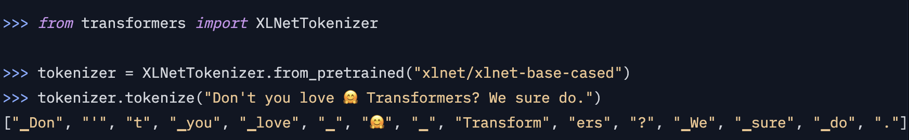
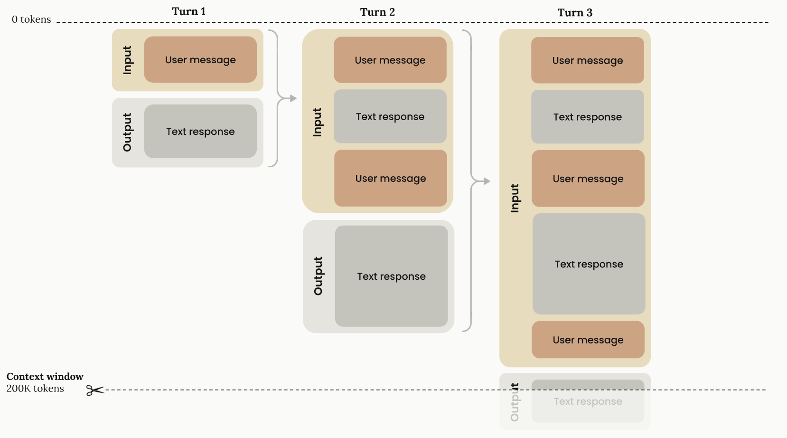
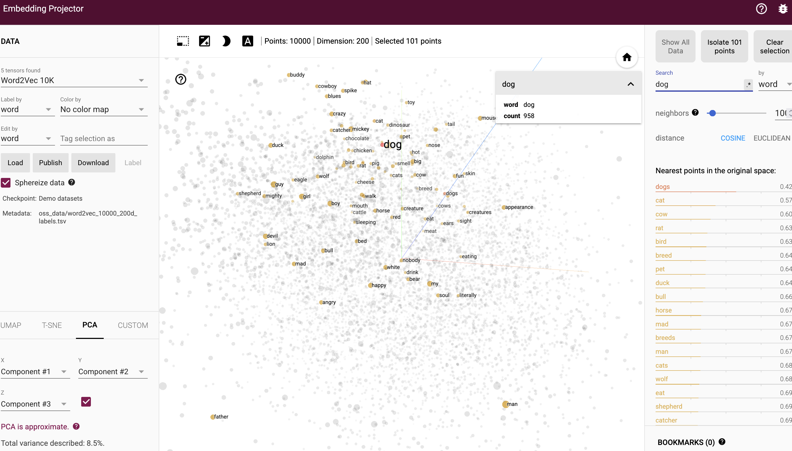
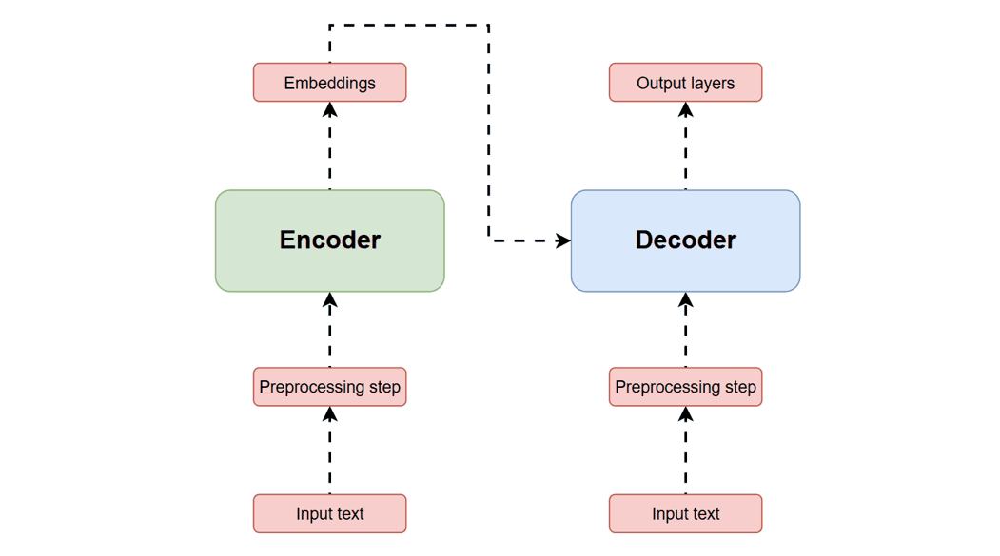
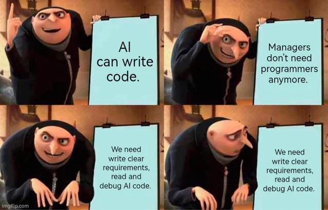
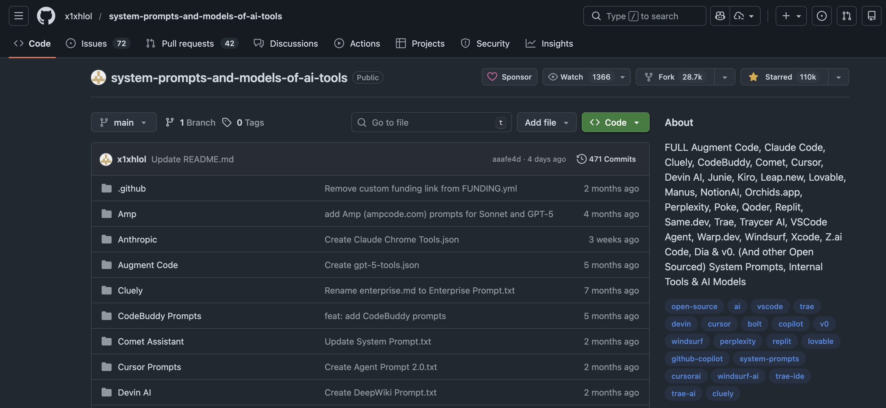
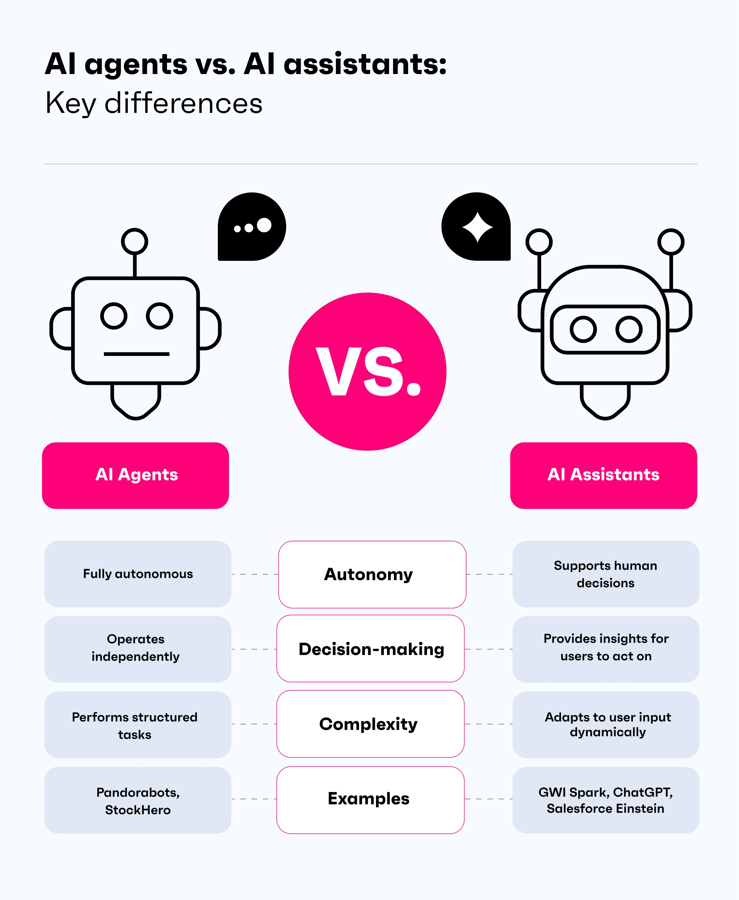

```{r setup, include=FALSE}
options(htmltools.dir.version = FALSE)
library(knitr)
opts_chunk$set(
  prompt = T,
  fig.align = "center",
  dpi = 300,
  cache = T,
  engine.opts = list(bash = "-l")
)

knit_hooks$set(
  prompt = function(before, options, envir) {
    options(
      prompt = if (options$engine %in% c("sh", "bash", "zsh")) "$ " else "R> ",
      continue = if (options$engine %in% c("sh", "bash", "zsh")) "$ " else "+ "
    )
  }
)

options(repos = c(CRAN = "https://cran.rstudio.com/"))

if (!require("fontawesome", character.only = TRUE)) {
  install.packages("fontawesome", dependencies = TRUE)
  library(fontawesome, character.only = TRUE)
}
```

# Día 4: LLMs y aplicaciones {background-color="#2d4563"}

## Repaso del Día 3

:::{style="margin-top: 20px; font-size: 28px;"}
:::{.columns}
:::{.column width=50%}
- [K-means]{.alert}: agrupa observaciones sin etiquetas
- [PCA]{.alert}: reduce dimensiones preservando varianza
- Texto como datos: [tokenización]{.alert}, [stopwords]{.alert}, [bag-of-words]{.alert}
- [TF-IDF]{.alert}: identifica palabras distintivas
- [LDA]{.alert}: descubre temas latentes en un corpus
- Estos métodos funcionan bien pero tienen limitaciones: no capturan [significado]{.alert} ni [contexto]{.alert}
:::

:::{.column width=50%}
:::{style="text-align: center; font-size: 22px;"}
**Hoy: la revolución de los LLMs**

Los LLMs cambian las reglas del juego:

- Entienden [contexto]{.alert} y [significado]{.alert}
- Pueden [clasificar]{.alert}, [resumir]{.alert}, [traducir]{.alert} y [generar]{.alert} texto
- Funcionan con [instrucciones en lenguaje natural]{.alert} (no código)
- Un solo modelo para [muchas tareas]{.alert}

Pero: ¿cómo funcionan por dentro?
:::
:::
:::
:::

## Agenda de hoy

:::{style="margin-top: 20px; font-size: 32px;"}

:::{.columns}
:::{.column width=50%}
**Sesión 4.1: Entendiendo los LLMs (~2 h)**

- ¿Qué es un LLM?
- Tokenización para LLMs
- Embeddings y atención
- Transformers (intuición)
- Prompt engineering
:::

:::{.column width=50%}
**Sesión 4.2: LLMs como herramientas (~2 h)**

- Alucinaciones y RAG
- Anotación automática de textos
- Generación de datos sintéticos
- Uso de APIs desde R con ellmer
- Laboratorio práctico
:::
:::
:::

# ¿Qué es un LLM? {background-color="#2d4563"}

## Modelos de lenguaje extensos

:::{style="margin-top: 30px; font-size: 24px;"}
:::{.columns}
:::{.column width=55%}
- [LLM]{.alert} (Large Language Model): un modelo de IA entrenado con cantidades masivas de texto para [predecir la siguiente palabra]{.alert}
- "El gato se sentó en la ___"
    - "silla": 27%
    - "cama": 22%
    - "mesa": 18%
    - ...
- ¿De dónde viene el "large"?
    - GPT-3: [175 mil millones]{.alert} de parámetros
    - GPT-4: ~1,7 billones de parámetros (estimado)
    - Entrenados con [billones de palabras]{.alert} de internet, libros, código
- A pesar de su simplicidad conceptual (predecir la siguiente palabra), esta tarea [genera capacidades emergentes]{.alert}: razonamiento, traducción, escritura creativa
:::

:::{.column width=45%}
:::{style="text-align: center;"}
[{width="100%"}](#){data-modal-type="image" data-modal-url="figures/llm-pipeline.png"}

Fuente: [Jay Alammar](https://jalammar.github.io/illustrated-transformer/)
:::
:::
:::
:::

## La tokenización en los LLMs

:::{style="margin-top: 30px; font-size: 24px;"}
:::{.columns}
:::{.column width=55%}
- Ayer vimos tokenización por palabras. Los LLMs usan algo diferente: [subpalabras]{.alert}
- Algoritmo más común: [BPE]{.alert} (Byte Pair Encoding)
    - Empieza con caracteres individuales
    - Fusiona los pares más frecuentes iterativamente
    - "desempleo" → ["des", "empleo"] o ["desem", "pleo"]
- ¿Por qué subpalabras?
    - Vocabulario [finito]{.alert} (~50.000 tokens) pero puede representar [cualquier texto]{.alert}
    - Palabras raras se descomponen; palabras comunes son un solo token
- [Los tokens no son palabras]{.alert}: "Hola" = 1 token, "paralelepípedo" = 4+ tokens
- Esto importa porque los LLMs tienen un [límite de tokens]{.alert} (ventana de contexto)
:::

:::{.column width=45%}
:::{style="text-align: center;"}
[{width="100%"}](#){data-modal-type="image" data-modal-url="figures/bpe-diagram.png"}

Fuente: [Hugging Face NLP Course](https://huggingface.co/learn/nlp-course)
:::
:::
:::
:::

## Ventana de contexto

:::{style="margin-top: 30px; font-size: 24px;"}
:::{.columns}
:::{.column width=55%}
- La [ventana de contexto]{.alert} es el número máximo de tokens que el modelo puede procesar a la vez
- Incluye tanto la entrada (prompt) como la salida (respuesta)
- Evolución:
    - GPT-3 (2020): 4.096 tokens (~3.000 palabras)
    - GPT-4 (2023): 128.000 tokens (~96.000 palabras)
    - Claude (2025): [1.000.000 tokens]{.alert} (~750.000 palabras)
- ¿Por qué importa?
    - Con más contexto, el modelo puede analizar [documentos largos]{.alert}
    - Puede mantener [conversaciones más largas]{.alert}
    - Puede procesar [múltiples documentos]{.alert} a la vez
- El costo de las APIs se cobra [por token]{.alert}
:::

:::{.column width=45%}
:::{style="text-align: center;"}
[{width="100%"}](#){data-modal-type="image" data-modal-url="figures/context-window.png"}
:::
:::
:::
:::

# Embeddings y atención {background-color="#2d4563"}

## Embeddings: palabras como vectores

:::{style="margin-top: 30px; font-size: 24px;"}
:::{.columns}
:::{.column width=55%}
- Cada token se convierte en un [vector]{.alert} (lista de números)
- Estos vectores capturan [significado semántico]{.alert}:
    - Palabras similares → vectores cercanos
    - "rey" - "hombre" + "mujer" ≈ "reina"
- GPT-2: cada token → 768 números
- GPT-4: cada token → miles de números
- Los embeddings se [aprenden durante el entrenamiento]{.alert}
- Aplicaciones prácticas:
    - [Búsqueda semántica]{.alert}: buscar por significado, no por palabras exactas
    - [Clasificación]{.alert}: agrupar textos similares
    - [Recomendaciones]{.alert}: encontrar documentos relacionados
:::

:::{.column width=45%}
:::{style="text-align: center;"}
[{width="100%"}](#){data-modal-type="image" data-modal-url="figures/embeddings-3d.png"}
:::
:::
:::
:::

## El mecanismo de atención

:::{style="margin-top: 30px; font-size: 24px;"}
:::{.columns}
:::{.column width=55%}
- La [atención]{.alert} es la innovación clave de los transformers
- Para cada palabra, el modelo pregunta: ["¿qué otras palabras son relevantes para entenderme?"]{.alert}
- "El banco cerró porque la economía estaba en crisis"
    - "banco" presta atención a "economía" y "crisis" → banco financiero
- "Me senté en el banco del parque"
    - "banco" presta atención a "senté" y "parque" → banco para sentarse
- [La misma palabra cambia de significado según el contexto]{.alert}
- Esto es lo que los métodos del Día 3 (bag-of-words, TF-IDF) no podían hacer
- La atención permite que el modelo entienda [relaciones a larga distancia]{.alert} en el texto
:::

:::{.column width=45%}
:::{style="text-align: center;"}
[{width="100%"}](#){data-modal-type="image" data-modal-url="figures/attention-heatmap.png"}
:::
:::
:::
:::

## Transformers: la arquitectura completa

:::{style="margin-top: 30px; font-size: 24px;"}
:::{.columns}
:::{.column width=55%}
- Los [transformers]{.alert} (Vaswani et al., 2017) combinan:
    1. [Tokenización]{.alert}: texto → tokens
    2. [Embeddings]{.alert}: tokens → vectores
    3. [Autoatención]{.alert}: cada token "mira" a los demás
    4. [Red feed-forward]{.alert}: procesa la información
    5. [Predicción]{.alert}: el siguiente token más probable
- Se apilan [muchas capas]{.alert} (bloques) de atención + feed-forward
    - GPT-2: 12 bloques
    - GPT-3: 96 bloques
- Las capas tempranas captan [gramática]{.alert}
- Las capas profundas captan [significado y razonamiento]{.alert}
- [Recurso interactivo]{.alert}: [Transformer Explainer](https://poloclub.github.io/transformer-explainer/)
:::

:::{.column width=45%}
:::{style="text-align: center;"}
[{width="100%"}](#){data-modal-type="image" data-modal-url="figures/transformer.gif"}
:::
:::
:::
:::

# Prompt engineering {background-color="#2d4563"}

## ¿Qué es prompt engineering?

:::{style="margin-top: 30px; font-size: 24px;"}
:::{.columns}
:::{.column width=55%}
- [Prompt engineering]{.alert}: el arte de escribir instrucciones efectivas para los LLMs
- La [calidad de la respuesta]{.alert} depende en gran medida de la calidad de la pregunta
- No es solo "hacer preguntas": es [diseñar la entrada]{.alert} para obtener la salida deseada
- Un buen prompt tiene cuatro componentes ([PTCF]{.alert}):
    - [Persona]{.alert}: ¿quién debería ser el modelo? ("Eres un analista político experto en América Latina")
    - [Tarea]{.alert}: ¿qué debe hacer? ("Clasifica el sentimiento de este texto")
    - [Contexto]{.alert}: ¿qué información adicional necesita?
    - [Formato]{.alert}: ¿cómo debe estructurar la respuesta? ("Responde en formato JSON")
:::

:::{.column width=45%}
:::{style="text-align: center;"}
[{width="100%"}](#){data-modal-type="image" data-modal-url="figures/prompt-engineering.webp"}
:::
:::
:::
:::

## Temperatura y creatividad

:::{style="margin-top: 30px; font-size: 24px;"}
:::{.columns}
:::{.column width=55%}
- La [temperatura]{.alert} controla la aleatoriedad de las respuestas
- Temperatura baja (0-0,3): respuestas [deterministas]{.alert}, siempre elige el token más probable
    - Bueno para: clasificación, extracción de datos, análisis
- Temperatura alta (0,7-1,0): respuestas más [creativas]{.alert} y variadas
    - Bueno para: escritura creativa, brainstorming
- Para [investigación]{.alert}, casi siempre queremos temperatura [baja]{.alert}
    - Reproducibilidad
    - Consistencia entre ejecuciones
    - Menos alucinaciones
:::

:::{.column width=45%}
:::{style="text-align: center;"}
[{width="100%"}](#){data-modal-type="image" data-modal-url="figures/temperature.gif"}
:::
:::
:::
:::

## Zero-shot, few-shot y chain-of-thought

:::{style="margin-top: 30px; font-size: 22px;"}
:::{.columns}
:::{.column width=50%}
**[Zero-shot]{.alert}**: dar la instrucción sin ejemplos

```
Clasifica el sentimiento de este texto
como positivo, negativo o neutro:
"La economía ha crecido un 5%"
```

**[Few-shot]{.alert}**: dar la instrucción con ejemplos

```
Clasifica el sentimiento:
- "La inflación es alta" → negativo
- "El empleo mejoró" → positivo
- "Los datos son de 2023" → neutro

Ahora clasifica:
"La pobreza ha disminuido" →
```
:::

:::{.column width=50%}
**[Chain-of-thought (CoT)]{.alert}**: pedir razonamiento paso a paso

```
Clasifica el sentimiento y explica
tu razonamiento paso a paso:

Texto: "A pesar de la crisis, el
gobierno logró reducir la pobreza"

Razonamiento:
1. "crisis" sugiere algo negativo
2. "logró reducir la pobreza" es positivo
3. "a pesar de" indica que el resultado
   positivo supera al contexto negativo
4. Clasificación: POSITIVO
```

CoT [mejora la precisión]{.alert} en tareas complejas al obligar al modelo a "pensar" antes de responder.
:::
:::
:::

## System prompts

:::{style="margin-top: 30px; font-size: 22px;"}
:::{.columns}
:::{.column width=55%}
- El [system prompt]{.alert} define el comportamiento del modelo para toda la conversación
- Se envía [antes]{.alert} de cualquier mensaje del usuario
- Establece la [personalidad]{.alert}, [restricciones]{.alert} y [formato]{.alert}
- Ejemplo para investigación:

```
Eres un asistente de investigación
especializado en ciencias sociales
latinoamericanas.

Reglas:
- Responde siempre en español
- Cita fuentes académicas cuando sea posible
- Si no estás seguro, dilo explícitamente
- No inventes datos ni estadísticas
- Formato: respuestas concisas con viñetas
```

- Los system prompts son clave para obtener [resultados consistentes]{.alert} al usar LLMs como herramientas de investigación
:::

:::{.column width=45%}
:::{style="text-align: center;"}
[{width="100%"}](#){data-modal-type="image" data-modal-url="figures/system-prompts.png"}
:::
:::
:::
:::

## Agentes de IA

:::{style="margin-top: 30px; font-size: 24px;"}
:::{.columns}
:::{.column width=55%}
- La última frontera: [agentes de IA]{.alert}
- Un agente es un LLM que puede [usar herramientas]{.alert} y [tomar acciones]{.alert}
- En lugar de solo generar texto, el agente puede:
    - [Buscar en internet]{.alert}
    - [Ejecutar código]{.alert}
    - [Leer y escribir archivos]{.alert}
    - [Interactuar con APIs]{.alert}
    - [Navegar sitios web]{.alert}
- Patrón [ReAct]{.alert} (Reasoning + Acting):
    1. El agente piensa sobre qué hacer (reasoning)
    2. Ejecuta una acción (acting)
    3. Observa el resultado
    4. Repite hasta completar la tarea
:::

:::{.column width=45%}
:::{style="text-align: center;"}
[{width="100%"}](#){data-modal-type="image" data-modal-url="figures/agents.webp"}
:::
:::
:::
:::

## Resumen de la sesión

:::{style="margin-top: 30px; font-size: 26px;"}

- Los [LLMs]{.alert} predicen el siguiente token, pero esta tarea simple genera capacidades complejas
- La [tokenización por subpalabras]{.alert} (BPE) permite un vocabulario finito para cualquier texto
- Los [embeddings]{.alert} capturan significado semántico como vectores
- La [autoatención]{.alert} permite entender el contexto y las relaciones entre palabras
- El [prompt engineering]{.alert} es clave para obtener buenos resultados: persona, tarea, contexto, formato
- [Temperatura baja]{.alert} para investigación; [CoT]{.alert} para tareas complejas
- En la próxima sesión: cómo usar los LLMs como [herramientas de investigación]{.alert}
:::

# Nos vemos en la próxima sesión {background-color="#2d4563"}
