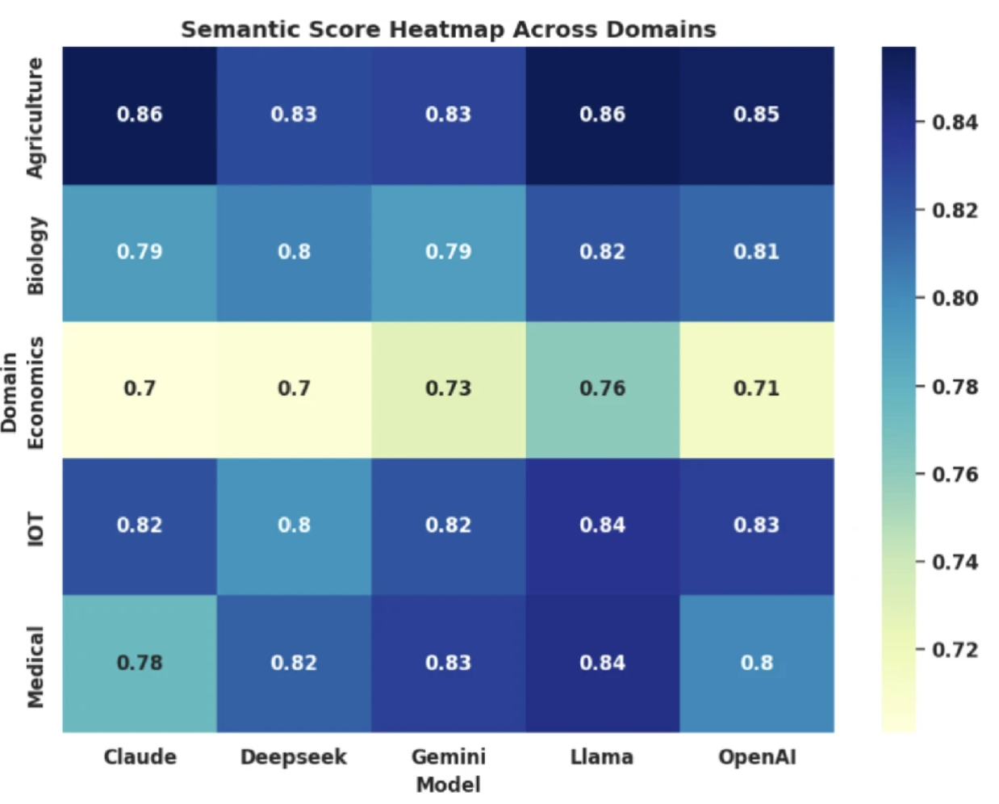
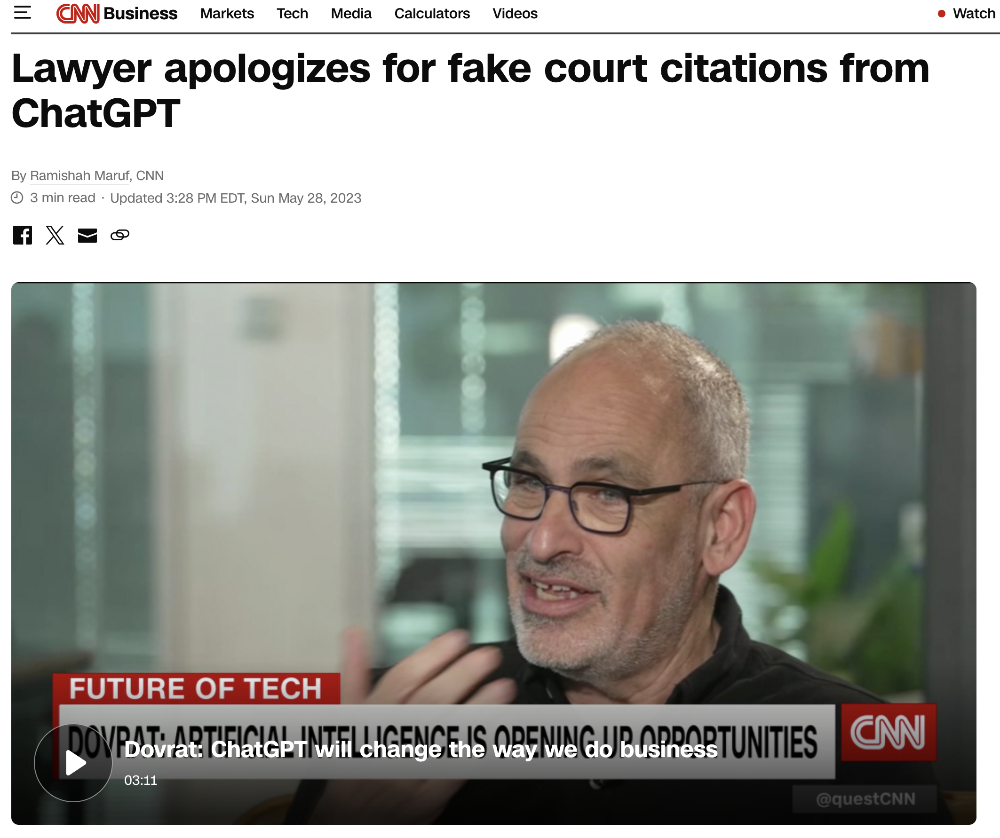
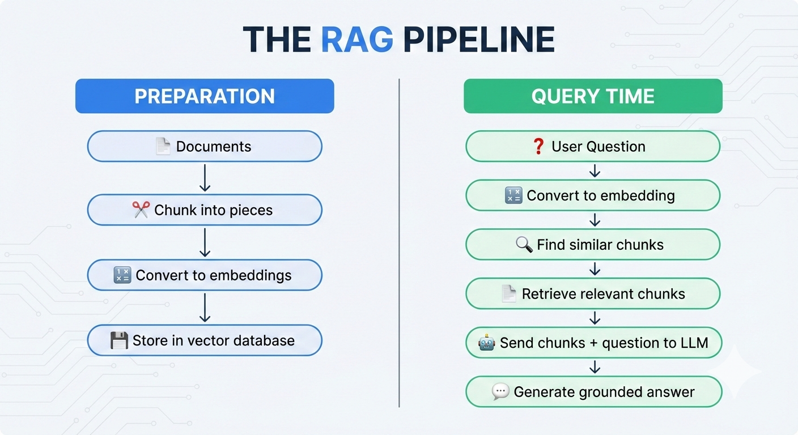

```{r setup, include=FALSE}
options(htmltools.dir.version = FALSE)
library(knitr)
opts_chunk$set(
  prompt = T,
  fig.align = "center",
  dpi = 300,
  cache = T,
  engine.opts = list(bash = "-l")
)

knit_hooks$set(
  prompt = function(before, options, envir) {
    options(
      prompt = if (options$engine %in% c("sh", "bash", "zsh")) "$ " else "R> ",
      continue = if (options$engine %in% c("sh", "bash", "zsh")) "$ " else "+ "
    )
  }
)

options(repos = c(CRAN = "https://cran.rstudio.com/"))

if (!require("fontawesome", character.only = TRUE)) {
  install.packages("fontawesome", dependencies = TRUE)
  library(fontawesome, character.only = TRUE)
}
```

# LLMs como herramientas de investigación {background-color="#2d4563"}

## Agenda de la sesión

:::{style="margin-top: 20px; font-size: 28px;"}

:::{.columns}
:::{.column width=50%}
**Primera parte**

- Alucinaciones y cómo mitigarlas
- RAG: Retrieval-Augmented Generation
- Prompt engineering avanzado
- Temperaturas y parámetros
:::

:::{.column width=50%}
**Segunda parte**

- LLMs para tareas de investigación
- Anotación automática de textos
- Generación de datos sintéticos
- Reproducibilidad y validación
- APIs y el paquete ellmer
:::
:::
:::

# Alucinaciones {background-color="#2d4563"}

## Cuando la IA inventa cosas

:::{style="margin-top: 30px; font-size: 22px;"}
:::{.columns}
:::{.column width=55%}
- [Alucinación]{.alert}: el LLM genera contenido fluido pero [factualmente incorrecto]{.alert}
- ¿Por qué ocurre? Porque los LLMs optimizan:

$$P(\text{siguiente token} | \text{contexto})$$

No:

$$P(\text{afirmación verdadera})$$

- [No tienen acceso a hechos]{.alert}: solo a patrones estadísticos del texto de entrenamiento
- Tipos comunes:
    - [Citas fabricadas]{.alert}: papers que no existen
    - [Estadísticas inventadas]{.alert}: números que suenan plausibles
    - [Hechos incorrectos]{.alert}: fechas, nombres, eventos erróneos
:::

:::{.column width=45%}
:::{style="text-align: center;"}
[{width="80%"}](#){data-modal-type="image" data-modal-url="figures/banana-hallucination.gif"}

Fuente: [Nielsen Norman Group](https://www.nngroup.com/articles/ai-hallucinations/)

<br>

[{width="100%"}](#){data-modal-type="image" data-modal-url="figures/hallucination-rates.png"}
:::
:::
:::
:::

## Caso real: el abogado y ChatGPT

:::{style="margin-top: 30px; font-size: 24px;"}
:::{.columns}
:::{.column width=55%}
- **2023**: dos abogados en Nueva York presentaron un escrito legal ante un tribunal federal
- Citaron [seis casos judiciales]{.alert} como precedentes
- Problema: [ninguno de esos casos existía]{.alert}
- Los habían obtenido de ChatGPT sin verificar
- El juez los sancionó con una multa de USD 5.000
- Lección: [los LLMs no son bases de datos]{.alert}
- No "buscan" información: [generan texto que parece plausible]{.alert}
- [Siempre verificar]{.alert} cualquier dato, cita o estadística generada por un LLM
:::

:::{.column width=45%}
:::{style="text-align: center;"}
[{width="100%"}](#){data-modal-type="image" data-modal-url="figures/lawyer-case.png"}
:::
:::
:::
:::

## Cómo reducir las alucinaciones

:::{style="margin-top: 30px; font-size: 24px;"}
:::{.columns}
:::{.column width=50%}
**En el prompt**

- [Temperatura baja]{.alert} (0-0,3)
- Pedir que diga ["no sé"]{.alert} cuando no está seguro
- [Few-shot]{.alert}: dar ejemplos del formato esperado
- [Chain-of-thought]{.alert}: obligar a razonar paso a paso
- Pedir [citas específicas]{.alert} y verificarlas manualmente
- Instrucción explícita: "no inventes datos"
:::

:::{.column width=50%}
**En la arquitectura**

- [RAG]{.alert} (Retrieval-Augmented Generation): darle al modelo documentos reales como contexto
- [Grounding]{.alert}: conectar el modelo con fuentes de información verificadas
- [Verificación cruzada]{.alert}: usar múltiples modelos y comparar respuestas
- [Post-procesamiento]{.alert}: verificar automáticamente las afirmaciones generadas
:::
:::

:::{style="margin-top: 20px; text-align: center; font-size: 22px;"}
[Regla de oro]{.alert}: nunca confiar en la salida de un LLM sin verificación. Los LLMs son [herramientas de borrador]{.alert}, no fuentes de verdad.
:::
:::

# RAG: Retrieval-Augmented Generation {background-color="#2d4563"}

## ¿Qué es RAG?

:::{style="margin-top: 30px; font-size: 22px;"}
:::{.columns}
:::{.column width=55%}
- [RAG]{.alert} ([Lewis et al., 2020](https://arxiv.org/abs/2005.11401)): en lugar de confiar en la "memoria" del modelo, le damos [documentos reales]{.alert} como contexto
- El pipeline:
    1. El usuario hace una pregunta
    2. El sistema [busca]{.alert} documentos relevantes en una base de conocimiento
    3. Los documentos se incluyen en el [prompt]{.alert}
    4. El LLM genera una respuesta basada en [esos documentos]{.alert}
- Reduce alucinaciones porque el modelo debe basar sus respuestas en [texto real]{.alert}
- Más fácil de [actualizar]{.alert}: cambiar los documentos, no reentrenar el modelo
- Ya lo usan: ChatGPT con archivos, NotebookLM de Google, Perplexity AI
:::

:::{.column width=45%}
:::{style="text-align: center;"}
[{width="100%"}](#){data-modal-type="image" data-modal-url="figures/rag-pipeline.png"}
:::
:::
:::
:::

## RAG para investigación en ciencias sociales

:::{style="margin-top: 30px; font-size: 24px;"}
:::{.columns}
:::{.column width=50%}
**Casos de uso**

- [Revisión de literatura]{.alert}: subir papers y preguntar sobre hallazgos
- [Análisis de documentos]{.alert}: subir leyes, informes o actas y hacer preguntas específicas
- [Codificación de datos]{.alert}: subir un codebook y pedir que clasifique respuestas abiertas
- [Preparación de clases]{.alert}: subir lecturas y generar preguntas de discusión
:::

:::{.column width=50%}
**Herramientas accesibles**

- [NotebookLM]{.alert} (Google): gratuito, sube PDFs y hace preguntas
- [ChatGPT]{.alert} con archivos: sube documentos y analiza
- [Claude]{.alert}: acepta documentos largos (hasta 750.000 palabras)
- Desde R: [ellmer]{.alert} permite enviar texto como contexto vía API

**Limitación**: RAG reduce pero [no elimina]{.alert} las alucinaciones. El modelo puede "ignorar" el contexto o interpretar mal los documentos.
:::
:::
:::

# LLMs para tareas de investigación {background-color="#2d4563"}

## Anotación automática de textos

:::{style="margin-top: 30px; font-size: 22px;"}
:::{.columns}
:::{.column width=55%}
- Ayer usamos diccionarios y LDA para clasificar textos. Los LLMs pueden hacerlo [mucho mejor]{.alert}
- [Anotación con LLMs]{.alert}: darle al modelo un texto y pedirle que lo clasifique según un esquema
- Ventajas frente a métodos clásicos:
    - Entiende [contexto y significado]{.alert}
    - Captura [negaciones]{.alert}: "no es bueno" = negativo
    - Maneja [ironía]{.alert} y lenguaje complejo
    - Funciona en [múltiples idiomas]{.alert}
- Estudios recientes muestran que GPT-4 y Claude tienen [precisión comparable a anotadores humanos]{.alert} en muchas tareas ([Gilardi, Alizadeh y Kubli, 2023](https://doi.org/10.1073/pnas.2305016120), publicado en PNAS)
- Costo: centavos por texto vs. dólares por anotador humano
:::

:::{.column width=45%}
:::{style="text-align: center; font-size: 20px;"}
**Ejemplo de prompt para anotación**

```
System: Eres un analista político.
Clasifica textos según el tema
principal. Temas posibles:
economía, educación, seguridad,
salud, medio ambiente.

Responde SOLO con el tema,
sin explicación.

User: "La inflación sigue siendo
un problema grave que afecta a
las familias más vulnerables."

Respuesta: economía
```
:::
:::
:::
:::

## Generación de datos sintéticos

:::{style="margin-top: 30px; font-size: 24px;"}
:::{.columns}
:::{.column width=55%}
- [Datos sintéticos]{.alert}: datos generados por un LLM que imitan datos reales
- Casos de uso en investigación:
    - [Pilotos]{.alert}: probar un análisis antes de recoger datos reales
    - [Aumentación]{.alert}: expandir datasets pequeños
    - [Privacidad]{.alert}: generar datos que preserven patrones sin exponer individuos
    - [Entrenamiento]{.alert}: crear ejemplos para entrenar clasificadores
- Precauciones:
    - Los datos sintéticos [reflejan los sesgos]{.alert} del modelo que los genera
    - No reemplazan datos reales para conclusiones sustantivas
    - Deben ser [validados]{.alert} contra datos reales cuando sea posible
- Útiles como [complemento]{.alert}, no como sustituto
:::

:::{.column width=45%}
:::{style="text-align: center; font-size: 20px;"}
**Ejemplo de prompt**

```
Genera 10 respuestas simuladas
a una encuesta sobre confianza
en instituciones en Uruguay.

Cada respuesta debe incluir:
- edad (18-80)
- género (M/F)
- confianza_gobierno (1-4)
- confianza_justicia (1-4)
- comentario (1 oración)

Formato: CSV con encabezados.
Las respuestas deben reflejar
la diversidad demográfica real.
```
:::
:::
:::
:::

## El paquete ellmer

:::{style="margin-top: 30px; font-size: 22px;"}
:::{.columns}
:::{.column width=55%}
- [ellmer]{.alert}: paquete de R para interactuar con LLMs desde R
- Desarrollado por el equipo de [Posit]{.alert} (los creadores de RStudio)
- Soporta múltiples proveedores: OpenAI, Anthropic (Claude), Google (Gemini), Ollama (modelos locales)
- Interfaz simple y consistente:
    - `chat()`: crear una sesión de chat
    - `$chat()`: enviar un mensaje y recibir respuesta
    - `$extract_data()`: extraer datos estructurados
- Se integra con el [tidyverse]{.alert}
- Permite [automatizar]{.alert} tareas de análisis de texto a escala
- Documentación: <https://ellmer.tidyverse.org/>
:::

:::{.column width=45%}
:::{style="font-size: 20px;"}
**Ejemplo básico**

```r
library(ellmer)

# Crear un chat con Claude
chat <- chat_claude(
  system_prompt = "Eres un analista
  político experto en América Latina.
  Responde en español."
)

# Enviar un mensaje
chat$chat("¿Cuáles son los principales
  desafíos democráticos en la región?")

# El modelo responde con texto
# que podemos procesar en R
```

Se necesita una [API key]{.alert} del proveedor (OpenAI, Anthropic, etc.)
:::
:::
:::
:::

# Prompt engineering avanzado {background-color="#2d4563"}

## El framework PTCF

:::{style="margin-top: 30px; font-size: 22px;"}
:::{.columns}
:::{.column width=55%}
- [PTCF]{.alert}: Persona, Tarea, Contexto, Formato
- Un buen prompt incluye los cuatro elementos:

**[Persona]{.alert}**: ¿quién es el modelo?

```
Eres un investigador experto en ciencia
política latinoamericana con 20 años
de experiencia en análisis de discurso.
```

**[Tarea]{.alert}**: ¿qué debe hacer?

```
Clasifica el siguiente texto según
su orientación ideológica.
```
:::

:::{.column width=45%}
**[Contexto]{.alert}**: información necesaria

```
El texto proviene de un discurso
presidencial de 2023 en Uruguay.
Las categorías son: izquierda,
centro-izquierda, centro,
centro-derecha, derecha.
```

**[Formato]{.alert}**: estructura de salida

```
Responde en JSON:
{"categoria": "...",
 "confianza": 0.0-1.0,
 "justificacion": "..."}
```
:::
:::
:::

## Zero-shot, few-shot y chain-of-thought

:::{style="margin-top: 30px; font-size: 22px;"}
:::{.columns}
:::{.column width=50%}
**[Zero-shot]{.alert}**: sin ejemplos

```
Clasifica el sentimiento:
"La economía ha crecido un 5%"
```

Funciona para tareas simples y comunes.

**[Few-shot]{.alert}**: con ejemplos

```
Ejemplos:
- "La inflación es alta" → negativo
- "El empleo mejoró" → positivo
- "Los datos son de 2023" → neutro

Clasifica:
"La pobreza ha disminuido" →
```

Mejora la precisión en tareas específicas.
:::

:::{.column width=50%}
**[Chain-of-thought]{.alert}** (CoT)

```
Clasifica y explica paso a paso:

Texto: "A pesar de la crisis, el
gobierno logró reducir la pobreza"

Análisis:
1. "crisis" = contexto negativo
2. "logró reducir pobreza" = resultado positivo
3. "a pesar de" = contraste
4. El resultado supera al contexto

Clasificación: POSITIVO
```

CoT mejora el razonamiento en tareas complejas ([Wei et al., 2022](https://arxiv.org/abs/2201.11903)).
:::
:::
:::

## Temperatura y otros parámetros

:::{style="margin-top: 30px; font-size: 22px;"}
:::{.columns}
:::{.column width=55%}
**[Temperatura]{.alert}** (0.0 - 2.0)

- 0.0: determinístico, siempre elige el token más probable
- 0.3: poca variación, bueno para análisis
- 0.7: balance, bueno para escritura
- 1.0+: muy creativo, impredecible

**Para investigación: [temperatura ≤ 0.3]{.alert}**

**Otros parámetros:**

- [max_tokens]{.alert}: límite de tokens en respuesta
- [top_p]{.alert}: nucleus sampling (alternativa a temperatura)
- [presence_penalty]{.alert}: penaliza repetición
:::

:::{.column width=45%}
:::{style="text-align: center; font-size: 18px;"}
**Recomendaciones por tarea:**

| Tarea | Temperatura |
|-------|-------------|
| Clasificación | 0.0 - 0.1 |
| Extracción de datos | 0.0 - 0.2 |
| Resumen | 0.2 - 0.4 |
| Análisis abierto | 0.3 - 0.5 |
| Escritura creativa | 0.7 - 1.0 |
| Brainstorming | 0.8 - 1.2 |

<br>

[Para replicabilidad, usar temperatura 0 y fijar una semilla (seed) si el API lo permite.]{.alert}
:::
:::
:::
:::

## Extracción de datos estructurados

:::{style="margin-top: 30px; font-size: 22px;"}
:::{.columns}
:::{.column width=55%}
- Pedir respuestas en [formato estructurado]{.alert} facilita el procesamiento
- Formatos comunes:
    - [JSON]{.alert}: el más versátil
    - [CSV]{.alert}: para tablas simples
    - [XML]{.alert}: para estructuras jerárquicas
- Ejemplo de extracción:

```
Extrae las entidades del texto en JSON:
{"personas": [...],
 "organizaciones": [...],
 "lugares": [...],
 "fechas": [...]}

Texto: "El presidente Lacalle Pou
se reunió con el FMI en Montevideo
el 15 de marzo de 2024."
```
:::

:::{.column width=45%}
:::{style="font-size: 18px;"}
**Respuesta esperada:**

```json
{
  "personas": ["Lacalle Pou"],
  "organizaciones": ["FMI"],
  "lugares": ["Montevideo"],
  "fechas": ["15 de marzo de 2024"]
}
```

<br>

**Tip**: Incluir un [ejemplo de formato]{.alert} en el prompt reduce errores de estructura.

[ellmer tiene `$extract_data()` que valida el JSON automáticamente.]{.alert}
:::
:::
:::
:::

# Reproducibilidad y validación {background-color="#2d4563"}

## El problema de la reproducibilidad

:::{style="margin-top: 30px; font-size: 24px;"}
:::{.columns}
:::{.column width=55%}
- Los LLMs plantean [desafíos de reproducibilidad]{.alert}:
    - Los modelos se actualizan (GPT-4 de marzo ≠ GPT-4 de diciembre)
    - Temperatura > 0 introduce aleatoriedad
    - Las APIs pueden cambiar comportamiento
    - Los modelos cerrados son cajas negras
- Buenas prácticas:
    - [Documentar]{.alert}: modelo, versión, fecha, parámetros
    - [Guardar]{.alert} los prompts exactos usados
    - [Temperatura 0]{.alert} cuando sea posible
    - [Guardar]{.alert} las respuestas crudas
    - Considerar [modelos abiertos]{.alert} (Llama) para máxima reproducibilidad
:::

:::{.column width=45%}
:::{style="text-align: center; font-size: 18px;"}
**Documentación mínima:**

```yaml
modelo: gpt-4o-mini
version: 2024-07-18
fecha_ejecucion: 2026-04-10
temperatura: 0
max_tokens: 500
system_prompt: |
  Eres un clasificador...
seed: 42  # si está disponible

# Guardar en archivo:
# - prompts usados
# - respuestas completas
# - código de procesamiento
```

[Sin esta documentación, el análisis no es reproducible.]{.alert}
:::
:::
:::
:::

## Validación de resultados

:::{style="margin-top: 30px; font-size: 22px;"}
:::{.columns}
:::{.column width=55%}
**Estrategias de validación:**

1. [Muestra manual]{.alert}: revisar humana de N casos
    - ¿El LLM clasificó correctamente?
    - ¿Qué errores comete?

2. [Gold standard]{.alert}: comparar con datos etiquetados por expertos
    - Calcular accuracy, precision, recall, F1

3. [Comparación con métodos clásicos]{.alert}
    - ¿LLM vs. diccionario? ¿LLM vs. LDA?
    - Los LLMs no siempre ganan

4. [Múltiples modelos]{.alert}
    - Comparar GPT vs. Claude vs. Llama
    - Si coinciden, más confianza
:::

:::{.column width=45%}
:::{style="font-size: 20px;"}
**Ejemplo de validación:**

```
Dataset: 100 textos políticos
Gold standard: etiquetados por
              2 investigadores

Resultados:
- LLM accuracy: 87%
- Diccionario: 72%
- LDA + supervisión: 79%
- Inter-rater (humanos): 91%

Conclusión: LLM cercano a humanos,
supera métodos clásicos
```

[Siempre reportar métricas de validación en publicaciones.]{.alert}
:::
:::
:::
:::

## LLMs vs. métodos clásicos

:::{style="margin-top: 30px; font-size: 22px;"}

:::{style="text-align: center;"}

| Criterio | LLMs | Clásicos (TF-IDF, LDA) |
|----------|------|------------------------|
| [Precisión]{.alert} | Alta (contexto, negaciones) | Moderada |
| [Velocidad]{.alert} | Lento (API calls) | Muy rápido |
| [Costo]{.alert} | USD 0.01-0.10 por texto | Gratis |
| [Reproducibilidad]{.alert} | Difícil (modelo cambia) | Alta |
| [Transparencia]{.alert} | Caja negra | Interpretable |
| [Escalabilidad]{.alert} | Costoso a gran escala | Escala bien |
| [Idiomas]{.alert} | Multilingüe nativo | Requiere recursos por idioma |

:::

<br>

:::{style="font-size: 22px;"}
[Recomendación]{.alert}: usar LLMs para tareas donde la precisión importa más que el costo. Para grandes volúmenes, considerar [híbridos]{.alert}: LLM para etiquetar subset → entrenar clasificador clásico.
:::
:::

# El paquete ellmer {background-color="#2d4563"}

## ¿Qué es ellmer?

:::{style="margin-top: 30px; font-size: 22px;"}
:::{.columns}
:::{.column width=55%}
- [ellmer]{.alert}: paquete de R para interactuar con LLMs
- Desarrollado por el equipo de [Posit]{.alert} (los creadores de RStudio)
- Interfaz unificada para múltiples proveedores:
    - [OpenAI]{.alert}: GPT-4, GPT-4o-mini
    - [Anthropic]{.alert}: Claude 3.5
    - [Google]{.alert}: Gemini
    - [Ollama]{.alert}: modelos locales (Llama, Mistral)
- Se integra con el [tidyverse]{.alert}
- Documentación: <https://ellmer.tidyverse.org/>
:::

:::{.column width=45%}
:::{style="font-size: 18px;"}
**Instalación:**

```r
install.packages("ellmer")

# Configurar API key
Sys.setenv(OPENAI_API_KEY = "sk-...")
# o
Sys.setenv(ANTHROPIC_API_KEY = "sk-ant-...")
```

**Funciones principales:**

- `chat_openai()`: crear chat con OpenAI
- `chat_claude()`: crear chat con Claude
- `$chat()`: enviar mensaje
- `$extract_data()`: extraer datos estructurados
:::
:::
:::
:::

## Ejemplo básico con ellmer

:::{style="margin-top: 30px; font-size: 20px;"}

```r
library(ellmer)
library(tidyverse)

# Crear un chat con Claude
chat <- chat_claude(
  model = "claude-sonnet-4-20250514",
  system_prompt = "Eres un analista político experto en América Latina.
                   Responde de forma concisa en español."
)

# Enviar un mensaje
respuesta <- chat$chat("¿Cuáles son los principales desafíos
                        democráticos en Uruguay actualmente?")

# Ver la respuesta
cat(respuesta)

# El chat mantiene el historial
chat$chat("¿Y cómo se compara con Chile?")
```

[Tip]{.alert}: crear un chat nuevo para cada tarea independiente. El historial acumulado puede sesgar las respuestas.
:::

## Extracción de datos estructurados

:::{style="margin-top: 30px; font-size: 20px;"}

```r
# Definir el esquema esperado
library(ellmer)

# Chat para clasificación
clasificador <- chat_openai(
  model = "gpt-4o-mini",
  system_prompt = "Clasifica textos políticos.
                   Responde SOLO en JSON válido."
)

# Usar extract_data para obtener estructura
resultado <- clasificador$extract_data(
  "La inflación sigue siendo un problema grave.",
  type = type_object(
    tema = type_string("Tema principal: economia/educacion/salud/seguridad/ambiente"),
    sentimiento = type_string("positivo/negativo/neutro"),
    confianza = type_number("Confianza de 0 a 1")
  )
)

# Resultado es una lista de R
resultado$tema        # "economia"
resultado$sentimiento # "negativo"
resultado$confianza   # 0.9
```
:::

## Resumen de la sesión

:::{style="margin-top: 30px; font-size: 22px;"}
:::{.columns}
:::{.column width=50%}
**Conceptos clave:**

- [Alucinaciones]{.alert}: los LLMs inventan información
- [RAG]{.alert}: darle documentos reales al modelo
- [PTCF]{.alert}: Persona, Tarea, Contexto, Formato
- [Temperatura baja]{.alert} para investigación
- [Datos estructurados]{.alert}: JSON para facilitar procesamiento
:::

:::{.column width=50%}
**Buenas prácticas:**

- [Validar]{.alert} contra gold standard
- [Documentar]{.alert} modelo, parámetros, prompts
- [Comparar]{.alert} con métodos clásicos
- [Considerar]{.alert} costo y escalabilidad
- [ellmer]{.alert} para usar LLMs desde R
:::
:::

<br>

[En los laboratorios pondremos todo esto en práctica.]{.alert}
:::

## Próximos pasos

:::{style="margin-top: 40px; font-size: 26px;"}

- [Laboratorio 4.3:]{.alert} Primeros pasos con ellmer
    - Configuración y chat básico
    - Clasificación de textos
    - Extracción estructurada

- [Laboratorio 4.4:]{.alert} Aplicaciones avanzadas
    - Análisis de sentimiento
    - Generación de datos sintéticos
    - Auditoría de sesgos
    - Comparación con métodos clásicos

[Nos vemos en el laboratorio.]{.alert}
:::

# Nos vemos en el laboratorio {background-color="#2d4563"}