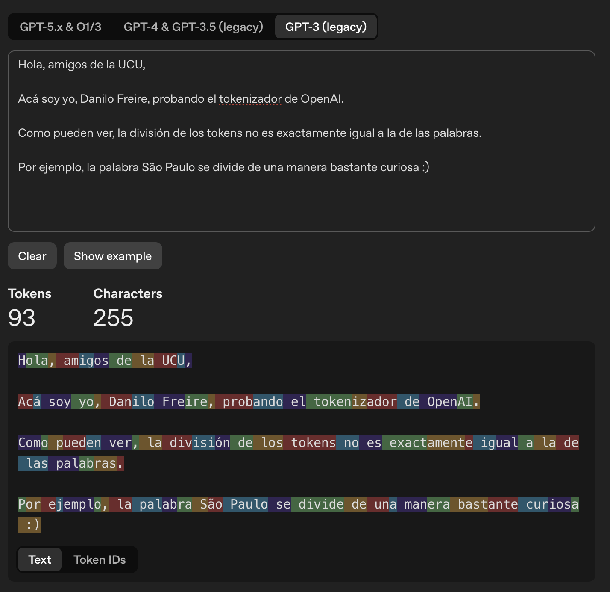
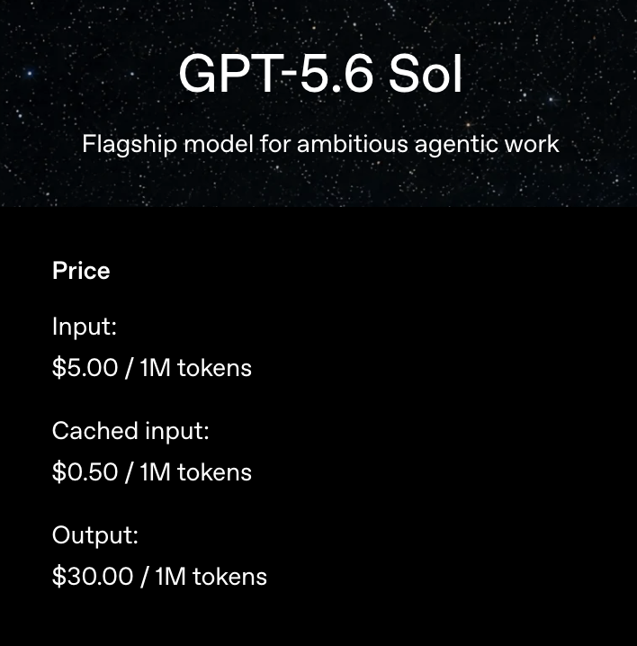
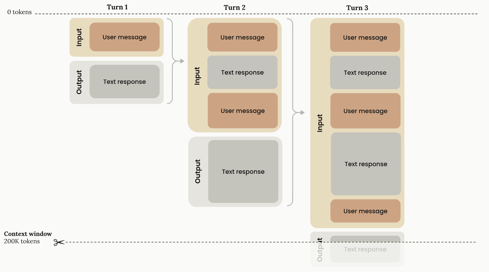
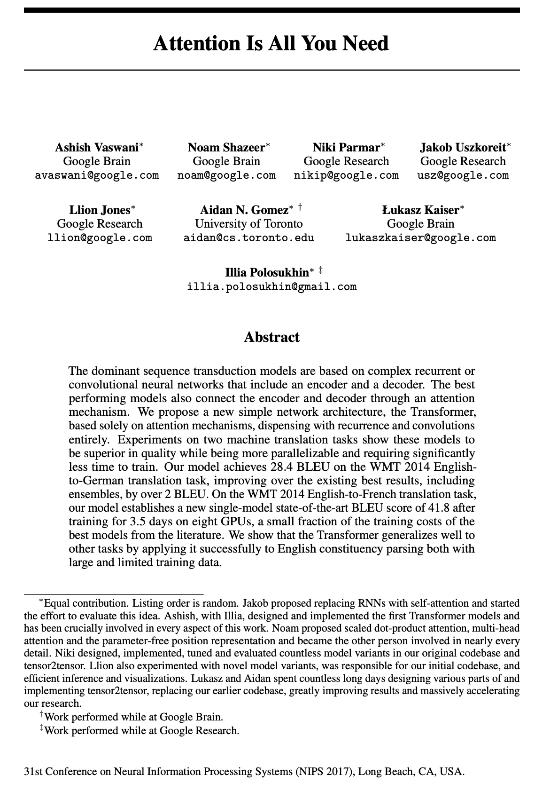

```{r setup, include=FALSE}
options(htmltools.dir.version = FALSE)
library(knitr)
opts_chunk$set(
  prompt = T,
  fig.align = "center",
  dpi = 300,
  cache = T,
  engine.opts = list(bash = "-l")
)

knit_hooks$set(
  prompt = function(before, options, envir) {
    options(
      prompt = if (options$engine %in% c("sh", "bash", "zsh")) "$ " else "R> ",
      continue = if (options$engine %in% c("sh", "bash", "zsh")) "$ " else "+ "
    )
  }
)

options(repos = c(CRAN = "https://cran.rstudio.com/"))

if (!require("fontawesome", character.only = TRUE)) {
  install.packages("fontawesome", dependencies = TRUE)
  library(fontawesome, character.only = TRUE)
}
```

## Repaso del Día 3

:::{style="margin-top: 20px; font-size: 23px;"}
:::{.columns}
:::{.column width=50%}
**Aprendizaje no supervisado**

- [K-means]{.alert} y [clustering jerárquico]{.alert}: agrupar sin etiquetas
- [PCA]{.alert}: reducir dimensiones preservando varianza

**Texto como datos**

- [Tokenización]{.alert} por palabras, [stopwords]{.alert}, [bag-of-words]{.alert}
- [TF-IDF]{.alert}: identificar vocabulario distintivo
- [Embeddings]{.alert} con [Word2Vec]{.alert}: las palabras como vectores
:::

:::{.column width=50%}
**Hoy: extendemos esa idea**

Word2Vec ya hacía algo notable: [aprender que palabras similares tienen vectores cercanos]{.alert}, sin etiquetas, sólo prediciendo contexto

Los [LLMs]{.alert} hacen [lo mismo, a escala masiva]{.alert}:

- Predicen [tokens]{.alert} en lugar de palabras
- Usan [atención]{.alert} para decidir qué contexto importa
- Trabajan con [cientos de miles de millones]{.alert} de parámetros

El resultado: traducción, resumen, razonamiento, conversación. Todo con [una sola idea]{.alert} aplicada a escala
:::
:::
:::

## Agenda del Día 4

:::{style="margin-top: 30px; font-size: 28px;"}

:::{.columns}
:::{.column width=50%}
**Sesión 4.1 (esta clase)**

[Cómo funcionan los LLMs por dentro]{.alert}

- La gran idea: predicción del próximo token
- Cómo procesa el texto (tokens, embeddings, contexto)
- Atención y arquitectura transformer
- Escala, emergencia y alucinaciones
- El ecosistema actual
:::

:::{.column width=50%}
**Sesión 4.2**

[Cómo usar los LLMs en investigación]{.alert}

- Alucinaciones en detalle (caso real)
- Cuatro defensas: prompts, salida estructurada, RAG, validación
- Anotación y datos sintéticos
- APIs accesibles (OpenRouter, Ollama) y `ellmer`

**Laboratorios 7 y 8**: práctica con LLMs desde R
:::
:::
:::

# La gran idea: predicción del próximo token {background-color="#2d4563"}

## ¿Qué es un LLM?

:::{style="margin-top: 30px; font-size: 24px;"}
:::{.columns}
:::{.column width=55%}
- [LLM]{.alert} = Large Language Model (modelo de lenguaje extenso)
- Un modelo de IA entrenado con cantidades masivas de texto para [predecir el próximo token]{.alert}
- El "large" se refiere a tres dimensiones:
    - [Parámetros]{.alert}: GPT-3 tiene 175 mil millones; GPT-4 se estima en más de 1 billón
    - [Datos]{.alert}: terabytes de texto (Wikipedia, libros, código, web)
    - [Cómputo]{.alert}: meses de entrenamiento con miles de GPUs
- La idea es conceptualmente simple. La magia viene de la [escala]{.alert}
- A esa escala [emergen capacidades que no fueron programadas]{.alert}: traducir, resumir, responder preguntas, escribir código
:::

:::{.column width=45%}
:::{style="text-align: center;"}
[{width="100%"}](#){data-modal-type="image" data-modal-url="figures/llm-pipeline.png"}

Fuente: [Jay Alammar](https://jalammar.github.io/illustrated-transformer/)
:::
:::
:::
:::

## La predicción del próximo token

:::{style="margin-top: 30px; font-size: 24px;"}
:::{.columns}
:::{.column width=55%}
- Dada una secuencia, el modelo calcula una [distribución de probabilidad]{.alert} sobre todos los tokens posibles del vocabulario
- Ejemplo: "El gato se sentó en la ___"

:::{style="font-size: 22px;"}
| Token | Probabilidad |
|-------|--------------|
| alfombra | 0,28 |
| silla | 0,15 |
| mesa | 0,12 |
| cama | 0,09 |
| ventana | 0,04 |
| ... | ... |
:::

- El modelo [muestrea]{.alert} un token (típicamente uno de los más probables, con algo de aleatoriedad)
- Luego repite el proceso con el nuevo contexto
:::

:::{.column width=45%}
:::{style="text-align: center; font-size: 23px;"}
**[¡Eso es todo lo que hace!]{.alert}** 🤖

Sin búsqueda, sin razonamiento explícito, sin "comprensión" como la entendemos los humanos

Sólo [estadísticas sobre tokens]{.alert}, computadas con una arquitectura muy potente, sobre datos masivos

:::{.callout-note}
Cuando ChatGPT genera una respuesta de 200 palabras, está haciendo esta predicción [unas 300 veces seguidas]{.alert}
:::
:::
:::
:::
:::

## La generación es iterativa

:::{style="margin-top: 30px; font-size: 24px;"}

- Cada paso usa el contexto completo (entrada + lo generado hasta ahora) para predecir el [siguiente token]{.alert}

:::{style="font-size: 22px; text-align: center;"}
**Paso 1**: "El gato se sentó en la **___**" → "alfombra"

**Paso 2**: "El gato se sentó en la alfombra **___**" → "porque"

**Paso 3**: "El gato se sentó en la alfombra porque **___**" → "estaba"

**Paso 4**: "El gato se sentó en la alfombra porque estaba **___**" → "caliente"

...
:::

:::{style="text-align: center; font-size: 24px; margin-top: 30px;"}
- [Un token a la vez, siempre mirando todo el contexto previo]{.alert}
- Por eso los LLMs pueden [equivocarse a mitad de un párrafo y arrastrar el error]{.alert}
- También por eso responden de forma fluida: [cada token nuevo se construye sobre los anteriores]{.alert}
:::
:::

# Cómo procesa el texto {background-color="#2d4563"}

## Tokens: ni letras ni palabras

:::{style="margin-top: 30px; font-size: 24px;"}
:::{.columns}
:::{.column width=55%}
- Los LLMs no leen letras ni palabras: leen [tokens]{.alert}, que son [subpalabras]{.alert}
- Algoritmo más común: [BPE]{.alert} (Byte Pair Encoding; [Sennrich, Haddow y Birch, 2016](https://arxiv.org/abs/1508.07909))
- Vocabulario [finito]{.alert} (típicamente 50.000 a 200.000 tokens) que puede representar [cualquier texto]{.alert}
- Palabras comunes son un solo token; palabras raras o largas se descomponen

**Ejemplos en GPT-4o**

- "hola" → 1 token
- "ChatGPT" → 3 tokens (`Chat`, `G`, `PT`)
- "investigación" → 3 tokens
- "Latinoamérica" → 5 tokens
- "paralelepípedo" → 6 tokens
:::

:::{.column width=45%}
:::{style="text-align: center;"}
[{width="100%"}](#){data-modal-type="image" data-modal-url="figures/bpe-diagram.png"}

Fuente: [OpenAI Tokenizer (GPT 3)](https://platform.openai.com/tokenizer)
:::
:::
:::
:::

## BPE: cómo se aprenden los tokens

:::{style="margin-top: 30px; font-size: 23px;"}
:::{.columns}
:::{.column width=55%}
- La intuición del algoritmo:
    1. Empezar con [caracteres individuales]{.alert} como vocabulario inicial
    2. Contar los pares más frecuentes (por ejemplo, "e" + "n" en español)
    3. Fusionar el par más frecuente en un nuevo token ("en")
    4. Repetir hasta llegar al tamaño de vocabulario deseado
- Resultado: tokens que reflejan la [estadística del idioma de entrenamiento]{.alert}
- Una palabra rara como "antidisestablishmentarianism" se descompone en partes pequeñas
- Una palabra común como "the" es un solo token
:::

:::{.column width=45%}
:::{style="text-align: center;"}
**Regla práctica**

Para inglés: 100 tokens ≈ 75 palabras

Para español: 100 tokens ≈ 55 palabras

Las tildes, la ñ y los acentos añaden tokens. Una respuesta de 1000 palabras en español puede consumir 1800 tokens

[Esto importa para el costo y para la ventana de contexto]{.alert}
:::
:::{.callout-note}
El vocabulario de BPE se aprende sobre el corpus de entrenamiento. Si el corpus es mayoritariamente inglés, el español necesita más tokens para decir lo mismo
:::
:::
:::
:::

## Tokens en español: una consideración práctica

:::{style="margin-top: 30px; font-size: 22px;"}
:::{.columns}
:::{.column width=55%}
- Los modelos comerciales fueron entrenados [mayoritariamente con texto en inglés]{.alert}
- Implicaciones prácticas para investigación en América Latina:
    - Los prompts en español [cuestan más]{.alert} por la misma cantidad de información
    - Las respuestas también consumen más tokens
- Estrategias:
    - Para tareas simples: usar inglés en el system prompt y español en los datos
    - Para investigación: medir el costo por documento antes de escalar
    - Para corpus grandes: considerar modelos entrenados con más español (Mistral, Qwen)
- Modelos chinos y europeos (Qwen, Mistral) tienen tokenizadores [más eficientes]{.alert} para lenguas no anglófonas
:::

:::{.column width=45%}
:::{style="text-align: center;"}
[{width="80%"}](#){data-modal-type="image" data-modal-url="figures/token-cost.png"}

:::{style="font-size: 22px;"}
Si tu corpus es grande y en español, el costo se acumula rápido. Mediciones tempranas evitan sorpresas
:::
:::
:::
:::
:::

## Ventana de contexto

:::{style="margin-top: 30px; font-size: 24px;"}
:::{.columns}
:::{.column width=55%}
- La [ventana de contexto]{.alert} es el número máximo de tokens que el modelo puede procesar en una sola llamada
- Incluye [entrada y salida]{.alert}: prompt + respuesta
- La ventana ha crecido enormemente en pocos años:

:::{style="font-size: 22px;"}
| Modelo | Ventana | Equivalente en español |
|--------|---------|------------------------|
| GPT-3 (2020) | 4K | ~2.000 palabras |
| GPT-3.5 (2022) | 16K | ~9.000 palabras |
| GPT-4o (2024) | 128K | ~70.000 palabras |
| Claude Sonnet 4.6, GPT-5.5 (2026) | 1M | ~550.000 palabras |
| Grok 4.1 Fast (2026) | 2M | ~1,1 millones de palabras |
:::

:::{style="margin-top: 15px;"}
- Implicación: hoy cabe un [artículo académico completo]{.alert} en el contexto. Una novela también. Una colección entera de documentos, muchas veces no
:::
:::

:::{.column width=45%}
:::{style="text-align: center;"}
[{width="100%"}](#){data-modal-type="image" data-modal-url="figures/context-window.png"}

Fuente: [Anthropic](https://platform.claude.com/docs/en/build-with-claude/context-windows)

:::{style="font-size: 22px;"}
Costo y rendimiento crecen con el tamaño del contexto. Más contexto no siempre es mejor
:::
:::
:::
:::
:::

## Embeddings: vectores con significado

:::{style="margin-top: 30px; font-size: 24px;"}
:::{.columns}
:::{.column width=55%}
- Cada token se convierte en un [vector]{.alert} de números
- Estos vectores capturan [significado semántico]{.alert}:
    - Palabras similares → vectores cercanos
    - "rey" − "hombre" + "mujer" ≈ "reina" ([Mikolov et al., 2013](https://arxiv.org/abs/1301.3781))
- Es la misma idea que vimos con Word2Vec ayer, pero ahora con dimensiones mucho mayores:
    - Word2Vec: ~300 dimensiones por palabra
    - GPT-2: 768 dimensiones por token
    - GPT-4: miles de dimensiones
- Los embeddings se [aprenden durante el entrenamiento]{.alert}: nadie los programa explícitamente
- Aplicaciones: búsqueda semántica, clasificación, recomendaciones, RAG 
:::

:::{.column width=45%}
:::{style="text-align: center;"}
[{width="100%"}](#){data-modal-type="image" data-modal-url="figures/embeddings-3d.png"}

Fuente: [TensorFlow Embedding Projector](https://projector.tensorflow.org/)

:::{style="font-size: 22px;"}
Los embeddings forman un [espacio semántico]{.alert}: regiones del espacio corresponden a temas, sentimientos, dominios
:::
:::
:::
:::
:::

## Embeddings contextuales: el salto

:::{style="margin-top: 30px; font-size: 24px;"}
:::{.columns}
:::{.column width=50%}
**Word2Vec (estático)**

- Una palabra → [un único vector]{.alert}
- "banco" tiene siempre el mismo embedding, sin importar el contexto
- Limitación: no distingue homónimos ni ambigüedad
- Promedio entre todos los usos

**Ejemplo:**

"banco financiero" y "banco del parque" usan el [mismo vector]{.alert} para "banco".
:::

:::{.column width=50%}
**LLM (contextual)**

- Una palabra → [un vector distinto en cada contexto]{.alert}
- "banco" en una frase de finanzas ≠ "banco" en una frase de paseo
- El embedding se calcula mirando todo el contexto
- Permite resolver ambigüedad de forma natural

**Ejemplo:**

"banco financiero" produce un vector cercano a "economía", "dinero".
"banco del parque" produce un vector cercano a "asiento", "madera".
:::
:::
:::

# Atención y arquitectura {background-color="#2d4563"}

## ¿Qué le faltaba a Word2Vec?

:::{style="margin-top: 30px; font-size: 23px;"}
:::{.columns}
:::{.column width=55%}
- Word2Vec aprendía con una [ventana fija]{.alert} de 5 palabras antes y 5 después
- Tres limitaciones serias:
    1. [Ventana corta]{.alert}: no captura relaciones de largo alcance dentro del texto
    2. [Peso uniforme]{.alert}: todas las palabras de la ventana cuentan igual, sin importar cuáles son relevantes
    3. [Sin contexto en el vector]{.alert}: la representación de cada palabra es la misma en cualquier oración
- Estas limitaciones son comunes a todos los métodos clásicos: bag-of-words, TF-IDF, LDA, Word2Vec

:::{.callout-note}
Cuando un modelo trata "no es bueno" como bag-of-words, pierde la negación. La atención permite que "no" pondere lo que viene después
:::
:::

:::{.column width=45%}
:::{style="text-align: center; font-size: 22px;"}
**¿Qué necesitamos?**

Un mecanismo que, para cada token nuevo, [decida cuáles tokens previos importan]{.alert} y los pondere en consecuencia

Esa es la innovación de los transformers

[Atención]{.alert} = ponderación dinámica del contexto
:::
:::
:::
:::

## La atención: pondera el contexto

:::{style="margin-top: 30px; font-size: 21px;"}
:::{.columns}
:::{.column width=55%}
- Para cada token, el modelo computa una [puntuación de relevancia]{.alert} con todos los tokens previos
- Luego usa esas puntuaciones para [ponderar la información]{.alert} que llega a ese token
- Ejemplo de resolución de ambigüedad:

:::{style="font-size: 22px;"}
*"El gato se sentó en la alfombra porque ella estaba caliente."*

Para entender a qué se refiere [ella]{.alert}, el modelo computa atención:

- ella → "gato": 0,05
- ella → "alfombra": 0,72
- ella → "caliente": 0,11
- ella → otros: 0,12
:::

- El modelo "resuelve" que [ella]{.alert} se refiere a [alfombra]{.alert}, no a [gato]{.alert}, porque la atención lo pondera así
:::

:::{.column width=45%}
:::{style="text-align: center;"}
[{width="100%"}](#){data-modal-type="image" data-modal-url="figures/attention-heatmap.png"}

Fuente: [Jay Alammar](https://jalammar.github.io/illustrated-transformer/)

Cada celda muestra cuánto un token presta atención a otro!
:::
:::
:::
:::

## Multi-cabeza: varios tipos de "qué importa"

:::{style="margin-top: 30px; font-size: 22px;"}
:::{.columns}
:::{.column width=55%}
- Una sola cabeza de atención sólo captura un tipo de relación a la vez
- Los transformers usan [atención multi-cabeza]{.alert}: varias capas de atención en paralelo
- Cada cabeza aprende un patrón distinto:
    - Una cabeza puede aprender [sintaxis]{.alert} (sujeto-verbo)
    - Otra puede aprender [co-referencia]{.alert} (pronombres → antecedentes)
    - Otra puede aprender [relaciones semánticas]{.alert} (causa-consecuencia)
- GPT-4 tiene [docenas de cabezas]{.alert} por capa, y [docenas de capas]{.alert}
- En total: miles de patrones aprendidos en paralelo

:::{.callout-note}
Las primeras capas tienden a aprender gramática. Las últimas, semántica y razonamiento. Esto se ha confirmado con investigaciones de interpretabilidad.
:::
:::

:::{.column width=45%}
:::{style="text-align: center; font-size: 17px; margin-top: -20px;"}
[{width="80%"}](#){data-modal-type="image" data-modal-url="figures/attention-need.png"}

:::{style="margin-top: -10px;"}
:::
Fuente: [Vaswani et al., 2017](https://arxiv.org/abs/1706.03762)
:::
:::
:::
:::

## El transformer en una diapositiva

:::{style="margin-top: 30px; font-size: 22px;"}
:::{.columns}
:::{.column width=55%}
- El [transformer]{.alert} (del paper *Attention is all you need*, [Vaswani et al., 2017](https://arxiv.org/abs/1706.03762)) combina todos los ingredientes:
    1. [Tokenizar]{.alert}: texto → tokens
    2. [Embeber]{.alert}: tokens → vectores (con posición)
    3. [Atender]{.alert}: cabezas múltiples ponderan el contexto
    4. [Procesar]{.alert}: red feed-forward refina la representación
    5. [Predecir]{.alert}: el próximo token más probable
- Los pasos 3 y 4 se repiten en [muchas capas apiladas]{.alert}:
    - GPT-2: 12 capas
    - GPT-3: 96 capas
    - GPT-4: estimado 120+ capas
- Cada capa va construyendo una [representación más abstracta]{.alert} del texto
:::

:::{.column width=45%}
:::{style="text-align: center;"}
[{width="100%"}](#){data-modal-type="image" data-modal-url="figures/transformer.gif"}

Fuente: [Jay Alammar](https://jalammar.github.io/illustrated-transformer/)
:::

:::{.callout-note}
**Recurso interactivo**: [Transformer Explainer](https://poloclub.github.io/transformer-explainer/) permite ver cada paso con un modelo pequeño
:::
:::
:::
:::

# La escala y sus consecuencias {background-color="#2d4563"}

## La escala lo cambia todo

:::{style="margin-top: 30px; font-size: 22px;"}

Un [parámetro]{.alert} es como un coeficiente de regresión: un número que el modelo aprende de los datos. Un LLM tiene miles de millones.

:::{style="text-align: center;"}

| | Word2Vec (2013) | GPT-3 (2020) | GPT-4 (2023) |
|---|---|---|---|
| [Parámetros]{.alert} | ~300 millones | 175 mil millones | ~1 billón (estimado) |
| [Datos de entrenamiento]{.alert} | Wikipedia (GB) | 570 GB de texto | Petabytes |
| [Tokens vistos]{.alert} | Millones | 300 mil millones | ~13 billones |
| [Costo estimado]{.alert} | Horas de GPU | ~USD 4 millones | ~USD 100 millones |
| [Tiempo de entrenamiento]{.alert} | Días | Semanas | Meses |

:::

<br>

:::{style="font-size: 24px;"}
- El salto de Word2Vec a GPT-3 fue de [tres órdenes de magnitud]{.alert} en parámetros
- El salto de GPT-3 a GPT-4 fue de [otro orden de magnitud]{.alert}
- A cada escala emergen [capacidades nuevas]{.alert} que no estaban en el modelo más pequeño
- Sólo las grandes empresas (OpenAI, Google, Anthropic, Meta, xAI) pueden entrenar modelos de frontera. [Nosotros usamos los modelos pre-entrenados]{.alert}
:::
:::

## Emergencia: capacidades nuevas a escala

:::{style="margin-top: 30px; font-size: 24px;"}
:::{.columns}
:::{.column width=55%}
- A escalas pequeñas, los modelos sólo predicen tokens sensatamente
- A escalas suficientemente grandes, [aparecen capacidades nuevas]{.alert}:
    - [Traducción]{.alert} entre idiomas sin entrenamiento específico
    - [Resumen]{.alert} de textos largos
    - [Razonamiento]{.alert} paso a paso
    - [Aritmética básica]{.alert}
    - [Programación]{.alert} en muchos lenguajes
    - [Conversación]{.alert} coherente y útil
- No hay un punto fijo: cada capacidad emerge a una escala distinta
- Esto se llama [emergencia]{.alert} y es debatido: ¿es real o artefacto de medición? ([Schaeffer et al., 2024](https://arxiv.org/abs/2304.15004))
:::

:::{.column width=45%}
:::{style="text-align: center; font-size: 22px;"}
**Una capacidad emergente que nos interesa**

[In-context learning]{.alert}: el modelo "aprende" de los ejemplos que le damos en el prompt, sin actualizar sus pesos

Esto sólo funciona a escala suficiente. Modelos pequeños no lo logran

Lo veremos a continuación 😉
:::
:::
:::
:::

## In-context learning: few-shot sin entrenamiento

:::{style="margin-top: 30px; font-size: 24px;"}
:::{.columns}
:::{.column width=50%}
**El experimento**

Dar al modelo unos pocos ejemplos en el prompt:

```
Traduce al inglés:
- gato → cat
- perro → dog
- casa → house
- libro →
```

[Sin entrenamiento, sin actualizar pesos.]{.alert} Sólo le pasamos los ejemplos en el contexto. El modelo continúa el patrón:

```
- libro → book
```
:::

:::{.column width=50%}
**Por qué importa**

- Permite [adaptar el modelo a tareas nuevas]{.alert} sin reentrenar
- Funciona para clasificación, anotación, extracción, traducción
- Es la base del [prompt engineering]{.alert}
- Es una [capacidad emergente]{.alert}: modelos pequeños no la tienen

[Comparación]{.alert}

| Enfoque | Datos necesarios |
|---------|------------------|
| Entrenar un clasificador | ~1000 ejemplos |
| Fine-tuning de LLM | ~100 ejemplos |
| In-context learning | 3 a 10 ejemplos |
:::
:::
:::

## Pero esto también falla: alucinaciones

:::{style="margin-top: 30px; font-size: 24px;"}
:::{.columns}
:::{.column width=55%}
- Recordá lo que el modelo optimiza:

$$P(\text{próximo token} \mid \text{contexto previo})$$

- [NO]{.alert} optimiza:

$$P(\text{afirmación verdadera})$$

- El modelo no tiene acceso a [hechos]{.alert}, sólo a [patrones estadísticos del texto de entrenamiento]{.alert}
- Si una secuencia de palabras suena plausible (un nombre, una fecha, una cita), el modelo la genera, [aunque sea falsa]{.alert}
- Las alucinaciones son comunes en:
    - [Citas académicas, estadísticas, hechos históricos]{.alert}, etc
:::

:::{.column width=45%}
:::{style="text-align: center;"}
[{width="100%"}](#){data-modal-type="image" data-modal-url="figures/hallucination-rates.png"}

:::{style="font-size: 22px;"}
[Las alucinaciones son una consecuencia mecánica del modelo, no un bug]{.alert}
:::
:::
:::
:::
:::

## Teaser: el abogado de Nueva York

:::{style="margin-top: 30px; font-size: 24px;"}
:::{.columns}
:::{.column width=55%}
- 2023: un abogado en Nueva York usa ChatGPT para preparar un escrito legal
- Le pide al modelo precedentes para apoyar su caso (Mata vs. Avianca)
- ChatGPT genera [seis casos]{.alert} con citas completas: nombres, números de expediente, argumentos
- El abogado los incluye en su escrito
- [Ninguno de los seis casos existe]{.alert}
- El juez lo descubre. Multa: USD 5.000. Vergüenza pública. Caso de estudio internacional

- Otros casos: [Air Canada - engaño]{.alert} ([The Guardian, 2024](https://www.theguardian.com/world/2024/feb/16/air-canada-chatbot-lawsuit)), [Google Bard - errores]{.alert} ([Reuters, 2023](https://www.reuters.com/technology/google-ai-chatbot-bard-offers-inaccurate-information-company-ad-2023-02-08/)), [ChatGPT - difamación]{.alert} ([Reuters, 2023](https://www.reuters.com/technology/australian-mayor-readies-worlds-first-defamation-lawsuit-over-chatgpt-content-2023-04-05/)), [EY - citas falsas]{.alert} ([FT, 2026](https://www.ft.com/content/a61cbcae-95e4-4449-86e1-ef40fb306f4e?syn-25a6b1a6=1))
:::

:::{.column width=45%}
:::{style="text-align: center;"}
[{width="100%"}](#){data-modal-type="image" data-modal-url="figures/lawyer-case.png"}

Fuente: [CNN](https://edition.cnn.com/2023/05/27/business/chat-gpt-avianca-mata-lawyers)
:::
:::
:::
:::

# El ecosistema actual {background-color="#2d4563"}

## Modelos cerrados (comerciales)

:::{style="margin-top: 30px; font-size: 26px;"}

:::{style="text-align: center;"}

| Modelo | Empresa | Contexto | Costo (entrada) | Acceso |
|--------|---------|----------|-----------------|--------|
| GPT-5.5 | OpenAI | ~1M | ~USD 5/M tokens | API |
| GPT-5 mini | OpenAI | 400K | ~USD 0,25/M tokens | API |
| Claude Opus 4.8 | Anthropic | 1M | ~USD 5/M tokens | API |
| Claude Sonnet 4.6 | Anthropic | 1M | ~USD 3/M tokens | API |
| Gemini 2.5 Pro | Google | 1M | ~USD 1,25/M tokens | API |
| Grok 4.3 | xAI | 1M | ~USD 1,25/M tokens | API |

:::

:::{style="text-align: center; font-size: 18px;"}
Precios y versiones de junio de 2026; el mercado cambia rápido, conviene verificar los valores actuales
:::

<br>

:::{style="font-size: 23px;"}
- [Pros]{.alert}: mejor calidad disponible, contexto grande, multimodal, no requieren hardware propio
- [Cons]{.alert}: cuestan dinero, requieren tarjeta de crédito, son [cajas negras]{.alert} (no podés inspeccionarlos), pueden cambiar entre versiones
- Para investigación reproducible: [registrar siempre el modelo y la fecha]{.alert}
:::
:::

## Modelos abiertos y locales

:::{style="margin-top: 30px; font-size: 22px;"}
:::{.columns}
:::{.column width=55%}
- Modelos con [pesos disponibles]{.alert}: cualquiera puede descargarlos y correrlos
- Pueden ejecutarse [localmente]{.alert} en una computadora con suficiente RAM
- Buena herramienta: [Ollama]{.alert} (`ollama pull qwen3` y listo)

**Principales modelos abiertos**

| Modelo | Empresa | Tamaños |
|--------|---------|---------|
| Llama 4 | Meta | Scout, Maverick |
| Qwen 3.5 | Alibaba | 4B a 235B |
| DeepSeek V4 | DeepSeek | 671B MoE (~22B activos) |
| Mistral Large 3 | Mistral AI | 675B MoE (~41B activos) |
| Gemma 4 | Google | chicos a medianos |

**Ventajas**

- [Cero costo, privacidad, reproducibilidad]{.alert}
:::

:::{.column width=45%}
:::{style="font-size: 22px;"}
**Limitaciones**

- Calidad por debajo de los cerrados de frontera (mejorando rápido)
- Necesitan [RAM significativa]{.alert}: 8 GB para modelos chicos, 40+ GB para los grandes
- Los modelos muy grandes (Llama 405B) no corren en laptops

**Por qué caben igual**

- [MoE]{.alert}: activan sólo parte de sus parámetros por token
- [Cuantización]{.alert}: menos precisión (16→4 bits) baja la RAM

[Volveremos a Ollama mañana, en la sesión de aplicaciones]{.alert}
:::
:::
:::
:::

## Multimodal: las imágenes también son tokens

:::{style="margin-top: 30px; font-size: 24px;"}
:::{.columns}
:::{.column width=55%}
- Una imagen es una grilla de [píxeles]{.alert}: cada uno, tres números (rojo, verde, azul)
- Una foto típica son [millones de números]{.alert} sin significado por sí solos
- Un [Vision Transformer]{.alert} la corta en [parches]{.alert} (por ejemplo, de 16×16 píxeles)
- Cada parche se trata como un [token]{.alert} y se convierte en un embedding, igual que una palabra
- Desde ahí, el transformer usa [atención]{.alert} exactamente como con el texto
- Por eso un modelo puede [ver]{.alert}: afiches, memes, documentos escaneados, PDFs
- Lo hacen GPT-5.5, Claude Opus 4.8 y Gemini 2.5
:::

:::{.column width=45%}
:::{style="text-align: center;"}
[{width="85%"}](#){data-modal-type="image" data-modal-url="figures/vit-architecture.png"}

:::{style="font-size: 20px;"}
La imagen se parte en parches; cada parche es un token

Fuente: [Dosovitskiy et al. (2020)](https://arxiv.org/abs/2010.11929)
:::
:::
:::
:::
:::

## Multimodal: el sonido se vuelve una imagen

:::{style="margin-top: 30px; font-size: 23px;"}
:::{.columns}
:::{.column width=55%}
- El sonido es una [onda]{.alert} que cambia en el tiempo. No se ve
- El truco: convertirla en un [espectrograma]{.alert}, una imagen de sus frecuencias
- Y una imagen ya sabemos volverla [tokens]{.alert}: parches → embeddings
- El espectrograma pasa por el [mismo transformer]{.alert}: atención y tokens, igual que el texto
- Así funciona [Whisper]{.alert} (OpenAI): transcribe habla en 99 idiomas
- Por eso un modelo puede [oír]{.alert}: transcribir entrevistas, discursos o audios de campo
- Y el [video]{.alert} no es nada nuevo: son imágenes + sonido, así que también entra

:::{.callout-note}
**Idea clave**: texto, imagen y sonido terminan siendo el mismo tipo de números (embeddings). Por eso [un solo modelo puede con todo]{.alert}
:::
:::

:::{.column width=45%}
:::{style="text-align: center;"}
[{width="80%"}](#){data-modal-type="image" data-modal-url="figures/waveform-spectrogram.png"}

:::{style="font-size: 20px;"}
Arriba la onda; abajo, el mismo sonido como imagen

Fuente: [Bäckström et al. (2026)](https://speechprocessingbook.aalto.fi/Representations/Spectrogram_and_the_STFT.html)
:::
:::
:::
:::
:::

## Resumen de la sesión

:::{style="margin-top: 30px; font-size: 25px;"}

Siete ideas para llevarse:

1. Un LLM es un [predictor del próximo token]{.alert}, entrenado a escala masiva
2. Procesa el texto como [subpalabras]{.alert} (tokens, BPE), con una [ventana de contexto]{.alert} finita
3. Los [embeddings]{.alert} de los LLMs son [contextuales]{.alert}, a diferencia de Word2Vec
4. La [atención]{.alert} es el mecanismo que permite ponderar qué contexto importa para cada token
5. La [escala]{.alert} (parámetros, datos, cómputo) produce [capacidades emergentes]{.alert} como el in-context learning
6. El [mismo mecanismo]{.alert} que da fluidez ([predicción de tokens]{.alert}, no de verdad) produce [alucinaciones]{.alert}
7. [Imagen, audio y video]{.alert} también son procesados por LLMs multimodales, con aplicaciones para investigación social
:::

## Próximos pasos

:::{style="margin-top: 40px; font-size: 26px;"}

- [Sesión 4.2]{.alert}: LLMs como herramientas de investigación
    - Las cuatro defensas: prompts, salida estructurada, RAG, validación
    - Anotación automática y datos sintéticos
    - APIs accesibles (OpenRouter, Ollama) y los paquetes [`ellmer`](https://ellmer.tidyverse.org/) y [`quallmer`](https://quallmer.github.io/quallmer/index.html) en R

- [Laboratorios 7 y 8]{.alert}:
    - Configurar `ellmer` con OpenRouter (gratis) desde R
    - Prompts con PTCF y clasificación con few-shot
    - Codificación cualitativa con `quallmer`: definir un codebook y validar
    - Comparación con los métodos clásicos del día 3

:::{style="margin-top: 20px;"}
[Nos vemos en la próxima sesión!]{.alert} 🤓
:::
:::

# Nos vemos en unos minutos 😉 {background-color="#2d4563"}
