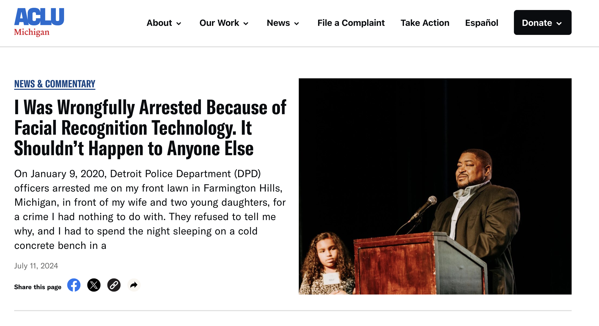
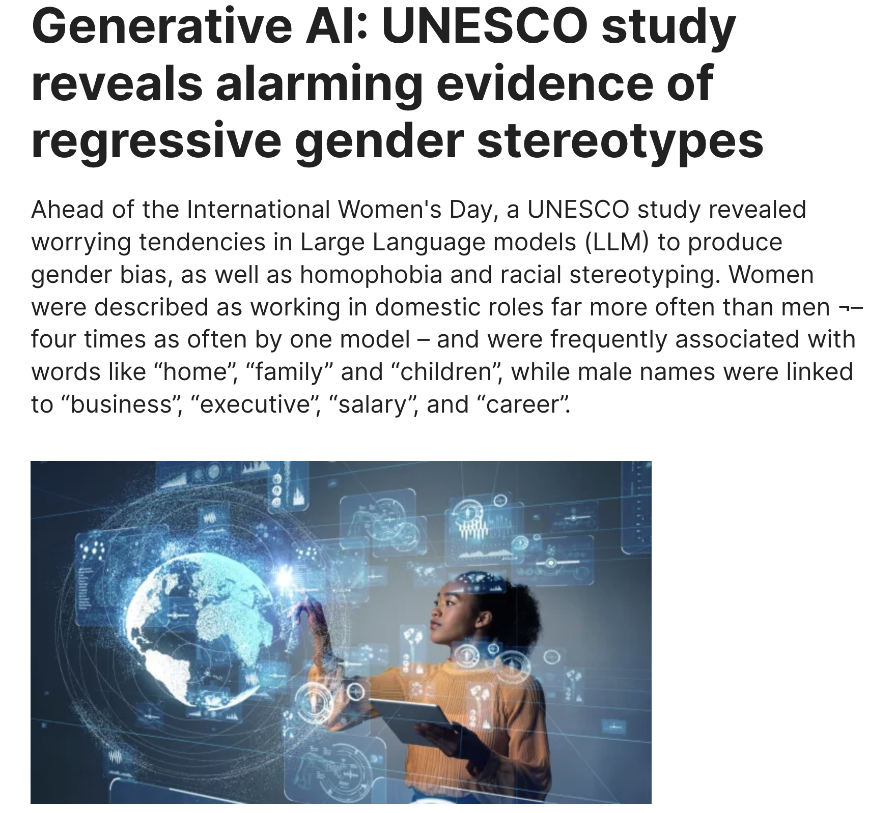
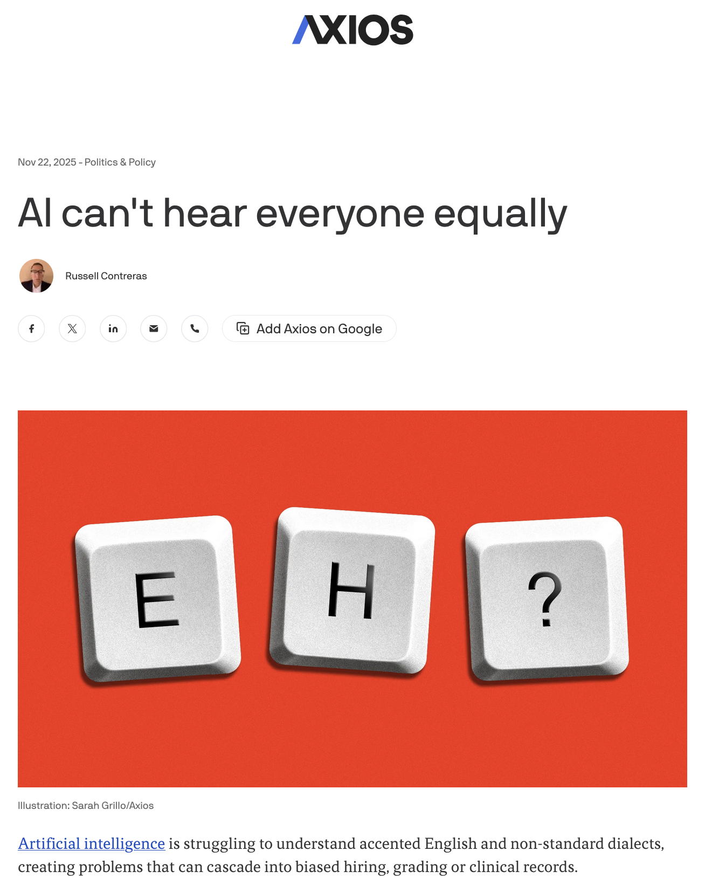
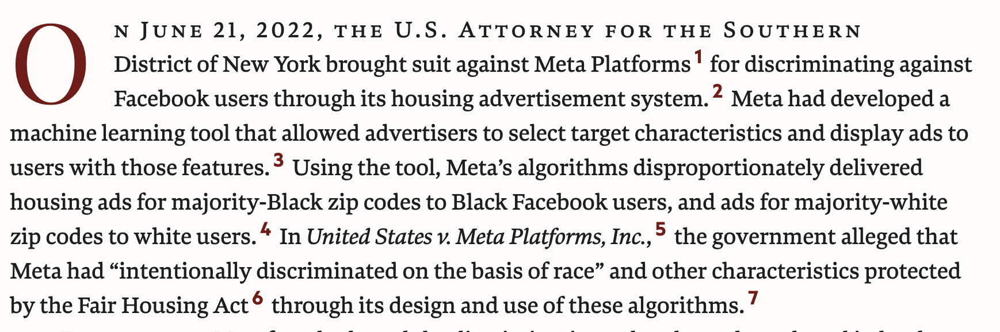
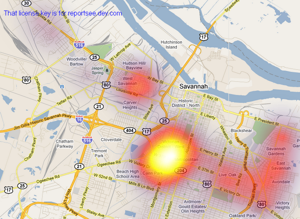

```{r setup, include=FALSE}
options(htmltools.dir.version = FALSE)
library(knitr)
opts_chunk$set(
  prompt = T,
  fig.align = "center",
  dpi = 300,
  cache = T,
  engine.opts = list(bash = "-l")
)

knit_hooks$set(
  prompt = function(before, options, envir) {
    options(
      prompt = if (options$engine %in% c("sh", "bash", "zsh")) "$ " else "R> ",
      continue = if (options$engine %in% c("sh", "bash", "zsh")) "$ " else "+ "
    )
  }
)

options(repos = c(CRAN = "https://cran.rstudio.com/"))

if (!require("fontawesome", character.only = TRUE)) {
  install.packages("fontawesome", dependencies = TRUE)
  library(fontawesome, character.only = TRUE)
}
```

# Día 5: Ética, sesgo y cierre {background-color="#2d4563"}

## Repaso del Día 4

:::{style="margin-top: 20px; font-size: 28px;"}
:::{.columns}
:::{.column width=50%}
- Los [LLMs]{.alert} predicen el siguiente token; esa tarea simple genera capacidades complejas
- [Embeddings]{.alert} y [atención]{.alert} permiten entender contexto y significado
- El [prompt engineering]{.alert} es clave: PTCF, temperatura, few-shot, CoT
- Las [alucinaciones]{.alert} son un riesgo real; RAG ayuda a mitigarlas
- [ellmer]{.alert} permite usar LLMs desde R para anotación, clasificación y generación de datos
:::

:::{.column width=50%}
:::{style="text-align: center; font-size: 22px;"}
**Hoy: las preguntas difíciles**

- ¿Los sistemas de IA son [justos]{.alert}?
- ¿De dónde viene el [sesgo]{.alert}?
- ¿Se puede [arreglar]{.alert}?
- ¿Quién [decide]{.alert} qué es justo?
- ¿Cómo [regulamos]{.alert} la IA?

Y al final: sus [mini-propuestas]{.alert} de investigación.
:::
:::
:::
:::

## Agenda del último día

:::{style="margin-top: 20px; font-size: 26px;"}

:::{.columns}
:::{.column width=50%}
**Sesión 5.1: Tipos de sesgo (~1 h)**

- Una historia para empezar
- Taxonomía del sesgo algorítmico
- Casos en América Latina
- El ciclo de vida del sesgo
- Bucles de retroalimentación

**Sesión 5.2: Detección y regulación (~1 h)**

- Métricas de equidad
- Detección y mitigación
- El teorema de imposibilidad
- Regulación (EU AI Act, región)
:::

:::{.column width=50%}
**Sesión 5.3: Laboratorio (~2 h)**

- Taller de auditoría de sesgo
- Cálculo de métricas de equidad
- Análisis de casos reales
- Discusión grupal

**Sesión 5.4: Cierre (~2 h)**

- Mini-propuestas de investigación
- Presentaciones breves (5 min)
- Recursos y próximos pasos
- Cierre del curso
:::
:::
:::

# Una historia para empezar {background-color="#2d4563"}

## Robert Williams, Detroit, 2020

:::{style="margin-top: 30px; font-size: 23px;"}
:::{.columns}
:::{.column width=55%}
- Robert Julian-Borchak Williams fue [arrestado frente a su familia]{.alert} en Detroit
- Acusado de robar relojes en una tienda
- Detenido durante [30 horas]{.alert}
- Luego liberado: [persona equivocada]{.alert}

**¿Qué pasó?**

- Un sistema de reconocimiento facial comparó su foto del carnet de conducir con imágenes borrosas de vigilancia
- El algoritmo se [equivocó]{.alert}
- Robert es afroamericano. Las investigaciones muestran que el reconocimiento facial tiene [tasas de error más altas]{.alert} con rostros de piel oscura
- [No fue un error de software. Así fue construido el sistema]{.alert}
:::

:::{.column width=45%}
:::{style="text-align: center;"}
[{width="100%"}](#){data-modal-type="image" data-modal-url="figures/robert-williams.png"}

Fuente: [ACLU](https://www.aclumich.org/news/i-was-wrongfully-arrested-because-facial-recognition-technology-it-shouldnt-happen-anyone-else/); [NPR (2020)](https://www.npr.org/2020/06/24/882683463/the-computer-got-it-wrong-how-facial-recognition-led-to-a-false-arrest-in-michig)
:::
:::
:::
:::

# ¿Qué es el sesgo algorítmico? {background-color="#2d4563"}

## Definir el sesgo: es complicado

:::{style="margin-top: 30px; font-size: 22px;"}
:::{.columns}
:::{.column width=55%}
**"Sesgo" significa cosas diferentes:**

| Contexto | Significado | Ejemplo |
|----------|-------------|---------|
| **Estadístico** | Desviación sistemática | Estimador sesgado |
| **Cognitivo** | Atajos mentales | Sesgo de confirmación |
| **Cultural** | Suposiciones aprendidas | "Los doctores son hombres" |
| **Algorítmico** | Injusticia sistemática | Diferentes tasas de error por grupo |
| **Histórico** | Desigualdades pasadas | Menos datos sobre minorías |

**En IA, sesgo típicamente significa:**

> Un sistema que produce [resultados sistemáticamente injustos]{.alert} para ciertos grupos de personas.

Pero, ¿quién define "injusto"? Esa es la parte difícil.
:::

:::{.column width=45%}
:::{style="text-align: center; margin-top: 30px;"}
[{width="100%"}](#){data-modal-type="image" data-modal-url="figures/bias-types.jpg"}

Fuente: [NIST](https://www.nist.gov/news-events/news/2022/03/theres-more-ai-bias-biased-data-nist-report-highlights)
:::
:::
:::
:::

## El problema del espejo: la IA nos refleja

:::{style="margin-top: 30px; font-size: 22px;"}
:::{.columns}
:::{.column width=55%}
> ¿La IA es sesgada, o simplemente [nos muestra lo que ya somos]{.alert}?

- La IA aprende de [datos generados por humanos]{.alert}
- Los datos históricos contienen discriminación histórica
- Si los humanos tomaron decisiones sesgadas, la IA aprende esos patrones
- Y la IA puede [amplificar]{.alert} los sesgos existentes a escala

**Ejemplo: word embeddings**

- "Hombre" es a "Doctor" como "Mujer" es a... "Enfermera" ([Bolukbasi et al., 2016](https://arxiv.org/abs/1607.06520))
- La IA aprendió esto de [millones de textos humanos]{.alert}
- Recogió [nuestro propio sexismo]{.alert} del texto
- Si el sesgo viene de nosotros, ¿eso hace a la IA menos responsable, o más?
:::

:::{.column width=45%}
:::{style="text-align: center;"}
[{width="80%"}](#){data-modal-type="image" data-modal-url="figures/ai-mirror.png"}

Fuente: [UNESCO](https://www.unesco.org/en/articles/generative-ai-unesco-study-reveals-alarming-evidence-regressive-gender-stereotypes)
:::
:::
:::
:::

# Tipos de sesgo {background-color="#2d4563"}

## Una taxonomía del sesgo

:::{style="margin-top: 30px; font-size: 24px;"}
:::{style="text-align: center;"}
| Tipo de sesgo | Cuándo ocurre | Ejemplo |
|---------------|--------------|---------|
| [Histórico]{.alert} | Decisiones pasadas codificadas en datos | Datos de crédito de una era discriminatoria |
| [Representación]{.alert} | Grupos subrepresentados | Pocas caras de piel oscura en el entrenamiento |
| [Medición]{.alert} | Proxies para conceptos no medibles | Usar código postal para solvencia |
| [Agregación]{.alert} | Tratar grupos diversos como uno | "Un modelo para todos" falla |
| [Evaluación]{.alert} | Benchmarks incorrectos | Probar con datos no representativos |
| [Despliegue]{.alert} | Modelo usado en contexto equivocado | Modelo de EE.UU. aplicado globalmente |
:::

:::{style="margin-top: 20px; font-size: 22px;"}
El sesgo puede entrar en [cualquier etapa]{.alert}: recolección de datos, etiquetado, entrenamiento, evaluación, despliegue, uso.
:::
:::

## Sesgo histórico: el pasado codificado

:::{style="margin-top: 30px; font-size: 22px;"}
:::{.columns}
:::{.column width=55%}
Ocurre cuando la [discriminación pasada]{.alert} se incorpora a los datos de entrenamiento, aunque los datos reflejen con precisión el mundo real de ese momento.

**El caso de Amazon (2018)** ([Dastin, Reuters](https://www.reuters.com/article/world/insight-amazon-scraps-secret-ai-recruiting-tool-that-showed-bias-against-women-idUSKCN1MK0AG/)):

- Amazon construyó una IA para filtrar CVs
- Entrenada con [10 años de contrataciones pasadas]{.alert}
- Las contrataciones pasadas eran mayoritariamente masculinas
- La IA aprendió: [penalizar CVs que mencionaran "mujeres"]{.alert}
    - "Capitana del club de ajedrez femenino" → penalizada
    - Universidad exclusivamente femenina → penalizada
- Amazon desechó la herramienta

Los datos eran "precisos": reflejaban las contrataciones reales de Amazon. Pero esas contrataciones eran sesgadas.
:::

:::{.column width=45%}
:::{style="text-align: center;"}
[{width="90%"}](#){data-modal-type="image" data-modal-url="figures/amazon-hiring.png"}

Fuente: [Reuters](https://www.reuters.com/article/world/insight-amazon-scraps-secret-ai-recruiting-tool-that-showed-bias-against-women-idUSKCN1MK0AG/)

:::{style="margin-top: 15px; background: rgba(230, 57, 70, 0.1); padding: 15px; border-radius: 10px;"}
Datos precisos $\neq$ datos justos.
:::
:::
:::
:::
:::

## Sesgo de representación: ¿quién falta?

:::{style="margin-top: 30px; font-size: 22px;"}
:::{.columns}
:::{.column width=55%}
Cuando ciertos grupos están [subrepresentados]{.alert} en los datos de entrenamiento, el modelo funciona mal para ellos.

**Ejemplo: reconocimiento facial** ([Buolamwini y Gebru, 2018](https://proceedings.mlr.press/v81/buolamwini18a.html))

- Sistemas comerciales de reconocimiento facial (peor de los tres sistemas evaluados):
    - Hombres de piel clara: [0,8% de error]{.alert}
    - Mujeres de piel oscura: [34,7% de error]{.alert}
    - Un rendimiento [43 veces peor]{.alert} para un grupo

**Ejemplo: asistentes de voz**

- Entrenados principalmente con acentos estadounidenses y británicos
- Resultado: mayor tasa de error para hablantes no nativos, acentos regionales, voces de mujeres

[Si no estás en los datos de entrenamiento, el modelo no tiene nada que aprender sobre ti.]{.alert}
:::

:::{.column width=45%}
:::{style="text-align: center;"}
[{width="100%"}](#){data-modal-type="image" data-modal-url="figures/rekognition.webp"}

Fuente: [Joy Buolamwini](https://medium.com/@Joy.Buolamwini/)

<br>

[{width="60%"}](#){data-modal-type="image" data-modal-url="figures/voice-bias.png"}
:::
:::
:::
:::

## Sesgo de medición: proxies problemáticos

:::{style="margin-top: 30px; font-size: 22px;"}
:::{.columns}
:::{.column width=55%}
Usar un [proxy medible]{.alert} para algo que realmente nos importa, pero el proxy no funciona igual para todos.

**Ejemplo: código postal como proxy crediticio**

- Los bancos no pueden usar raza para decidir préstamos
- Pero pueden usar [códigos postales]{.alert}
- Los códigos postales correlacionan fuertemente con raza debido a la segregación residencial
- Resultado: una variable "neutral" que codifica raza

**Otros proxies problemáticos:**

| Lo que queremos | Proxy usado | Problema |
|----------------|------------|---------|
| Inteligencia | Tests estandarizados | Refleja acceso a preparación |
| Calidad laboral | Antigüedad | Penaliza a cuidadores |
| Necesidades de salud | Gasto pasado | Refleja barreras de acceso |

[Se puede eliminar la raza de los datos y terminar con un modelo racialmente sesgado]{.alert} (ver [Obermeyer et al., 2019](https://doi.org/10.1126/science.aax2342), sobre sesgo racial en algoritmos de salud en EE.UU.).
:::

:::{.column width=45%}
:::{style="text-align: center; margin-top: 30px;"}
[{width="100%"}](#){data-modal-type="image" data-modal-url="figures/proxy-bias.png"}

Fuente: [Harvard Law Review](https://harvardlawreview.org/print/vol-138/resetting-antidiscrimination-law-in-the-age-of-ai/)
:::
:::
:::
:::

## Sesgo de agregación: un modelo no sirve para todos

:::{style="margin-top: 30px; font-size: 22px;"}
:::{.columns}
:::{.column width=55%}
Ocurre cuando un modelo [trata a grupos diversos como si fueran homogéneos]{.alert}, ignorando diferencias que afectan los resultados.

**Ejemplo: diabetes y etnicidad** ([Obermeyer et al., 2019](https://doi.org/10.1126/science.aax2342))

- Modelos de riesgo de diabetes entrenados principalmente con datos de poblaciones europeas
- La [hemoglobina glicosilada (HbA1c)]{.alert} se usa como indicador
- Pero la HbA1c funciona diferente en poblaciones afrodescendientes e indígenas
- Resultado: [subdiagnóstico]{.alert} en grupos no europeos

**En ciencias sociales:**

- Un modelo de satisfacción democrática entrenado con datos de Europa puede [fallar en América Latina]{.alert}
- Los patrones de participación política difieren por contexto cultural
- Las escalas de encuesta tienen [significados diferentes]{.alert} entre culturas
:::

:::{.column width=45%}
:::{style="text-align: center; margin-top: 30px;"}
[{width="100%"}](#){data-modal-type="image" data-modal-url="figures/aggregation-bias.png"}

Fuente: [AI Fairness 360](https://aif360.res.ibm.com/)

:::{style="margin-top: 15px; background: rgba(45, 69, 99, 0.1); padding: 15px; border-radius: 10px;"}
[Un modelo "global" puede ser injusto localmente.]{.alert}
:::
:::
:::
:::
:::

## Sesgo de evaluación y despliegue

:::{style="margin-top: 30px; font-size: 22px;"}
:::{.columns}
:::{.column width=50%}
**Sesgo de evaluación**

Cuando los [benchmarks de prueba]{.alert} no son representativos de la población real.

**Ejemplo:**

- Un modelo de detección de discurso de odio en español
- Evaluado con datos de España
- Desplegado en [Argentina]{.alert}: no entiende "boludo", "negro" (coloquial), o el voseo
- Las métricas de evaluación [no predijeron]{.alert} el mal desempeño

**Problema:** los datasets de prueba suelen venir de los mismos lugares que los de entrenamiento
:::

:::{.column width=50%}
**Sesgo de despliegue**

Cuando un modelo se usa en un [contexto diferente]{.alert} al que fue diseñado.

**Ejemplos:**

| Modelo entrenado en... | Desplegado en... | Problema |
|------------------------|------------------|----------|
| EE.UU. | Uruguay | Diferencias culturales |
| Adultos | Adolescentes | Lenguaje diferente |
| 2015 | 2025 | Cambios temporales |
| Texto formal | Redes sociales | Registro diferente |

:::{style="margin-top: 15px; background: rgba(230, 57, 70, 0.1); padding: 15px; border-radius: 10px;"}
[El rendimiento del modelo no viaja bien entre contextos.]{.alert}
:::
:::
:::
:::

## Bucles de retroalimentación

:::{style="margin-top: 30px; font-size: 20px;"}
:::{.columns}
:::{.column width=55%}
**¿Qué es un bucle de retroalimentación?**

Cuando las [predicciones del algoritmo influyen en los datos]{.alert} que se usarán para entrenarlo en el futuro.

**Ejemplo: vigilancia predictiva** ([Ensign et al., 2018](https://doi.org/10.1145/3219819.3220109); [Lum e Isaac, 2016](https://doi.org/10.1111/j.1740-9713.2016.00960.x))

1. El algoritmo predice zonas de alta criminalidad basándose en [datos de arrestos pasados]{.alert}
2. La policía patrulla esas zonas con más intensidad
3. Más patrullas → más arrestos (haya o no más crimen)
4. Los nuevos datos de arrestos confirman las predicciones del algoritmo
5. El algoritmo se vuelve [más confiado]{.alert} en patrones sesgados
6. El ciclo continúa...

**Por qué es peligroso:**

- El algoritmo crea [evidencia para sus propias predicciones]{.alert}
- El sesgo se [acumula]{.alert} con el tiempo
- Después de varios ciclos, nadie puede saber cuál era la tasa real de criminalidad
:::

:::{.column width=45%}
:::{style="text-align: center;"}
[{width="100%"}](#){data-modal-type="image" data-modal-url="figures/feedback-loop.png"}

Fuente: [SpotCrime](https://blog.spotcrime.com/2011/06/savanna-ga-heat-map.html)

:::{style="margin-top: 15px; background: rgba(230, 57, 70, 0.1); padding: 15px; border-radius: 10px;"}
**Otros bucles:**

- Denegaciones de crédito → peor historial → más denegaciones
- Filtros de CVs → equipo homogéneo → más sesgo en datos de entrenamiento
:::
:::
:::
:::
:::

## Casos de sesgo en América Latina

:::{style="margin-top: 30px; font-size: 20px;"}
:::{.columns}
:::{.column width=50%}
**Brasil: reconocimiento facial en Carnaval**

- Policía de Bahía usó reconocimiento facial en el Carnaval de Salvador (2019)
- [42 arrestos]{.alert} basados en coincidencias del sistema
- Varios casos de [personas inocentes detenidas]{.alert}
- El sistema tenía mayor tasa de error con [rostros afrobrasileños]{.alert}
- Fuente: [Coding Rights](https://codingrights.org/)

**Argentina: scoring social en ANSES**

- Sistema de perfilado para detectar fraude en beneficios sociales
- Usaba variables como [barrio de residencia]{.alert} y patrones de consumo
- Críticas por [falta de transparencia]{.alert} y posible discriminación
- Sin auditoría pública del algoritmo
:::

:::{.column width=50%}
**Chile: algoritmo de riesgo delictivo**

- Sistema de evaluación de riesgo en el sistema penal juvenil
- Basado en [historial familiar]{.alert} y contexto socioeconómico
- Riesgo de [perpetuar desigualdad]{.alert}: jóvenes de barrios pobres reciben peores evaluaciones
- Debate sobre uso de variables no modificables

**Colombia: VeriTran en Bogotá**

- Sistema de reconocimiento facial en TransMilenio
- Objetivo: detectar evasores de pasaje
- Preocupaciones sobre [vigilancia masiva]{.alert} y sesgo racial
- Falta de consentimiento informado

:::{style="margin-top: 10px; background: rgba(45, 69, 99, 0.1); padding: 10px; border-radius: 10px;"}
[Los mismos problemas de sesgo del norte global se replican en la región, a menudo con menos protecciones.]{.alert}
:::
:::
:::
:::

## El sesgo a lo largo del ciclo de vida

:::{style="margin-top: 30px; font-size: 22px; text-align: center;"}
[{width="100%"}](#){data-modal-type="image" data-modal-url="figures/bias-lifecycle.png"}

Arreglar los datos de entrenamiento no sirve si el benchmark de evaluación también es sesgado. Hay que verificar [cada etapa]{.alert}.
:::

# Para reflexionar {background-color="#2d4563"}

## ¿Por qué es tan difícil detectar el sesgo?

:::{style="margin-top: 30px; font-size: 22px;"}
:::{.columns}
:::{.column width=50%}
**Desafíos técnicos**

- El sesgo puede estar [oculto]{.alert} en variables aparentemente neutrales
- Los modelos de caja negra no revelan su lógica interna
- El rendimiento agregado puede ocultar disparidades por grupo
- Los datos de prueba pueden tener los mismos sesgos que los de entrenamiento
- El sesgo emerge en la [interacción]{.alert} de variables, no en variables individuales

**Desafíos institucionales**

- Falta de [acceso]{.alert} a los algoritmos (propiedad intelectual)
- Sin [métricas estándar]{.alert} de equidad
- Pocos [incentivos]{.alert} para auditar
- Quien diseña raramente es quien sufre el sesgo
:::

:::{.column width=50%}
**Desafíos conceptuales**

- ¿Qué [grupos]{.alert} deberían protegerse?
- ¿Qué [variables]{.alert} nunca deberían usarse?
- ¿Cuánta [disparidad]{.alert} es aceptable?
- ¿Quién [decide]{.alert} las respuestas a estas preguntas?

:::{style="margin-top: 20px; background: rgba(45, 69, 99, 0.1); padding: 15px; border-radius: 10px;"}
**Ejemplo:**

Un modelo de scoring crediticio no usa raza. Pero usa código postal, que correlaciona con raza por segregación histórica.

¿El modelo es sesgado? ¿Debería prohibirse usar código postal? ¿O el problema es la segregación, no el modelo?
:::
:::
:::
:::

## Actividad: identificar el sesgo

:::{style="margin-top: 30px; font-size: 22px;"}
:::{.columns}
:::{.column width=50%}
**Caso para analizar:**

Una universidad uruguaya quiere usar IA para predecir qué estudiantes tienen [riesgo de deserción]{.alert} y ofrecerles apoyo temprano.

El modelo usa:
- Notas del primer semestre
- Asistencia a clases
- Barrio de residencia
- Si trabaja además de estudiar
- Tipo de liceo de procedencia (público/privado)

El modelo tiene [85% de precisión]{.alert} en predecir deserción.
:::

:::{.column width=50%}
**Preguntas para discutir (10 min):**

1. ¿Qué tipos de sesgo podrían estar presentes?
2. ¿Qué variables son problemáticas y por qué?
3. ¿El modelo [ayuda]{.alert} a los estudiantes vulnerables o los [estigmatiza]{.alert}?
4. ¿Cómo verificarían si el modelo funciona igual para todos los grupos?
5. ¿Qué información necesitarían para auditar este modelo?

:::{style="margin-top: 20px; background: rgba(230, 57, 70, 0.1); padding: 15px; border-radius: 10px;"}
**Recuerden:** un modelo puede ser [preciso en promedio]{.alert} pero [injusto para ciertos grupos]{.alert}.
:::
:::
:::
:::

## Resumen de la sesión

:::{style="margin-top: 30px; font-size: 24px;"}
:::{.columns}
:::{.column width=50%}
**Tipos de sesgo:**

- [Histórico]{.alert}: discriminación pasada codificada
- [Representación]{.alert}: grupos subrepresentados
- [Medición]{.alert}: proxies problemáticos
- [Agregación]{.alert}: un modelo para todos
- [Evaluación]{.alert}: benchmarks no representativos
- [Despliegue]{.alert}: contexto equivocado
:::

:::{.column width=50%}
**Ideas clave:**

- La IA [hereda]{.alert} sesgos humanos de los datos
- El sesgo puede entrar en [cualquier etapa]{.alert}
- Los [bucles de retroalimentación]{.alert} amplifican el sesgo
- América Latina [replica]{.alert} problemas del norte global
- Detectar sesgo es [difícil]{.alert} técnica e institucionalmente
:::
:::

:::{style="margin-top: 20px; text-align: center;"}
[En la próxima sesión: ¿cómo detectamos, medimos y mitigamos el sesgo? Y, ¿cómo se regula la IA?]{.alert}
:::
:::

# Nos vemos en la sesión 5.2 {background-color="#2d4563"}
