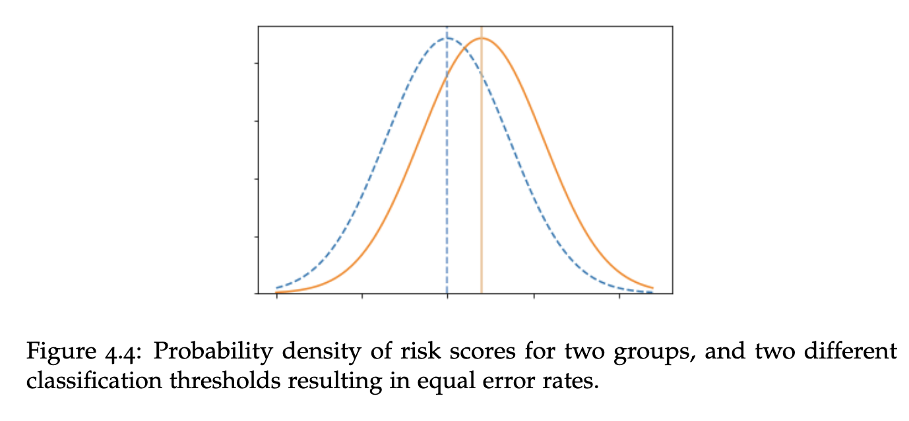

```{r setup, include=FALSE}
options(htmltools.dir.version = FALSE)
library(knitr)
opts_chunk$set(
  prompt = T,
  fig.align = "center",
  dpi = 300,
  cache = T,
  engine.opts = list(bash = "-l")
)

knit_hooks$set(
  prompt = function(before, options, envir) {
    options(
      prompt = if (options$engine %in% c("sh", "bash", "zsh")) "$ " else "R> ",
      continue = if (options$engine %in% c("sh", "bash", "zsh")) "$ " else "+ "
    )
  }
)

options(repos = c(CRAN = "https://cran.rstudio.com/"))

if (!require("fontawesome", character.only = TRUE)) {
  install.packages("fontawesome", dependencies = TRUE)
  library(fontawesome, character.only = TRUE)
}
```

# Día 5: Ética, sesgo y cierre {background-color="#2d4563"}

## Repaso del Día 4

:::{style="margin-top: 20px; font-size: 28px;"}
:::{.columns}
:::{.column width=50%}
- Los [LLMs]{.alert} predicen el siguiente token; esa tarea simple genera capacidades complejas
- [Embeddings]{.alert} y [atención]{.alert} permiten entender contexto y significado
- El [prompt engineering]{.alert} es clave: PTCF, temperatura, few-shot, CoT
- Las [alucinaciones]{.alert} son un riesgo real; RAG ayuda a mitigarlas
- [ellmer]{.alert} permite usar LLMs desde R para anotación, clasificación y generación de datos
:::

:::{.column width=50%}
:::{style="text-align: center; font-size: 22px;"}
**Hoy: las preguntas difíciles**

- ¿Los sistemas de IA son [justos]{.alert}?
- ¿De dónde viene el [sesgo]{.alert}?
- ¿Se puede [arreglar]{.alert}?
- ¿Quién [decide]{.alert} qué es justo?
- ¿Cómo [regulamos]{.alert} la IA?

Y al final: sus [mini-propuestas]{.alert} de investigación.
:::
:::
:::
:::

## Agenda del último día

:::{style="margin-top: 20px; font-size: 32px;"}

:::{.columns}
:::{.column width=50%}
**Sesión 5.1: Ética y sesgo (~2 h)**

- Una historia para empezar
- Tipos de sesgo algorítmico
- El ciclo de vida del sesgo
- Bucles de retroalimentación
- El teorema de imposibilidad
- Regulación en la región
:::

:::{.column width=50%}
**Sesión 5.2: Cierre (~2 h)**

- Integración de IA en investigación
- Taller de mini-propuestas
- Presentaciones breves (5 min)
- Discusión y cierre del curso
:::
:::
:::

# Una historia para empezar {background-color="#2d4563"}

## Robert Williams, Detroit, 2020

:::{style="margin-top: 30px; font-size: 23px;"}
:::{.columns}
:::{.column width=55%}
- Robert Julian-Borchak Williams fue [arrestado frente a su familia]{.alert} en Detroit
- Acusado de robar relojes en una tienda
- Detenido durante [30 horas]{.alert}
- Luego liberado: [persona equivocada]{.alert}

**¿Qué pasó?**

- Un sistema de reconocimiento facial comparó su foto del carnet de conducir con imágenes borrosas de vigilancia
- El algoritmo se [equivocó]{.alert}
- Robert es afroamericano. Las investigaciones muestran que el reconocimiento facial tiene [tasas de error más altas]{.alert} con rostros de piel oscura
- [No fue un error de software. Así fue construido el sistema]{.alert}
:::

:::{.column width=45%}
:::{style="text-align: center;"}
[{width="100%"}](#){data-modal-type="image" data-modal-url="figures/robert-williams.png"}

Fuente: [ACLU](https://www.aclumich.org/news/i-was-wrongfully-arrested-because-facial-recognition-technology-it-shouldnt-happen-anyone-else/)
:::
:::
:::
:::

# ¿Qué es el sesgo algorítmico? {background-color="#2d4563"}

## Definir el sesgo: es complicado

:::{style="margin-top: 30px; font-size: 22px;"}
:::{.columns}
:::{.column width=55%}
**"Sesgo" significa cosas diferentes:**

| Contexto | Significado | Ejemplo |
|----------|-------------|---------|
| **Estadístico** | Desviación sistemática | Estimador sesgado |
| **Cognitivo** | Atajos mentales | Sesgo de confirmación |
| **Cultural** | Suposiciones aprendidas | "Los doctores son hombres" |
| **Algorítmico** | Injusticia sistemática | Diferentes tasas de error por grupo |
| **Histórico** | Desigualdades pasadas | Menos datos sobre minorías |

**En IA, sesgo típicamente significa:**

> Un sistema que produce [resultados sistemáticamente injustos]{.alert} para ciertos grupos de personas.

Pero, ¿quién define "injusto"? Esa es la parte difícil.
:::

:::{.column width=45%}
:::{style="text-align: center; margin-top: 30px;"}
[{width="100%"}](#){data-modal-type="image" data-modal-url="figures/bias-types.jpg"}

Fuente: [NIST](https://www.nist.gov/news-events/news/2022/03/theres-more-ai-bias-biased-data-nist-report-highlights)
:::
:::
:::
:::

## El problema del espejo: la IA nos refleja

:::{style="margin-top: 30px; font-size: 22px;"}
:::{.columns}
:::{.column width=55%}
> ¿La IA es sesgada, o simplemente [nos muestra lo que ya somos]{.alert}?

- La IA aprende de [datos generados por humanos]{.alert}
- Los datos históricos contienen discriminación histórica
- Si los humanos tomaron decisiones sesgadas, la IA aprende esos patrones
- Y la IA puede [amplificar]{.alert} los sesgos existentes a escala

**Ejemplo: word embeddings**

- "Hombre" es a "Doctor" como "Mujer" es a... "Enfermera"
- La IA aprendió esto de [millones de textos humanos]{.alert}
- Recogió [nuestro propio sexismo]{.alert} del texto
- Si el sesgo viene de nosotros, ¿eso hace a la IA menos responsable, o más?
:::

:::{.column width=45%}
:::{style="text-align: center;"}
[{width="80%"}](#){data-modal-type="image" data-modal-url="figures/ai-mirror.png"}

Fuente: [UNESCO](https://www.unesco.org/en/articles/generative-ai-unesco-study-reveals-alarming-evidence-regressive-gender-stereotypes)
:::
:::
:::
:::

# Tipos de sesgo {background-color="#2d4563"}

## Una taxonomía del sesgo

:::{style="margin-top: 30px; font-size: 24px;"}
:::{style="text-align: center;"}
| Tipo de sesgo | Cuándo ocurre | Ejemplo |
|---------------|--------------|---------|
| [Histórico]{.alert} | Decisiones pasadas codificadas en datos | Datos de crédito de una era discriminatoria |
| [Representación]{.alert} | Grupos subrepresentados | Pocas caras de piel oscura en el entrenamiento |
| [Medición]{.alert} | Proxies para conceptos no medibles | Usar código postal para solvencia |
| [Agregación]{.alert} | Tratar grupos diversos como uno | "Un modelo para todos" falla |
| [Evaluación]{.alert} | Benchmarks incorrectos | Probar con datos no representativos |
| [Despliegue]{.alert} | Modelo usado en contexto equivocado | Modelo de EE.UU. aplicado globalmente |
:::

:::{style="margin-top: 20px; font-size: 22px;"}
El sesgo puede entrar en [cualquier etapa]{.alert}: recolección de datos, etiquetado, entrenamiento, evaluación, despliegue, uso.
:::
:::

## Sesgo histórico: el pasado codificado

:::{style="margin-top: 30px; font-size: 22px;"}
:::{.columns}
:::{.column width=55%}
Ocurre cuando la [discriminación pasada]{.alert} se incorpora a los datos de entrenamiento, aunque los datos reflejen con precisión el mundo real de ese momento.

**El caso de Amazon (2018):**

- Amazon construyó una IA para filtrar CVs
- Entrenada con [10 años de contrataciones pasadas]{.alert}
- Las contrataciones pasadas eran mayoritariamente masculinas
- La IA aprendió: [penalizar CVs que mencionaran "mujeres"]{.alert}
    - "Capitana del club de ajedrez femenino" → penalizada
    - Universidad exclusivamente femenina → penalizada
- Amazon desechó la herramienta

Los datos eran "precisos": reflejaban las contrataciones reales de Amazon. Pero esas contrataciones eran sesgadas.
:::

:::{.column width=45%}
:::{style="text-align: center;"}
[{width="90%"}](#){data-modal-type="image" data-modal-url="figures/amazon-hiring.png"}

Fuente: [Reuters](https://www.reuters.com/article/world/insight-amazon-scraps-secret-ai-recruiting-tool-that-showed-bias-against-women-idUSKCN1MK0AG/)

:::{style="margin-top: 15px; background: rgba(230, 57, 70, 0.1); padding: 15px; border-radius: 10px;"}
Datos precisos $\neq$ datos justos.
:::
:::
:::
:::
:::

## Sesgo de representación: ¿quién falta?

:::{style="margin-top: 30px; font-size: 22px;"}
:::{.columns}
:::{.column width=55%}
Cuando ciertos grupos están [subrepresentados]{.alert} en los datos de entrenamiento, el modelo funciona mal para ellos.

**Ejemplo: reconocimiento facial** (Buolamwini y Gebru, 2018)

- Sistemas comerciales de reconocimiento facial:
    - Hombres de piel clara: [0,8% de error]{.alert}
    - Mujeres de piel oscura: [34,7% de error]{.alert}
    - Un rendimiento [43 veces peor]{.alert} para un grupo

**Ejemplo: asistentes de voz**

- Entrenados principalmente con acentos estadounidenses y británicos
- Resultado: mayor tasa de error para hablantes no nativos, acentos regionales, voces de mujeres

[Si no estás en los datos de entrenamiento, el modelo no tiene nada que aprender sobre ti.]{.alert}
:::

:::{.column width=45%}
:::{style="text-align: center;"}
[{width="100%"}](#){data-modal-type="image" data-modal-url="figures/rekognition.webp"}

Fuente: [Joy Buolamwini](https://medium.com/@Joy.Buolamwini/)

<br>

[{width="60%"}](#){data-modal-type="image" data-modal-url="figures/voice-bias.png"}
:::
:::
:::
:::

## Sesgo de medición: proxies problemáticos

:::{style="margin-top: 30px; font-size: 22px;"}
:::{.columns}
:::{.column width=55%}
Usar un [proxy medible]{.alert} para algo que realmente nos importa, pero el proxy no funciona igual para todos.

**Ejemplo: código postal como proxy crediticio**

- Los bancos no pueden usar raza para decidir préstamos
- Pero pueden usar [códigos postales]{.alert}
- Los códigos postales correlacionan fuertemente con raza debido a la segregación residencial
- Resultado: una variable "neutral" que codifica raza

**Otros proxies problemáticos:**

| Lo que queremos | Proxy usado | Problema |
|----------------|------------|---------|
| Inteligencia | Tests estandarizados | Refleja acceso a preparación |
| Calidad laboral | Antigüedad | Penaliza a cuidadores |
| Necesidades de salud | Gasto pasado | Refleja barreras de acceso |

[Se puede eliminar la raza de los datos y terminar con un modelo racialmente sesgado.]{.alert}
:::

:::{.column width=45%}
:::{style="text-align: center; margin-top: 30px;"}
[{width="100%"}](#){data-modal-type="image" data-modal-url="figures/proxy-bias.png"}

Fuente: [Harvard Law Review](https://harvardlawreview.org/print/vol-138/resetting-antidiscrimination-law-in-the-age-of-ai/)
:::
:::
:::
:::

## Bucles de retroalimentación

:::{style="margin-top: 30px; font-size: 20px;"}
:::{.columns}
:::{.column width=55%}
**¿Qué es un bucle de retroalimentación?**

Cuando las [predicciones del algoritmo influyen en los datos]{.alert} que se usarán para entrenarlo en el futuro.

**Ejemplo: vigilancia predictiva**

1. El algoritmo predice zonas de alta criminalidad basándose en [datos de arrestos pasados]{.alert}
2. La policía patrulla esas zonas con más intensidad
3. Más patrullas → más arrestos (haya o no más crimen)
4. Los nuevos datos de arrestos confirman las predicciones del algoritmo
5. El algoritmo se vuelve [más confiado]{.alert} en patrones sesgados
6. El ciclo continúa...

**Por qué es peligroso:**

- El algoritmo crea [evidencia para sus propias predicciones]{.alert}
- El sesgo se [acumula]{.alert} con el tiempo
- Después de varios ciclos, nadie puede saber cuál era la tasa real de criminalidad
:::

:::{.column width=45%}
:::{style="text-align: center;"}
[{width="100%"}](#){data-modal-type="image" data-modal-url="figures/feedback-loop.png"}

Fuente: [SpotCrime](https://blog.spotcrime.com/2011/06/savanna-ga-heat-map.html)

:::{style="margin-top: 15px; background: rgba(230, 57, 70, 0.1); padding: 15px; border-radius: 10px;"}
**Otros bucles:**

- Denegaciones de crédito → peor historial → más denegaciones
- Filtros de CVs → equipo homogéneo → más sesgo en datos de entrenamiento
:::
:::
:::
:::
:::

## El sesgo a lo largo del ciclo de vida

:::{style="margin-top: 30px; font-size: 22px; text-align: center;"}
[{width="100%"}](#){data-modal-type="image" data-modal-url="figures/bias-lifecycle.png"}

Arreglar los datos de entrenamiento no sirve si el benchmark de evaluación también es sesgado. Hay que verificar [cada etapa]{.alert}.
:::

# Las preguntas difíciles {background-color="#2d4563"}

## El teorema de imposibilidad

:::{style="margin-top: 30px; font-size: 20px;"}
:::{.columns}
:::{.column width=55%}
**Tres criterios de equidad (simplificados):**

1. **Calibración**: entre quienes reciben la misma puntuación, los resultados deben ser similares entre grupos

2. **Igualdad de falsos positivos**: los grupos deben tener tasas iguales de ser señalados erróneamente

3. **Igualdad de falsos negativos**: los grupos deben tener tasas iguales de ser ignorados erróneamente

**El teorema de imposibilidad:**

> Si las tasas base difieren entre grupos, [no se pueden satisfacer los tres criterios]{.alert} simultáneamente.

**En simple**: si el Grupo A reincide al 40% y el Grupo B al 20%, hay que elegir qué tipo de error igualar.

[No existe una solución matemáticamente "justa".]{.alert}
:::

:::{.column width=45%}
:::{style="text-align: center;"}
[{width="100%"}](#){data-modal-type="image" data-modal-url="figures/impossibility-theorem.png"}

Fuente: [Fairness and Machine Learning Book](https://fairmlbook.org/)

:::{style="margin-top: 15px; background: rgba(230, 57, 70, 0.1); padding: 15px; border-radius: 10px;"}
Ningún algoritmo puede decidir qué errores importan más. Esa es una [pregunta política y moral]{.alert}.
:::
:::
:::
:::
:::

## ¿Quién define "justo"?

:::{style="margin-top: 30px; font-size: 26px; text-align: center;"}
**Lo que cuenta como justo depende de lo que valoramos:**

:::{style="margin-top: 30px;"}
| Definición | Prioriza | Desventaja |
|------------|----------|------------|
| **Igual trato** | Consistencia | Ignora el contexto |
| **Igualdad de resultados** | Equidad | Puede requerir trato diferenciado |
| **Igual tasa de error** | Paridad entre grupos | Puede sacrificar precisión |
| **Calibración** | Precisión individual | Oculta disparidades |
:::

:::{style="margin-top: 30px;"}
- No existe un [valor por defecto neutral]{.alert}
- Quien elige la definición de equidad [determina quién se beneficia]{.alert}
- Decir "solo usamos los datos" es en sí mismo una elección
:::
:::

## Actividad: ¡hagan el trade-off!

:::{style="margin-top: 30px; font-size: 21px;"}
:::{.columns}
:::{.column width=50%}
**Están diseñando un algoritmo de aprobación de préstamos**

**Los datos muestran:**

- Grupo A: 80% paga los préstamos
- Grupo B: 60% paga los préstamos (debido a desventaja económica histórica)

**Deben elegir UNO de estos enfoques:**

1. **Mismo umbral para todos**: 70% de probabilidad de pago = aprobado
    - Resultado: más rechazos del Grupo B

2. **Misma tasa de aprobación**: ajustar umbrales para que ambos grupos tengan 50% de aprobación
    - Resultado: más impagos, mayor riesgo

3. **Misma tasa de rechazo injusto**: asegurar que el mismo % de buenos pagadores sea rechazado en ambos grupos
    - Resultado: diferentes tasas de aprobación
:::

:::{.column width=50%}
**Preguntas para discutir:**

- ¿Cuál enfoque es "más justo"?
- ¿Quién se beneficia y quién se perjudica con cada uno?
- ¿Cambiaría su respuesta si la menor tasa del Grupo B se debe a discriminación (no a capacidad)?
- ¿Debería el algoritmo intentar [corregir]{.alert} la injusticia histórica, o solo [no perpetuarla]{.alert}?

:::{style="margin-top: 20px; background: rgba(45, 69, 99, 0.1); padding: 15px; border-radius: 10px;"}
**Debatan en grupos de 3-4 personas y presenten su decisión.**
:::
:::
:::
:::

# Regulación de la IA {background-color="#2d4563"}

## Panorama regulatorio

:::{style="margin-top: 30px; font-size: 20px;"}
:::{.columns}
:::{.column width=50%}
**Unión Europea: EU AI Act (2024)**

- Primera ley integral sobre IA en el mundo
- Clasifica sistemas por [nivel de riesgo]{.alert}:
    - [Inaceptable]{.alert}: scoring social masivo, manipulación subliminal
    - [Alto riesgo]{.alert}: salud, justicia, empleo, migración → requieren auditoría
    - [Riesgo limitado]{.alert}: chatbots → deben informar que son IA
    - [Riesgo mínimo]{.alert}: filtros de spam → sin restricciones
- Multas: hasta 35 millones de euros o 7% de la facturación global

**Estados Unidos**

- Sin ley federal integral
- Regulación sectorial y estatal
- NYC: ley de auditoría de IA en contratación (2023)
- Orden ejecutiva de Biden sobre IA (2023)
:::

:::{.column width=50%}
**América Latina**

- [Uruguay]{.alert}: Ley 18.331 de Protección de Datos; Estrategia Nacional de IA (2019); URCDP como órgano de control. Referente regional en gobierno digital
- [Brasil]{.alert}: LGPD (2018) para protección de datos; proyecto de ley de IA (PL 2338/2023) en debate en el Senado
- [Chile]{.alert}: primera Política Nacional de IA (2021) en la región; proyecto de ley de neuroderechos
- [Colombia]{.alert}: marco ético de IA (2019); sandbox regulatorio
- [Argentina]{.alert}: Plan Nacional de IA (2019); ley de datos personales en actualización

**Desafíos comunes:**

- Marcos regulatorios [en construcción]{.alert}
- Brecha entre legislación y aplicación
- Dependencia de infraestructura extranjera
- Necesidad de [capacidad técnica]{.alert} en las agencias reguladoras
:::
:::
:::

## Perspectivas: ¿es solucionable el sesgo en la IA?

:::{style="margin-top: 30px; font-size: 22px;"}
:::{.columns}
:::{.column width=50%}
**Los optimistas**

- El sesgo de la IA es un [problema técnico]{.alert} con soluciones técnicas
- Mejores datos, mejores algoritmos, mejores auditorías
- La IA podría ser [menos sesgada]{.alert} que los humanos:
    - Los humanos son inconsistentes; la IA al menos es consistente
    - Las decisiones de la IA se pueden auditar; las intuiciones humanas no
- Los datasets están mejorando, la regulación avanza

> "Un algoritmo sesgado se puede reentrenar. Un gerente de contratación sesgado es más difícil de arreglar."
:::

:::{.column width=50%}
**Los escépticos**

- El sesgo de la IA refleja [problemas sociales]{.alert} que no se solucionan con código
- Hablar de "IA justa" distrae de las causas raíz
- ¿Quién define la equidad? Generalmente quienes ya tienen poder
- La IA oculta la responsabilidad humana
- Algunas decisiones no deberían automatizarse

> "No se puede arreglar un mercado inmobiliario discriminatorio ajustando un modelo de scoring crediticio."

:::{style="margin-top: 20px; background: rgba(45, 69, 99, 0.1); padding: 15px; border-radius: 10px;"}
**¿Dónde se ubican ustedes?**
:::
:::
:::
:::

## Resumen de la sesión

:::{style="margin-top: 30px; font-size: 26px;"}

- La IA aprende de datos humanos, así que [hereda sesgos humanos]{.alert}
- El sesgo [histórico]{.alert} codifica discriminación pasada en los modelos
- Si un grupo [falta]{.alert} de los datos de entrenamiento, el modelo falla para ellos
- Proxies aparentemente neutrales (código postal, tests) pueden [codificar desigualdad]{.alert}
- Los [bucles de retroalimentación]{.alert} hacen que el sesgo se amplifique con el tiempo
- El [teorema de imposibilidad]{.alert}: no se pueden satisfacer todos los criterios de equidad a la vez
- Elegir una definición de equidad es una [pregunta de valores]{.alert}, no técnica
- La regulación avanza, pero la [brecha entre legislación y aplicación]{.alert} sigue siendo grande
:::

# Nos vemos en la próxima sesión {background-color="#2d4563"}
