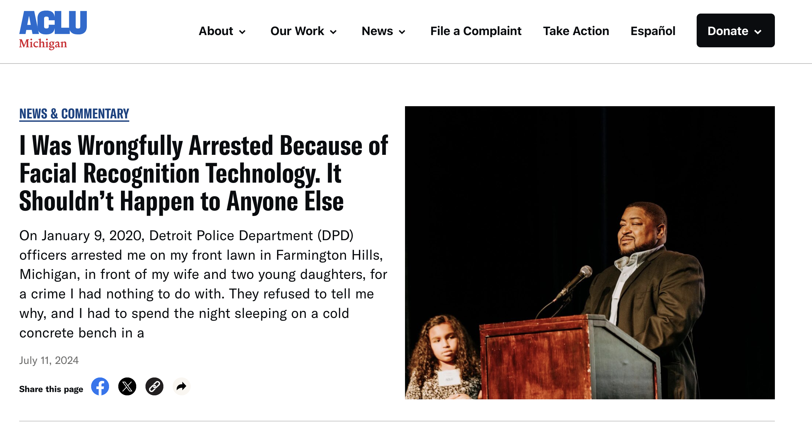
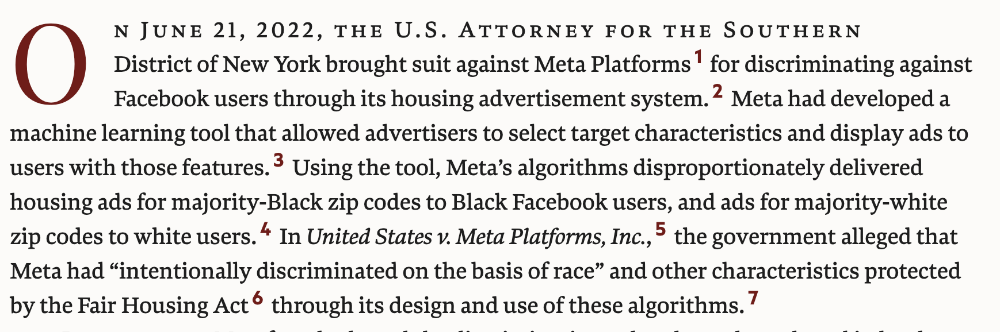

```{r setup, include=FALSE}
options(htmltools.dir.version = FALSE)
library(knitr)
opts_chunk$set(
  prompt = T,
  fig.align = "center",
  dpi = 300,
  cache = T,
  message = FALSE,
  warning = FALSE,
  engine.opts = list(bash = "-l")
)

knit_hooks$set(
  prompt = function(before, options, envir) {
    options(
      prompt = if (options$engine %in% c("sh", "bash", "zsh")) "$ " else "R> ",
      continue = if (options$engine %in% c("sh", "bash", "zsh")) "$ " else "+ "
    )
  }
)

options(repos = c(CRAN = "https://cran.rstudio.com/"))

if (!require("fontawesome", character.only = TRUE)) {
  install.packages("fontawesome", dependencies = TRUE)
  library(fontawesome, character.only = TRUE)
}
```

# Ética, sesgo y regulación {background-color="#2d4563"}

## Repaso: ya sabemos usar la IA

:::{style="margin-top: 20px; font-size: 22px;"}
:::{.columns}
:::{.column width=50%}
**Esta semana aprendimos a usarla**

- Clasificación y regresión, clustering, análisis de texto
- LLMs para anotación, extracción y generación de datos, con `ellmer` y `quallmer`
- Y a [validar]{.alert} todo contra un estándar conocido

**Recién, en la sesión 5.1**

- Modelos de [pesos abiertos]{.alert}, cuantizados para entrar en una laptop
- [Ollama]{.alert} y el Modelfile: un codificador congelado y reproducible
- La motivación era ética: datos sensibles que [no pueden salir de la máquina]{.alert}
:::

:::{.column width=50%}
:::{style="font-size: 22px;"}
**Ahora: las preguntas difíciles**

- ¿Estos sistemas son [justos]{.alert}?
- ¿De dónde viene el [sesgo]{.alert}?
- ¿Cómo se [mide]{.alert} la equidad?
- ¿Se puede [arreglar]{.alert}?
- ¿Quién [decide]{.alert} qué es justo?
- ¿Quién protege la [privacidad]{.alert} de las personas en los datos?
- ¿Cómo se [regula]{.alert} todo esto?

Saber usar una herramienta y saber [cuándo no usarla]{.alert} son dos cosas distintas
:::
:::
:::
:::

## Agenda de la sesión

:::{style="margin-top: 30px; font-size: 24px;"}
:::{.columns}
:::{.column width=50%}
**Sesgo: qué es y de dónde viene**

- Una historia para empezar
- Cinco usos de la palabra "sesgo"
- Una taxonomía del sesgo algorítmico
- Bucles de retroalimentación
- Casos en América Latina

**Medir la equidad**

- Las métricas, con un ejemplo concreto
- El teorema de imposibilidad
- Cuatro tensiones sin solución limpia
- Detección, mitigación y el caso COMPAS
:::

:::{.column width=50%}
**Privacidad**

- Escala, inferencia y persistencia
- El caso Clearview AI
- Del GDPR a la Ley 18.331

**Regulación y cierre**

- El EU AI Act, EE.UU. y América Latina
- Qué pueden hacer los investigadores
:::
:::
:::

# Una historia para empezar {background-color="#2d4563"}

## Robert Williams, Detroit, 2020

:::{style="margin-top: 30px; font-size: 23px;"}
:::{.columns}
:::{.column width=55%}
- Robert Julian-Borchak Williams fue [arrestado frente a su familia]{.alert} en Detroit
- Acusado de robar relojes, detenido [30 horas]{.alert}
- Luego liberado: [persona equivocada]{.alert}

**¿Qué pasó?**

- Un sistema de reconocimiento facial comparó su foto del carnet con imágenes borrosas de vigilancia
- El algoritmo se [equivocó]{.alert}
- Robert es afroamericano. El reconocimiento facial tiene [tasas de error más altas]{.alert} con rostros de piel oscura
- [No fue un error de software. Así fue construido el sistema]{.alert}
:::

:::{.column width=45%}
:::{style="text-align: center;"}
[{width="100%"}](#){data-modal-type="image" data-modal-url="figures/robert-williams.png"}

Fuente: [ACLU](https://www.aclumich.org/news/i-was-wrongfully-arrested-because-facial-recognition-technology-it-shouldnt-happen-anyone-else/); [NPR (2020)](https://www.npr.org/2020/06/24/882683463/the-computer-got-it-wrong-how-facial-recognition-led-to-a-false-arrest-in-michig)
:::
:::
:::
:::

# ¿Qué es el sesgo algorítmico? {background-color="#2d4563"}

## "Sesgo": una palabra, cinco usos

:::{style="margin-top: 30px; font-size: 24px;"}
La palabra aparece en contextos distintos y conviene separarlos antes de seguir:

| Uso | Qué significa | Ejemplo |
|---|---|---|
| [Estadístico]{.alert} | Desviación sistemática del valor verdadero | Una muestra que sobrerrepresenta a Montevideo |
| [Cognitivo]{.alert} | Atajos mentales de las personas | Confirmar lo que ya creíamos |
| [Cultural]{.alert} | Supuestos aprendidos de la sociedad | Asociar profesiones con géneros |
| [Histórico]{.alert} | Desigualdades pasadas registradas en datos | Décadas de contrataciones discriminatorias |
| [Algorítmico]{.alert} | Resultados sistemáticamente injustos de un sistema | El tema de hoy |

<br>

:::{style="font-size: 22px;"}
- Los cuatro primeros se [filtran]{.alert} en el quinto: los datos cargan los sesgos estadísticos, cognitivos, culturales e históricos de quienes los generaron
- Por eso "el algoritmo es neutral" es un argumento que no se sostiene
:::
:::

## El sesgo es la IA reflejándonos

:::{style="margin-top: 30px; font-size: 21px;"}
:::{.columns}
:::{.column width=55%}
**En IA, sesgo suele significar:**

> Un sistema que produce [resultados sistemáticamente injustos]{.alert} para ciertos grupos de personas.

- La IA aprende de [datos generados por humanos]{.alert}
- Si los humanos decidieron de forma sesgada, la IA aprende ese patrón
- Y puede [amplificarlo]{.alert} a escala

**Ejemplo: word embeddings** ([Bolukbasi et al., 2016](https://arxiv.org/abs/1607.06520))

- "Hombre" es a "Doctor" como "Mujer" es a... "Enfermera"
- La IA recogió [nuestro propio sexismo]{.alert} de millones de textos
- Si el sesgo viene de nosotros, ¿eso hace a la IA menos responsable, o más?
:::

:::{.column width=45%}
:::{style="text-align: center;"}
[{width="80%"}](#){data-modal-type="image" data-modal-url="figures/ai-mirror.png"}

Fuente: [UNESCO](https://www.unesco.org/en/articles/generative-ai-unesco-study-reveals-alarming-evidence-regressive-gender-stereotypes)

:::{style="margin-top: 15px; background: rgba(45, 69, 99, 0.1); padding: 15px; border-radius: 10px; font-size: 20px;"}
La parte difícil no es detectar diferencias, es decidir [qué cuenta como "injusto"]{.alert}.
:::
:::
:::
:::
:::

## Discusión rápida: ¿qué riesgo prefieren?

:::{style="margin-top: 30px; font-size: 23px;"}
:::{.columns}
:::{.column width=50%}
Una universidad decide admisiones. Hay dos opciones:

**Opción A: un comité humano**

- Sesgos [inconsistentes]{.alert}: dependen de quién lea tu carpeta, de su humor, de la hora
- Difíciles de detectar, imposibles de auditar a escala

**Opción B: un algoritmo**

- Sesgos [sistemáticos]{.alert}: el mismo error, para todos los casos parecidos, siempre
- Pero medibles, auditables y, en principio, corregibles
:::

:::{.column width=50%}
:::{style="font-size: 23px;"}
**Para discutir (2 min)**

1. ¿Cuál preferirían si fueran [el postulante]{.alert}?
2. ¿Y si fueran [la universidad]{.alert}?
3. ¿Cambia algo que el error sistemático se pueda [demostrar ante un juez]{.alert} y el humano no?

:::{style="margin-top: 15px; background: rgba(45, 69, 99, 0.1); padding: 15px; border-radius: 10px;"}
No hay respuesta correcta: la pregunta revela [qué tipo de injusticia]{.alert} nos resulta más tolerable.
:::
:::
:::
:::
:::

## Una taxonomía del sesgo {#sec:taxonomia}

:::{style="margin-top: 30px; font-size: 24px;"}
:::{style="text-align: center;"}
| Tipo de sesgo | Cuándo ocurre | Ejemplo |
|---------------|--------------|---------|
| [Histórico]{.alert} | Decisiones pasadas codificadas en datos | IA de contratación de Amazon penaliza CVs "de mujeres" |
| [Representación]{.alert} | Grupos subrepresentados | 35% de error en mujeres de piel oscura |
| [Medición]{.alert} | Proxies para conceptos no medibles | Código postal como proxy de solvencia |
| [Agregación]{.alert} | Tratar grupos diversos como uno | Un modelo "global" falla localmente |
| [Evaluación]{.alert} | Benchmarks no representativos | Probado en España, usado en Argentina |
| [Despliegue]{.alert} | Modelo usado en contexto equivocado | Modelo de 2015 aplicado en 2025 |
:::

:::{style="font-size: 22px; margin-top: 20px;"}
- El sesgo puede entrar en [cualquier etapa]{.alert}: recolección, etiquetado, entrenamiento, evaluación, despliegue, uso
- Una idea para llevarse: [datos precisos no son lo mismo que datos justos]{.alert}
- [[Ejemplos detallados de cada tipo]{.button}](#sec:apendice-tipos)
:::
:::

## Bucles de retroalimentación

:::{style="margin-top: 30px; font-size: 21px;"}
:::{.columns}
:::{.column width=55%}
Cuando las [predicciones del algoritmo influyen en los datos]{.alert} que lo entrenarán después.

**Ejemplo: vigilancia predictiva** ([Lum e Isaac, 2016](https://doi.org/10.1111/j.1740-9713.2016.00960.x))

1. El algoritmo predice zonas de alto crimen con [datos de arrestos pasados]{.alert}
2. La policía patrulla esas zonas más intensamente
3. Más patrullas → más arrestos (haya o no más crimen)
4. Los nuevos datos [confirman]{.alert} la predicción
5. El algoritmo se vuelve más confiado en un patrón sesgado

[El algoritmo crea evidencia para sus propias predicciones.]{.alert}
:::

:::{.column width=45%}
:::{style="text-align: center; font-size: 18px;"}
[{width="90%"}](#){data-modal-type="image" data-modal-url="figures/feedback-loop.png"}

Fuente: [SpotCrime](https://blog.spotcrime.com/2011/06/savanna-ga-heat-map.html)

:::{style="margin-top: 15px; background: rgba(230, 57, 70, 0.1); padding: 15px; border-radius: 10px; font-size: 17px;"}
**Otros bucles:**

- Denegar crédito → peor historial → más denegaciones
- Filtros de CVs → equipo homogéneo → más sesgo en los datos
:::
:::
:::
:::
:::

## Casos de sesgo en América Latina

:::{style="margin-top: 30px; font-size: 20px;"}
:::{.columns}
:::{.column width=50%}
**Brasil: reconocimiento facial policial**

- El Carnaval de Salvador (2019) inauguró los arrestos por reconocimiento facial en Brasil
- La [Rede de Observatórios da Segurança](https://observatorioseguranca.com.br/) relevó los casos de 2019: el [90,5% de los detenidos]{.alert} por estos sistemas eran personas negras
- El mismo sesgo de representación que vimos con Robert Williams, a escala regional

**Argentina: predecir embarazos adolescentes**

- Salta (2018): un sistema de Microsoft y el gobierno provincial decía predecir [qué adolescentes quedarían embarazadas]{.alert} a partir de datos socioeconómicos
- Aplicado sobre poblaciones pobres, sin transparencia ni evaluación; el [Laboratorio de IA Aplicada de la UBA](https://liaa.dc.uba.ar/es/sobre-la-prediccion-automatica-de-embarazos-adolescentes/) mostró errores metodológicos graves ([Wired, 2022](https://www.wired.com/story/argentina-algorithms-pregnancy-prediction/))
:::

:::{.column width=50%}
**Chile: Sistema Alerta Niñez**

- Modelo que predice riesgo de [vulneración de derechos]{.alert} de niños usando datos familiares y socioeconómicos
- Críticas de [Derechos Digitales](https://www.derechosdigitales.org/) por estigmatización: los falsos positivos se concentran en [familias pobres]{.alert}, las más presentes en los registros estatales

**Colombia: reconocimiento facial en el transporte**

- Detección de evasores en TransMilenio (Bogotá)
- [Fundación Karisma](https://web.karisma.org.co/) documentó preocupaciones por [vigilancia masiva]{.alert} y falta de consentimiento

:::{style="margin-top: 10px; background: rgba(45, 69, 99, 0.1); padding: 10px; border-radius: 10px;"}
[Los mismos problemas del norte global se replican en la región, a menudo con menos protecciones y menos prensa.]{.alert}
:::
:::
:::
:::

# Medir la equidad {background-color="#2d4563"}

## ¿Cómo medimos si un modelo es justo? {#sec:metricas}

:::{style="margin-top: 20px; font-size: 22px;"}
Un ejemplo concreto: un banco usa un modelo para aprobar créditos. Se presentan [100 personas del Grupo A y 100 del Grupo B]{.alert}. Sabemos (después) quiénes pagaron.

:::{style="margin-top: 15px;"}
| Métrica | La pregunta, en simple | En el ejemplo |
|---------|------------------------|---------------|
| [Paridad demográfica]{.alert} | ¿Aprobamos a los dos grupos por igual? | A: 50 de 100 aprobados. B: 30 de 100. No hay paridad |
| [Igualdad de oportunidades]{.alert} | Entre los que [sí pagan]{.alert}, ¿aprobamos por igual? | De los buenos pagadores, A: 80% aprobados. B: 60%. Hay buenos pagadores de B que el modelo rechaza más |
| [Calibración]{.alert} | Un "70% de probabilidad de pago", ¿vale lo mismo? | De quienes recibieron un score de 70, ¿pagan ~70 de cada 100 en [ambos]{.alert} grupos? |
:::

:::{.columns}
:::{.column width=55%}
:::{style="font-size: 20px; margin-top: 10px;"}
- La primera mira los [resultados]{.alert} (quién recibe el sí)
- La segunda mira los [errores]{.alert} (a quién le erramos)
- La tercera mira el [significado del score]{.alert} (si el número es honesto)
:::
:::

:::{.column width=45%}
:::{style="margin-top: 10px; background: rgba(45, 69, 99, 0.1); padding: 15px; border-radius: 10px; font-size: 20px;"}
Las tres suenan razonables. Cada una captura una noción distinta de "justo", y elegir una es elegir [a quién proteger]{.alert}. La próxima diapositiva muestra que no se pueden tener todas.
:::
:::
:::

[[Definiciones formales y gráficos]{.button}](#sec:apendice-metricas)
:::

## El teorema de imposibilidad

:::{style="margin-top: 30px; font-size: 22px;"}
:::{.columns}
:::{.column width=55%}
**Tres criterios de equidad (simplificados):**

1. [Calibración]{.alert}: a igual puntuación, resultados similares entre grupos
2. [Igualdad de falsos positivos]{.alert}: misma tasa de ser señalado por error
3. [Igualdad de falsos negativos]{.alert}: misma tasa de ser ignorado por error

**El teorema** ([Chouldechova, 2017](https://doi.org/10.1089/big.2016.0047); [Kleinberg et al., 2016](https://arxiv.org/abs/1609.05807)):

> Si las tasas base difieren entre grupos, [no se pueden satisfacer los tres criterios a la vez]{.alert}.

**En simple**: si el Grupo A reincide al 40% y el B al 20%, hay que [elegir]{.alert} qué tipo de error igualar.
:::

:::{.column width=45%}
:::{style="text-align: center;"}
[{width="100%"}](#){data-modal-type="image" data-modal-url="figures/impossibility-theorem.png"}

Fuente: [Fairness and Machine Learning Book](https://fairmlbook.org/)

:::{style="margin-top: 15px; background: rgba(230, 57, 70, 0.1); padding: 15px; border-radius: 10px; font-size: 20px;"}
[No existe una solución matemáticamente "justa". Ningún algoritmo decide qué errores importan más.]{.alert}
:::
:::
:::
:::
:::

## ¿Quién define "justo"? {#sec:quien-define}

:::{style="margin-top: 30px; font-size: 26px; text-align: center;"}

| Definición | Prioriza | Desventaja |
|------------|----------|------------|
| Igual trato | Consistencia | Ignora el contexto |
| Igualdad de resultados | Equidad | Puede requerir trato diferenciado |
| Igual tasa de error | Paridad entre grupos | Puede sacrificar precisión |
| Calibración | Precisión individual | Oculta disparidades |

:::{style="margin-top: 25px; font-size: 24px; text-align: left;"}
- No existe un [valor por defecto neutral]{.alert}
- Quien elige la definición de equidad [determina quién se beneficia]{.alert}
- Decir "sólo usamos los datos" es, en sí mismo, una elección
- Es una [pregunta política y moral]{.alert}, no técnica
:::

[[Actividad: el dilema del préstamo]{.button}](#sec:actividad-prestamo)
:::

## Cuatro tensiones sin solución clara

:::{style="margin-top: 30px; font-size: 26px;"}
Aun después de elegir una definición, quedan trade-offs que ningún ajuste técnico elimina:

:::{style="margin-top: 15px;"}
| Tensión | El dilema |
|---------|-----------|
| [Precisión vs equidad]{.alert} | Imponer una restricción de equidad suele bajar la accuracy global. ¿Cuánta precisión vale una mejora en paridad? |
| [Individual vs grupal]{.alert} | Tratar igual a individuos similares puede producir disparidades entre grupos, y corregir al grupo puede tratar distinto a individuos similares |
| [Transparencia vs manipulación]{.alert} | Publicar los criterios permite auditarlos, y también permite "jugarle" al sistema |
| [Corto vs largo plazo]{.alert} | Una corrección hoy cambia los datos de mañana: los bucles de retroalimentación también funcionan a favor |
:::

<br>

:::{style="text-align: center; font-size: 24px;"}
[Cada tensión es una decisión de diseño que alguien toma, la haga explícita o no.]{.alert}
:::
:::

## Un ejemplo: el umbral de crédito

:::{style="margin-top: 20px; font-size: 23px;"}
:::{.columns}
:::{.column width=42%}
- Un modelo predice la probabilidad de que cada persona [pague el préstamo]{.alert}
- Aprobamos si la probabilidad supera un [umbral]{.alert}
- El Grupo B tiene una tasa de repago histórica más baja (por desventaja económica, no por capacidad)
- Con [el mismo umbral]{.alert} para todos, el Grupo B se aprueba mucho menos
- Para igualar la aprobación, habría que bajar su umbral. Pero eso aprueba más préstamos que no se pagarán: [sube su tasa de falsos positivos]{.alert}

[No se puede igualar todo a la vez. El umbral es una elección de valores.]{.alert}
:::

:::{.column width=58%}
```{r umbral, echo=FALSE, fig.width=6.2, fig.height=4.6}
library(dplyr)
library(ggplot2)
set.seed(2026)
n <- 1000
simular <- function(grupo, p_bueno, m_bueno, m_malo) {
  bueno <- rbinom(n, 1, p_bueno)
  score <- ifelse(bueno == 1, rnorm(n, m_bueno, 0.15), rnorm(n, m_malo, 0.15))
  data.frame(grupo = grupo, bueno = bueno, score = pmin(pmax(score, 0), 1))
}
datos <- rbind(
  simular("Grupo A", 0.80, 0.70, 0.45),
  simular("Grupo B", 0.60, 0.62, 0.40)
)
umbrales <- seq(0.3, 0.8, by = 0.025)
aprob <- do.call(rbind, lapply(umbrales, function(t) {
  datos |> group_by(grupo) |>
    summarise(umbral = t, aprobacion = mean(score >= t), .groups = "drop")
}))
ggplot(aprob, aes(umbral, aprobacion, color = grupo)) +
  geom_line(linewidth = 1.3) +
  geom_vline(xintercept = 0.5, linetype = "dashed", colour = "grey40") +
  annotate("text", x = 0.5, y = 0.95, label = "mismo umbral", size = 4, colour = "grey30") +
  scale_color_manual(values = c("Grupo A" = "#2d4563", "Grupo B" = "#e63946")) +
  scale_y_continuous(labels = scales::percent) +
  labs(x = "Umbral de aprobación", y = "Tasa de aprobación", color = "",
       title = "Mismo umbral, distinta tasa de aprobación") +
  theme_minimal(base_size = 14) +
  theme(legend.position = "bottom")
```
:::
:::
:::

## Detección y mitigación

:::{style="margin-top: 30px; font-size: 23px;"}
:::{.columns}
:::{.column width=50%}
**Detectar: tres pasos**

1. Definir los [grupos protegidos]{.alert} (género, etnicidad, edad...). A veces sólo hay proxies
2. Calcular métricas [por grupo]{.alert}: tasa positiva, TPR, FPR, valor predictivo
3. [Comparar]{.alert} entre grupos. Regla del 80%: si un grupo recibe menos del 80% de la tasa del otro, hay disparidad

:::{style="text-align: center;"}
**Herramientas**

| Herramienta | Lenguaje |
|---|---|
| [fairmodels](https://fairmodels.drwhy.ai/) | R |
| AI Fairness 360, Fairlearn, Aequitas | Python |
:::
:::

:::{.column width=50%}
**Mitigar: tres momentos**

- [Pre-procesamiento]{.alert}: cambiar los datos (rebalancear, quitar variables sensibles)
- [In-procesamiento]{.alert}: cambiar el entrenamiento (restricciones de equidad en la pérdida)
- [Post-procesamiento]{.alert}: cambiar las predicciones (umbrales por grupo)

:::{style="margin-top: 15px; background: rgba(45, 69, 99, 0.1); padding: 15px; border-radius: 10px;"}
Ninguna técnica es perfecta: la mitigación siempre implica [trade-offs]{.alert}.

El [laboratorio de hoy]{.alert} hace una auditoría completa con `fairmodels` sobre datos de crédito.
:::
:::
:::
:::

## El caso COMPAS

:::{style="margin-top: 30px; font-size: 23px;"}
:::{.columns}
:::{.column width=55%}
**¿Qué es COMPAS?**

- Sistema de scoring de [riesgo de reincidencia]{.alert} usado en EE.UU. para fianza, sentencia y libertad condicional

**El análisis de ProPublica (2016):**

- Tasas de [falsos positivos desiguales]{.alert}:
    - Negros: 44,9% señalados como alto riesgo pero no reincidieron
    - Blancos: 23,5% en la misma situación
- Conclusión: el sistema es [racialmente sesgado]{.alert}
:::

:::{.column width=45%}
**La respuesta de Northpointe:**

- COMPAS está [calibrado]{.alert}: una puntuación de 7 significa lo mismo para ambos grupos
- Si las tasas base difieren, no se pueden igualar FPR y calibración a la vez
- El teorema de imposibilidad en acción
  
:::{style="margin-top: 30px; background: rgba(230, 57, 70, 0.1); padding: 20px; border-radius: 10px; font-size: 21px; text-align: center;"}
**¿Quién tiene razón?** Ambos. El debate no es sobre [hechos]{.alert} sino sobre [valores]{.alert}: ¿qué error importa más?
:::

:::{style="margin-top: 15px; font-size: 18px; text-align: center;"}
Fuente: [ProPublica (2016)](https://www.propublica.org/article/machine-bias-risk-assessments-in-criminal-sentencing)
:::
:::
:::
:::

# Privacidad y datos personales {background-color="#2d4563"}

## La IA cambia el problema de la privacidad

:::{style="margin-top: 30px; font-size: 24px;"}
:::{.columns}
:::{.column width=55%}
Tres cosas que antes no pasaban:

- [Escala]{.alert}: recolectar y procesar datos de millones de personas cuesta casi nada
- [Inferencia]{.alert}: el modelo deduce lo que nunca contaste. Los "me gusta" predicen orientación política; las compras, un embarazo; el celular, síntomas de depresión
- [Persistencia]{.alert}: lo que entró a un dataset o a un modelo entrenado es muy difícil de borrar. Los LLMs pueden [memorizar y filtrar]{.alert} texto de entrenamiento, incluyendo nombres y contactos ([Carlini et al., 2021](https://arxiv.org/abs/2012.07805))
:::

:::{.column width=45%}
:::{style="font-size: 24px;"}
**El caso clásico de inferencia**

La cadena Target (EE.UU.) identificó el embarazo de una adolescente por sus [patrones de compra]{.alert} y mandó cupones de bebé a su casa, antes de que su padre lo supiera ([New York Times, 2012](https://www.nytimes.com/2012/02/19/magazine/shopping-habits.html)).

:::{style="margin-top: 15px; background: rgba(45, 69, 99, 0.1); padding: 15px; border-radius: 10px;"}
El problema no es sólo qué datos entregamos, sino [qué se puede inferir]{.alert} de ellos. El consentimiento que firmamos rara vez cubre eso.
:::
:::
:::
:::
:::

## Clearview AI: tu cara ya está en la base

:::{style="margin-top: 30px; font-size: 24px;"}
:::{.columns}
:::{.column width=55%}
- Una empresa raspó [más de 30 mil millones de fotos]{.alert} de Facebook, Instagram y LinkedIn, sin consentimiento de nadie
- Vendió la búsqueda por rostro a [más de 2.400 agencias policiales]{.alert} de EE.UU.
- Revelado por el [New York Times (2020)](https://www.nytimes.com/2020/01/18/technology/clearview-privacy-facial-recognition.html); la ACLU lo describió como poner a todo el mundo en una [rueda de reconocimiento perpetua]{.alert}
- Multas: 20 millones de euros en Francia, 20 en Italia, 30,5 en Países Bajos; Reino Unido, Australia y Canadá ordenaron borrar los datos
:::

:::{.column width=45%}
:::{style="font-size: 24px;"}
**Por qué importa para esta clase**

- Es el sistema que cierra el círculo con [Robert Williams]{.alert}: el reconocimiento facial policial se alimenta de datos obtenidos así
- Y muestra el límite de la autorregulación: la empresa sólo cambió cuando llegaron [demandas y multas]{.alert}

:::{style="margin-top: 15px; background: rgba(230, 57, 70, 0.1); padding: 15px; border-radius: 10px;"}
"Estaba disponible públicamente" no es lo mismo que ["consentí este uso"]{.alert}. Eso aplica también a los datos que usamos en investigación.
:::
:::
:::
:::
:::

## Protección de datos: del GDPR a la Ley 18.331

:::{style="margin-top: 30px; font-size: 23px;"}
:::{.columns}
:::{.column width=50%}
**El modelo europeo (GDPR, 2018)**

- Principios: [minimización]{.alert} (recolectar sólo lo necesario), limitación de propósito, plazos de conservación
- Derechos: acceso, rectificación, [olvido]{.alert}, portabilidad, y a no ser objeto de [decisiones puramente automatizadas]{.alert} con efectos importantes (artículo 22)

**Uruguay llegó antes que la región**

- La [Ley 18.331](https://www.impo.com.uy/bases/leyes/18331-2008) (2008) y la URCDP
- Uruguay es de los pocos países con [adecuación]{.alert} reconocida por la UE: su protección se considera equivalente
:::

:::{.column width=50%}
**Donde la IA tensiona la ley**

| El derecho | El problema técnico |
|---|---|
| Minimización | Los LLMs quieren [todos]{.alert} los datos |
| Olvido | "Desentrenar" un modelo es casi imposible |
| Explicación | Las cajas negras no se explican solas |

:::{style="margin-top: 15px; background: rgba(45, 69, 99, 0.1); padding: 15px; border-radius: 10px;"}
Para investigadores, la defensa más práctica ya la vimos en la sesión 5.1: con un [modelo local]{.alert}, los datos de los participantes nunca se transfieren a un tercero.
:::
:::
:::
:::

# Regulación de la IA {background-color="#2d4563"}

## EU AI Act (2024)

:::{style="margin-top: 30px; font-size: 24px;"}
**Primera ley integral sobre IA en el mundo.** Clasifica los sistemas por [nivel de riesgo]{.alert}:

:::{style="text-align: center;"}
| Nivel | Ejemplos | Requisitos |
|-------|----------|------------|
| [Inaceptable]{.alert} | Scoring social masivo, vigilancia biométrica en tiempo real | Prohibido |
| [Alto riesgo]{.alert} | Salud, justicia, empleo, crédito, educación | Auditoría y registro |
| [Riesgo limitado]{.alert} | Chatbots, deepfakes | Transparencia |
| [Riesgo mínimo]{.alert} | Filtros de spam, videojuegos | Sin restricciones |
:::

**Multas:** hasta 35 millones de euros o 7% de la facturación global

**Aplicación:** gradual entre 2024 y 2027

:::{style="text-align: center;"}
:::{style="margin-top: 30px; background: rgba(45, 69, 99, 0.1); padding: 20px; border-radius: 10px; font-size: 21px;"}
**Para investigadores:** los sistemas de IA para investigación suelen estar [exentos]{.alert}, pero si se despliegan, aplica la regulación.
:::

:::{style="margin-top: 15px; font-size: 18px;"}
Fuente: [European Commission](https://digital-strategy.ec.europa.eu/en/policies/regulatory-framework-ai)
:::
:::
:::

## Regulación: EE.UU. y América Latina

:::{style="margin-top: 30px; font-size: 24px;"}
:::{.columns}
:::{.column width=50%}
**Estados Unidos: fragmentado**

- Sin ley federal integral, enfoque [sectorial]{.alert} (FDA, FTC, EEOC)
- Estados: Nueva York exige auditoría de IA en contratación (2023); California, Colorado avanzan
- La orden ejecutiva de Biden (2023) fue [revocada]{.alert} en 2025
:::

:::{.column width=50%}
**América Latina: en construcción**

- [Uruguay]{.alert}: Ley 18.331 de datos, Estrategia Nacional de IA (2019), bien posicionado pero sin ley específica
- [Brasil]{.alert}: LGPD (2018) y PL 2338/2023, inspirado en el EU AI Act
- [Chile]{.alert}: política nacional de IA (2021) y ley pionera de [neuroderechos]{.alert}
- Desafío común: [brecha entre legislación y aplicación]{.alert}
:::
:::

:::{style="text-align: center; font-size: 22px; margin-top: 20px;"}
La autorregulación de la industria [no es suficiente]{.alert}: sin poder de aplicación y con conflicto de intereses.

[[Estándares y autorregulación]{.button}](#sec:apendice-autorreg)
:::
:::

## ¿Qué pueden hacer los investigadores? {#sec:investigadores}

:::{style="margin-top: 30px; font-size: 21px;"}
:::{.columns}
:::{.column width=50%}
**En su propia investigación**

- [Documentar]{.alert} las limitaciones del modelo
- [Reportar]{.alert} métricas por subgrupos, no sólo el promedio
- [Transparentar]{.alert} datos y código
- [Considerar]{.alert} quién puede ser afectado
- [Evitar]{.alert} claims exagerados de equidad

**En la sociedad**

- [Auditar]{.alert} sistemas existentes y comunicar hallazgos
- [Participar]{.alert} en los debates de política pública
:::

:::{.column width=50%}
**Preguntas para cada proyecto**

1. ¿Qué [daños]{.alert} podría causar el sistema?
2. ¿Quiénes son los [grupos afectados]{.alert}?
3. ¿Cómo [mediría]{.alert} si es justo?
4. ¿Qué variables son [proxies]{.alert} de atributos sensibles?
5. ¿Quién definió el [éxito]{.alert}?
6. ¿Hay [supervisión humana]{.alert} y mecanismo de apelación?

:::{style="margin-top: 15px; background: rgba(45, 69, 99, 0.1); padding: 10px; border-radius: 10px;"}
[La ética no es un paso final; es parte del diseño desde el inicio.]{.alert}
:::
:::
:::

[[¿Es solucionable el sesgo? Optimistas y escépticos]{.button}](#sec:apendice-debate)
:::

## Resumen de la sesión

:::{style="margin-top: 30px; font-size: 20px;"}
:::{.columns}
:::{.column width=50%}
**Sesgo**

- La IA [hereda]{.alert} sesgos humanos de los datos
- Seis tipos, en cualquier etapa del ciclo
- Los [bucles de retroalimentación]{.alert} lo amplifican
- América Latina replica los problemas con menos protecciones

**Medición**

- Paridad, oportunidades, calibración: cada una protege a alguien distinto
- El [teorema de imposibilidad]{.alert}: no se pueden tener todas a la vez
- Y aun eligiendo, quedan [cuatro tensiones]{.alert} de diseño
:::

:::{.column width=50%}
**Privacidad**

- Escala, [inferencia]{.alert} y persistencia cambian el problema
- Clearview AI: "público" no es "consentido"
- GDPR y [Ley 18.331]{.alert}; el modelo local como defensa práctica

**Regulación**

- [EU AI Act]{.alert}: clasificación por riesgo; EE.UU. fragmentado; América Latina en construcción
- La autorregulación no alcanza

**Para llevarse**

- La equidad es una [elección de valores]{.alert}
- Los investigadores tienen [responsabilidad]{.alert} sobre lo que construyen
:::
:::

:::{style="margin-top: 10px; text-align: center;"}
[Ahora: el laboratorio 9, con el modelo local y la auditoría de equidad. Después, sus propuestas de investigación]{.alert}
:::
:::

# Vamos al laboratorio 🤓 {background-color="#2d4563"}

# Apéndice {background-color="#2d4563"}

## Sesgo histórico: el pasado codificado {#sec:apendice-tipos}

:::{style="margin-top: 30px; font-size: 22px;"}
:::{.columns}
:::{.column width=55%}
La [discriminación pasada]{.alert} se incorpora a los datos, aunque reflejen con precisión el mundo de ese momento.

**El caso de Amazon (2018)** ([Reuters](https://www.reuters.com/article/world/insight-amazon-scraps-secret-ai-recruiting-tool-that-showed-bias-against-women-idUSKCN1MK0AG/)):

- IA para filtrar CVs, entrenada con [10 años de contrataciones pasadas]{.alert}
- Esas contrataciones eran mayoritariamente masculinas
- La IA aprendió a [penalizar CVs que mencionaran "mujeres"]{.alert}
    - "Capitana del club de ajedrez femenino" → penalizada
- Amazon desechó la herramienta

[Datos precisos ≠ datos justos.]{.alert}
:::

:::{.column width=45%}
:::{style="text-align: center;"}
[{width="90%"}](#){data-modal-type="image" data-modal-url="figures/amazon-hiring.png"}

Fuente: [Reuters](https://www.reuters.com/article/world/insight-amazon-scraps-secret-ai-recruiting-tool-that-showed-bias-against-women-idUSKCN1MK0AG/)
:::
:::
:::

[[Volver]{.button}](#sec:taxonomia)
:::

## Sesgo de representación: ¿quién falta?

:::{style="margin-top: 30px; font-size: 22px;"}
:::{.columns}
:::{.column width=55%}
Cuando ciertos grupos están [subrepresentados]{.alert}, el modelo funciona mal para ellos.

**Reconocimiento facial** ([Buolamwini y Gebru, 2018](https://proceedings.mlr.press/v81/buolamwini18a.html)):

- Hombres de piel clara: [0,8% de error]{.alert}
- Mujeres de piel oscura: [34,7% de error]{.alert}
- Un rendimiento [43 veces peor]{.alert} para un grupo

**Asistentes de voz**: entrenados con acentos angloamericanos, fallan más con hablantes no nativos y voces de mujeres.

[Si no estás en los datos, el modelo no tiene nada que aprender sobre ti.]{.alert}
:::

:::{.column width=45%}
:::{style="text-align: center;"}
[{width="100%"}](#){data-modal-type="image" data-modal-url="figures/rekognition.webp"}

Fuente: [Joy Buolamwini](https://medium.com/@Joy.Buolamwini/)
:::
:::
:::

[[Volver]{.button}](#sec:taxonomia)
:::

## Sesgo de medición: proxies problemáticos

:::{style="margin-top: 30px; font-size: 22px;"}
:::{.columns}
:::{.column width=55%}
Usar un [proxy medible]{.alert} para algo que importa, pero que no funciona igual para todos.

**Código postal como proxy crediticio**

- Los bancos no pueden usar raza para decidir préstamos
- Pero pueden usar [código postal]{.alert}, que correlaciona con raza por segregación residencial
- Resultado: una variable "neutral" que codifica raza

| Lo que queremos | Proxy usado | Problema |
|---|---|---|
| Inteligencia | Tests estandarizados | Refleja acceso a preparación |
| Necesidad de salud | Gasto pasado | Refleja barreras de acceso |

[Se puede quitar la raza de los datos y aun así terminar con un modelo racialmente sesgado]{.alert} ([Obermeyer et al., 2019](https://doi.org/10.1126/science.aax2342)).
:::

:::{.column width=45%}
:::{style="text-align: center; margin-top: 30px;"}
[{width="100%"}](#){data-modal-type="image" data-modal-url="figures/proxy-bias.png"}

Fuente: [Harvard Law Review](https://harvardlawreview.org/print/vol-138/resetting-antidiscrimination-law-in-the-age-of-ai/)
:::
:::
:::

[[Volver]{.button}](#sec:taxonomia)
:::

## Sesgo de agregación y de despliegue

:::{style="margin-top: 30px; font-size: 21px;"}
:::{.columns}
:::{.column width=50%}
**Agregación**: tratar a grupos diversos como homogéneos.

- Modelos de riesgo de diabetes entrenados con poblaciones europeas usan la HbA1c, que [funciona distinto]{.alert} en otras poblaciones → subdiagnóstico
- Un modelo de satisfacción democrática europeo puede [fallar en América Latina]{.alert}: las escalas de encuesta significan cosas distintas entre culturas
:::

:::{.column width=50%}
**Evaluación y despliegue**: probar o usar el modelo en el contexto equivocado.

| Entrenado en... | Usado en... | Problema |
|---|---|---|
| España | Argentina | "boludo", voseo |
| EE.UU. | Uruguay | Diferencias culturales |
| 2015 | 2025 | Cambios temporales |
| Texto formal | Redes sociales | Registro distinto |

[El rendimiento no viaja bien entre contextos.]{.alert}
:::
:::

[[Volver]{.button}](#sec:taxonomia)
:::

## Definiciones formales de las métricas {#sec:apendice-metricas}

:::{style="margin-top: 20px; font-size: 20px;"}
:::{.columns}
:::{.column width=50%}
**Paridad demográfica**

$$P(\hat{Y} = 1 \mid A = a) = P(\hat{Y} = 1 \mid A = b)$$

Misma tasa de resultados positivos entre grupos. Garantiza representación, pero ignora las tasas base.

**Igualdad de oportunidades**

$$P(\hat{Y} = 1 \mid Y = 1, A = a) = P(\hat{Y} = 1 \mid Y = 1, A = b)$$

Entre quienes merecen el resultado, mismo TPR. Requiere conocer el resultado real.
:::

:::{.column width=50%}
**Calibración**

$$P(Y = 1 \mid \hat{Y} = p, A = a) = p$$

Una predicción de p% significa lo mismo para todos los grupos. Hace las predicciones interpretables, pero no garantiza igualdad de errores.

:::{style="margin-top: 20px; background: rgba(45, 69, 99, 0.1); padding: 15px; border-radius: 10px;"}
COMPAS estaba [calibrado]{.alert} pero tenía falsos positivos desiguales por raza. Las métricas chocan entre sí.
:::
:::
:::

[[Volver]{.button}](#sec:metricas)
:::

## ¿Es solucionable el sesgo en la IA? {#sec:apendice-debate}

:::{style="margin-top: 30px; font-size: 21px;"}
:::{.columns}
:::{.column width=50%}
**Los optimistas**

- Es un [problema técnico]{.alert} con soluciones técnicas: mejores datos, algoritmos y auditorías
- La IA puede ser [menos sesgada]{.alert} que los humanos: es consistente y se puede auditar

> "Un algoritmo sesgado se puede reentrenar. Un gerente de contratación sesgado es más difícil de arreglar."
:::

:::{.column width=50%}
**Los escépticos**

- El sesgo refleja [problemas sociales]{.alert} que no se arreglan con código
- Hablar de "IA justa" distrae de las causas raíz
- ¿Quién define la equidad? Generalmente quienes ya tienen poder

> "No se arregla un mercado inmobiliario discriminatorio ajustando un modelo de scoring crediticio."
:::
:::

:::{style="margin-top: 15px; text-align: center; background: rgba(45, 69, 99, 0.1); padding: 15px; border-radius: 10px;"}
[¿Dónde se ubican ustedes?]{.alert}
:::

[[Volver]{.button}](#sec:investigadores)
:::

## Autorregulación y estándares {#sec:apendice-autorreg}

:::{style="margin-top: 30px; font-size: 21px;"}
:::{.columns}
:::{.column width=50%}
**Estándares técnicos**

- [ISO/IEC 42001]{.alert}: gestión de IA
- [NIST AI RMF]{.alert}: gestión de riesgos
- [IEEE P7000]{.alert}: diseño ético

**Principios de la industria**

- Google AI Principles, Microsoft Responsible AI, Anthropic responsible scaling policy
- Iniciativas académicas: Montreal (2018), OECD (2019)
:::

:::{.column width=50%}
**Críticas**

- Sin [poder de aplicación]{.alert}
- [Conflicto de intereses]{.alert}: quien desarrolla, audita
- Principios [vagos]{.alert} y no vinculantes ("ética-washing")
- Las empresas [abandonan]{.alert} compromisos cuando son inconvenientes

:::{style="margin-top: 20px; background: rgba(230, 57, 70, 0.1); padding: 15px; border-radius: 10px;"}
[Consenso emergente: se necesita regulación vinculante con supervisión externa.]{.alert}
:::
:::
:::

[[Volver]{.button}](#sec:investigadores)
:::

## Actividad: el dilema del préstamo {#sec:actividad-prestamo}

:::{style="margin-top: 30px; font-size: 21px;"}
:::{.columns}
:::{.column width=50%}
**Están diseñando un algoritmo de aprobación de préstamos**

Los datos muestran:

- Grupo A: 80% paga los préstamos
- Grupo B: 60% paga (por desventaja económica histórica)

Elijan UNO:

1. [Mismo umbral]{.alert} para todos (70%) → más rechazos del Grupo B
2. [Misma tasa de aprobación]{.alert} → más impagos y riesgo
3. [Mismo trato a los buenos pagadores]{.alert} → distintas tasas de aprobación
:::

:::{.column width=50%}
**Para discutir (10 min):**

- ¿Cuál enfoque es "más justo"?
- ¿Quién se beneficia y quién se perjudica con cada uno?
- ¿Cambia su respuesta si la menor tasa del Grupo B se debe a discriminación, no a capacidad?
- ¿El algoritmo debería [corregir]{.alert} la injusticia histórica, o sólo [no perpetuarla]{.alert}?

:::{style="margin-top: 15px; background: rgba(45, 69, 99, 0.1); padding: 15px; border-radius: 10px;"}
Debatan en grupos de 3-4 y presenten su decisión.
:::
:::
:::

[[Volver]{.button}](#sec:quien-define)
:::

## Actividad: identificar el sesgo {#sec:actividad-desercion}

:::{style="margin-top: 30px; font-size: 21px;"}
:::{.columns}
:::{.column width=50%}
Una universidad uruguaya quiere predecir qué estudiantes tienen [riesgo de deserción]{.alert} y ofrecerles apoyo temprano.

El modelo usa:

- Notas del primer semestre
- Asistencia a clases
- Barrio de residencia
- Si trabaja además de estudiar
- Tipo de liceo (público/privado)

Tiene [85% de precisión]{.alert}.
:::

:::{.column width=50%}
**Para discutir (10 min):**

1. ¿Qué tipos de sesgo podrían estar presentes?
2. ¿Qué variables son problemáticas y por qué?
3. ¿El modelo [ayuda]{.alert} a los estudiantes vulnerables o los [estigmatiza]{.alert}?
4. ¿Cómo verificarían que funciona igual para todos los grupos?

:::{style="margin-top: 15px; background: rgba(230, 57, 70, 0.1); padding: 15px; border-radius: 10px;"}
Un modelo puede ser [preciso en promedio]{.alert} pero [injusto para ciertos grupos]{.alert}.
:::
:::
:::

[[Volver]{.button}](#sec:taxonomia)
:::
